# Machine Learning Engineer Nanodegree
## Investment and Trading Capstone Project
## Project: Build a Stock Price Indicator
----
## Exploring the Data
Load necessary Python libraries and the price data. Note that the column from this dataset will be calculated to our target label (whether the next daily price" ups, flats or downs) and the features of other days. All other columns are features for near days. This project import the python module [`googlefinance.client`](https://pypi.python.org/pypi/googlefinance.client) instead of [`yahoo-finance`](http://pypi.python.org/pypi/yahoo-finance) [which is being discontinued](https://yahoo.sdx.socialdynamx.com/portal/conversation/19248672) although it is planned in the proposal. Because the trading days one year is a little few for machine learning, we will try to use ten years. This Notebook is inherited from the [Udacity project template: Finding Donors for CharityML](https://github.com/udacity/machine-learning/blob/master/projects/finding_donors/finding_donors.ipynb) and [Creating Customer Segments](https://github.com/udacity/machine-learning/blob/master/projects/customer_segments/customer_segments.ipynb).


```python
import numpy                as     np
import pandas               as     pd
import seaborn              as     sns
import matplotlib.pyplot    as     plt
import matplotlib.dates     as     dates
from   datetime             import date, timedelta
from   time                 import time
from   IPython.display      import display         # Allows the use of display() for DataFrames
from   collections          import OrderedDict

# Pretty display for notebooks
%matplotlib inline

# display_En   = True # Enable/Disable unnecessary complex figures to speed up the data flow
```


```python
random_state =  7
data_p       = '7Y'                # Years, data_period to get data from current date
Page_size    = 17                  # inch, for figure size
date_split   = date(2018,   1,  1) # Split train/test data by the date
day          = timedelta(days = 1)
class_name   = lambda c: c.__class__.__name__
percent      = '{:6.2f}%'
R            = '#dd4b39'           # Google Red
G            = '#3cba54'           # Google Green
B            = '#4885ed'           # Google Blue
Y            = '#f4c20d'           # Google Yellow

def     concat        (df,      keys = None): return pd.concat( df, axis = 1, keys = keys)
def     concat_idx    (df, idx, keys = None): return    concat([df[i] for i in idx], keys)
def     concat_display(df, idx, keys = None , n = 5, head = False):
    d = concat_idx    (df, idx, keys = keys)
    display(d.head(n = n) if head else d.tail(n = n))
    return  d
```


```python
try:
    from   googlefinance.client import get_price_data, get_prices_data #, get_prices_time_data
    
    # Load daily prices of the S&P 500
    data = get_price_data({
       'x': 'INDEXSP', # Stock exchange symbol (S&P 500: 'INDEXSP', Dow Jones: 'INDEXDJX', NYSE COMPOSITE: 'INDEXNYSEGIS'  )
       'q': '.INX'   , # Stock symbol          (S&P 500: '.INX'   , Dow Jones: '.DJI'    , NYSE COMPOSITE: 'NYA', 'AAPL'...)
       'i': '86400'  , # Interval seconds      ('86400' = 1 day  intervals)
       'p': data_p     # Period                (   '1Y' = 1 year period   )
    })                 # get price data        (return pandas dataframe)
    # Success - Display the first record
    display(data.tail(n = 1))
    
    # Comparing to get_price_data, get_prices_data focuses on daily data (avoid confusion although the same data) and flexibility
    data = get_prices_data([{
       'x': 'INDEXSP', # Stock exchange symbol (S&P 500: 'INDEXSP', Dow Jones: 'INDEXDJX', NYSE COMPOSITE: 'INDEXNYSEGIS'  )
       'q': '.INX'   , # Stock symbol          (S&P 500: '.INX'   , Dow Jones: '.DJI'    , NYSE COMPOSITE: 'NYA', 'AAPL'...)
    }],     data_p   ) # get price data        (return pandas dataframe)
    # Success - Display the first record
    display(data.tail(n = 1))
    
    data     .  to_csv  ('SP.csv.txt')                                    # Save the got data (10 years: 125 KB)
except:
    data = pd.read_csv  ('SP.csv.txt', index_col = 0, parse_dates = True) # Load the got data (when googlefinance fails)
```


<div>
<style>
    .dataframe thead tr:only-child th {
        text-align: right;
    }

    .dataframe thead th {
        text-align: left;
    }

    .dataframe tbody tr th {
        vertical-align: top;
    }
</style>
<table border="1" class="dataframe">
  <thead>
    <tr style="text-align: right;">
      <th></th>
      <th>Open</th>
      <th>High</th>
      <th>Low</th>
      <th>Close</th>
      <th>Volume</th>
    </tr>
  </thead>
  <tbody>
    <tr>
      <th>2018-04-13 04:00:00</th>
      <td>2653.83</td>
      <td>2674.72</td>
      <td>2653.83</td>
      <td>2663.99</td>
      <td>1922966393</td>
    </tr>
  </tbody>
</table>
</div>


<div>
<style>
    .dataframe thead tr:only-child th {
        text-align: right;
    }

    .dataframe thead th {
        text-align: left;
    }

    .dataframe tbody tr th {
        vertical-align: top;
    }
</style>
<table border="1" class="dataframe">
  <thead>
    <tr style="text-align: right;">
      <th></th>
      <th>.INX_Open</th>
      <th>.INX_High</th>
      <th>.INX_Low</th>
      <th>.INX_Close</th>
      <th>.INX_Volume</th>
    </tr>
  </thead>
  <tbody>
    <tr>
      <th>2018-04-13</th>
      <td>2653.83</td>
      <td>2674.72</td>
      <td>2653.83</td>
      <td>2663.99</td>
      <td>1922966393</td>
    </tr>
  </tbody>
</table>
</div>


### Implementation: Data Cleaning
The data with abnormal 0 needs to be cleaned


```python
data  = data.rename(columns = lambda c: c.split('_')[-1]) # Clean column names
display(data.describe())                                  # Check data
```


<div>
<style>
    .dataframe thead tr:only-child th {
        text-align: right;
    }

    .dataframe thead th {
        text-align: left;
    }

    .dataframe tbody tr th {
        vertical-align: top;
    }
</style>
<table border="1" class="dataframe">
  <thead>
    <tr style="text-align: right;">
      <th></th>
      <th>Open</th>
      <th>High</th>
      <th>Low</th>
      <th>Close</th>
      <th>Volume</th>
    </tr>
  </thead>
  <tbody>
    <tr>
      <th>count</th>
      <td>1760.000000</td>
      <td>1760.000000</td>
      <td>1760.000000</td>
      <td>1760.000000</td>
      <td>1.760000e+03</td>
    </tr>
    <tr>
      <th>mean</th>
      <td>1886.840188</td>
      <td>1895.594045</td>
      <td>1877.553511</td>
      <td>1888.710006</td>
      <td>8.644661e+08</td>
    </tr>
    <tr>
      <th>std</th>
      <td>423.082646</td>
      <td>423.271610</td>
      <td>422.764892</td>
      <td>420.793683</td>
      <td>6.581135e+08</td>
    </tr>
    <tr>
      <th>min</th>
      <td>0.000000</td>
      <td>0.000000</td>
      <td>0.000000</td>
      <td>1099.230000</td>
      <td>0.000000e+00</td>
    </tr>
    <tr>
      <th>25%</th>
      <td>1469.620000</td>
      <td>1472.637500</td>
      <td>1463.075000</td>
      <td>1472.102500</td>
      <td>4.947604e+08</td>
    </tr>
    <tr>
      <th>50%</th>
      <td>1955.025000</td>
      <td>1964.140000</td>
      <td>1942.590000</td>
      <td>1955.120000</td>
      <td>5.854669e+08</td>
    </tr>
    <tr>
      <th>75%</th>
      <td>2127.025000</td>
      <td>2132.870000</td>
      <td>2119.892500</td>
      <td>2126.735000</td>
      <td>8.558583e+08</td>
    </tr>
    <tr>
      <th>max</th>
      <td>2867.230000</td>
      <td>2872.870000</td>
      <td>2851.480000</td>
      <td>2872.870000</td>
      <td>4.024144e+09</td>
    </tr>
  </tbody>
</table>
</div>


```python
data['Volume'].plot();                                    # Check 0 Volumes
```


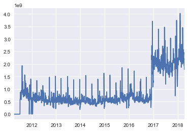


```python
# Discard days with 0 Volumn & check again
Day_Volume  = data[data['Volume'] == 0].index[-1] + day
print 'Cleaned data with Volume start from: ' + str(Day_Volume)
data_Volume = data[Day_Volume:]
display(data_Volume.describe())
```

    Cleaned data with Volume start from: 2012-01-15
    


<div>
<style>
    .dataframe thead tr:only-child th {
        text-align: right;
    }

    .dataframe thead th {
        text-align: left;
    }

    .dataframe tbody tr th {
        vertical-align: top;
    }
</style>
<table border="1" class="dataframe">
  <thead>
    <tr style="text-align: right;">
      <th></th>
      <th>Open</th>
      <th>High</th>
      <th>Low</th>
      <th>Close</th>
      <th>Volume</th>
    </tr>
  </thead>
  <tbody>
    <tr>
      <th>count</th>
      <td>1569.000000</td>
      <td>1569.000000</td>
      <td>1569.000000</td>
      <td>1569.000000</td>
      <td>1.569000e+03</td>
    </tr>
    <tr>
      <th>mean</th>
      <td>1963.794436</td>
      <td>1972.340924</td>
      <td>1954.761262</td>
      <td>1965.909567</td>
      <td>9.019116e+08</td>
    </tr>
    <tr>
      <th>std</th>
      <td>381.668290</td>
      <td>382.380579</td>
      <td>380.726669</td>
      <td>378.366296</td>
      <td>6.696760e+08</td>
    </tr>
    <tr>
      <th>min</th>
      <td>0.000000</td>
      <td>0.000000</td>
      <td>0.000000</td>
      <td>1278.040000</td>
      <td>1.839316e+08</td>
    </tr>
    <tr>
      <th>25%</th>
      <td>1674.320000</td>
      <td>1680.190000</td>
      <td>1662.670000</td>
      <td>1676.120000</td>
      <td>4.982664e+08</td>
    </tr>
    <tr>
      <th>50%</th>
      <td>2003.570000</td>
      <td>2016.890000</td>
      <td>1992.440000</td>
      <td>2002.330000</td>
      <td>5.795952e+08</td>
    </tr>
    <tr>
      <th>75%</th>
      <td>2165.130000</td>
      <td>2170.200000</td>
      <td>2156.510000</td>
      <td>2164.450000</td>
      <td>8.658505e+08</td>
    </tr>
    <tr>
      <th>max</th>
      <td>2867.230000</td>
      <td>2872.870000</td>
      <td>2851.480000</td>
      <td>2872.870000</td>
      <td>4.024144e+09</td>
    </tr>
  </tbody>
</table>
</div>


```python
data_Volume.hist(figsize = (16, 2), layout = (1, 5));     # Check distribution
```


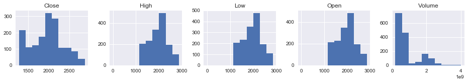


```python
for c in ['Open', 'High', 'Low']:
    display(data_Volume[data_Volume[ c    ] < 1000]) # Check prices < 1000 (the strange gap in 'Open', 'High', and 'Low')
```


<div>
<style>
    .dataframe thead tr:only-child th {
        text-align: right;
    }

    .dataframe thead th {
        text-align: left;
    }

    .dataframe tbody tr th {
        vertical-align: top;
    }
</style>
<table border="1" class="dataframe">
  <thead>
    <tr style="text-align: right;">
      <th></th>
      <th>Open</th>
      <th>High</th>
      <th>Low</th>
      <th>Close</th>
      <th>Volume</th>
    </tr>
  </thead>
  <tbody>
    <tr>
      <th>2017-08-01</th>
      <td>0.0</td>
      <td>0.0</td>
      <td>0.0</td>
      <td>2470.3</td>
      <td>2189633778</td>
    </tr>
  </tbody>
</table>
</div>


<div>
<style>
    .dataframe thead tr:only-child th {
        text-align: right;
    }

    .dataframe thead th {
        text-align: left;
    }

    .dataframe tbody tr th {
        vertical-align: top;
    }
</style>
<table border="1" class="dataframe">
  <thead>
    <tr style="text-align: right;">
      <th></th>
      <th>Open</th>
      <th>High</th>
      <th>Low</th>
      <th>Close</th>
      <th>Volume</th>
    </tr>
  </thead>
  <tbody>
    <tr>
      <th>2017-08-01</th>
      <td>0.0</td>
      <td>0.0</td>
      <td>0.0</td>
      <td>2470.3</td>
      <td>2189633778</td>
    </tr>
  </tbody>
</table>
</div>


<div>
<style>
    .dataframe thead tr:only-child th {
        text-align: right;
    }

    .dataframe thead th {
        text-align: left;
    }

    .dataframe tbody tr th {
        vertical-align: top;
    }
</style>
<table border="1" class="dataframe">
  <thead>
    <tr style="text-align: right;">
      <th></th>
      <th>Open</th>
      <th>High</th>
      <th>Low</th>
      <th>Close</th>
      <th>Volume</th>
    </tr>
  </thead>
  <tbody>
    <tr>
      <th>2017-08-01</th>
      <td>0.0</td>
      <td>0.0</td>
      <td>0.0</td>
      <td>2470.3</td>
      <td>2189633778</td>
    </tr>
  </tbody>
</table>
</div>


```python
data_Volume_Price     = data_Volume[
                        data_Volume['Open'] > 1000]               # Discard the abnormal day
data_Volume_Price     . hist(figsize = (16, 2), layout = (1, 5));
display               ( data_Volume_Price.describe())
data_cln              = data_Volume_Price                         # Cleaned data
```


<div>
<style>
    .dataframe thead tr:only-child th {
        text-align: right;
    }

    .dataframe thead th {
        text-align: left;
    }

    .dataframe tbody tr th {
        vertical-align: top;
    }
</style>
<table border="1" class="dataframe">
  <thead>
    <tr style="text-align: right;">
      <th></th>
      <th>Open</th>
      <th>High</th>
      <th>Low</th>
      <th>Close</th>
      <th>Volume</th>
    </tr>
  </thead>
  <tbody>
    <tr>
      <th>count</th>
      <td>1568.000000</td>
      <td>1568.000000</td>
      <td>1568.000000</td>
      <td>1568.000000</td>
      <td>1.568000e+03</td>
    </tr>
    <tr>
      <th>mean</th>
      <td>1965.046856</td>
      <td>1973.598795</td>
      <td>1956.007921</td>
      <td>1965.587889</td>
      <td>9.010903e+08</td>
    </tr>
    <tr>
      <th>std</th>
      <td>378.551200</td>
      <td>379.241480</td>
      <td>377.631128</td>
      <td>378.272330</td>
      <td>6.690988e+08</td>
    </tr>
    <tr>
      <th>min</th>
      <td>1277.820000</td>
      <td>1282.550000</td>
      <td>1266.740000</td>
      <td>1278.040000</td>
      <td>1.839316e+08</td>
    </tr>
    <tr>
      <th>25%</th>
      <td>1675.025000</td>
      <td>1682.845000</td>
      <td>1663.307500</td>
      <td>1675.845000</td>
      <td>4.982246e+08</td>
    </tr>
    <tr>
      <th>50%</th>
      <td>2003.615000</td>
      <td>2017.540000</td>
      <td>1992.490000</td>
      <td>2002.305000</td>
      <td>5.791136e+08</td>
    </tr>
    <tr>
      <th>75%</th>
      <td>2165.257500</td>
      <td>2170.490000</td>
      <td>2156.655000</td>
      <td>2164.300000</td>
      <td>8.655811e+08</td>
    </tr>
    <tr>
      <th>max</th>
      <td>2867.230000</td>
      <td>2872.870000</td>
      <td>2851.480000</td>
      <td>2872.870000</td>
      <td>4.024144e+09</td>
    </tr>
  </tbody>
</table>
</div>


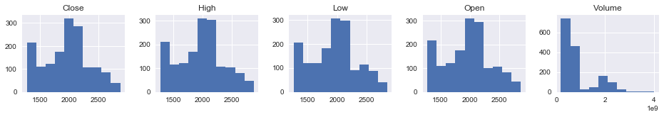


### Implementation: Data Exploration
A cursory investigation of the dataset will determine how many days fit into either group, and will tell us about the percentage of these daily prices uping or falling. In the code cell below, we will compute the basic following and additional statistics with [stockstats](https://pypi.python.org/pypi/stockstats):
- The total number of records, `'n_records'`.
- The number of the next daily prices upping, `'n_up'`.
- The number of the next daily prices downing, `'n_down'`.
- The number of the next daily prices flatting, `'n_flat'`.
- The percentage of the next daily prices upping, `'up_percent'`.


```python
col_pre   =  ['Open' ,   'Close']                  # Collect previous daily data column to cancat together
col_next  =  ['Open' ,   'Close']                  # Collect next     daily data column to cancat together
d         = concat([   data_cln[     col_pre ].shift( 1).rename(columns = lambda c: c + '_pre' ),
                       data_cln])                  # d is the acronyms to cancat all data
d         = concat([d, data_cln[     col_next].shift(-1).rename(columns = lambda c: c + '_next')
                               ])[1:-1]            # Discard the 1st/last one which lacks a previous/next daily data
y_rgr     = list  ( d. columns [-len(col_next):])  # Select data column for regression y

X_vec, y_clf_vec = [], []
for                    p1,     p2 in [
   # Timeline: Open_pre > Close_pre > Open >  Close >  Open_next >  Close_next
             ('Open_pre'                   , 'Close'                           ), # Vector from Open_pre  to Close
             (           'Close_pre'       , 'Close'                           ), # Vector from Close_pre to Close
             (                       'Open', 'Close'                           ), # Vector from Open      to Close
             (                       'Open',          'Open_next'              ), # Vector from Open      to  Open_next
             (                               'Close', 'Open_next'              ), # Vector from Close     to  Open_next
             (                               'Close',              'Close_next'), # Vector from Close     to Close_next
             (                                        'Open_next', 'Close_next'), # Vector from Open_next to Close_next
             ]:
    p      = '_'.join([p1,     p2    ])
    d [p]  =  -      d[p1] + d[p2]
    if 0  <=    p.find  ('Close_next' ): # next daily data are usually for y
        y_clf_vec.append(      p      )  # Vectors for classification y
    else:
        X_vec    .append(      p      )  #

X_up, y_clf = [], []
for vec      in     X_vec + y_clf_vec  : # Index of records where the next daily prices up
    col    =          vec +     '_up'    # Merge 'flat' to 'up': Align to the 'up' of matplotlib.finance
    d[col] =  0 <=  d[vec]
    if 0  <=  col.find  ('Close_next' ): # next daily data are usually for y
        y_clf    .append(        col  )
    else:
        X_up     .append(        col  )

X_base     = list(data_cln.columns)
X_all      = X_base + X_vec + X_up     # Select data column for X
# Xy     = [c for c in d.columns if 0 <= c.find('Open_next') and c.find('Close_next') < 0  ] # X sometimes includes Open_next

Close_Close_next_flat =         0   == d.    Close_Close_next
Close_Open_next_flat  =         0   == d.     Close_Open_next

n_records             = d.shape[0]                                # Total number of records
n_up                  = sum    (       d.Close_Close_next_up    )
n_flat                = sum    (         Close_Close_next_flat  )
n_down                = sum    (0    > d.Close_Close_next       )
up_percent            = float  (n_up)/n_records*100               # Percentage of days whose price up

print '[Example Daily Close-to-Close (Close_Close_next) prices]'
print 'Total number of records: {}'               .format(n_records )
print 'Daily prices upping:     {}  ({})'         .format(n_up      , 'Close_Close_next_up, including flatting to align the "up" of matplotlib.finance')
print 'Daily prices flatting:   {}'               .format(n_flat    )
print 'Daily prices downing:    {}'               .format(n_down    )
print 'Percentage of daily prices upping: {:.2f}%'.format(up_percent)

print '\nThe flat days with the same Close prices'
display       ( d[Close_Close_next_flat | Close_Close_next_flat.shift(1)])
print '\nThe flat day  with the same Open & Close prices'
display       ( d[    d.Open           ==  d.Close                      ])
# print '\n     {} days with the same Close & Open_next prices'.format(sum(Close_Open_next_flat))
# display       ( d[ Close_Open_next_flat |  Close_Open_next_flat.shift(1)].head(n = 2))
```

    [Example Daily Close-to-Close (Close_Close_next) prices]
    Total number of records: 1566
    Daily prices upping:     847  (Close_Close_next_up, including flatting to align the "up" of matplotlib.finance)
    Daily prices flatting:   1
    Daily prices downing:    719
    Percentage of daily prices upping: 54.09%
    
    The flat days with the same Close prices
    


<div>
<style>
    .dataframe thead tr:only-child th {
        text-align: right;
    }

    .dataframe thead th {
        text-align: left;
    }

    .dataframe tbody tr th {
        vertical-align: top;
    }
</style>
<table border="1" class="dataframe">
  <thead>
    <tr style="text-align: right;">
      <th></th>
      <th>Open_pre</th>
      <th>Close_pre</th>
      <th>Open</th>
      <th>High</th>
      <th>Low</th>
      <th>Close</th>
      <th>Volume</th>
      <th>Open_next</th>
      <th>Close_next</th>
      <th>Open_pre_Close</th>
      <th>...</th>
      <th>Close_Open_next</th>
      <th>Close_Close_next</th>
      <th>Open_next_Close_next</th>
      <th>Open_pre_Close_up</th>
      <th>Close_pre_Close_up</th>
      <th>Open_Close_up</th>
      <th>Open_Open_next_up</th>
      <th>Close_Open_next_up</th>
      <th>Close_Close_next_up</th>
      <th>Open_next_Close_next_up</th>
    </tr>
  </thead>
  <tbody>
    <tr>
      <th>2017-01-10</th>
      <td>2271.14</td>
      <td>2276.98</td>
      <td>2273.59</td>
      <td>2275.49</td>
      <td>2268.90</td>
      <td>2268.9</td>
      <td>1914652521</td>
      <td>2269.72</td>
      <td>2268.90</td>
      <td>-2.24</td>
      <td>...</td>
      <td>0.82</td>
      <td>0.00</td>
      <td>-0.82</td>
      <td>False</td>
      <td>False</td>
      <td>False</td>
      <td>False</td>
      <td>True</td>
      <td>True</td>
      <td>False</td>
    </tr>
    <tr>
      <th>2017-01-11</th>
      <td>2273.59</td>
      <td>2268.90</td>
      <td>2269.72</td>
      <td>2279.27</td>
      <td>2265.27</td>
      <td>2268.9</td>
      <td>2138024556</td>
      <td>2268.60</td>
      <td>2275.32</td>
      <td>-4.69</td>
      <td>...</td>
      <td>-0.30</td>
      <td>6.42</td>
      <td>6.72</td>
      <td>False</td>
      <td>True</td>
      <td>False</td>
      <td>False</td>
      <td>False</td>
      <td>True</td>
      <td>True</td>
    </tr>
  </tbody>
</table>
<p>2 rows × 23 columns</p>
</div>


    
    The flat day  with the same Open & Close prices
    


<div>
<style>
    .dataframe thead tr:only-child th {
        text-align: right;
    }

    .dataframe thead th {
        text-align: left;
    }

    .dataframe tbody tr th {
        vertical-align: top;
    }
</style>
<table border="1" class="dataframe">
  <thead>
    <tr style="text-align: right;">
      <th></th>
      <th>Open_pre</th>
      <th>Close_pre</th>
      <th>Open</th>
      <th>High</th>
      <th>Low</th>
      <th>Close</th>
      <th>Volume</th>
      <th>Open_next</th>
      <th>Close_next</th>
      <th>Open_pre_Close</th>
      <th>...</th>
      <th>Close_Open_next</th>
      <th>Close_Close_next</th>
      <th>Open_next_Close_next</th>
      <th>Open_pre_Close_up</th>
      <th>Close_pre_Close_up</th>
      <th>Open_Close_up</th>
      <th>Open_Open_next_up</th>
      <th>Close_Open_next_up</th>
      <th>Close_Close_next_up</th>
      <th>Open_next_Close_next_up</th>
    </tr>
  </thead>
  <tbody>
    <tr>
      <th>2017-04-11</th>
      <td>2356.59</td>
      <td>2355.54</td>
      <td>2357.16</td>
      <td>2366.37</td>
      <td>2351.5</td>
      <td>2357.16</td>
      <td>1620328913</td>
      <td>2353.92</td>
      <td>2353.78</td>
      <td>0.57</td>
      <td>...</td>
      <td>-3.24</td>
      <td>-3.38</td>
      <td>-0.14</td>
      <td>True</td>
      <td>True</td>
      <td>True</td>
      <td>False</td>
      <td>False</td>
      <td>False</td>
      <td>False</td>
    </tr>
  </tbody>
</table>
<p>1 rows × 23 columns</p>
</div>


** Featureset Exploration **

All features are continuous


```python
hdr_base =       'Base Features ~  X_base' # Headers
hdr_vec  =     'Vector Features ~  X_vec'  #
hdr_up   =         'Up Features ~  X_up'   #
hdr_stat = 'Statistics Features ~  X_stat' # will add later
X_grp    =                      [  X_base             ,  X_vec,             X_up          ]
def X_display            (d,       X_grp = X_grp      , head = 0, n = 5):
    return concat_display(d,       X_grp              ,
                                [hdr_base             ,hdr_vec          , hdr_up, hdr_stat][:len(X_grp)], head = head, n = n)
def y_display            (d,       y_clf = y_clf      ,  y_rgr = y_rgr ):
    return concat_display(d,    [  y_clf              ,  y_rgr         ],
                                [ 'y (Classification)', 'y (Regressions)'])

X_display                (d)
y_display                (d);
# display                  (d[      y_clf_vec         ].rename(columns = lambda c: ('Vectors for Classification', c)).tail())
```


<div>
<style>
    .dataframe thead tr:only-child th {
        text-align: right;
    }

    .dataframe thead th {
        text-align: left;
    }

    .dataframe tbody tr th {
        vertical-align: top;
    }
</style>
<table border="1" class="dataframe">
  <thead>
    <tr>
      <th></th>
      <th colspan="5" halign="left">Base Features ~  X_base</th>
      <th colspan="5" halign="left">Vector Features ~  X_vec</th>
      <th colspan="5" halign="left">Up Features ~  X_up</th>
    </tr>
    <tr>
      <th></th>
      <th>Open</th>
      <th>High</th>
      <th>Low</th>
      <th>Close</th>
      <th>Volume</th>
      <th>Open_pre_Close</th>
      <th>Close_pre_Close</th>
      <th>Open_Close</th>
      <th>Open_Open_next</th>
      <th>Close_Open_next</th>
      <th>Open_pre_Close_up</th>
      <th>Close_pre_Close_up</th>
      <th>Open_Close_up</th>
      <th>Open_Open_next_up</th>
      <th>Close_Open_next_up</th>
    </tr>
  </thead>
  <tbody>
    <tr>
      <th>2018-04-06</th>
      <td>2657.36</td>
      <td>2672.08</td>
      <td>2649.58</td>
      <td>2662.84</td>
      <td>2008036352</td>
      <td>78.80</td>
      <td>18.15</td>
      <td>5.48</td>
      <td>-11.54</td>
      <td>-17.02</td>
      <td>True</td>
      <td>True</td>
      <td>True</td>
      <td>False</td>
      <td>False</td>
    </tr>
    <tr>
      <th>2018-04-07</th>
      <td>2645.82</td>
      <td>2656.88</td>
      <td>2586.27</td>
      <td>2604.47</td>
      <td>2187111865</td>
      <td>-52.89</td>
      <td>-58.37</td>
      <td>-41.35</td>
      <td>-28.64</td>
      <td>12.71</td>
      <td>False</td>
      <td>False</td>
      <td>False</td>
      <td>False</td>
      <td>True</td>
    </tr>
    <tr>
      <th>2018-04-10</th>
      <td>2617.18</td>
      <td>2653.55</td>
      <td>2610.79</td>
      <td>2613.16</td>
      <td>1923050595</td>
      <td>-32.66</td>
      <td>8.69</td>
      <td>-4.02</td>
      <td>21.23</td>
      <td>25.25</td>
      <td>False</td>
      <td>True</td>
      <td>False</td>
      <td>True</td>
      <td>True</td>
    </tr>
    <tr>
      <th>2018-04-11</th>
      <td>2638.41</td>
      <td>2665.45</td>
      <td>2635.78</td>
      <td>2656.87</td>
      <td>2132599583</td>
      <td>39.69</td>
      <td>43.71</td>
      <td>18.46</td>
      <td>5.48</td>
      <td>-12.98</td>
      <td>True</td>
      <td>True</td>
      <td>True</td>
      <td>True</td>
      <td>False</td>
    </tr>
    <tr>
      <th>2018-04-12</th>
      <td>2643.89</td>
      <td>2661.43</td>
      <td>2639.25</td>
      <td>2642.19</td>
      <td>1788526146</td>
      <td>3.78</td>
      <td>-14.68</td>
      <td>-1.70</td>
      <td>9.94</td>
      <td>11.64</td>
      <td>True</td>
      <td>False</td>
      <td>False</td>
      <td>True</td>
      <td>True</td>
    </tr>
  </tbody>
</table>
</div>


<div>
<style>
    .dataframe thead tr:only-child th {
        text-align: right;
    }

    .dataframe thead th {
        text-align: left;
    }

    .dataframe tbody tr th {
        vertical-align: top;
    }
</style>
<table border="1" class="dataframe">
  <thead>
    <tr>
      <th></th>
      <th colspan="2" halign="left">y (Classification)</th>
      <th colspan="2" halign="left">y (Regressions)</th>
    </tr>
    <tr>
      <th></th>
      <th>Close_Close_next_up</th>
      <th>Open_next_Close_next_up</th>
      <th>Open_next</th>
      <th>Close_next</th>
    </tr>
  </thead>
  <tbody>
    <tr>
      <th>2018-04-06</th>
      <td>False</td>
      <td>False</td>
      <td>2645.82</td>
      <td>2604.47</td>
    </tr>
    <tr>
      <th>2018-04-07</th>
      <td>True</td>
      <td>False</td>
      <td>2617.18</td>
      <td>2613.16</td>
    </tr>
    <tr>
      <th>2018-04-10</th>
      <td>True</td>
      <td>True</td>
      <td>2638.41</td>
      <td>2656.87</td>
    </tr>
    <tr>
      <th>2018-04-11</th>
      <td>False</td>
      <td>False</td>
      <td>2643.89</td>
      <td>2642.19</td>
    </tr>
    <tr>
      <th>2018-04-12</th>
      <td>True</td>
      <td>True</td>
      <td>2653.83</td>
      <td>2663.99</td>
    </tr>
  </tbody>
</table>
</div>


```python
# print 'Produce a scatter matrix for each pair of features in the data'
data_corr = d  [[c for c in d.columns if c.find('up') < 0]]
mtrx_corr = data_corr.corr().as_matrix()
axs       = pd.plotting.scatter_matrix(data_corr, alpha = 0.3, figsize = (Page_size, Page_size*2/3), diagonal = 'kde')
for          i, j in  zip (*np.tril_indices_from(axs, k = 0)):
    ax = axs[i, j]
    if       i!=j:
        ax.annotate('%.3f' %mtrx_corr[i, j], ( 0.1, 0.8), xycoords = 'axes fraction', color = R)
    ax.get_yaxis().set_label_coords          (-0.9, 0.4)
    ax.xaxis.label.set_rotation(60)
    ax.yaxis.label.set_rotation(30)
    ax.set_xticks(())
    ax.set_yticks(())
```


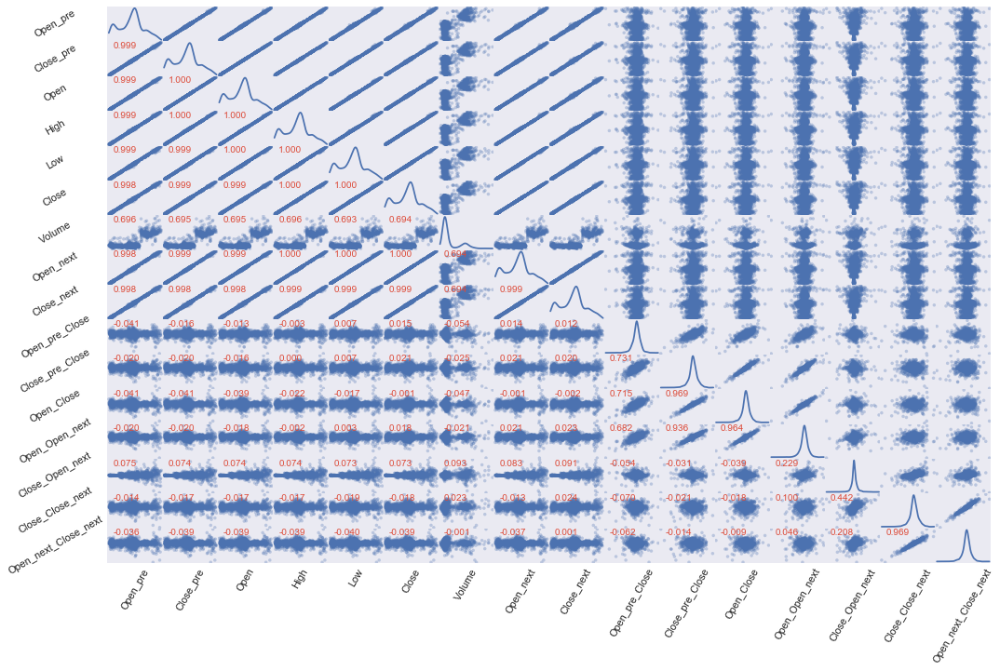


```python
def corr_heatmap (data) :
    corr =        data  .corr()
    _, _ = plt.subplots (figsize     = (Page_size, Page_size/ 2))
    heat = sns.heatmap  (corr, annot =  True)
    heat.set_xticklabels(heat.get_xticklabels()  , rotation = 75)
corr_heatmap     (d   )
```


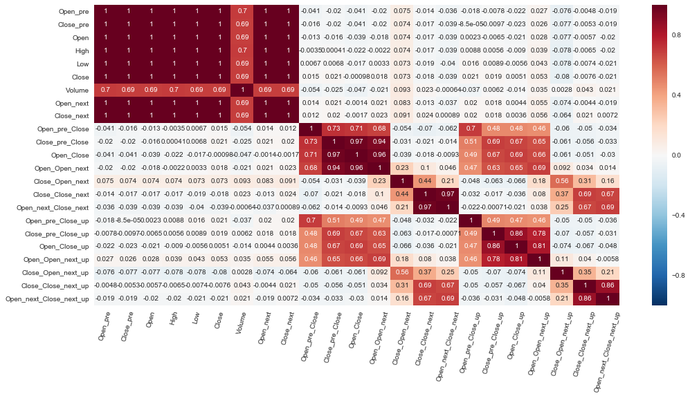


```python
from stockstats import StockDataFrame
# from copy       import deepcopy
# s_copy  =              deepcopy(d     )
# s       = StockDataFrame.retype(s_copy)          # The data => StockDataFrame
s       = StockDataFrame.retype(d.copy())          # The data => StockDataFrame
stats   = ['volume_delta', 'open_-2_r', 'cr', 'cr-ma1', 'cr-ma2', 'cr-ma3', 'volume_-3,2,-1_max', 'volume_-3~1_min',
           'kdjk', 'kdjd', 'kdjj', 'open_2_sma', 'macd', 'macds', 'macdh', 'boll', 'boll_ub', 'boll_lb', 'cr-ma2_xu_cr-ma1_20_c',
           'rsi_6', 'rsi_12', 'wr_10', 'wr_6', 'cci', 'cci_20', 'tr', 'atr', 'dma', 'pdi', 'mdi', 'dx', 'adx', 'adxr',
           'trix', 'trix_9_sma', 'vr', 'vr_6_sma'] # Examples from the Tutorial of the stockstats
```


```python
# [ s[stat] for stat in  stats]                    # Generate relative statistics
for             stat in  stats:                    # Generate relative statistics
    s[stat]                                        # The SettingWithCopyWarning might in stockstats.StockDataFrame
```

    C:\ProgramData\Anaconda2\lib\site-packages\pandas\core\indexing.py:179: SettingWithCopyWarning: 
    A value is trying to be set on a copy of a slice from a DataFrame
    
    See the caveats in the documentation: http://pandas.pydata.org/pandas-docs/stable/indexing.html#indexing-view-versus-copy
      self._setitem_with_indexer(indexer, value)
    


```python
def display_corr(        data, corr,     n   = 5):
    print '\nTop {} Positive/Negative Correlation with {} of Statistics'                                      .format(n, corr)
    corr   =    (        data. corr()[corr].sort_values(by = corr, ascending = False)*100).applymap('{:6.2f}%'.format)
    display     (  concat    ([corr.head(n   = n)      .reset_index().rename(columns = {'index': 'Features'}) ,
                               corr.tail(n   = n)[::-1].reset_index().rename(columns = {'index': 'Features'})],
                  ['Positive Correlation', 'Negitive Correlation'])  .rename(index   = lambda i: i + 1))
def display_n   (        data, corr = False, right = '',
                                         n   = 5):
    with pd.option_context('display.max_rows', None, 'display.max_columns', None):
        display ((       data. loc[:, right:] if right else data).describe())
        if          corr:
            display_corr(data, corr ,    n   = n)

_max = lambda s: max([int(n) for n in s.split('_') if n.isdigit()] or [1])

print 'Some raw and side statistics examples of the stockstats might incomplete in the first few days:'
display_n  (  s, right = stats[0])                          # display only new features

print '\nThe statistics with the most day number of data:'
stats_days = pd.DataFrame([(c, _max(c)) for c in s.columns],                 columns = ['Statistics', 'Days']
                                                               ).sort_values(by      =                'Days', ascending = False
                                                               ).reset_index(drop    = 1
                                                               ).     rename(index   = lambda i: i + 1)
display                 (stats_days.head())
stats_day  =         max(stats_days.Days  )
s_cplt     = s     .iloc[stats_day:-  stats_day                      ]
s_cplt     = s_cplt. loc[         :, (s_cplt  != s_cplt.iloc[0]).any()]
print 'Dropped the first, last {} days and constant statistics are dropped to complete integrity'.format(stats_day)
```

    Some raw and side statistics examples of the stockstats might incomplete in the first few days:
    


<div>
<style>
    .dataframe thead tr:only-child th {
        text-align: right;
    }

    .dataframe thead th {
        text-align: left;
    }

    .dataframe tbody tr th {
        vertical-align: top;
    }
</style>
<table border="1" class="dataframe">
  <thead>
    <tr style="text-align: right;">
      <th></th>
      <th>volume_delta</th>
      <th>open_-2_r</th>
      <th>middle</th>
      <th>cr</th>
      <th>cr-ma1</th>
      <th>cr-ma2</th>
      <th>cr-ma3</th>
      <th>volume_-3_s</th>
      <th>volume_-1_s</th>
      <th>volume_2_s</th>
      <th>volume_-3,2,-1_max</th>
      <th>volume_-2_s</th>
      <th>volume_0_s</th>
      <th>volume_1_s</th>
      <th>volume_-3~1_min</th>
      <th>rsv_9</th>
      <th>kdjk_9</th>
      <th>kdjk</th>
      <th>kdjd_9</th>
      <th>kdjd</th>
      <th>kdjj_9</th>
      <th>kdjj</th>
      <th>open_2_sma</th>
      <th>close_26_ema</th>
      <th>macd</th>
      <th>macds</th>
      <th>macdh</th>
      <th>close_20_sma</th>
      <th>close_20_mstd</th>
      <th>boll</th>
      <th>boll_ub</th>
      <th>boll_lb</th>
      <th>cr-ma1_20_c</th>
      <th>close_-1_s</th>
      <th>close_-1_d</th>
      <th>rs_6</th>
      <th>rsi_6</th>
      <th>rs_12</th>
      <th>rsi_12</th>
      <th>wr_10</th>
      <th>wr_6</th>
      <th>middle_14_sma</th>
      <th>cci</th>
      <th>middle_20_sma</th>
      <th>cci_20</th>
      <th>tr</th>
      <th>atr</th>
      <th>close_10_sma</th>
      <th>close_50_sma</th>
      <th>dma</th>
      <th>high_delta</th>
      <th>um</th>
      <th>low_delta</th>
      <th>dm</th>
      <th>pdm</th>
      <th>pdm_14_ema</th>
      <th>pdm_14</th>
      <th>atr_14</th>
      <th>pdi_14</th>
      <th>pdi</th>
      <th>mdm</th>
      <th>mdm_14_ema</th>
      <th>mdm_14</th>
      <th>mdi_14</th>
      <th>mdi</th>
      <th>dx_14</th>
      <th>dx</th>
      <th>dx_6_ema</th>
      <th>adx</th>
      <th>adx_6_ema</th>
      <th>adxr</th>
      <th>trix</th>
      <th>trix_9_sma</th>
      <th>change</th>
      <th>vr</th>
      <th>vr_6_sma</th>
    </tr>
  </thead>
  <tbody>
    <tr>
      <th>count</th>
      <td>1.565000e+03</td>
      <td>1564.000000</td>
      <td>1566.000000</td>
      <td>1565.000000</td>
      <td>1561.000000</td>
      <td>1559.000000</td>
      <td>1555.000000</td>
      <td>1.563000e+03</td>
      <td>1.565000e+03</td>
      <td>1.564000e+03</td>
      <td>1.566000e+03</td>
      <td>1.564000e+03</td>
      <td>1.566000e+03</td>
      <td>1.565000e+03</td>
      <td>1.566000e+03</td>
      <td>1566.000000</td>
      <td>1566.000000</td>
      <td>1566.000000</td>
      <td>1566.000000</td>
      <td>1566.000000</td>
      <td>1566.000000</td>
      <td>1566.000000</td>
      <td>1566.000000</td>
      <td>1566.000000</td>
      <td>1566.000000</td>
      <td>1566.000000</td>
      <td>1566.000000</td>
      <td>1566.000000</td>
      <td>1565.000000</td>
      <td>1566.000000</td>
      <td>1565.000000</td>
      <td>1565.000000</td>
      <td>1542.0</td>
      <td>1565.000000</td>
      <td>1565.000000</td>
      <td>1565.000000</td>
      <td>1565.000000</td>
      <td>1565.000000</td>
      <td>1565.000000</td>
      <td>1566.000000</td>
      <td>1566.000000</td>
      <td>1566.000000</td>
      <td>1565.000000</td>
      <td>1566.000000</td>
      <td>1565.000000</td>
      <td>1565.000000</td>
      <td>1565.000000</td>
      <td>1566.000000</td>
      <td>1566.000000</td>
      <td>1566.000000</td>
      <td>1565.000000</td>
      <td>1565.000000</td>
      <td>1565.000000</td>
      <td>1565.000000</td>
      <td>1566.000000</td>
      <td>1566.000000</td>
      <td>1566.000000</td>
      <td>1565.000000</td>
      <td>1565.000000</td>
      <td>1565.000000</td>
      <td>1566.000000</td>
      <td>1566.000000</td>
      <td>1566.000000</td>
      <td>1565.000000</td>
      <td>1565.000000</td>
      <td>1565.000000</td>
      <td>1565.000000</td>
      <td>1565.000000</td>
      <td>1565.000000</td>
      <td>1565.000000</td>
      <td>1565.000000</td>
      <td>1565.000000</td>
      <td>1565.000000</td>
      <td>1565.000000</td>
      <td>1565.000000</td>
      <td>1562.000000</td>
    </tr>
    <tr>
      <th>mean</th>
      <td>7.109750e+05</td>
      <td>0.096372</td>
      <td>1965.045915</td>
      <td>inf</td>
      <td>124.055562</td>
      <td>124.445264</td>
      <td>124.919721</td>
      <td>8.985928e+08</td>
      <td>9.000359e+08</td>
      <td>9.008985e+08</td>
      <td>1.038439e+09</td>
      <td>8.992478e+08</td>
      <td>9.006032e+08</td>
      <td>9.007468e+08</td>
      <td>7.655661e+08</td>
      <td>63.217628</td>
      <td>63.196455</td>
      <td>63.196455</td>
      <td>63.189040</td>
      <td>63.189040</td>
      <td>63.211286</td>
      <td>63.211286</td>
      <td>1964.606833</td>
      <td>1954.886308</td>
      <td>6.034597</td>
      <td>6.100260</td>
      <td>-0.131325</td>
      <td>1957.560815</td>
      <td>23.096961</td>
      <td>1957.560815</td>
      <td>2004.169766</td>
      <td>1911.781922</td>
      <td>20.0</td>
      <td>1965.138633</td>
      <td>0.852492</td>
      <td>inf</td>
      <td>56.986342</td>
      <td>inf</td>
      <td>56.402249</td>
      <td>36.401746</td>
      <td>38.066529</td>
      <td>1959.565461</td>
      <td>27.249469</td>
      <td>1957.007466</td>
      <td>32.072864</td>
      <td>18.596805</td>
      <td>18.287635</td>
      <td>1961.775678</td>
      <td>1944.402275</td>
      <td>17.373403</td>
      <td>0.864741</td>
      <td>4.655297</td>
      <td>0.861508</td>
      <td>4.708709</td>
      <td>4.512899</td>
      <td>4.494931</td>
      <td>4.494931</td>
      <td>18.287635</td>
      <td>25.255818</td>
      <td>25.255818</td>
      <td>4.611073</td>
      <td>4.561974</td>
      <td>4.561974</td>
      <td>23.167088</td>
      <td>23.167088</td>
      <td>31.655778</td>
      <td>31.655778</td>
      <td>31.754112</td>
      <td>31.754112</td>
      <td>31.853150</td>
      <td>31.853150</td>
      <td>0.045978</td>
      <td>0.046596</td>
      <td>0.048057</td>
      <td>inf</td>
      <td>124.994873</td>
    </tr>
    <tr>
      <th>std</th>
      <td>2.635931e+08</td>
      <td>1.072557</td>
      <td>377.784239</td>
      <td>NaN</td>
      <td>48.708993</td>
      <td>46.343358</td>
      <td>41.703392</td>
      <td>6.680305e+08</td>
      <td>6.688323e+08</td>
      <td>6.693723e+08</td>
      <td>7.497904e+08</td>
      <td>6.683190e+08</td>
      <td>6.689955e+08</td>
      <td>6.691852e+08</td>
      <td>5.736891e+08</td>
      <td>30.669792</td>
      <td>23.310024</td>
      <td>23.310024</td>
      <td>20.315846</td>
      <td>20.315846</td>
      <td>36.437747</td>
      <td>36.437747</td>
      <td>377.931176</td>
      <td>375.164160</td>
      <td>13.320366</td>
      <td>12.120632</td>
      <td>9.478785</td>
      <td>376.519440</td>
      <td>13.474134</td>
      <td>376.519440</td>
      <td>383.883753</td>
      <td>370.487406</td>
      <td>0.0</td>
      <td>377.453284</td>
      <td>15.674215</td>
      <td>NaN</td>
      <td>17.467911</td>
      <td>NaN</td>
      <td>12.126782</td>
      <td>30.543445</td>
      <td>31.087472</td>
      <td>377.054138</td>
      <td>105.834073</td>
      <td>376.637431</td>
      <td>108.431629</td>
      <td>12.440788</td>
      <td>7.086038</td>
      <td>377.136879</td>
      <td>373.063381</td>
      <td>37.889743</td>
      <td>11.890080</td>
      <td>7.149653</td>
      <td>15.067462</td>
      <td>10.054780</td>
      <td>7.185735</td>
      <td>2.178084</td>
      <td>2.178084</td>
      <td>7.086038</td>
      <td>9.469674</td>
      <td>9.469674</td>
      <td>10.074563</td>
      <td>3.898423</td>
      <td>3.898423</td>
      <td>11.721679</td>
      <td>11.721679</td>
      <td>21.139215</td>
      <td>21.139215</td>
      <td>15.388984</td>
      <td>15.388984</td>
      <td>13.485305</td>
      <td>13.485305</td>
      <td>0.107750</td>
      <td>0.103136</td>
      <td>0.789639</td>
      <td>NaN</td>
      <td>52.061479</td>
    </tr>
    <tr>
      <th>min</th>
      <td>-1.854808e+09</td>
      <td>-6.911553</td>
      <td>1275.823333</td>
      <td>35.036925</td>
      <td>44.631415</td>
      <td>52.251135</td>
      <td>55.682846</td>
      <td>1.839316e+08</td>
      <td>1.839316e+08</td>
      <td>1.839316e+08</td>
      <td>3.782322e+08</td>
      <td>1.839316e+08</td>
      <td>1.839316e+08</td>
      <td>1.839316e+08</td>
      <td>1.839316e+08</td>
      <td>0.000000</td>
      <td>4.666604</td>
      <td>4.666604</td>
      <td>9.879499</td>
      <td>9.879499</td>
      <td>-22.128273</td>
      <td>-22.128273</td>
      <td>1278.055000</td>
      <td>1308.040000</td>
      <td>-47.639949</td>
      <td>-40.305676</td>
      <td>-61.144555</td>
      <td>1308.040000</td>
      <td>3.228371</td>
      <td>1308.040000</td>
      <td>1320.170742</td>
      <td>1270.300916</td>
      <td>20.0</td>
      <td>1278.040000</td>
      <td>-113.190000</td>
      <td>0.067665</td>
      <td>6.337629</td>
      <td>0.174513</td>
      <td>14.858333</td>
      <td>0.000000</td>
      <td>0.000000</td>
      <td>1302.380000</td>
      <td>-340.578134</td>
      <td>1302.380000</td>
      <td>-395.599439</td>
      <td>3.700000</td>
      <td>6.807037</td>
      <td>1305.426000</td>
      <td>1308.040000</td>
      <td>-125.243000</td>
      <td>-72.360000</td>
      <td>0.000000</td>
      <td>-121.800000</td>
      <td>0.000000</td>
      <td>0.000000</td>
      <td>0.000000</td>
      <td>0.000000</td>
      <td>6.807037</td>
      <td>4.532342</td>
      <td>4.532342</td>
      <td>0.000000</td>
      <td>0.000000</td>
      <td>0.000000</td>
      <td>0.000000</td>
      <td>0.000000</td>
      <td>0.010822</td>
      <td>0.010822</td>
      <td>6.959956</td>
      <td>6.959956</td>
      <td>10.029961</td>
      <td>10.029961</td>
      <td>-0.368495</td>
      <td>-0.346507</td>
      <td>-4.097924</td>
      <td>34.691762</td>
      <td>46.627682</td>
    </tr>
    <tr>
      <th>25%</th>
      <td>-6.639762e+07</td>
      <td>-0.416318</td>
      <td>1677.350000</td>
      <td>88.686167</td>
      <td>91.006380</td>
      <td>91.903318</td>
      <td>94.638374</td>
      <td>4.980816e+08</td>
      <td>4.980993e+08</td>
      <td>4.980904e+08</td>
      <td>5.645439e+08</td>
      <td>4.980904e+08</td>
      <td>4.981410e+08</td>
      <td>4.980993e+08</td>
      <td>4.445846e+08</td>
      <td>39.318797</td>
      <td>44.264536</td>
      <td>44.264536</td>
      <td>47.262897</td>
      <td>47.262897</td>
      <td>33.948500</td>
      <td>33.948500</td>
      <td>1671.807500</td>
      <td>1663.119700</td>
      <td>-0.715605</td>
      <td>-0.205845</td>
      <td>-5.159700</td>
      <td>1661.877000</td>
      <td>14.345160</td>
      <td>1661.877000</td>
      <td>1709.468592</td>
      <td>1615.973079</td>
      <td>20.0</td>
      <td>1676.120000</td>
      <td>-5.750000</td>
      <td>0.817341</td>
      <td>44.974555</td>
      <td>0.921528</td>
      <td>47.958081</td>
      <td>8.583897</td>
      <td>9.641872</td>
      <td>1663.469762</td>
      <td>-45.159773</td>
      <td>1661.552208</td>
      <td>-41.929135</td>
      <td>10.760000</td>
      <td>13.803081</td>
      <td>1666.509500</td>
      <td>1651.803050</td>
      <td>-2.151300</td>
      <td>-4.580000</td>
      <td>0.000000</td>
      <td>-5.690000</td>
      <td>0.000000</td>
      <td>0.000000</td>
      <td>2.973087</td>
      <td>2.973087</td>
      <td>13.803081</td>
      <td>18.426845</td>
      <td>18.426845</td>
      <td>0.000000</td>
      <td>2.236181</td>
      <td>2.236181</td>
      <td>14.655415</td>
      <td>14.655415</td>
      <td>14.102412</td>
      <td>14.102412</td>
      <td>20.182037</td>
      <td>20.182037</td>
      <td>21.831296</td>
      <td>21.831296</td>
      <td>-0.013578</td>
      <td>-0.011824</td>
      <td>-0.303501</td>
      <td>85.824545</td>
      <td>87.419510</td>
    </tr>
    <tr>
      <th>50%</th>
      <td>-1.463050e+05</td>
      <td>0.141122</td>
      <td>2003.305000</td>
      <td>115.962830</td>
      <td>117.867002</td>
      <td>117.715008</td>
      <td>118.072214</td>
      <td>5.782834e+08</td>
      <td>5.785919e+08</td>
      <td>5.784377e+08</td>
      <td>6.637828e+08</td>
      <td>5.784377e+08</td>
      <td>5.786119e+08</td>
      <td>5.785919e+08</td>
      <td>5.026603e+08</td>
      <td>70.536326</td>
      <td>67.608672</td>
      <td>67.608672</td>
      <td>66.399738</td>
      <td>66.399738</td>
      <td>69.599937</td>
      <td>69.599937</td>
      <td>2003.845000</td>
      <td>1990.773362</td>
      <td>7.661139</td>
      <td>7.337007</td>
      <td>-0.048888</td>
      <td>1995.985750</td>
      <td>20.013207</td>
      <td>1995.985750</td>
      <td>2075.773601</td>
      <td>1946.723082</td>
      <td>20.0</td>
      <td>2002.280000</td>
      <td>0.870000</td>
      <td>1.398811</td>
      <td>58.312676</td>
      <td>1.356960</td>
      <td>57.572466</td>
      <td>29.175793</td>
      <td>30.927083</td>
      <td>1997.500476</td>
      <td>53.194342</td>
      <td>1994.961750</td>
      <td>58.448373</td>
      <td>15.260000</td>
      <td>16.407386</td>
      <td>1999.802000</td>
      <td>1986.871200</td>
      <td>21.696100</td>
      <td>0.880000</td>
      <td>0.880000</td>
      <td>1.920000</td>
      <td>0.000000</td>
      <td>0.000000</td>
      <td>4.063178</td>
      <td>4.063178</td>
      <td>16.407386</td>
      <td>24.910759</td>
      <td>24.910759</td>
      <td>0.000000</td>
      <td>3.474976</td>
      <td>3.474976</td>
      <td>21.310346</td>
      <td>21.310346</td>
      <td>29.574098</td>
      <td>29.574098</td>
      <td>28.066182</td>
      <td>28.066182</td>
      <td>28.755776</td>
      <td>28.755776</td>
      <td>0.060346</td>
      <td>0.060244</td>
      <td>0.048154</td>
      <td>111.037538</td>
      <td>112.622133</td>
    </tr>
    <tr>
      <th>75%</th>
      <td>6.961343e+07</td>
      <td>0.678960</td>
      <td>2163.869167</td>
      <td>145.661918</td>
      <td>145.171176</td>
      <td>144.425112</td>
      <td>147.869185</td>
      <td>8.585427e+08</td>
      <td>8.627076e+08</td>
      <td>8.655811e+08</td>
      <td>1.301351e+09</td>
      <td>8.610650e+08</td>
      <td>8.647954e+08</td>
      <td>8.654914e+08</td>
      <td>6.326820e+08</td>
      <td>91.128968</td>
      <td>83.317637</td>
      <td>83.317637</td>
      <td>80.138098</td>
      <td>80.138098</td>
      <td>95.310805</td>
      <td>95.310805</td>
      <td>2163.783750</td>
      <td>2154.733919</td>
      <td>14.561517</td>
      <td>13.713746</td>
      <td>5.371336</td>
      <td>2153.816750</td>
      <td>27.245661</td>
      <td>2153.816750</td>
      <td>2193.302950</td>
      <td>2118.860620</td>
      <td>20.0</td>
      <td>2164.200000</td>
      <td>8.890000</td>
      <td>2.400290</td>
      <td>70.590741</td>
      <td>1.864848</td>
      <td>65.094134</td>
      <td>59.787489</td>
      <td>63.028819</td>
      <td>2155.302976</td>
      <td>104.341856</td>
      <td>2153.853125</td>
      <td>111.183313</td>
      <td>22.430000</td>
      <td>19.588294</td>
      <td>2158.944250</td>
      <td>2148.668700</td>
      <td>42.437200</td>
      <td>7.100000</td>
      <td>7.100000</td>
      <td>8.580000</td>
      <td>5.690000</td>
      <td>6.927500</td>
      <td>5.541147</td>
      <td>5.541147</td>
      <td>19.588294</td>
      <td>31.631866</td>
      <td>31.631866</td>
      <td>5.445000</td>
      <td>5.532275</td>
      <td>5.532275</td>
      <td>29.830016</td>
      <td>29.830016</td>
      <td>45.746534</td>
      <td>45.746534</td>
      <td>41.011351</td>
      <td>41.011351</td>
      <td>39.876968</td>
      <td>39.876968</td>
      <td>0.119202</td>
      <td>0.117639</td>
      <td>0.466163</td>
      <td>150.803866</td>
      <td>149.940140</td>
    </tr>
    <tr>
      <th>max</th>
      <td>1.765587e+09</td>
      <td>6.050461</td>
      <td>2863.973333</td>
      <td>inf</td>
      <td>449.383886</td>
      <td>449.383886</td>
      <td>449.383886</td>
      <td>4.024144e+09</td>
      <td>4.024144e+09</td>
      <td>4.024144e+09</td>
      <td>4.024144e+09</td>
      <td>4.024144e+09</td>
      <td>4.024144e+09</td>
      <td>4.024144e+09</td>
      <td>2.838299e+09</td>
      <td>100.000000</td>
      <td>97.792533</td>
      <td>97.792533</td>
      <td>96.055363</td>
      <td>96.055363</td>
      <td>123.515157</td>
      <td>123.515157</td>
      <td>2857.355000</td>
      <td>2781.595585</td>
      <td>47.662717</td>
      <td>43.182659</td>
      <td>27.413893</td>
      <td>2801.856500</td>
      <td>91.627922</td>
      <td>2801.856500</td>
      <td>2945.158618</td>
      <td>2722.922774</td>
      <td>20.0</td>
      <td>2872.870000</td>
      <td>72.890000</td>
      <td>inf</td>
      <td>100.000000</td>
      <td>inf</td>
      <td>100.000000</td>
      <td>100.000000</td>
      <td>100.000000</td>
      <td>2821.722381</td>
      <td>318.649509</td>
      <td>2801.216333</td>
      <td>278.083764</td>
      <td>125.220000</td>
      <td>50.759978</td>
      <td>2835.381000</td>
      <td>2748.848600</td>
      <td>129.493200</td>
      <td>46.510000</td>
      <td>46.510000</td>
      <td>89.760000</td>
      <td>121.800000</td>
      <td>46.510000</td>
      <td>14.881184</td>
      <td>14.881184</td>
      <td>50.759978</td>
      <td>64.384652</td>
      <td>64.384652</td>
      <td>121.800000</td>
      <td>36.356521</td>
      <td>36.356521</td>
      <td>95.970924</td>
      <td>95.970924</td>
      <td>100.000000</td>
      <td>100.000000</td>
      <td>100.000000</td>
      <td>100.000000</td>
      <td>100.000000</td>
      <td>100.000000</td>
      <td>0.264922</td>
      <td>0.252039</td>
      <td>3.902828</td>
      <td>inf</td>
      <td>422.185018</td>
    </tr>
  </tbody>
</table>
</div>


    
    The statistics with the most day number of data:
    


<div>
<style>
    .dataframe thead tr:only-child th {
        text-align: right;
    }

    .dataframe thead th {
        text-align: left;
    }

    .dataframe tbody tr th {
        vertical-align: top;
    }
</style>
<table border="1" class="dataframe">
  <thead>
    <tr style="text-align: right;">
      <th></th>
      <th>Statistics</th>
      <th>Days</th>
    </tr>
  </thead>
  <tbody>
    <tr>
      <th>1</th>
      <td>close_50_sma</td>
      <td>50</td>
    </tr>
    <tr>
      <th>2</th>
      <td>close_26_ema</td>
      <td>26</td>
    </tr>
    <tr>
      <th>3</th>
      <td>close_20_sma</td>
      <td>20</td>
    </tr>
    <tr>
      <th>4</th>
      <td>close_20_mstd</td>
      <td>20</td>
    </tr>
    <tr>
      <th>5</th>
      <td>cr-ma1_20_c</td>
      <td>20</td>
    </tr>
  </tbody>
</table>
</div>


    Dropped the first, last 50 days and constant statistics are dropped to complete integrity
    


```python
display_n(s_cplt, right = stats[0], corr = ['close_close_next_up', 'close_close_next'], n = 10)
```


<div>
<style>
    .dataframe thead tr:only-child th {
        text-align: right;
    }

    .dataframe thead th {
        text-align: left;
    }

    .dataframe tbody tr th {
        vertical-align: top;
    }
</style>
<table border="1" class="dataframe">
  <thead>
    <tr style="text-align: right;">
      <th></th>
      <th>volume_delta</th>
      <th>open_-2_r</th>
      <th>middle</th>
      <th>cr</th>
      <th>cr-ma1</th>
      <th>cr-ma2</th>
      <th>cr-ma3</th>
      <th>volume_-3_s</th>
      <th>volume_-1_s</th>
      <th>volume_2_s</th>
      <th>volume_-3,2,-1_max</th>
      <th>volume_-2_s</th>
      <th>volume_0_s</th>
      <th>volume_1_s</th>
      <th>volume_-3~1_min</th>
      <th>rsv_9</th>
      <th>kdjk_9</th>
      <th>kdjk</th>
      <th>kdjd_9</th>
      <th>kdjd</th>
      <th>kdjj_9</th>
      <th>kdjj</th>
      <th>open_2_sma</th>
      <th>close_26_ema</th>
      <th>macd</th>
      <th>macds</th>
      <th>macdh</th>
      <th>close_20_sma</th>
      <th>close_20_mstd</th>
      <th>boll</th>
      <th>boll_ub</th>
      <th>boll_lb</th>
      <th>close_-1_s</th>
      <th>close_-1_d</th>
      <th>rs_6</th>
      <th>rsi_6</th>
      <th>rs_12</th>
      <th>rsi_12</th>
      <th>wr_10</th>
      <th>wr_6</th>
      <th>middle_14_sma</th>
      <th>cci</th>
      <th>middle_20_sma</th>
      <th>cci_20</th>
      <th>tr</th>
      <th>atr</th>
      <th>close_10_sma</th>
      <th>close_50_sma</th>
      <th>dma</th>
      <th>high_delta</th>
      <th>um</th>
      <th>low_delta</th>
      <th>dm</th>
      <th>pdm</th>
      <th>pdm_14_ema</th>
      <th>pdm_14</th>
      <th>atr_14</th>
      <th>pdi_14</th>
      <th>pdi</th>
      <th>mdm</th>
      <th>mdm_14_ema</th>
      <th>mdm_14</th>
      <th>mdi_14</th>
      <th>mdi</th>
      <th>dx_14</th>
      <th>dx</th>
      <th>dx_6_ema</th>
      <th>adx</th>
      <th>adx_6_ema</th>
      <th>adxr</th>
      <th>trix</th>
      <th>trix_9_sma</th>
      <th>change</th>
      <th>vr</th>
      <th>vr_6_sma</th>
    </tr>
  </thead>
  <tbody>
    <tr>
      <th>count</th>
      <td>1.466000e+03</td>
      <td>1466.000000</td>
      <td>1466.000000</td>
      <td>1466.000000</td>
      <td>1466.000000</td>
      <td>1466.000000</td>
      <td>1466.000000</td>
      <td>1.466000e+03</td>
      <td>1.466000e+03</td>
      <td>1.466000e+03</td>
      <td>1.466000e+03</td>
      <td>1.466000e+03</td>
      <td>1.466000e+03</td>
      <td>1.466000e+03</td>
      <td>1.466000e+03</td>
      <td>1466.000000</td>
      <td>1466.000000</td>
      <td>1466.000000</td>
      <td>1466.000000</td>
      <td>1466.000000</td>
      <td>1466.000000</td>
      <td>1466.000000</td>
      <td>1466.000000</td>
      <td>1466.000000</td>
      <td>1466.000000</td>
      <td>1466.000000</td>
      <td>1466.000000</td>
      <td>1466.000000</td>
      <td>1466.000000</td>
      <td>1466.000000</td>
      <td>1466.000000</td>
      <td>1466.000000</td>
      <td>1466.000000</td>
      <td>1466.000000</td>
      <td>1466.000000</td>
      <td>1466.000000</td>
      <td>1466.000000</td>
      <td>1466.000000</td>
      <td>1466.000000</td>
      <td>1466.000000</td>
      <td>1466.000000</td>
      <td>1466.000000</td>
      <td>1466.000000</td>
      <td>1466.000000</td>
      <td>1466.000000</td>
      <td>1466.000000</td>
      <td>1466.000000</td>
      <td>1466.000000</td>
      <td>1466.000000</td>
      <td>1466.000000</td>
      <td>1466.000000</td>
      <td>1466.000000</td>
      <td>1466.000000</td>
      <td>1466.000000</td>
      <td>1466.000000</td>
      <td>1466.000000</td>
      <td>1466.000000</td>
      <td>1466.000000</td>
      <td>1466.000000</td>
      <td>1466.000000</td>
      <td>1466.000000</td>
      <td>1466.000000</td>
      <td>1466.000000</td>
      <td>1466.000000</td>
      <td>1466.000000</td>
      <td>1466.000000</td>
      <td>1466.000000</td>
      <td>1466.000000</td>
      <td>1466.000000</td>
      <td>1466.000000</td>
      <td>1466.000000</td>
      <td>1466.000000</td>
      <td>1466.000000</td>
      <td>1466.000000</td>
      <td>1466.000000</td>
    </tr>
    <tr>
      <th>mean</th>
      <td>1.052489e+06</td>
      <td>0.101331</td>
      <td>1960.749966</td>
      <td>123.175687</td>
      <td>122.491550</td>
      <td>121.957844</td>
      <td>121.352924</td>
      <td>8.545447e+08</td>
      <td>8.568791e+08</td>
      <td>8.605674e+08</td>
      <td>9.908756e+08</td>
      <td>8.557455e+08</td>
      <td>8.579316e+08</td>
      <td>8.591492e+08</td>
      <td>7.272176e+08</td>
      <td>63.235285</td>
      <td>63.213662</td>
      <td>63.213662</td>
      <td>63.194999</td>
      <td>63.194999</td>
      <td>63.250989</td>
      <td>63.250989</td>
      <td>1960.192370</td>
      <td>1949.521200</td>
      <td>6.482407</td>
      <td>6.399121</td>
      <td>0.166572</td>
      <td>1952.157293</td>
      <td>22.260380</td>
      <td>1952.157293</td>
      <td>1996.678052</td>
      <td>1907.636534</td>
      <td>1960.339072</td>
      <td>0.987715</td>
      <td>1.839591</td>
      <td>56.989340</td>
      <td>1.476777</td>
      <td>56.295796</td>
      <td>36.392298</td>
      <td>37.953963</td>
      <td>1954.428717</td>
      <td>27.129945</td>
      <td>1951.585713</td>
      <td>32.228694</td>
      <td>17.764870</td>
      <td>17.701481</td>
      <td>1956.916294</td>
      <td>1938.479673</td>
      <td>18.436621</td>
      <td>0.993840</td>
      <td>4.537776</td>
      <td>0.992005</td>
      <td>4.343315</td>
      <td>4.402142</td>
      <td>4.378949</td>
      <td>4.378949</td>
      <td>17.701481</td>
      <td>25.200158</td>
      <td>25.200158</td>
      <td>4.253888</td>
      <td>4.268334</td>
      <td>4.268334</td>
      <td>22.964283</td>
      <td>22.964283</td>
      <td>31.325783</td>
      <td>31.325783</td>
      <td>31.220497</td>
      <td>31.220497</td>
      <td>31.138301</td>
      <td>31.138301</td>
      <td>0.047002</td>
      <td>0.046775</td>
      <td>0.051225</td>
      <td>123.342072</td>
      <td>123.287902</td>
    </tr>
    <tr>
      <th>std</th>
      <td>2.575351e+08</td>
      <td>1.035144</td>
      <td>348.350514</td>
      <td>49.515938</td>
      <td>45.550970</td>
      <td>41.526200</td>
      <td>35.448340</td>
      <td>6.184226e+08</td>
      <td>6.205196e+08</td>
      <td>6.248320e+08</td>
      <td>6.964109e+08</td>
      <td>6.195523e+08</td>
      <td>6.214470e+08</td>
      <td>6.227290e+08</td>
      <td>5.323908e+08</td>
      <td>30.737830</td>
      <td>23.363475</td>
      <td>23.363475</td>
      <td>20.368793</td>
      <td>20.368793</td>
      <td>36.448963</td>
      <td>36.448963</td>
      <td>348.026753</td>
      <td>342.620884</td>
      <td>13.055517</td>
      <td>11.953051</td>
      <td>8.768463</td>
      <td>343.648092</td>
      <td>11.610522</td>
      <td>343.648092</td>
      <td>345.635427</td>
      <td>343.223844</td>
      <td>347.998993</td>
      <td>14.436109</td>
      <td>1.520618</td>
      <td>17.352974</td>
      <td>0.762966</td>
      <td>11.813134</td>
      <td>30.631388</td>
      <td>31.096728</td>
      <td>344.880306</td>
      <td>105.861011</td>
      <td>343.607146</td>
      <td>108.371629</td>
      <td>10.365895</td>
      <td>5.593259</td>
      <td>345.916674</td>
      <td>339.028298</td>
      <td>37.239122</td>
      <td>11.189929</td>
      <td>6.898437</td>
      <td>13.362543</td>
      <td>8.571588</td>
      <td>6.934254</td>
      <td>2.013337</td>
      <td>2.013337</td>
      <td>5.593259</td>
      <td>9.478541</td>
      <td>9.478541</td>
      <td>8.592336</td>
      <td>3.088913</td>
      <td>3.088913</td>
      <td>11.160661</td>
      <td>11.160661</td>
      <td>20.890078</td>
      <td>20.890078</td>
      <td>14.895336</td>
      <td>14.895336</td>
      <td>12.577919</td>
      <td>12.577919</td>
      <td>0.107272</td>
      <td>0.103160</td>
      <td>0.762706</td>
      <td>53.717153</td>
      <td>51.299464</td>
    </tr>
    <tr>
      <th>min</th>
      <td>-1.854808e+09</td>
      <td>-6.686069</td>
      <td>1275.823333</td>
      <td>35.036925</td>
      <td>44.631415</td>
      <td>52.251135</td>
      <td>55.682846</td>
      <td>1.839316e+08</td>
      <td>1.839316e+08</td>
      <td>1.839316e+08</td>
      <td>3.782322e+08</td>
      <td>1.839316e+08</td>
      <td>1.839316e+08</td>
      <td>1.839316e+08</td>
      <td>1.839316e+08</td>
      <td>0.000000</td>
      <td>4.666604</td>
      <td>4.666604</td>
      <td>9.879499</td>
      <td>9.879499</td>
      <td>-22.128273</td>
      <td>-22.128273</td>
      <td>1278.055000</td>
      <td>1324.033020</td>
      <td>-47.639949</td>
      <td>-40.305676</td>
      <td>-47.470134</td>
      <td>1310.821000</td>
      <td>5.550314</td>
      <td>1310.821000</td>
      <td>1341.444192</td>
      <td>1270.300916</td>
      <td>1278.040000</td>
      <td>-77.680000</td>
      <td>0.067665</td>
      <td>6.337629</td>
      <td>0.174513</td>
      <td>14.858333</td>
      <td>0.000000</td>
      <td>0.000000</td>
      <td>1306.971190</td>
      <td>-340.578134</td>
      <td>1310.760500</td>
      <td>-395.599439</td>
      <td>3.700000</td>
      <td>9.318114</td>
      <td>1305.426000</td>
      <td>1332.767800</td>
      <td>-125.243000</td>
      <td>-72.360000</td>
      <td>0.000000</td>
      <td>-103.880000</td>
      <td>0.000000</td>
      <td>0.000000</td>
      <td>0.922930</td>
      <td>0.922930</td>
      <td>9.318114</td>
      <td>4.532342</td>
      <td>4.532342</td>
      <td>0.000000</td>
      <td>0.257627</td>
      <td>0.257627</td>
      <td>2.440395</td>
      <td>2.440395</td>
      <td>0.010822</td>
      <td>0.010822</td>
      <td>6.959956</td>
      <td>6.959956</td>
      <td>10.029961</td>
      <td>10.029961</td>
      <td>-0.368495</td>
      <td>-0.346507</td>
      <td>-3.941367</td>
      <td>34.691762</td>
      <td>46.627682</td>
    </tr>
    <tr>
      <th>25%</th>
      <td>-6.430402e+07</td>
      <td>-0.399765</td>
      <td>1691.199167</td>
      <td>89.636903</td>
      <td>91.283779</td>
      <td>91.890209</td>
      <td>94.304295</td>
      <td>4.942331e+08</td>
      <td>4.942331e+08</td>
      <td>4.942331e+08</td>
      <td>5.592976e+08</td>
      <td>4.942331e+08</td>
      <td>4.942331e+08</td>
      <td>4.942331e+08</td>
      <td>4.389721e+08</td>
      <td>39.335180</td>
      <td>44.160217</td>
      <td>44.160217</td>
      <td>47.113405</td>
      <td>47.113405</td>
      <td>34.108685</td>
      <td>34.108685</td>
      <td>1691.573750</td>
      <td>1680.531638</td>
      <td>-0.550192</td>
      <td>0.047780</td>
      <td>-5.159700</td>
      <td>1686.208625</td>
      <td>14.375646</td>
      <td>1686.208625</td>
      <td>1724.062672</td>
      <td>1644.044621</td>
      <td>1692.165000</td>
      <td>-5.710000</td>
      <td>0.819447</td>
      <td>45.038234</td>
      <td>0.928163</td>
      <td>48.137153</td>
      <td>8.334603</td>
      <td>9.526809</td>
      <td>1687.872976</td>
      <td>-45.889148</td>
      <td>1685.840583</td>
      <td>-41.624986</td>
      <td>10.730000</td>
      <td>13.901286</td>
      <td>1690.016750</td>
      <td>1672.884750</td>
      <td>-1.424700</td>
      <td>-4.475000</td>
      <td>0.000000</td>
      <td>-5.677500</td>
      <td>0.000000</td>
      <td>0.000000</td>
      <td>2.931800</td>
      <td>2.931800</td>
      <td>13.901286</td>
      <td>18.418010</td>
      <td>18.418010</td>
      <td>0.000000</td>
      <td>2.283687</td>
      <td>2.283687</td>
      <td>14.746050</td>
      <td>14.746050</td>
      <td>14.100694</td>
      <td>14.100694</td>
      <td>20.089223</td>
      <td>20.089223</td>
      <td>21.736076</td>
      <td>21.736076</td>
      <td>-0.010703</td>
      <td>-0.011115</td>
      <td>-0.297205</td>
      <td>85.089825</td>
      <td>86.524778</td>
    </tr>
    <tr>
      <th>50%</th>
      <td>1.064320e+05</td>
      <td>0.142177</td>
      <td>2003.305000</td>
      <td>115.664744</td>
      <td>117.291387</td>
      <td>117.066059</td>
      <td>116.419225</td>
      <td>5.703109e+08</td>
      <td>5.711212e+08</td>
      <td>5.711212e+08</td>
      <td>6.583008e+08</td>
      <td>5.708913e+08</td>
      <td>5.711212e+08</td>
      <td>5.711212e+08</td>
      <td>4.954667e+08</td>
      <td>70.664333</td>
      <td>67.512948</td>
      <td>67.512948</td>
      <td>66.231751</td>
      <td>66.231751</td>
      <td>69.599937</td>
      <td>69.599937</td>
      <td>2003.845000</td>
      <td>1990.773362</td>
      <td>8.233869</td>
      <td>7.933337</td>
      <td>-0.219993</td>
      <td>1995.985750</td>
      <td>19.974540</td>
      <td>1995.985750</td>
      <td>2075.710700</td>
      <td>1946.519459</td>
      <td>2002.220000</td>
      <td>0.870000</td>
      <td>1.405751</td>
      <td>58.432944</td>
      <td>1.356655</td>
      <td>57.566972</td>
      <td>29.073447</td>
      <td>30.786569</td>
      <td>1997.500476</td>
      <td>54.113480</td>
      <td>1994.961750</td>
      <td>58.840831</td>
      <td>14.990000</td>
      <td>16.400564</td>
      <td>1999.802000</td>
      <td>1986.871200</td>
      <td>22.759700</td>
      <td>0.850000</td>
      <td>0.850000</td>
      <td>2.000000</td>
      <td>0.000000</td>
      <td>0.000000</td>
      <td>4.020170</td>
      <td>4.020170</td>
      <td>16.400564</td>
      <td>24.861230</td>
      <td>24.861230</td>
      <td>0.000000</td>
      <td>3.458627</td>
      <td>3.458627</td>
      <td>21.253614</td>
      <td>21.253614</td>
      <td>29.286433</td>
      <td>29.286433</td>
      <td>27.801975</td>
      <td>27.801975</td>
      <td>28.265603</td>
      <td>28.265603</td>
      <td>0.061374</td>
      <td>0.060393</td>
      <td>0.044390</td>
      <td>109.295836</td>
      <td>110.113314</td>
    </tr>
    <tr>
      <th>75%</th>
      <td>6.672878e+07</td>
      <td>0.669962</td>
      <td>2142.754167</td>
      <td>144.256782</td>
      <td>143.160353</td>
      <td>142.519266</td>
      <td>142.755011</td>
      <td>7.851635e+08</td>
      <td>7.876751e+08</td>
      <td>7.976706e+08</td>
      <td>1.012876e+09</td>
      <td>7.868224e+08</td>
      <td>7.887408e+08</td>
      <td>7.942247e+08</td>
      <td>6.045733e+08</td>
      <td>91.220479</td>
      <td>83.411212</td>
      <td>83.411212</td>
      <td>80.352733</td>
      <td>80.352733</td>
      <td>95.445161</td>
      <td>95.445161</td>
      <td>2143.810000</td>
      <td>2141.103973</td>
      <td>15.079088</td>
      <td>14.129111</td>
      <td>5.533308</td>
      <td>2140.193750</td>
      <td>26.304473</td>
      <td>2140.193750</td>
      <td>2182.044499</td>
      <td>2087.884172</td>
      <td>2140.810000</td>
      <td>8.790000</td>
      <td>2.384152</td>
      <td>70.450495</td>
      <td>1.846296</td>
      <td>64.866610</td>
      <td>59.881232</td>
      <td>62.985794</td>
      <td>2140.961250</td>
      <td>104.339782</td>
      <td>2139.640458</td>
      <td>111.631775</td>
      <td>21.750000</td>
      <td>19.339548</td>
      <td>2140.742500</td>
      <td>2126.922050</td>
      <td>42.941600</td>
      <td>7.022500</td>
      <td>7.022500</td>
      <td>8.415000</td>
      <td>5.677500</td>
      <td>6.915000</td>
      <td>5.427504</td>
      <td>5.427504</td>
      <td>19.339548</td>
      <td>31.565100</td>
      <td>31.565100</td>
      <td>5.427500</td>
      <td>5.384049</td>
      <td>5.384049</td>
      <td>29.546247</td>
      <td>29.546247</td>
      <td>44.876143</td>
      <td>44.876143</td>
      <td>39.987775</td>
      <td>39.987775</td>
      <td>38.584126</td>
      <td>38.584126</td>
      <td>0.118862</td>
      <td>0.117599</td>
      <td>0.462461</td>
      <td>149.234269</td>
      <td>147.379870</td>
    </tr>
    <tr>
      <th>max</th>
      <td>1.765587e+09</td>
      <td>6.050461</td>
      <td>2863.973333</td>
      <td>411.752016</td>
      <td>357.413324</td>
      <td>296.699432</td>
      <td>231.970717</td>
      <td>3.745746e+09</td>
      <td>3.745746e+09</td>
      <td>3.745746e+09</td>
      <td>3.745746e+09</td>
      <td>3.745746e+09</td>
      <td>3.745746e+09</td>
      <td>3.745746e+09</td>
      <td>2.311255e+09</td>
      <td>100.000000</td>
      <td>97.792533</td>
      <td>97.792533</td>
      <td>96.055363</td>
      <td>96.055363</td>
      <td>123.515157</td>
      <td>123.515157</td>
      <td>2857.355000</td>
      <td>2770.913155</td>
      <td>47.662717</td>
      <td>42.913898</td>
      <td>27.413893</td>
      <td>2780.662500</td>
      <td>79.617104</td>
      <td>2780.662500</td>
      <td>2892.455522</td>
      <td>2668.869478</td>
      <td>2872.870000</td>
      <td>72.890000</td>
      <td>12.067142</td>
      <td>92.347217</td>
      <td>7.179207</td>
      <td>87.773876</td>
      <td>100.000000</td>
      <td>100.000000</td>
      <td>2806.390952</td>
      <td>318.649509</td>
      <td>2778.795167</td>
      <td>278.083764</td>
      <td>103.880000</td>
      <td>39.236068</td>
      <td>2826.260000</td>
      <td>2696.766800</td>
      <td>129.493200</td>
      <td>46.510000</td>
      <td>46.510000</td>
      <td>70.020000</td>
      <td>103.880000</td>
      <td>46.510000</td>
      <td>13.225444</td>
      <td>13.225444</td>
      <td>39.236068</td>
      <td>64.384652</td>
      <td>64.384652</td>
      <td>103.880000</td>
      <td>29.492933</td>
      <td>29.492933</td>
      <td>95.970924</td>
      <td>95.970924</td>
      <td>90.213402</td>
      <td>90.213402</td>
      <td>85.536074</td>
      <td>85.536074</td>
      <td>79.375693</td>
      <td>79.375693</td>
      <td>0.264922</td>
      <td>0.252039</td>
      <td>3.902828</td>
      <td>440.631438</td>
      <td>358.794197</td>
    </tr>
  </tbody>
</table>
</div>


    
    Top 10 Positive/Negative Correlation with ['close_close_next_up', 'close_close_next'] of Statistics
    


<div>
<style>
    .dataframe thead tr:only-child th {
        text-align: right;
    }

    .dataframe thead th {
        text-align: left;
    }

    .dataframe tbody tr th {
        vertical-align: top;
    }
</style>
<table border="1" class="dataframe">
  <thead>
    <tr>
      <th></th>
      <th colspan="3" halign="left">Positive Correlation</th>
      <th colspan="3" halign="left">Negitive Correlation</th>
    </tr>
    <tr>
      <th></th>
      <th>Features</th>
      <th>close_close_next_up</th>
      <th>close_close_next</th>
      <th>Features</th>
      <th>close_close_next_up</th>
      <th>close_close_next</th>
    </tr>
  </thead>
  <tbody>
    <tr>
      <th>1</th>
      <td>close_close_next_up</td>
      <td>100.00%</td>
      <td>71.53%</td>
      <td>open_close_up</td>
      <td>-7.76%</td>
      <td>-4.62%</td>
    </tr>
    <tr>
      <th>2</th>
      <td>open_next_close_next_up</td>
      <td>86.14%</td>
      <td>69.69%</td>
      <td>close_pre_close_up</td>
      <td>-6.56%</td>
      <td>-3.58%</td>
    </tr>
    <tr>
      <th>3</th>
      <td>close_close_next</td>
      <td>71.53%</td>
      <td>100.00%</td>
      <td>rsi_12</td>
      <td>-5.63%</td>
      <td>-6.59%</td>
    </tr>
    <tr>
      <th>4</th>
      <td>open_next_close_next</td>
      <td>69.41%</td>
      <td>97.72%</td>
      <td>open_close</td>
      <td>-5.54%</td>
      <td>-1.63%</td>
    </tr>
    <tr>
      <th>5</th>
      <td>close_open_next</td>
      <td>36.69%</td>
      <td>48.47%</td>
      <td>rsi_6</td>
      <td>-5.41%</td>
      <td>-6.33%</td>
    </tr>
    <tr>
      <th>6</th>
      <td>close_open_next_up</td>
      <td>35.65%</td>
      <td>40.69%</td>
      <td>close_-1_d</td>
      <td>-5.40%</td>
      <td>-1.75%</td>
    </tr>
    <tr>
      <th>7</th>
      <td>volume</td>
      <td>5.37%</td>
      <td>5.52%</td>
      <td>close_pre_close</td>
      <td>-5.40%</td>
      <td>-1.75%</td>
    </tr>
    <tr>
      <th>8</th>
      <td>volume_0_s</td>
      <td>5.37%</td>
      <td>5.52%</td>
      <td>rsv_9</td>
      <td>-5.39%</td>
      <td>-6.35%</td>
    </tr>
    <tr>
      <th>9</th>
      <td>wr_10</td>
      <td>5.29%</td>
      <td>6.59%</td>
      <td>rs_6</td>
      <td>-5.27%</td>
      <td>-3.57%</td>
    </tr>
    <tr>
      <th>10</th>
      <td>wr_6</td>
      <td>5.28%</td>
      <td>6.36%</td>
      <td>rs_12</td>
      <td>-4.99%</td>
      <td>-4.28%</td>
    </tr>
  </tbody>
</table>
</div>


```python
X_stat, days_max = [], 0
for    col          ,   stat     in [
     ('RSI12'       ,  'rsi_12'     ),          # 12 days Relative Strength Index (RSI)
     ('RSI6'        ,  'rsi_6'      ),          #  6 days Relative Strength Index (RSI)
     ('WR10'        ,  'wr_10'      ),          # 10 days Williams Overbought/Oversold Index
     ('WR6'         ,  'wr_6'       ),          #  6 days Williams Overbought/Oversold Index
     ('C2M'         ,  'close_2_sma'),          #  2 days simple moving average (rolling means) on close price
     ('MACD'        ,  'macd'       ),          # Moving Average Convergence Divergence (MACD)
     ('Boll_u'      ,  'boll_ub'    ),          # Bollinger Upper Bands
     ('Boll'        ,  'boll'       ),          # Bollinger       Bands
     ('Boll_l'      ,  'boll_lb'    ),          # Bollinger Lower Bands
                                    ]:
    d[ col      ]   = s[stat        ]
    X_stat.append      ( col)
    days_cur     = _max(stat)
    if  days_max <  days_cur:
        days_max =  days_cur
        stat_max =      stat
        col_max  =       col
X_all   += X_stat
display(   d.loc[        :,       X_stat[0]:].head(n = days_max))
data_raw = d    [days_max:                  ]
display(   d.loc[        :,       X_stat[0]:].head(n = days_max))
print 'The first {} days w/o sufficient data for {}-day {} be dropped'.format(days_max - 1, days_max, stat_max)
display(   d.loc[        :,         col_max:].tail(n = days_max))
```


<div>
<style>
    .dataframe thead tr:only-child th {
        text-align: right;
    }

    .dataframe thead th {
        text-align: left;
    }

    .dataframe tbody tr th {
        vertical-align: top;
    }
</style>
<table border="1" class="dataframe">
  <thead>
    <tr style="text-align: right;">
      <th></th>
      <th>RSI12</th>
      <th>RSI6</th>
      <th>WR10</th>
      <th>WR6</th>
      <th>C2M</th>
      <th>MACD</th>
      <th>Boll_u</th>
      <th>Boll</th>
      <th>Boll_l</th>
    </tr>
  </thead>
  <tbody>
    <tr>
      <th>2012-01-19</th>
      <td>NaN</td>
      <td>NaN</td>
      <td>0.408879</td>
      <td>0.408879</td>
      <td>1308.040</td>
      <td>0.000000</td>
      <td>NaN</td>
      <td>1308.040000</td>
      <td>NaN</td>
    </tr>
    <tr>
      <th>2012-01-20</th>
      <td>100.000000</td>
      <td>100.000000</td>
      <td>4.040816</td>
      <td>4.040816</td>
      <td>1311.270</td>
      <td>0.144936</td>
      <td>1320.405820</td>
      <td>1311.270000</td>
      <td>1302.134180</td>
    </tr>
    <tr>
      <th>2012-01-21</th>
      <td>100.000000</td>
      <td>100.000000</td>
      <td>0.448980</td>
      <td>0.448980</td>
      <td>1314.940</td>
      <td>0.211966</td>
      <td>1320.655884</td>
      <td>1312.640000</td>
      <td>1304.624116</td>
    </tr>
    <tr>
      <th>2012-01-24</th>
      <td>100.000000</td>
      <td>100.000000</td>
      <td>20.070310</td>
      <td>20.070310</td>
      <td>1315.690</td>
      <td>0.259643</td>
      <td>1320.837028</td>
      <td>1313.480000</td>
      <td>1306.122972</td>
    </tr>
    <tr>
      <th>2012-01-25</th>
      <td>82.315081</td>
      <td>78.282565</td>
      <td>24.384787</td>
      <td>24.384787</td>
      <td>1315.325</td>
      <td>0.226364</td>
      <td>1320.170742</td>
      <td>1313.714000</td>
      <td>1307.257258</td>
    </tr>
    <tr>
      <th>2012-01-26</th>
      <td>93.277192</td>
      <td>93.218876</td>
      <td>6.003752</td>
      <td>6.003752</td>
      <td>1320.355</td>
      <td>0.690002</td>
      <td>1327.389215</td>
      <td>1315.771667</td>
      <td>1304.154118</td>
    </tr>
    <tr>
      <th>2012-01-27</th>
      <td>64.232195</td>
      <td>60.067847</td>
      <td>35.404896</td>
      <td>54.870485</td>
      <td>1322.245</td>
      <td>0.629801</td>
      <td>1326.945454</td>
      <td>1316.151429</td>
      <td>1305.357403</td>
    </tr>
    <tr>
      <th>2012-01-28</th>
      <td>58.740379</td>
      <td>53.754183</td>
      <td>40.348399</td>
      <td>62.531923</td>
      <td>1317.380</td>
      <td>0.479432</td>
      <td>1326.167874</td>
      <td>1316.173750</td>
      <td>1306.179626</td>
    </tr>
    <tr>
      <th>2012-01-31</th>
      <td>51.191713</td>
      <td>44.817317</td>
      <td>48.163842</td>
      <td>62.037599</td>
      <td>1314.670</td>
      <td>0.203292</td>
      <td>1325.405843</td>
      <td>1315.822222</td>
      <td>1306.238602</td>
    </tr>
    <tr>
      <th>2012-02-01</th>
      <td>49.926777</td>
      <td>43.257655</td>
      <td>49.576271</td>
      <td>63.856883</td>
      <td>1312.710</td>
      <td>-0.026457</td>
      <td>1324.770671</td>
      <td>1315.481000</td>
      <td>1306.191329</td>
    </tr>
    <tr>
      <th>2012-02-02</th>
      <td>67.159631</td>
      <td>68.701440</td>
      <td>28.441480</td>
      <td>28.441480</td>
      <td>1318.250</td>
      <td>0.430152</td>
      <td>1326.491982</td>
      <td>1316.263636</td>
      <td>1306.035290</td>
    </tr>
    <tr>
      <th>2012-02-03</th>
      <td>68.622109</td>
      <td>70.661286</td>
      <td>24.044876</td>
      <td>24.044876</td>
      <td>1324.815</td>
      <td>0.838713</td>
      <td>1328.162847</td>
      <td>1317.036667</td>
      <td>1305.910487</td>
    </tr>
  </tbody>
</table>
</div>


<div>
<style>
    .dataframe thead tr:only-child th {
        text-align: right;
    }

    .dataframe thead th {
        text-align: left;
    }

    .dataframe tbody tr th {
        vertical-align: top;
    }
</style>
<table border="1" class="dataframe">
  <thead>
    <tr style="text-align: right;">
      <th></th>
      <th>RSI12</th>
      <th>RSI6</th>
      <th>WR10</th>
      <th>WR6</th>
      <th>C2M</th>
      <th>MACD</th>
      <th>Boll_u</th>
      <th>Boll</th>
      <th>Boll_l</th>
    </tr>
  </thead>
  <tbody>
    <tr>
      <th>2012-01-19</th>
      <td>NaN</td>
      <td>NaN</td>
      <td>0.408879</td>
      <td>0.408879</td>
      <td>1308.040</td>
      <td>0.000000</td>
      <td>NaN</td>
      <td>1308.040000</td>
      <td>NaN</td>
    </tr>
    <tr>
      <th>2012-01-20</th>
      <td>100.000000</td>
      <td>100.000000</td>
      <td>4.040816</td>
      <td>4.040816</td>
      <td>1311.270</td>
      <td>0.144936</td>
      <td>1320.405820</td>
      <td>1311.270000</td>
      <td>1302.134180</td>
    </tr>
    <tr>
      <th>2012-01-21</th>
      <td>100.000000</td>
      <td>100.000000</td>
      <td>0.448980</td>
      <td>0.448980</td>
      <td>1314.940</td>
      <td>0.211966</td>
      <td>1320.655884</td>
      <td>1312.640000</td>
      <td>1304.624116</td>
    </tr>
    <tr>
      <th>2012-01-24</th>
      <td>100.000000</td>
      <td>100.000000</td>
      <td>20.070310</td>
      <td>20.070310</td>
      <td>1315.690</td>
      <td>0.259643</td>
      <td>1320.837028</td>
      <td>1313.480000</td>
      <td>1306.122972</td>
    </tr>
    <tr>
      <th>2012-01-25</th>
      <td>82.315081</td>
      <td>78.282565</td>
      <td>24.384787</td>
      <td>24.384787</td>
      <td>1315.325</td>
      <td>0.226364</td>
      <td>1320.170742</td>
      <td>1313.714000</td>
      <td>1307.257258</td>
    </tr>
    <tr>
      <th>2012-01-26</th>
      <td>93.277192</td>
      <td>93.218876</td>
      <td>6.003752</td>
      <td>6.003752</td>
      <td>1320.355</td>
      <td>0.690002</td>
      <td>1327.389215</td>
      <td>1315.771667</td>
      <td>1304.154118</td>
    </tr>
    <tr>
      <th>2012-01-27</th>
      <td>64.232195</td>
      <td>60.067847</td>
      <td>35.404896</td>
      <td>54.870485</td>
      <td>1322.245</td>
      <td>0.629801</td>
      <td>1326.945454</td>
      <td>1316.151429</td>
      <td>1305.357403</td>
    </tr>
    <tr>
      <th>2012-01-28</th>
      <td>58.740379</td>
      <td>53.754183</td>
      <td>40.348399</td>
      <td>62.531923</td>
      <td>1317.380</td>
      <td>0.479432</td>
      <td>1326.167874</td>
      <td>1316.173750</td>
      <td>1306.179626</td>
    </tr>
    <tr>
      <th>2012-01-31</th>
      <td>51.191713</td>
      <td>44.817317</td>
      <td>48.163842</td>
      <td>62.037599</td>
      <td>1314.670</td>
      <td>0.203292</td>
      <td>1325.405843</td>
      <td>1315.822222</td>
      <td>1306.238602</td>
    </tr>
    <tr>
      <th>2012-02-01</th>
      <td>49.926777</td>
      <td>43.257655</td>
      <td>49.576271</td>
      <td>63.856883</td>
      <td>1312.710</td>
      <td>-0.026457</td>
      <td>1324.770671</td>
      <td>1315.481000</td>
      <td>1306.191329</td>
    </tr>
    <tr>
      <th>2012-02-02</th>
      <td>67.159631</td>
      <td>68.701440</td>
      <td>28.441480</td>
      <td>28.441480</td>
      <td>1318.250</td>
      <td>0.430152</td>
      <td>1326.491982</td>
      <td>1316.263636</td>
      <td>1306.035290</td>
    </tr>
    <tr>
      <th>2012-02-03</th>
      <td>68.622109</td>
      <td>70.661286</td>
      <td>24.044876</td>
      <td>24.044876</td>
      <td>1324.815</td>
      <td>0.838713</td>
      <td>1328.162847</td>
      <td>1317.036667</td>
      <td>1305.910487</td>
    </tr>
  </tbody>
</table>
</div>


    The first 11 days w/o sufficient data for 12-day rsi_12 be dropped
    


<div>
<style>
    .dataframe thead tr:only-child th {
        text-align: right;
    }

    .dataframe thead th {
        text-align: left;
    }

    .dataframe tbody tr th {
        vertical-align: top;
    }
</style>
<table border="1" class="dataframe">
  <thead>
    <tr style="text-align: right;">
      <th></th>
      <th>RSI12</th>
      <th>RSI6</th>
      <th>WR10</th>
      <th>WR6</th>
      <th>C2M</th>
      <th>MACD</th>
      <th>Boll_u</th>
      <th>Boll</th>
      <th>Boll_l</th>
    </tr>
  </thead>
  <tbody>
    <tr>
      <th>2018-03-27</th>
      <td>41.951022</td>
      <td>41.107915</td>
      <td>66.362668</td>
      <td>53.270307</td>
      <td>2623.405</td>
      <td>-18.657749</td>
      <td>2813.926644</td>
      <td>2717.8935</td>
      <td>2621.860356</td>
    </tr>
    <tr>
      <th>2018-03-28</th>
      <td>36.635903</td>
      <td>32.670391</td>
      <td>86.021337</td>
      <td>82.557912</td>
      <td>2635.585</td>
      <td>-23.690448</td>
      <td>2817.265582</td>
      <td>2711.3105</td>
      <td>2605.355418</td>
    </tr>
    <tr>
      <th>2018-03-29</th>
      <td>35.814648</td>
      <td>31.387795</td>
      <td>89.211923</td>
      <td>87.530179</td>
      <td>2608.810</td>
      <td>-27.971332</td>
      <td>2821.971635</td>
      <td>2705.8690</td>
      <td>2589.766365</td>
    </tr>
    <tr>
      <th>2018-03-30</th>
      <td>42.440658</td>
      <td>43.841743</td>
      <td>68.754262</td>
      <td>49.922579</td>
      <td>2622.935</td>
      <td>-28.145115</td>
      <td>2823.140737</td>
      <td>2704.0290</td>
      <td>2584.917263</td>
    </tr>
    <tr>
      <th>2018-04-03</th>
      <td>35.808719</td>
      <td>32.279134</td>
      <td>85.030387</td>
      <td>76.789552</td>
      <td>2611.375</td>
      <td>-32.666283</td>
      <td>2829.588913</td>
      <td>2698.5605</td>
      <td>2567.532087</td>
    </tr>
    <tr>
      <th>2018-04-04</th>
      <td>41.330727</td>
      <td>42.352392</td>
      <td>67.276357</td>
      <td>49.867747</td>
      <td>2598.165</td>
      <td>-33.238067</td>
      <td>2829.004256</td>
      <td>2693.2360</td>
      <td>2557.467744</td>
    </tr>
    <tr>
      <th>2018-04-05</th>
      <td>46.032940</td>
      <td>50.547925</td>
      <td>50.960397</td>
      <td>24.871880</td>
      <td>2629.570</td>
      <td>-30.894956</td>
      <td>2825.445263</td>
      <td>2689.0645</td>
      <td>2552.683737</td>
    </tr>
    <tr>
      <th>2018-04-06</th>
      <td>48.723799</td>
      <td>55.141173</td>
      <td>23.146321</td>
      <td>7.811972</td>
      <td>2653.765</td>
      <td>-27.259243</td>
      <td>2821.519188</td>
      <td>2685.8665</td>
      <td>2550.213812</td>
    </tr>
    <tr>
      <th>2018-04-07</th>
      <td>41.469541</td>
      <td>40.591215</td>
      <td>58.117044</td>
      <td>57.160974</td>
      <td>2633.655</td>
      <td>-28.756400</td>
      <td>2817.026839</td>
      <td>2679.1415</td>
      <td>2541.256161</td>
    </tr>
    <tr>
      <th>2018-04-10</th>
      <td>42.851439</td>
      <td>43.265715</td>
      <td>50.934039</td>
      <td>49.814001</td>
      <td>2608.815</td>
      <td>-28.908458</td>
      <td>2801.553832</td>
      <td>2670.4710</td>
      <td>2539.388168</td>
    </tr>
    <tr>
      <th>2018-04-11</th>
      <td>49.405984</td>
      <td>55.388032</td>
      <td>14.804100</td>
      <td>15.446329</td>
      <td>2635.015</td>
      <td>-25.211313</td>
      <td>2784.110756</td>
      <td>2664.1635</td>
      <td>2544.216244</td>
    </tr>
    <tr>
      <th>2018-04-12</th>
      <td>47.413596</td>
      <td>50.996585</td>
      <td>25.270544</td>
      <td>30.354423</td>
      <td>2649.530</td>
      <td>-23.198436</td>
      <td>2768.350676</td>
      <td>2658.0075</td>
      <td>2547.664324</td>
    </tr>
  </tbody>
</table>
</div>


```python
display_corr(d, corr = ['Close_Close_next_up', 'Close_Close_next'], n = 10)
```

    
    Top 10 Positive/Negative Correlation with ['Close_Close_next_up', 'Close_Close_next'] of Statistics
    


<div>
<style>
    .dataframe thead tr:only-child th {
        text-align: right;
    }

    .dataframe thead th {
        text-align: left;
    }

    .dataframe tbody tr th {
        vertical-align: top;
    }
</style>
<table border="1" class="dataframe">
  <thead>
    <tr>
      <th></th>
      <th colspan="3" halign="left">Positive Correlation</th>
      <th colspan="3" halign="left">Negitive Correlation</th>
    </tr>
    <tr>
      <th></th>
      <th>Features</th>
      <th>Close_Close_next_up</th>
      <th>Close_Close_next</th>
      <th>Features</th>
      <th>Close_Close_next_up</th>
      <th>Close_Close_next</th>
    </tr>
  </thead>
  <tbody>
    <tr>
      <th>1</th>
      <td>Close_Close_next_up</td>
      <td>100.00%</td>
      <td>69.06%</td>
      <td>Open_Close_up</td>
      <td>-6.67%</td>
      <td>-3.60%</td>
    </tr>
    <tr>
      <th>2</th>
      <td>Open_next_Close_next_up</td>
      <td>86.12%</td>
      <td>67.28%</td>
      <td>RSI12</td>
      <td>-5.84%</td>
      <td>-6.40%</td>
    </tr>
    <tr>
      <th>3</th>
      <td>Close_Close_next</td>
      <td>69.06%</td>
      <td>100.00%</td>
      <td>Close_pre_Close_up</td>
      <td>-5.69%</td>
      <td>-1.65%</td>
    </tr>
    <tr>
      <th>4</th>
      <td>Open_next_Close_next</td>
      <td>66.73%</td>
      <td>96.92%</td>
      <td>RSI6</td>
      <td>-5.65%</td>
      <td>-5.58%</td>
    </tr>
    <tr>
      <th>5</th>
      <td>Close_Open_next_up</td>
      <td>34.56%</td>
      <td>37.37%</td>
      <td>Close_pre_Close</td>
      <td>-5.56%</td>
      <td>-2.07%</td>
    </tr>
    <tr>
      <th>6</th>
      <td>Close_Open_next</td>
      <td>31.29%</td>
      <td>44.21%</td>
      <td>MACD</td>
      <td>-5.37%</td>
      <td>-7.42%</td>
    </tr>
    <tr>
      <th>7</th>
      <td>WR10</td>
      <td>5.44%</td>
      <td>5.45%</td>
      <td>Open_Close</td>
      <td>-5.08%</td>
      <td>-1.84%</td>
    </tr>
    <tr>
      <th>8</th>
      <td>WR6</td>
      <td>5.01%</td>
      <td>4.69%</td>
      <td>Open_pre_Close_up</td>
      <td>-5.01%</td>
      <td>-3.19%</td>
    </tr>
    <tr>
      <th>9</th>
      <td>Volume</td>
      <td>4.28%</td>
      <td>2.29%</td>
      <td>Open_pre_Close</td>
      <td>-4.99%</td>
      <td>-7.03%</td>
    </tr>
    <tr>
      <th>10</th>
      <td>Open_Open_next_up</td>
      <td>4.00%</td>
      <td>7.95%</td>
      <td>Close</td>
      <td>-0.76%</td>
      <td>-1.78%</td>
    </tr>
  </tbody>
</table>
</div>


```python
# Candle Stick Plot of open, high, low, close and Volume
from matplotlib.finance import candlestick_ohlc #, volume_overlay3
from matplotlib.patches import Patch

def FigStock(    x, size = 16, boll = False):
    x=           x. reset_index()
    x['index'] = x      ['index'].apply (dates.  date2num)
    fig, axP   = plt.subplots(figsize = (size , size/2  ))
    candlestick_ohlc(axP, x.values,    colorup = R ,   colordown = G, width = .5)
    axP. set_facecolor  ('#000000')
    axP.xaxis_date()
    axP. set_prop_cycle (  'color' ,      [      R ,  B    ,       G ])
    if  boll:
        boll = axP.plot (x['index'],    x[['Boll_u', 'Boll', 'Boll_l']].values, alpha = 0.75)
    axV      = axP.twinx()
    axV           .plot (x['index'],    x[ 'Volume'                   ].values, alpha = 0.75, label = 'Volume', color = Y)
    axV.grid      (False)
    axV.set_ylim  (None            ,  3*x[ 'Volume'].max())
    axV.set_ylabel(                        'Volume')
    axP.set_ylabel(                        'Price' )
    axV                   .legend( prop   = {'size': size}, loc = 'best'         ).get_texts()[0].set_color(Y)
    for text, c in zip(axP.legend([Patch(color = R), Patch(color = G)] +   boll,
                                  [            'Up',              'Down', 'Bollinger Upper Bands' ,
                                                                          'Bollinger Bands'       ,
                                                                          'Bollinger Lower Bands'],
                                   prop   = {'size': size}, loc = 'upper left'   ).get_texts()    ,
                                  [              R ,               G,      R, B, G]):
        text.set_color(c)
    plt.tight_layout()
    return axP, x

print 'Test Data'
FigStock(d[date_split:], Page_size, boll = True);
plt.show()
print  'All Data'
FigStock(d             , Page_size, boll = True);
```

    Test Data
    


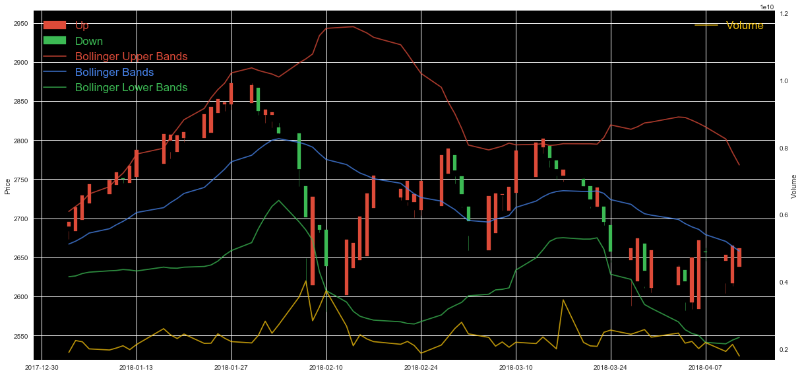


    All Data
    


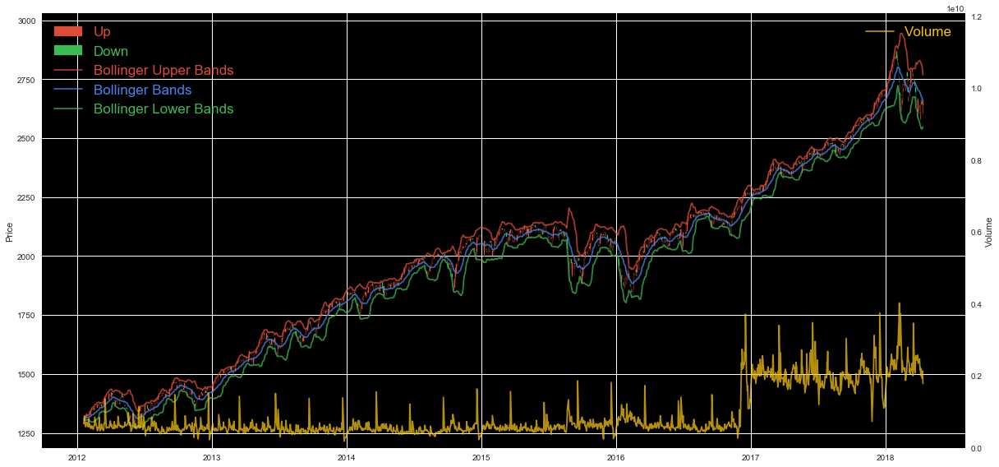


```python
def subplot(data):
    data.plot(figsize = (Page_size, Page_size), subplots = True, layout = (len(data.columns)/3 + 1, 3));
subplot (d[X_base + X_vec + X_stat])
```


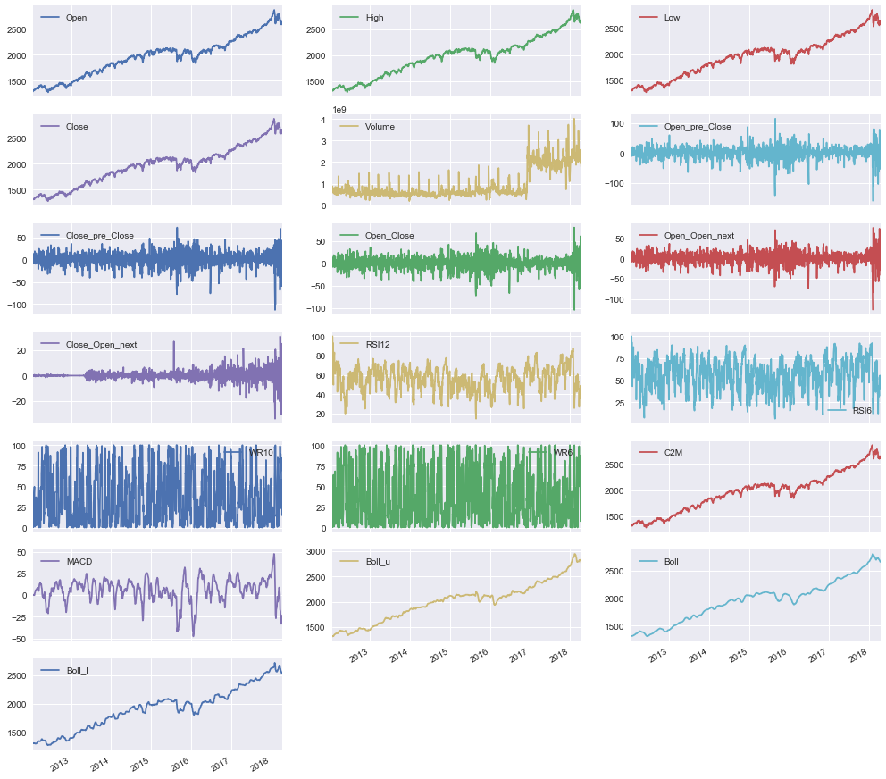


```python
third_y =  ['C2M', 'Boll']
d_test  = d[date_split  :]
def plot( data,     ylabel = ''            , secondary_y = None       ):
    ax  = data.plot       (                  secondary_y = secondary_y, figsize = (Page_size, Page_size/2));
    ax        . set_ylabel(ylabel)

plot    ( d_test          [X_base + [x for x in X_stat if any([0 <= x.find(s) for s in third_y])]],
                          'Price'          ,              'Volume'                                )
plot    ( d_test          [X_vec  + ['Close_Close_next'                                         ]],
                          'Price Change'                                                          )
plot    ( d_test          [         [x for x in X_stat if all([0 >  x.find(s) for s in third_y])]])
```


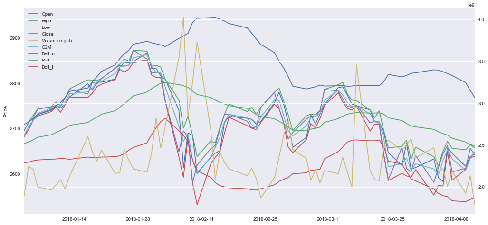


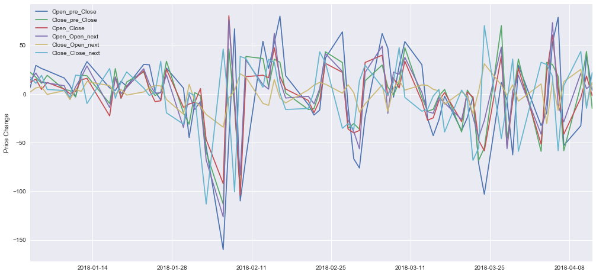


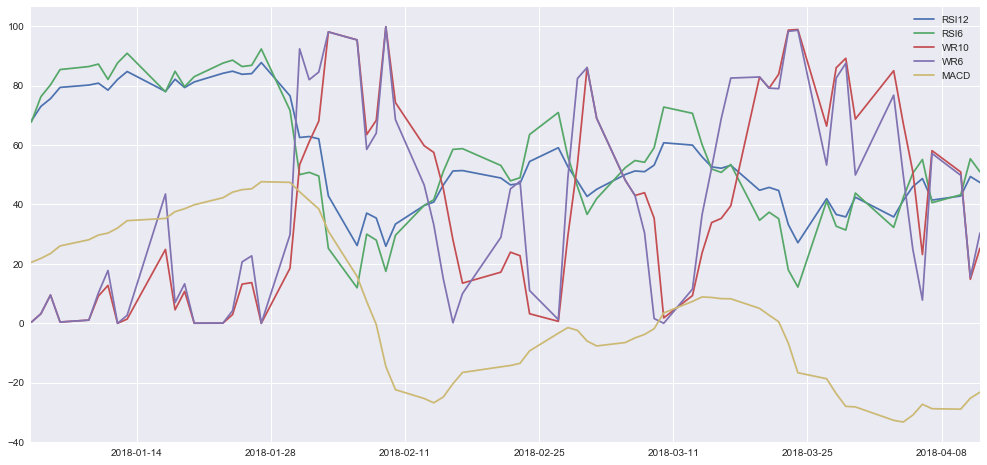


----
## Preparing the Data
### Normalizing Numerical Features
We will use [`sklearn.preprocessing.MinMaxScaler`](http://scikit-learn.org/stable/modules/generated/sklearn.preprocessing.MinMaxScaler.html) first and try others later.


```python
# Try Log-transform for the special feature
log           = ['Volume']
data_log      = data_raw     .copy  ()
data_log[log] = data_log[log].apply (          lambda x: np.log(x  + 1))
concat( [       data_raw[log],
                data_log[log].rename(columns = lambda c: 'log of ' + c)]).hist(figsize = (8, 2));
```


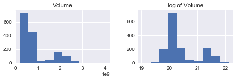


```python
from sklearn.preprocessing import MinMaxScaler, StandardScaler, RobustScaler
numerical = [c for c in data_raw.columns if c.find('up') < 0]
for data_scale, name in ((data_raw, 'data_raw'), (data_log, 'data_log'),):
    for scaler in (  RobustScaler(), StandardScaler(), MinMaxScaler(),):
        data_scaled                  =                           data_scale .copy()
        data_scaled[numerical]       =      scaler.fit_transform(data_scaled[numerical])
        print '\n[{} with {}]'.format(name, class_name(scaler))
#         display(data_scaled.head(n = 5)) # Show examples of records with scaling applied
        display(data_scaled.tail(n = 5))
        display(data_scaled.describe())
```

    
    [data_raw with RobustScaler]
    


<div>
<style>
    .dataframe thead tr:only-child th {
        text-align: right;
    }

    .dataframe thead th {
        text-align: left;
    }

    .dataframe tbody tr th {
        vertical-align: top;
    }
</style>
<table border="1" class="dataframe">
  <thead>
    <tr style="text-align: right;">
      <th></th>
      <th>Open_pre</th>
      <th>Close_pre</th>
      <th>Open</th>
      <th>High</th>
      <th>Low</th>
      <th>Close</th>
      <th>Volume</th>
      <th>Open_next</th>
      <th>Close_next</th>
      <th>Open_pre_Close</th>
      <th>...</th>
      <th>Open_next_Close_next_up</th>
      <th>RSI12</th>
      <th>RSI6</th>
      <th>WR10</th>
      <th>WR6</th>
      <th>C2M</th>
      <th>MACD</th>
      <th>Boll_u</th>
      <th>Boll</th>
      <th>Boll_l</th>
    </tr>
  </thead>
  <tbody>
    <tr>
      <th>2018-04-06</th>
      <td>1.193716</td>
      <td>1.328448</td>
      <td>1.344722</td>
      <td>1.351144</td>
      <td>1.361805</td>
      <td>1.362890</td>
      <td>3.864324</td>
      <td>1.321736</td>
      <td>1.234804</td>
      <td>3.734520</td>
      <td>...</td>
      <td>False</td>
      <td>-0.512845</td>
      <td>-0.122343</td>
      <td>-0.120587</td>
      <td>-0.434278</td>
      <td>1.346140</td>
      <td>-2.274156</td>
      <td>1.558650</td>
      <td>1.426240</td>
      <td>1.201826</td>
    </tr>
    <tr>
      <th>2018-04-07</th>
      <td>1.345371</td>
      <td>1.366236</td>
      <td>1.320820</td>
      <td>1.319634</td>
      <td>1.230137</td>
      <td>1.241211</td>
      <td>4.347866</td>
      <td>1.262230</td>
      <td>1.252880</td>
      <td>-2.686251</td>
      <td>...</td>
      <td>False</td>
      <td>-0.935980</td>
      <td>-0.692436</td>
      <td>0.561920</td>
      <td>0.482418</td>
      <td>1.304218</td>
      <td>-2.371354</td>
      <td>1.549233</td>
      <td>1.412296</td>
      <td>1.183906</td>
    </tr>
    <tr>
      <th>2018-04-10</th>
      <td>1.321502</td>
      <td>1.244709</td>
      <td>1.261499</td>
      <td>1.312731</td>
      <td>1.281132</td>
      <td>1.259326</td>
      <td>3.634844</td>
      <td>1.306340</td>
      <td>1.343800</td>
      <td>-1.699902</td>
      <td>...</td>
      <td>True</td>
      <td>-0.855375</td>
      <td>-0.587644</td>
      <td>0.421733</td>
      <td>0.345942</td>
      <td>1.252436</td>
      <td>-2.381226</td>
      <td>1.516798</td>
      <td>1.394319</td>
      <td>1.180169</td>
    </tr>
    <tr>
      <th>2018-04-11</th>
      <td>1.262263</td>
      <td>1.262802</td>
      <td>1.305472</td>
      <td>1.337400</td>
      <td>1.333105</td>
      <td>1.350445</td>
      <td>4.200672</td>
      <td>1.317726</td>
      <td>1.313264</td>
      <td>1.827645</td>
      <td>...</td>
      <td>False</td>
      <td>-0.473054</td>
      <td>-0.112671</td>
      <td>-0.283398</td>
      <td>-0.292464</td>
      <td>1.307053</td>
      <td>-2.141201</td>
      <td>1.480234</td>
      <td>1.381241</td>
      <td>1.189828</td>
    </tr>
    <tr>
      <th>2018-04-12</th>
      <td>1.306175</td>
      <td>1.353806</td>
      <td>1.316822</td>
      <td>1.329066</td>
      <td>1.340321</td>
      <td>1.319842</td>
      <td>3.271599</td>
      <td>1.338379</td>
      <td>1.358610</td>
      <td>0.076792</td>
      <td>...</td>
      <td>True</td>
      <td>-0.589268</td>
      <td>-0.284735</td>
      <td>-0.079129</td>
      <td>-0.015534</td>
      <td>1.337312</td>
      <td>-2.010522</td>
      <td>1.447197</td>
      <td>1.368477</td>
      <td>1.196726</td>
    </tr>
  </tbody>
</table>
<p>5 rows × 32 columns</p>
</div>


<div>
<style>
    .dataframe thead tr:only-child th {
        text-align: right;
    }

    .dataframe thead th {
        text-align: left;
    }

    .dataframe tbody tr th {
        vertical-align: top;
    }
</style>
<table border="1" class="dataframe">
  <thead>
    <tr style="text-align: right;">
      <th></th>
      <th>Open_pre</th>
      <th>Close_pre</th>
      <th>Open</th>
      <th>High</th>
      <th>Low</th>
      <th>Close</th>
      <th>Volume</th>
      <th>Open_next</th>
      <th>Close_next</th>
      <th>Open_pre_Close</th>
      <th>...</th>
      <th>Open_next_Close_next</th>
      <th>RSI12</th>
      <th>RSI6</th>
      <th>WR10</th>
      <th>WR6</th>
      <th>C2M</th>
      <th>MACD</th>
      <th>Boll_u</th>
      <th>Boll</th>
      <th>Boll_l</th>
    </tr>
  </thead>
  <tbody>
    <tr>
      <th>count</th>
      <td>1554.000000</td>
      <td>1.554000e+03</td>
      <td>1554.000000</td>
      <td>1554.000000</td>
      <td>1554.000000</td>
      <td>1554.000000</td>
      <td>1554.000000</td>
      <td>1554.000000</td>
      <td>1554.000000</td>
      <td>1554.000000</td>
      <td>...</td>
      <td>1554.000000</td>
      <td>1.554000e+03</td>
      <td>1554.000000</td>
      <td>1.554000e+03</td>
      <td>1.554000e+03</td>
      <td>1554.000000</td>
      <td>1554.000000</td>
      <td>1554.000000</td>
      <td>1.554000e+03</td>
      <td>1554.000000</td>
    </tr>
    <tr>
      <th>mean</th>
      <td>-0.077993</td>
      <td>-7.682265e-02</td>
      <td>-0.078837</td>
      <td>-0.086401</td>
      <td>-0.070275</td>
      <td>-0.080208</td>
      <td>0.878752</td>
      <td>-0.080530</td>
      <td>-0.081970</td>
      <td>-0.040909</td>
      <td>...</td>
      <td>-0.035586</td>
      <td>-7.303883e-02</td>
      <td>-0.054734</td>
      <td>1.400658e-01</td>
      <td>1.289869e-01</td>
      <td>-0.078934</td>
      <td>-0.109810</td>
      <td>-0.144600</td>
      <td>-7.353891e-02</td>
      <td>-0.066765</td>
    </tr>
    <tr>
      <th>std</th>
      <td>0.775783</td>
      <td>7.803418e-01</td>
      <td>0.776915</td>
      <td>0.778964</td>
      <td>0.778229</td>
      <td>0.781382</td>
      <td>1.812471</td>
      <td>0.779441</td>
      <td>0.779838</td>
      <td>1.030669</td>
      <td>...</td>
      <td>1.071620</td>
      <td>6.971336e-01</td>
      <td>0.681047</td>
      <td>5.972657e-01</td>
      <td>5.781753e-01</td>
      <td>0.781184</td>
      <td>0.867501</td>
      <td>0.798526</td>
      <td>7.748031e-01</td>
      <td>0.736688</td>
    </tr>
    <tr>
      <th>min</th>
      <td>-1.508072</td>
      <td>-1.516932e+00</td>
      <td>-1.512637</td>
      <td>-1.529338</td>
      <td>-1.514124</td>
      <td>-1.523884</td>
      <td>-1.061150</td>
      <td>-1.520595</td>
      <td>-1.524267</td>
      <td>-7.907606</td>
      <td>...</td>
      <td>-7.805241</td>
      <td>-2.488190e+00</td>
      <td>-2.034550</td>
      <td>-5.723220e-01</td>
      <td>-5.793909e-01</td>
      <td>-1.521593</td>
      <td>-3.597306</td>
      <td>-1.551223</td>
      <td>-1.424796e+00</td>
      <td>-1.358628</td>
    </tr>
    <tr>
      <th>25%</th>
      <td>-0.671067</td>
      <td>-6.710424e-01</td>
      <td>-0.672822</td>
      <td>-0.684268</td>
      <td>-0.659034</td>
      <td>-0.674811</td>
      <td>-0.213339</td>
      <td>-0.674415</td>
      <td>-0.676772</td>
      <td>-0.508289</td>
      <td>...</td>
      <td>-0.492659</td>
      <td>-5.609045e-01</td>
      <td>-0.522498</td>
      <td>-4.033682e-01</td>
      <td>-4.001021e-01</td>
      <td>-0.672002</td>
      <td>-0.556873</td>
      <td>-0.756628</td>
      <td>-6.754070e-01</td>
      <td>-0.658826</td>
    </tr>
    <tr>
      <th>50%</th>
      <td>0.000000</td>
      <td>-2.367898e-16</td>
      <td>0.000000</td>
      <td>0.000000</td>
      <td>0.000000</td>
      <td>0.000000</td>
      <td>0.000000</td>
      <td>0.000000</td>
      <td>0.000000</td>
      <td>0.000000</td>
      <td>...</td>
      <td>0.000000</td>
      <td>2.072181e-16</td>
      <td>0.000000</td>
      <td>-3.469447e-17</td>
      <td>3.301396e-17</td>
      <td>0.000000</td>
      <td>0.000000</td>
      <td>0.000000</td>
      <td>2.357259e-16</td>
      <td>0.000000</td>
    </tr>
    <tr>
      <th>75%</th>
      <td>0.328933</td>
      <td>3.289576e-01</td>
      <td>0.327178</td>
      <td>0.315732</td>
      <td>0.340966</td>
      <td>0.325189</td>
      <td>0.786661</td>
      <td>0.325585</td>
      <td>0.323228</td>
      <td>0.491711</td>
      <td>...</td>
      <td>0.507341</td>
      <td>4.390955e-01</td>
      <td>0.477502</td>
      <td>5.966318e-01</td>
      <td>5.998979e-01</td>
      <td>0.327998</td>
      <td>0.443127</td>
      <td>0.243372</td>
      <td>3.245930e-01</td>
      <td>0.341174</td>
    </tr>
    <tr>
      <th>max</th>
      <td>1.779467</td>
      <td>1.803521e+00</td>
      <td>1.779413</td>
      <td>1.767379</td>
      <td>1.781702</td>
      <td>1.800721</td>
      <td>9.308247</td>
      <td>1.781766</td>
      <td>1.793095</td>
      <td>5.495124</td>
      <td>...</td>
      <td>5.900019</td>
      <td>1.764914e+00</td>
      <td>1.335454</td>
      <td>1.379329e+00</td>
      <td>1.278185e+00</td>
      <td>1.782735</td>
      <td>2.589904</td>
      <td>1.817824</td>
      <td>1.666735e+00</td>
      <td>1.547329</td>
    </tr>
  </tbody>
</table>
<p>8 rows × 25 columns</p>
</div>


    
    [data_raw with StandardScaler]
    


<div>
<style>
    .dataframe thead tr:only-child th {
        text-align: right;
    }

    .dataframe thead th {
        text-align: left;
    }

    .dataframe tbody tr th {
        vertical-align: top;
    }
</style>
<table border="1" class="dataframe">
  <thead>
    <tr style="text-align: right;">
      <th></th>
      <th>Open_pre</th>
      <th>Close_pre</th>
      <th>Open</th>
      <th>High</th>
      <th>Low</th>
      <th>Close</th>
      <th>Volume</th>
      <th>Open_next</th>
      <th>Close_next</th>
      <th>Open_pre_Close</th>
      <th>...</th>
      <th>Open_next_Close_next_up</th>
      <th>RSI12</th>
      <th>RSI6</th>
      <th>WR10</th>
      <th>WR6</th>
      <th>C2M</th>
      <th>MACD</th>
      <th>Boll_u</th>
      <th>Boll</th>
      <th>Boll_l</th>
    </tr>
  </thead>
  <tbody>
    <tr>
      <th>2018-04-06</th>
      <td>1.639788</td>
      <td>1.801419</td>
      <td>1.832913</td>
      <td>1.846051</td>
      <td>1.840770</td>
      <td>1.847446</td>
      <td>1.647769</td>
      <td>1.799646</td>
      <td>1.689067</td>
      <td>3.664266</td>
      <td>...</td>
      <td>False</td>
      <td>-0.631081</td>
      <td>-0.099305</td>
      <td>-0.436550</td>
      <td>-0.974524</td>
      <td>1.824835</td>
      <td>-2.495725</td>
      <td>2.133679</td>
      <td>1.936314</td>
      <td>1.722573</td>
    </tr>
    <tr>
      <th>2018-04-07</th>
      <td>1.835338</td>
      <td>1.849860</td>
      <td>1.802138</td>
      <td>1.805588</td>
      <td>1.671527</td>
      <td>1.691673</td>
      <td>1.914641</td>
      <td>1.723277</td>
      <td>1.712253</td>
      <td>-2.567454</td>
      <td>...</td>
      <td>False</td>
      <td>-1.238240</td>
      <td>-0.936657</td>
      <td>0.706537</td>
      <td>0.611484</td>
      <td>1.771153</td>
      <td>-2.607804</td>
      <td>2.121883</td>
      <td>1.918312</td>
      <td>1.698241</td>
    </tr>
    <tr>
      <th>2018-04-10</th>
      <td>1.804560</td>
      <td>1.694075</td>
      <td>1.725759</td>
      <td>1.796723</td>
      <td>1.737075</td>
      <td>1.714864</td>
      <td>1.521117</td>
      <td>1.779887</td>
      <td>1.828879</td>
      <td>-1.610147</td>
      <td>...</td>
      <td>True</td>
      <td>-1.122580</td>
      <td>-0.782739</td>
      <td>0.471746</td>
      <td>0.375362</td>
      <td>1.704845</td>
      <td>-2.619188</td>
      <td>2.081251</td>
      <td>1.895101</td>
      <td>1.693167</td>
    </tr>
    <tr>
      <th>2018-04-11</th>
      <td>1.728175</td>
      <td>1.717268</td>
      <td>1.782376</td>
      <td>1.828402</td>
      <td>1.803879</td>
      <td>1.831514</td>
      <td>1.833403</td>
      <td>1.794499</td>
      <td>1.789710</td>
      <td>1.813537</td>
      <td>...</td>
      <td>False</td>
      <td>-0.573984</td>
      <td>-0.085098</td>
      <td>-0.709232</td>
      <td>-0.729167</td>
      <td>1.774783</td>
      <td>-2.342413</td>
      <td>2.035447</td>
      <td>1.878217</td>
      <td>1.706282</td>
    </tr>
    <tr>
      <th>2018-04-12</th>
      <td>1.784797</td>
      <td>1.833927</td>
      <td>1.796991</td>
      <td>1.817700</td>
      <td>1.813156</td>
      <td>1.792337</td>
      <td>1.320638</td>
      <td>1.821005</td>
      <td>1.847876</td>
      <td>0.114235</td>
      <td>...</td>
      <td>True</td>
      <td>-0.740741</td>
      <td>-0.337826</td>
      <td>-0.367116</td>
      <td>-0.250041</td>
      <td>1.813530</td>
      <td>-2.191726</td>
      <td>1.994061</td>
      <td>1.861738</td>
      <td>1.715648</td>
    </tr>
  </tbody>
</table>
<p>5 rows × 32 columns</p>
</div>


<div>
<style>
    .dataframe thead tr:only-child th {
        text-align: right;
    }

    .dataframe thead th {
        text-align: left;
    }

    .dataframe tbody tr th {
        vertical-align: top;
    }
</style>
<table border="1" class="dataframe">
  <thead>
    <tr style="text-align: right;">
      <th></th>
      <th>Open_pre</th>
      <th>Close_pre</th>
      <th>Open</th>
      <th>High</th>
      <th>Low</th>
      <th>Close</th>
      <th>Volume</th>
      <th>Open_next</th>
      <th>Close_next</th>
      <th>Open_pre_Close</th>
      <th>...</th>
      <th>Open_next_Close_next</th>
      <th>RSI12</th>
      <th>RSI6</th>
      <th>WR10</th>
      <th>WR6</th>
      <th>C2M</th>
      <th>MACD</th>
      <th>Boll_u</th>
      <th>Boll</th>
      <th>Boll_l</th>
    </tr>
  </thead>
  <tbody>
    <tr>
      <th>count</th>
      <td>1.554000e+03</td>
      <td>1.554000e+03</td>
      <td>1.554000e+03</td>
      <td>1.554000e+03</td>
      <td>1.554000e+03</td>
      <td>1.554000e+03</td>
      <td>1.554000e+03</td>
      <td>1.554000e+03</td>
      <td>1.554000e+03</td>
      <td>1.554000e+03</td>
      <td>...</td>
      <td>1.554000e+03</td>
      <td>1.554000e+03</td>
      <td>1.554000e+03</td>
      <td>1.554000e+03</td>
      <td>1.554000e+03</td>
      <td>1.554000e+03</td>
      <td>1.554000e+03</td>
      <td>1.554000e+03</td>
      <td>1.554000e+03</td>
      <td>1.554000e+03</td>
    </tr>
    <tr>
      <th>mean</th>
      <td>6.474158e-16</td>
      <td>-1.751638e-15</td>
      <td>5.272488e-17</td>
      <td>3.883637e-16</td>
      <td>-8.920363e-16</td>
      <td>1.528879e-17</td>
      <td>-1.314550e-17</td>
      <td>-6.356991e-16</td>
      <td>-3.920788e-16</td>
      <td>2.482642e-18</td>
      <td>...</td>
      <td>1.293117e-17</td>
      <td>-3.070617e-16</td>
      <td>8.444554e-17</td>
      <td>2.173294e-16</td>
      <td>7.019267e-17</td>
      <td>1.350557e-15</td>
      <td>-3.857918e-17</td>
      <td>-7.277176e-16</td>
      <td>-6.431292e-16</td>
      <td>-2.216159e-16</td>
    </tr>
    <tr>
      <th>std</th>
      <td>1.000322e+00</td>
      <td>1.000322e+00</td>
      <td>1.000322e+00</td>
      <td>1.000322e+00</td>
      <td>1.000322e+00</td>
      <td>1.000322e+00</td>
      <td>1.000322e+00</td>
      <td>1.000322e+00</td>
      <td>1.000322e+00</td>
      <td>1.000322e+00</td>
      <td>...</td>
      <td>1.000322e+00</td>
      <td>1.000322e+00</td>
      <td>1.000322e+00</td>
      <td>1.000322e+00</td>
      <td>1.000322e+00</td>
      <td>1.000322e+00</td>
      <td>1.000322e+00</td>
      <td>1.000322e+00</td>
      <td>1.000322e+00</td>
      <td>1.000322e+00</td>
    </tr>
    <tr>
      <th>min</th>
      <td>-1.843995e+00</td>
      <td>-1.846079e+00</td>
      <td>-1.846099e+00</td>
      <td>-1.852977e+00</td>
      <td>-1.855899e+00</td>
      <td>-1.848188e+00</td>
      <td>-1.070652e+00</td>
      <td>-1.848158e+00</td>
      <td>-1.850079e+00</td>
      <td>-7.635073e+00</td>
      <td>...</td>
      <td>-7.252714e+00</td>
      <td>-3.465517e+00</td>
      <td>-2.907956e+00</td>
      <td>-1.193133e+00</td>
      <td>-1.225590e+00</td>
      <td>-1.847353e+00</td>
      <td>-4.021459e+00</td>
      <td>-1.762092e+00</td>
      <td>-1.744562e+00</td>
      <td>-1.754172e+00</td>
    </tr>
    <tr>
      <th>25%</th>
      <td>-7.647309e-01</td>
      <td>-7.617316e-01</td>
      <td>-7.647888e-01</td>
      <td>-7.677633e-01</td>
      <td>-7.567814e-01</td>
      <td>-7.612076e-01</td>
      <td>-6.027362e-01</td>
      <td>-7.621830e-01</td>
      <td>-7.629717e-01</td>
      <td>-4.536187e-01</td>
      <td>...</td>
      <td>-4.266629e-01</td>
      <td>-7.000419e-01</td>
      <td>-6.870517e-01</td>
      <td>-9.101628e-01</td>
      <td>-9.153959e-01</td>
      <td>-7.594348e-01</td>
      <td>-5.155117e-01</td>
      <td>-7.666941e-01</td>
      <td>-7.770515e-01</td>
      <td>-8.039371e-01</td>
    </tr>
    <tr>
      <th>50%</th>
      <td>1.005673e-01</td>
      <td>9.847912e-02</td>
      <td>1.015074e-01</td>
      <td>1.109532e-01</td>
      <td>9.032969e-02</td>
      <td>1.026815e-01</td>
      <td>-4.849922e-01</td>
      <td>1.033504e-01</td>
      <td>1.051453e-01</td>
      <td>3.970407e-02</td>
      <td>...</td>
      <td>3.321826e-02</td>
      <td>1.048039e-01</td>
      <td>8.039316e-02</td>
      <td>-2.345872e-01</td>
      <td>-2.231649e-01</td>
      <td>1.010763e-01</td>
      <td>1.266223e-01</td>
      <td>1.811416e-01</td>
      <td>9.494359e-02</td>
      <td>9.065831e-02</td>
    </tr>
    <tr>
      <th>75%</th>
      <td>5.247051e-01</td>
      <td>5.201707e-01</td>
      <td>5.227680e-01</td>
      <td>5.164066e-01</td>
      <td>5.286014e-01</td>
      <td>5.189874e-01</td>
      <td>-5.082565e-02</td>
      <td>5.212012e-01</td>
      <td>5.197594e-01</td>
      <td>5.169377e-01</td>
      <td>...</td>
      <td>5.068039e-01</td>
      <td>7.348652e-01</td>
      <td>7.817489e-01</td>
      <td>7.646729e-01</td>
      <td>8.147401e-01</td>
      <td>5.210847e-01</td>
      <td>6.375959e-01</td>
      <td>4.860167e-01</td>
      <td>5.140145e-01</td>
      <td>5.539259e-01</td>
    </tr>
    <tr>
      <th>max</th>
      <td>2.395076e+00</td>
      <td>2.410416e+00</td>
      <td>2.392603e+00</td>
      <td>2.380569e+00</td>
      <td>2.380498e+00</td>
      <td>2.407956e+00</td>
      <td>4.652327e+00</td>
      <td>2.390041e+00</td>
      <td>2.405204e+00</td>
      <td>5.373032e+00</td>
      <td>...</td>
      <td>5.540689e+00</td>
      <td>2.637292e+00</td>
      <td>2.041908e+00</td>
      <td>2.075563e+00</td>
      <td>1.988270e+00</td>
      <td>2.383903e+00</td>
      <td>3.113060e+00</td>
      <td>2.458350e+00</td>
      <td>2.246809e+00</td>
      <td>2.191719e+00</td>
    </tr>
  </tbody>
</table>
<p>8 rows × 25 columns</p>
</div>


    
    [data_raw with MinMaxScaler]
    


<div>
<style>
    .dataframe thead tr:only-child th {
        text-align: right;
    }

    .dataframe thead th {
        text-align: left;
    }

    .dataframe tbody tr th {
        vertical-align: top;
    }
</style>
<table border="1" class="dataframe">
  <thead>
    <tr style="text-align: right;">
      <th></th>
      <th>Open_pre</th>
      <th>Close_pre</th>
      <th>Open</th>
      <th>High</th>
      <th>Low</th>
      <th>Close</th>
      <th>Volume</th>
      <th>Open_next</th>
      <th>Close_next</th>
      <th>Open_pre_Close</th>
      <th>...</th>
      <th>Open_next_Close_next_up</th>
      <th>RSI12</th>
      <th>RSI6</th>
      <th>WR10</th>
      <th>WR6</th>
      <th>C2M</th>
      <th>MACD</th>
      <th>Boll_u</th>
      <th>Boll</th>
      <th>Boll_l</th>
    </tr>
  </thead>
  <tbody>
    <tr>
      <th>2018-04-06</th>
      <td>0.821827</td>
      <td>0.856925</td>
      <td>0.867957</td>
      <td>0.873742</td>
      <td>0.872597</td>
      <td>0.868306</td>
      <td>0.475001</td>
      <td>0.860697</td>
      <td>0.831706</td>
      <td>0.868638</td>
      <td>...</td>
      <td>False</td>
      <td>0.464448</td>
      <td>0.567420</td>
      <td>0.231463</td>
      <td>0.078120</td>
      <td>0.867872</td>
      <td>0.213852</td>
      <td>0.923072</td>
      <td>0.922208</td>
      <td>0.881105</td>
    </tr>
    <tr>
      <th>2018-04-07</th>
      <td>0.867957</td>
      <td>0.868306</td>
      <td>0.860697</td>
      <td>0.864185</td>
      <td>0.832648</td>
      <td>0.831706</td>
      <td>0.521633</td>
      <td>0.842677</td>
      <td>0.837155</td>
      <td>0.389574</td>
      <td>...</td>
      <td>False</td>
      <td>0.364959</td>
      <td>0.398253</td>
      <td>0.581170</td>
      <td>0.571610</td>
      <td>0.855185</td>
      <td>0.198143</td>
      <td>0.920277</td>
      <td>0.917698</td>
      <td>0.874939</td>
    </tr>
    <tr>
      <th>2018-04-10</th>
      <td>0.860697</td>
      <td>0.831706</td>
      <td>0.842677</td>
      <td>0.862091</td>
      <td>0.848120</td>
      <td>0.837155</td>
      <td>0.452871</td>
      <td>0.856035</td>
      <td>0.864562</td>
      <td>0.463167</td>
      <td>...</td>
      <td>True</td>
      <td>0.383911</td>
      <td>0.429348</td>
      <td>0.509340</td>
      <td>0.498140</td>
      <td>0.839514</td>
      <td>0.196547</td>
      <td>0.910650</td>
      <td>0.911883</td>
      <td>0.873653</td>
    </tr>
    <tr>
      <th>2018-04-11</th>
      <td>0.842677</td>
      <td>0.837155</td>
      <td>0.856035</td>
      <td>0.869573</td>
      <td>0.863889</td>
      <td>0.864562</td>
      <td>0.507438</td>
      <td>0.859482</td>
      <td>0.855358</td>
      <td>0.726363</td>
      <td>...</td>
      <td>False</td>
      <td>0.473804</td>
      <td>0.570290</td>
      <td>0.148041</td>
      <td>0.154463</td>
      <td>0.856043</td>
      <td>0.235341</td>
      <td>0.899796</td>
      <td>0.907653</td>
      <td>0.876977</td>
    </tr>
    <tr>
      <th>2018-04-12</th>
      <td>0.856035</td>
      <td>0.864562</td>
      <td>0.859482</td>
      <td>0.867046</td>
      <td>0.866079</td>
      <td>0.855358</td>
      <td>0.417840</td>
      <td>0.865736</td>
      <td>0.869027</td>
      <td>0.595729</td>
      <td>...</td>
      <td>True</td>
      <td>0.446479</td>
      <td>0.519232</td>
      <td>0.252705</td>
      <td>0.303544</td>
      <td>0.865200</td>
      <td>0.256462</td>
      <td>0.889991</td>
      <td>0.903524</td>
      <td>0.879350</td>
    </tr>
  </tbody>
</table>
<p>5 rows × 32 columns</p>
</div>


<div>
<style>
    .dataframe thead tr:only-child th {
        text-align: right;
    }

    .dataframe thead th {
        text-align: left;
    }

    .dataframe tbody tr th {
        vertical-align: top;
    }
</style>
<table border="1" class="dataframe">
  <thead>
    <tr style="text-align: right;">
      <th></th>
      <th>Open_pre</th>
      <th>Close_pre</th>
      <th>Open</th>
      <th>High</th>
      <th>Low</th>
      <th>Close</th>
      <th>Volume</th>
      <th>Open_next</th>
      <th>Close_next</th>
      <th>Open_pre_Close</th>
      <th>...</th>
      <th>Open_next_Close_next</th>
      <th>RSI12</th>
      <th>RSI6</th>
      <th>WR10</th>
      <th>WR6</th>
      <th>C2M</th>
      <th>MACD</th>
      <th>Boll_u</th>
      <th>Boll</th>
      <th>Boll_l</th>
    </tr>
  </thead>
  <tbody>
    <tr>
      <th>count</th>
      <td>1554.000000</td>
      <td>1554.000000</td>
      <td>1554.000000</td>
      <td>1554.000000</td>
      <td>1554.000000</td>
      <td>1554.000000</td>
      <td>1554.000000</td>
      <td>1554.000000</td>
      <td>1554.000000</td>
      <td>1554.000000</td>
      <td>...</td>
      <td>1554.000000</td>
      <td>1554.000000</td>
      <td>1554.000000</td>
      <td>1554.000000</td>
      <td>1554.000000</td>
      <td>1554.000000</td>
      <td>1554.000000</td>
      <td>1554.000000</td>
      <td>1554.000000</td>
      <td>1554.000000</td>
    </tr>
    <tr>
      <th>mean</th>
      <td>0.435000</td>
      <td>0.433709</td>
      <td>0.435534</td>
      <td>0.437689</td>
      <td>0.438084</td>
      <td>0.434240</td>
      <td>0.187079</td>
      <td>0.436072</td>
      <td>0.434772</td>
      <td>0.586947</td>
      <td>...</td>
      <td>0.566910</td>
      <td>0.567856</td>
      <td>0.587482</td>
      <td>0.365018</td>
      <td>0.381345</td>
      <td>0.436597</td>
      <td>0.563662</td>
      <td>0.417514</td>
      <td>0.437083</td>
      <td>0.444557</td>
    </tr>
    <tr>
      <th>std</th>
      <td>0.235977</td>
      <td>0.235011</td>
      <td>0.235997</td>
      <td>0.236285</td>
      <td>0.236126</td>
      <td>0.235030</td>
      <td>0.174790</td>
      <td>0.236025</td>
      <td>0.235078</td>
      <td>0.076900</td>
      <td>...</td>
      <td>0.078190</td>
      <td>0.163912</td>
      <td>0.202091</td>
      <td>0.306031</td>
      <td>0.311253</td>
      <td>0.236413</td>
      <td>0.140209</td>
      <td>0.237018</td>
      <td>0.250621</td>
      <td>0.253510</td>
    </tr>
    <tr>
      <th>min</th>
      <td>0.000000</td>
      <td>0.000000</td>
      <td>0.000000</td>
      <td>0.000000</td>
      <td>0.000000</td>
      <td>0.000000</td>
      <td>0.000000</td>
      <td>0.000000</td>
      <td>0.000000</td>
      <td>0.000000</td>
      <td>...</td>
      <td>0.000000</td>
      <td>0.000000</td>
      <td>0.000000</td>
      <td>0.000000</td>
      <td>0.000000</td>
      <td>0.000000</td>
      <td>0.000000</td>
      <td>0.000000</td>
      <td>0.000000</td>
      <td>0.000000</td>
    </tr>
    <tr>
      <th>25%</th>
      <td>0.254599</td>
      <td>0.254751</td>
      <td>0.255104</td>
      <td>0.256337</td>
      <td>0.259446</td>
      <td>0.255391</td>
      <td>0.081761</td>
      <td>0.256235</td>
      <td>0.255472</td>
      <td>0.552075</td>
      <td>...</td>
      <td>0.533560</td>
      <td>0.453148</td>
      <td>0.448680</td>
      <td>0.086570</td>
      <td>0.096518</td>
      <td>0.257115</td>
      <td>0.491406</td>
      <td>0.235852</td>
      <td>0.242401</td>
      <td>0.240816</td>
    </tr>
    <tr>
      <th>50%</th>
      <td>0.458724</td>
      <td>0.456845</td>
      <td>0.459482</td>
      <td>0.463897</td>
      <td>0.459407</td>
      <td>0.458365</td>
      <td>0.102335</td>
      <td>0.460457</td>
      <td>0.459482</td>
      <td>0.590000</td>
      <td>...</td>
      <td>0.569507</td>
      <td>0.585029</td>
      <td>0.603723</td>
      <td>0.293250</td>
      <td>0.311907</td>
      <td>0.460485</td>
      <td>0.581410</td>
      <td>0.460434</td>
      <td>0.460871</td>
      <td>0.467532</td>
    </tr>
    <tr>
      <th>75%</th>
      <td>0.558778</td>
      <td>0.555915</td>
      <td>0.558866</td>
      <td>0.559669</td>
      <td>0.562860</td>
      <td>0.556178</td>
      <td>0.178199</td>
      <td>0.559049</td>
      <td>0.556917</td>
      <td>0.626687</td>
      <td>...</td>
      <td>0.606525</td>
      <td>0.688270</td>
      <td>0.745415</td>
      <td>0.598956</td>
      <td>0.634853</td>
      <td>0.559748</td>
      <td>0.653030</td>
      <td>0.532671</td>
      <td>0.565865</td>
      <td>0.584937</td>
    </tr>
    <tr>
      <th>max</th>
      <td>1.000000</td>
      <td>1.000000</td>
      <td>1.000000</td>
      <td>1.000000</td>
      <td>1.000000</td>
      <td>1.000000</td>
      <td>1.000000</td>
      <td>1.000000</td>
      <td>1.000000</td>
      <td>1.000000</td>
      <td>...</td>
      <td>1.000000</td>
      <td>1.000000</td>
      <td>1.000000</td>
      <td>1.000000</td>
      <td>1.000000</td>
      <td>1.000000</td>
      <td>1.000000</td>
      <td>1.000000</td>
      <td>1.000000</td>
      <td>1.000000</td>
    </tr>
  </tbody>
</table>
<p>8 rows × 25 columns</p>
</div>


    
    [data_log with RobustScaler]
    


<div>
<style>
    .dataframe thead tr:only-child th {
        text-align: right;
    }

    .dataframe thead th {
        text-align: left;
    }

    .dataframe tbody tr th {
        vertical-align: top;
    }
</style>
<table border="1" class="dataframe">
  <thead>
    <tr style="text-align: right;">
      <th></th>
      <th>Open_pre</th>
      <th>Close_pre</th>
      <th>Open</th>
      <th>High</th>
      <th>Low</th>
      <th>Close</th>
      <th>Volume</th>
      <th>Open_next</th>
      <th>Close_next</th>
      <th>Open_pre_Close</th>
      <th>...</th>
      <th>Open_next_Close_next_up</th>
      <th>RSI12</th>
      <th>RSI6</th>
      <th>WR10</th>
      <th>WR6</th>
      <th>C2M</th>
      <th>MACD</th>
      <th>Boll_u</th>
      <th>Boll</th>
      <th>Boll_l</th>
    </tr>
  </thead>
  <tbody>
    <tr>
      <th>2018-04-06</th>
      <td>1.193716</td>
      <td>1.328448</td>
      <td>1.344722</td>
      <td>1.351144</td>
      <td>1.361805</td>
      <td>1.362890</td>
      <td>2.242945</td>
      <td>1.321736</td>
      <td>1.234804</td>
      <td>3.734520</td>
      <td>...</td>
      <td>False</td>
      <td>-0.512845</td>
      <td>-0.122343</td>
      <td>-0.120587</td>
      <td>-0.434278</td>
      <td>1.346140</td>
      <td>-2.274156</td>
      <td>1.558650</td>
      <td>1.426240</td>
      <td>1.201826</td>
    </tr>
    <tr>
      <th>2018-04-07</th>
      <td>1.345371</td>
      <td>1.366236</td>
      <td>1.320820</td>
      <td>1.319634</td>
      <td>1.230137</td>
      <td>1.241211</td>
      <td>2.396570</td>
      <td>1.262230</td>
      <td>1.252880</td>
      <td>-2.686251</td>
      <td>...</td>
      <td>False</td>
      <td>-0.935980</td>
      <td>-0.692436</td>
      <td>0.561920</td>
      <td>0.482418</td>
      <td>1.304218</td>
      <td>-2.371354</td>
      <td>1.549233</td>
      <td>1.412296</td>
      <td>1.183906</td>
    </tr>
    <tr>
      <th>2018-04-10</th>
      <td>1.321502</td>
      <td>1.244709</td>
      <td>1.261499</td>
      <td>1.312731</td>
      <td>1.281132</td>
      <td>1.259326</td>
      <td>2.165175</td>
      <td>1.306340</td>
      <td>1.343800</td>
      <td>-1.699902</td>
      <td>...</td>
      <td>True</td>
      <td>-0.855375</td>
      <td>-0.587644</td>
      <td>0.421733</td>
      <td>0.345942</td>
      <td>1.252436</td>
      <td>-2.381226</td>
      <td>1.516798</td>
      <td>1.394319</td>
      <td>1.180169</td>
    </tr>
    <tr>
      <th>2018-04-11</th>
      <td>1.262263</td>
      <td>1.262802</td>
      <td>1.305472</td>
      <td>1.337400</td>
      <td>1.333105</td>
      <td>1.350445</td>
      <td>2.351179</td>
      <td>1.317726</td>
      <td>1.313264</td>
      <td>1.827645</td>
      <td>...</td>
      <td>False</td>
      <td>-0.473054</td>
      <td>-0.112671</td>
      <td>-0.283398</td>
      <td>-0.292464</td>
      <td>1.307053</td>
      <td>-2.141201</td>
      <td>1.480234</td>
      <td>1.381241</td>
      <td>1.189828</td>
    </tr>
    <tr>
      <th>2018-04-12</th>
      <td>1.306175</td>
      <td>1.353806</td>
      <td>1.316822</td>
      <td>1.329066</td>
      <td>1.340321</td>
      <td>1.319842</td>
      <td>2.034756</td>
      <td>1.338379</td>
      <td>1.358610</td>
      <td>0.076792</td>
      <td>...</td>
      <td>True</td>
      <td>-0.589268</td>
      <td>-0.284735</td>
      <td>-0.079129</td>
      <td>-0.015534</td>
      <td>1.337312</td>
      <td>-2.010522</td>
      <td>1.447197</td>
      <td>1.368477</td>
      <td>1.196726</td>
    </tr>
  </tbody>
</table>
<p>5 rows × 32 columns</p>
</div>


<div>
<style>
    .dataframe thead tr:only-child th {
        text-align: right;
    }

    .dataframe thead th {
        text-align: left;
    }

    .dataframe tbody tr th {
        vertical-align: top;
    }
</style>
<table border="1" class="dataframe">
  <thead>
    <tr style="text-align: right;">
      <th></th>
      <th>Open_pre</th>
      <th>Close_pre</th>
      <th>Open</th>
      <th>High</th>
      <th>Low</th>
      <th>Close</th>
      <th>Volume</th>
      <th>Open_next</th>
      <th>Close_next</th>
      <th>Open_pre_Close</th>
      <th>...</th>
      <th>Open_next_Close_next</th>
      <th>RSI12</th>
      <th>RSI6</th>
      <th>WR10</th>
      <th>WR6</th>
      <th>C2M</th>
      <th>MACD</th>
      <th>Boll_u</th>
      <th>Boll</th>
      <th>Boll_l</th>
    </tr>
  </thead>
  <tbody>
    <tr>
      <th>count</th>
      <td>1554.000000</td>
      <td>1.554000e+03</td>
      <td>1554.000000</td>
      <td>1554.000000</td>
      <td>1554.000000</td>
      <td>1554.000000</td>
      <td>1.554000e+03</td>
      <td>1554.000000</td>
      <td>1554.000000</td>
      <td>1554.000000</td>
      <td>...</td>
      <td>1554.000000</td>
      <td>1.554000e+03</td>
      <td>1554.000000</td>
      <td>1.554000e+03</td>
      <td>1.554000e+03</td>
      <td>1554.000000</td>
      <td>1554.000000</td>
      <td>1554.000000</td>
      <td>1.554000e+03</td>
      <td>1554.000000</td>
    </tr>
    <tr>
      <th>mean</th>
      <td>-0.077993</td>
      <td>-7.682265e-02</td>
      <td>-0.078837</td>
      <td>-0.086401</td>
      <td>-0.070275</td>
      <td>-0.080208</td>
      <td>4.383759e-01</td>
      <td>-0.080530</td>
      <td>-0.081970</td>
      <td>-0.040909</td>
      <td>...</td>
      <td>-0.035586</td>
      <td>-7.303883e-02</td>
      <td>-0.054734</td>
      <td>1.400658e-01</td>
      <td>1.289869e-01</td>
      <td>-0.078934</td>
      <td>-0.109810</td>
      <td>-0.144600</td>
      <td>-7.353891e-02</td>
      <td>-0.066765</td>
    </tr>
    <tr>
      <th>std</th>
      <td>0.775783</td>
      <td>7.803418e-01</td>
      <td>0.776915</td>
      <td>0.778964</td>
      <td>0.778229</td>
      <td>0.781382</td>
      <td>1.060842e+00</td>
      <td>0.779441</td>
      <td>0.779838</td>
      <td>1.030669</td>
      <td>...</td>
      <td>1.071620</td>
      <td>6.971336e-01</td>
      <td>0.681047</td>
      <td>5.972657e-01</td>
      <td>5.781753e-01</td>
      <td>0.781184</td>
      <td>0.867501</td>
      <td>0.798526</td>
      <td>7.748031e-01</td>
      <td>0.736688</td>
    </tr>
    <tr>
      <th>min</th>
      <td>-1.508072</td>
      <td>-1.516932e+00</td>
      <td>-1.512637</td>
      <td>-1.529338</td>
      <td>-1.514124</td>
      <td>-1.523884</td>
      <td>-2.055783e+00</td>
      <td>-1.520595</td>
      <td>-1.524267</td>
      <td>-7.907606</td>
      <td>...</td>
      <td>-7.805241</td>
      <td>-2.488190e+00</td>
      <td>-2.034550</td>
      <td>-5.723220e-01</td>
      <td>-5.793909e-01</td>
      <td>-1.521593</td>
      <td>-3.597306</td>
      <td>-1.551223</td>
      <td>-1.424796e+00</td>
      <td>-1.358628</td>
    </tr>
    <tr>
      <th>25%</th>
      <td>-0.671067</td>
      <td>-6.710424e-01</td>
      <td>-0.672822</td>
      <td>-0.684268</td>
      <td>-0.659034</td>
      <td>-0.674811</td>
      <td>-2.648651e-01</td>
      <td>-0.674415</td>
      <td>-0.676772</td>
      <td>-0.508289</td>
      <td>...</td>
      <td>-0.492659</td>
      <td>-5.609045e-01</td>
      <td>-0.522498</td>
      <td>-4.033682e-01</td>
      <td>-4.001021e-01</td>
      <td>-0.672002</td>
      <td>-0.556873</td>
      <td>-0.756628</td>
      <td>-6.754070e-01</td>
      <td>-0.658826</td>
    </tr>
    <tr>
      <th>50%</th>
      <td>0.000000</td>
      <td>-2.367898e-16</td>
      <td>0.000000</td>
      <td>0.000000</td>
      <td>0.000000</td>
      <td>0.000000</td>
      <td>3.194547e-15</td>
      <td>0.000000</td>
      <td>0.000000</td>
      <td>0.000000</td>
      <td>...</td>
      <td>0.000000</td>
      <td>2.072181e-16</td>
      <td>0.000000</td>
      <td>-3.469447e-17</td>
      <td>3.301396e-17</td>
      <td>0.000000</td>
      <td>0.000000</td>
      <td>0.000000</td>
      <td>2.357259e-16</td>
      <td>0.000000</td>
    </tr>
    <tr>
      <th>75%</th>
      <td>0.328933</td>
      <td>3.289576e-01</td>
      <td>0.327178</td>
      <td>0.315732</td>
      <td>0.340966</td>
      <td>0.325189</td>
      <td>7.351349e-01</td>
      <td>0.325585</td>
      <td>0.323228</td>
      <td>0.491711</td>
      <td>...</td>
      <td>0.507341</td>
      <td>4.390955e-01</td>
      <td>0.477502</td>
      <td>5.966318e-01</td>
      <td>5.998979e-01</td>
      <td>0.327998</td>
      <td>0.443127</td>
      <td>0.243372</td>
      <td>3.245930e-01</td>
      <td>0.341174</td>
    </tr>
    <tr>
      <th>max</th>
      <td>1.779467</td>
      <td>1.803521e+00</td>
      <td>1.779413</td>
      <td>1.767379</td>
      <td>1.781702</td>
      <td>1.800721</td>
      <td>3.493090e+00</td>
      <td>1.781766</td>
      <td>1.793095</td>
      <td>5.495124</td>
      <td>...</td>
      <td>5.900019</td>
      <td>1.764914e+00</td>
      <td>1.335454</td>
      <td>1.379329e+00</td>
      <td>1.278185e+00</td>
      <td>1.782735</td>
      <td>2.589904</td>
      <td>1.817824</td>
      <td>1.666735e+00</td>
      <td>1.547329</td>
    </tr>
  </tbody>
</table>
<p>8 rows × 25 columns</p>
</div>


    
    [data_log with StandardScaler]
    


<div>
<style>
    .dataframe thead tr:only-child th {
        text-align: right;
    }

    .dataframe thead th {
        text-align: left;
    }

    .dataframe tbody tr th {
        vertical-align: top;
    }
</style>
<table border="1" class="dataframe">
  <thead>
    <tr style="text-align: right;">
      <th></th>
      <th>Open_pre</th>
      <th>Close_pre</th>
      <th>Open</th>
      <th>High</th>
      <th>Low</th>
      <th>Close</th>
      <th>Volume</th>
      <th>Open_next</th>
      <th>Close_next</th>
      <th>Open_pre_Close</th>
      <th>...</th>
      <th>Open_next_Close_next_up</th>
      <th>RSI12</th>
      <th>RSI6</th>
      <th>WR10</th>
      <th>WR6</th>
      <th>C2M</th>
      <th>MACD</th>
      <th>Boll_u</th>
      <th>Boll</th>
      <th>Boll_l</th>
    </tr>
  </thead>
  <tbody>
    <tr>
      <th>2018-04-06</th>
      <td>1.639788</td>
      <td>1.801419</td>
      <td>1.832913</td>
      <td>1.846051</td>
      <td>1.840770</td>
      <td>1.847446</td>
      <td>1.701620</td>
      <td>1.799646</td>
      <td>1.689067</td>
      <td>3.664266</td>
      <td>...</td>
      <td>False</td>
      <td>-0.631081</td>
      <td>-0.099305</td>
      <td>-0.436550</td>
      <td>-0.974524</td>
      <td>1.824835</td>
      <td>-2.495725</td>
      <td>2.133679</td>
      <td>1.936314</td>
      <td>1.722573</td>
    </tr>
    <tr>
      <th>2018-04-07</th>
      <td>1.835338</td>
      <td>1.849860</td>
      <td>1.802138</td>
      <td>1.805588</td>
      <td>1.671527</td>
      <td>1.691673</td>
      <td>1.846480</td>
      <td>1.723277</td>
      <td>1.712253</td>
      <td>-2.567454</td>
      <td>...</td>
      <td>False</td>
      <td>-1.238240</td>
      <td>-0.936657</td>
      <td>0.706537</td>
      <td>0.611484</td>
      <td>1.771153</td>
      <td>-2.607804</td>
      <td>2.121883</td>
      <td>1.918312</td>
      <td>1.698241</td>
    </tr>
    <tr>
      <th>2018-04-10</th>
      <td>1.804560</td>
      <td>1.694075</td>
      <td>1.725759</td>
      <td>1.796723</td>
      <td>1.737075</td>
      <td>1.714864</td>
      <td>1.628287</td>
      <td>1.779887</td>
      <td>1.828879</td>
      <td>-1.610147</td>
      <td>...</td>
      <td>True</td>
      <td>-1.122580</td>
      <td>-0.782739</td>
      <td>0.471746</td>
      <td>0.375362</td>
      <td>1.704845</td>
      <td>-2.619188</td>
      <td>2.081251</td>
      <td>1.895101</td>
      <td>1.693167</td>
    </tr>
    <tr>
      <th>2018-04-11</th>
      <td>1.728175</td>
      <td>1.717268</td>
      <td>1.782376</td>
      <td>1.828402</td>
      <td>1.803879</td>
      <td>1.831514</td>
      <td>1.803679</td>
      <td>1.794499</td>
      <td>1.789710</td>
      <td>1.813537</td>
      <td>...</td>
      <td>False</td>
      <td>-0.573984</td>
      <td>-0.085098</td>
      <td>-0.709232</td>
      <td>-0.729167</td>
      <td>1.774783</td>
      <td>-2.342413</td>
      <td>2.035447</td>
      <td>1.878217</td>
      <td>1.706282</td>
    </tr>
    <tr>
      <th>2018-04-12</th>
      <td>1.784797</td>
      <td>1.833927</td>
      <td>1.796991</td>
      <td>1.817700</td>
      <td>1.813156</td>
      <td>1.792337</td>
      <td>1.505308</td>
      <td>1.821005</td>
      <td>1.847876</td>
      <td>0.114235</td>
      <td>...</td>
      <td>True</td>
      <td>-0.740741</td>
      <td>-0.337826</td>
      <td>-0.367116</td>
      <td>-0.250041</td>
      <td>1.813530</td>
      <td>-2.191726</td>
      <td>1.994061</td>
      <td>1.861738</td>
      <td>1.715648</td>
    </tr>
  </tbody>
</table>
<p>5 rows × 32 columns</p>
</div>


<div>
<style>
    .dataframe thead tr:only-child th {
        text-align: right;
    }

    .dataframe thead th {
        text-align: left;
    }

    .dataframe tbody tr th {
        vertical-align: top;
    }
</style>
<table border="1" class="dataframe">
  <thead>
    <tr style="text-align: right;">
      <th></th>
      <th>Open_pre</th>
      <th>Close_pre</th>
      <th>Open</th>
      <th>High</th>
      <th>Low</th>
      <th>Close</th>
      <th>Volume</th>
      <th>Open_next</th>
      <th>Close_next</th>
      <th>Open_pre_Close</th>
      <th>...</th>
      <th>Open_next_Close_next</th>
      <th>RSI12</th>
      <th>RSI6</th>
      <th>WR10</th>
      <th>WR6</th>
      <th>C2M</th>
      <th>MACD</th>
      <th>Boll_u</th>
      <th>Boll</th>
      <th>Boll_l</th>
    </tr>
  </thead>
  <tbody>
    <tr>
      <th>count</th>
      <td>1.554000e+03</td>
      <td>1.554000e+03</td>
      <td>1.554000e+03</td>
      <td>1.554000e+03</td>
      <td>1.554000e+03</td>
      <td>1.554000e+03</td>
      <td>1.554000e+03</td>
      <td>1.554000e+03</td>
      <td>1.554000e+03</td>
      <td>1.554000e+03</td>
      <td>...</td>
      <td>1.554000e+03</td>
      <td>1.554000e+03</td>
      <td>1.554000e+03</td>
      <td>1.554000e+03</td>
      <td>1.554000e+03</td>
      <td>1.554000e+03</td>
      <td>1.554000e+03</td>
      <td>1.554000e+03</td>
      <td>1.554000e+03</td>
      <td>1.554000e+03</td>
    </tr>
    <tr>
      <th>mean</th>
      <td>6.474158e-16</td>
      <td>-1.751638e-15</td>
      <td>5.272488e-17</td>
      <td>3.883637e-16</td>
      <td>-8.920363e-16</td>
      <td>1.528879e-17</td>
      <td>-2.499931e-15</td>
      <td>-6.356991e-16</td>
      <td>-3.920788e-16</td>
      <td>2.482642e-18</td>
      <td>...</td>
      <td>1.293117e-17</td>
      <td>-3.070617e-16</td>
      <td>8.444554e-17</td>
      <td>2.173294e-16</td>
      <td>7.019267e-17</td>
      <td>1.350557e-15</td>
      <td>-3.857918e-17</td>
      <td>-7.277176e-16</td>
      <td>-6.431292e-16</td>
      <td>-2.216159e-16</td>
    </tr>
    <tr>
      <th>std</th>
      <td>1.000322e+00</td>
      <td>1.000322e+00</td>
      <td>1.000322e+00</td>
      <td>1.000322e+00</td>
      <td>1.000322e+00</td>
      <td>1.000322e+00</td>
      <td>1.000322e+00</td>
      <td>1.000322e+00</td>
      <td>1.000322e+00</td>
      <td>1.000322e+00</td>
      <td>...</td>
      <td>1.000322e+00</td>
      <td>1.000322e+00</td>
      <td>1.000322e+00</td>
      <td>1.000322e+00</td>
      <td>1.000322e+00</td>
      <td>1.000322e+00</td>
      <td>1.000322e+00</td>
      <td>1.000322e+00</td>
      <td>1.000322e+00</td>
      <td>1.000322e+00</td>
    </tr>
    <tr>
      <th>min</th>
      <td>-1.843995e+00</td>
      <td>-1.846079e+00</td>
      <td>-1.846099e+00</td>
      <td>-1.852977e+00</td>
      <td>-1.855899e+00</td>
      <td>-1.848188e+00</td>
      <td>-2.351868e+00</td>
      <td>-1.848158e+00</td>
      <td>-1.850079e+00</td>
      <td>-7.635073e+00</td>
      <td>...</td>
      <td>-7.252714e+00</td>
      <td>-3.465517e+00</td>
      <td>-2.907956e+00</td>
      <td>-1.193133e+00</td>
      <td>-1.225590e+00</td>
      <td>-1.847353e+00</td>
      <td>-4.021459e+00</td>
      <td>-1.762092e+00</td>
      <td>-1.744562e+00</td>
      <td>-1.754172e+00</td>
    </tr>
    <tr>
      <th>25%</th>
      <td>-7.647309e-01</td>
      <td>-7.617316e-01</td>
      <td>-7.647888e-01</td>
      <td>-7.677633e-01</td>
      <td>-7.567814e-01</td>
      <td>-7.612076e-01</td>
      <td>-6.631214e-01</td>
      <td>-7.621830e-01</td>
      <td>-7.629717e-01</td>
      <td>-4.536187e-01</td>
      <td>...</td>
      <td>-4.266629e-01</td>
      <td>-7.000419e-01</td>
      <td>-6.870517e-01</td>
      <td>-9.101628e-01</td>
      <td>-9.153959e-01</td>
      <td>-7.594348e-01</td>
      <td>-5.155117e-01</td>
      <td>-7.666941e-01</td>
      <td>-7.770515e-01</td>
      <td>-8.039371e-01</td>
    </tr>
    <tr>
      <th>50%</th>
      <td>1.005673e-01</td>
      <td>9.847912e-02</td>
      <td>1.015074e-01</td>
      <td>1.109532e-01</td>
      <td>9.032969e-02</td>
      <td>1.026815e-01</td>
      <td>-4.133668e-01</td>
      <td>1.033504e-01</td>
      <td>1.051453e-01</td>
      <td>3.970407e-02</td>
      <td>...</td>
      <td>3.321826e-02</td>
      <td>1.048039e-01</td>
      <td>8.039316e-02</td>
      <td>-2.345872e-01</td>
      <td>-2.231649e-01</td>
      <td>1.010763e-01</td>
      <td>1.266223e-01</td>
      <td>1.811416e-01</td>
      <td>9.494359e-02</td>
      <td>9.065831e-02</td>
    </tr>
    <tr>
      <th>75%</th>
      <td>5.247051e-01</td>
      <td>5.201707e-01</td>
      <td>5.227680e-01</td>
      <td>5.164066e-01</td>
      <td>5.286014e-01</td>
      <td>5.189874e-01</td>
      <td>2.798291e-01</td>
      <td>5.212012e-01</td>
      <td>5.197594e-01</td>
      <td>5.169377e-01</td>
      <td>...</td>
      <td>5.068039e-01</td>
      <td>7.348652e-01</td>
      <td>7.817489e-01</td>
      <td>7.646729e-01</td>
      <td>8.147401e-01</td>
      <td>5.210847e-01</td>
      <td>6.375959e-01</td>
      <td>4.860167e-01</td>
      <td>5.140145e-01</td>
      <td>5.539259e-01</td>
    </tr>
    <tr>
      <th>max</th>
      <td>2.395076e+00</td>
      <td>2.410416e+00</td>
      <td>2.392603e+00</td>
      <td>2.380569e+00</td>
      <td>2.380498e+00</td>
      <td>2.407956e+00</td>
      <td>2.880444e+00</td>
      <td>2.390041e+00</td>
      <td>2.405204e+00</td>
      <td>5.373032e+00</td>
      <td>...</td>
      <td>5.540689e+00</td>
      <td>2.637292e+00</td>
      <td>2.041908e+00</td>
      <td>2.075563e+00</td>
      <td>1.988270e+00</td>
      <td>2.383903e+00</td>
      <td>3.113060e+00</td>
      <td>2.458350e+00</td>
      <td>2.246809e+00</td>
      <td>2.191719e+00</td>
    </tr>
  </tbody>
</table>
<p>8 rows × 25 columns</p>
</div>


    
    [data_log with MinMaxScaler]
    


<div>
<style>
    .dataframe thead tr:only-child th {
        text-align: right;
    }

    .dataframe thead th {
        text-align: left;
    }

    .dataframe tbody tr th {
        vertical-align: top;
    }
</style>
<table border="1" class="dataframe">
  <thead>
    <tr style="text-align: right;">
      <th></th>
      <th>Open_pre</th>
      <th>Close_pre</th>
      <th>Open</th>
      <th>High</th>
      <th>Low</th>
      <th>Close</th>
      <th>Volume</th>
      <th>Open_next</th>
      <th>Close_next</th>
      <th>Open_pre_Close</th>
      <th>...</th>
      <th>Open_next_Close_next_up</th>
      <th>RSI12</th>
      <th>RSI6</th>
      <th>WR10</th>
      <th>WR6</th>
      <th>C2M</th>
      <th>MACD</th>
      <th>Boll_u</th>
      <th>Boll</th>
      <th>Boll_l</th>
    </tr>
  </thead>
  <tbody>
    <tr>
      <th>2018-04-06</th>
      <td>0.821827</td>
      <td>0.856925</td>
      <td>0.867957</td>
      <td>0.873742</td>
      <td>0.872597</td>
      <td>0.868306</td>
      <td>0.774703</td>
      <td>0.860697</td>
      <td>0.831706</td>
      <td>0.868638</td>
      <td>...</td>
      <td>False</td>
      <td>0.464448</td>
      <td>0.567420</td>
      <td>0.231463</td>
      <td>0.078120</td>
      <td>0.867872</td>
      <td>0.213852</td>
      <td>0.923072</td>
      <td>0.922208</td>
      <td>0.881105</td>
    </tr>
    <tr>
      <th>2018-04-07</th>
      <td>0.867957</td>
      <td>0.868306</td>
      <td>0.860697</td>
      <td>0.864185</td>
      <td>0.832648</td>
      <td>0.831706</td>
      <td>0.802389</td>
      <td>0.842677</td>
      <td>0.837155</td>
      <td>0.389574</td>
      <td>...</td>
      <td>False</td>
      <td>0.364959</td>
      <td>0.398253</td>
      <td>0.581170</td>
      <td>0.571610</td>
      <td>0.855185</td>
      <td>0.198143</td>
      <td>0.920277</td>
      <td>0.917698</td>
      <td>0.874939</td>
    </tr>
    <tr>
      <th>2018-04-10</th>
      <td>0.860697</td>
      <td>0.831706</td>
      <td>0.842677</td>
      <td>0.862091</td>
      <td>0.848120</td>
      <td>0.837155</td>
      <td>0.760688</td>
      <td>0.856035</td>
      <td>0.864562</td>
      <td>0.463167</td>
      <td>...</td>
      <td>True</td>
      <td>0.383911</td>
      <td>0.429348</td>
      <td>0.509340</td>
      <td>0.498140</td>
      <td>0.839514</td>
      <td>0.196547</td>
      <td>0.910650</td>
      <td>0.911883</td>
      <td>0.873653</td>
    </tr>
    <tr>
      <th>2018-04-11</th>
      <td>0.842677</td>
      <td>0.837155</td>
      <td>0.856035</td>
      <td>0.869573</td>
      <td>0.863889</td>
      <td>0.864562</td>
      <td>0.794208</td>
      <td>0.859482</td>
      <td>0.855358</td>
      <td>0.726363</td>
      <td>...</td>
      <td>False</td>
      <td>0.473804</td>
      <td>0.570290</td>
      <td>0.148041</td>
      <td>0.154463</td>
      <td>0.856043</td>
      <td>0.235341</td>
      <td>0.899796</td>
      <td>0.907653</td>
      <td>0.876977</td>
    </tr>
    <tr>
      <th>2018-04-12</th>
      <td>0.856035</td>
      <td>0.864562</td>
      <td>0.859482</td>
      <td>0.867046</td>
      <td>0.866079</td>
      <td>0.855358</td>
      <td>0.737184</td>
      <td>0.865736</td>
      <td>0.869027</td>
      <td>0.595729</td>
      <td>...</td>
      <td>True</td>
      <td>0.446479</td>
      <td>0.519232</td>
      <td>0.252705</td>
      <td>0.303544</td>
      <td>0.865200</td>
      <td>0.256462</td>
      <td>0.889991</td>
      <td>0.903524</td>
      <td>0.879350</td>
    </tr>
  </tbody>
</table>
<p>5 rows × 32 columns</p>
</div>


<div>
<style>
    .dataframe thead tr:only-child th {
        text-align: right;
    }

    .dataframe thead th {
        text-align: left;
    }

    .dataframe tbody tr th {
        vertical-align: top;
    }
</style>
<table border="1" class="dataframe">
  <thead>
    <tr style="text-align: right;">
      <th></th>
      <th>Open_pre</th>
      <th>Close_pre</th>
      <th>Open</th>
      <th>High</th>
      <th>Low</th>
      <th>Close</th>
      <th>Volume</th>
      <th>Open_next</th>
      <th>Close_next</th>
      <th>Open_pre_Close</th>
      <th>...</th>
      <th>Open_next_Close_next</th>
      <th>RSI12</th>
      <th>RSI6</th>
      <th>WR10</th>
      <th>WR6</th>
      <th>C2M</th>
      <th>MACD</th>
      <th>Boll_u</th>
      <th>Boll</th>
      <th>Boll_l</th>
    </tr>
  </thead>
  <tbody>
    <tr>
      <th>count</th>
      <td>1554.000000</td>
      <td>1554.000000</td>
      <td>1554.000000</td>
      <td>1554.000000</td>
      <td>1554.000000</td>
      <td>1554.000000</td>
      <td>1554.000000</td>
      <td>1554.000000</td>
      <td>1554.000000</td>
      <td>1554.000000</td>
      <td>...</td>
      <td>1554.000000</td>
      <td>1554.000000</td>
      <td>1554.000000</td>
      <td>1554.000000</td>
      <td>1554.000000</td>
      <td>1554.000000</td>
      <td>1554.000000</td>
      <td>1554.000000</td>
      <td>1554.000000</td>
      <td>1554.000000</td>
    </tr>
    <tr>
      <th>mean</th>
      <td>0.435000</td>
      <td>0.433709</td>
      <td>0.435534</td>
      <td>0.437689</td>
      <td>0.438084</td>
      <td>0.434240</td>
      <td>0.449489</td>
      <td>0.436072</td>
      <td>0.434772</td>
      <td>0.586947</td>
      <td>...</td>
      <td>0.566910</td>
      <td>0.567856</td>
      <td>0.587482</td>
      <td>0.365018</td>
      <td>0.381345</td>
      <td>0.436597</td>
      <td>0.563662</td>
      <td>0.417514</td>
      <td>0.437083</td>
      <td>0.444557</td>
    </tr>
    <tr>
      <th>std</th>
      <td>0.235977</td>
      <td>0.235011</td>
      <td>0.235997</td>
      <td>0.236285</td>
      <td>0.236126</td>
      <td>0.235030</td>
      <td>0.191182</td>
      <td>0.236025</td>
      <td>0.235078</td>
      <td>0.076900</td>
      <td>...</td>
      <td>0.078190</td>
      <td>0.163912</td>
      <td>0.202091</td>
      <td>0.306031</td>
      <td>0.311253</td>
      <td>0.236413</td>
      <td>0.140209</td>
      <td>0.237018</td>
      <td>0.250621</td>
      <td>0.253510</td>
    </tr>
    <tr>
      <th>min</th>
      <td>0.000000</td>
      <td>0.000000</td>
      <td>0.000000</td>
      <td>0.000000</td>
      <td>0.000000</td>
      <td>0.000000</td>
      <td>0.000000</td>
      <td>0.000000</td>
      <td>0.000000</td>
      <td>0.000000</td>
      <td>...</td>
      <td>0.000000</td>
      <td>0.000000</td>
      <td>0.000000</td>
      <td>0.000000</td>
      <td>0.000000</td>
      <td>0.000000</td>
      <td>0.000000</td>
      <td>0.000000</td>
      <td>0.000000</td>
      <td>0.000000</td>
    </tr>
    <tr>
      <th>25%</th>
      <td>0.254599</td>
      <td>0.254751</td>
      <td>0.255104</td>
      <td>0.256337</td>
      <td>0.259446</td>
      <td>0.255391</td>
      <td>0.322753</td>
      <td>0.256235</td>
      <td>0.255472</td>
      <td>0.552075</td>
      <td>...</td>
      <td>0.533560</td>
      <td>0.453148</td>
      <td>0.448680</td>
      <td>0.086570</td>
      <td>0.096518</td>
      <td>0.257115</td>
      <td>0.491406</td>
      <td>0.235852</td>
      <td>0.242401</td>
      <td>0.240816</td>
    </tr>
    <tr>
      <th>50%</th>
      <td>0.458724</td>
      <td>0.456845</td>
      <td>0.459482</td>
      <td>0.463897</td>
      <td>0.459407</td>
      <td>0.458365</td>
      <td>0.370487</td>
      <td>0.460457</td>
      <td>0.459482</td>
      <td>0.590000</td>
      <td>...</td>
      <td>0.569507</td>
      <td>0.585029</td>
      <td>0.603723</td>
      <td>0.293250</td>
      <td>0.311907</td>
      <td>0.460485</td>
      <td>0.581410</td>
      <td>0.460434</td>
      <td>0.460871</td>
      <td>0.467532</td>
    </tr>
    <tr>
      <th>75%</th>
      <td>0.558778</td>
      <td>0.555915</td>
      <td>0.558866</td>
      <td>0.559669</td>
      <td>0.562860</td>
      <td>0.556178</td>
      <td>0.502970</td>
      <td>0.559049</td>
      <td>0.556917</td>
      <td>0.626687</td>
      <td>...</td>
      <td>0.606525</td>
      <td>0.688270</td>
      <td>0.745415</td>
      <td>0.598956</td>
      <td>0.634853</td>
      <td>0.559748</td>
      <td>0.653030</td>
      <td>0.532671</td>
      <td>0.565865</td>
      <td>0.584937</td>
    </tr>
    <tr>
      <th>max</th>
      <td>1.000000</td>
      <td>1.000000</td>
      <td>1.000000</td>
      <td>1.000000</td>
      <td>1.000000</td>
      <td>1.000000</td>
      <td>1.000000</td>
      <td>1.000000</td>
      <td>1.000000</td>
      <td>1.000000</td>
      <td>...</td>
      <td>1.000000</td>
      <td>1.000000</td>
      <td>1.000000</td>
      <td>1.000000</td>
      <td>1.000000</td>
      <td>1.000000</td>
      <td>1.000000</td>
      <td>1.000000</td>
      <td>1.000000</td>
      <td>1.000000</td>
    </tr>
  </tbody>
</table>
<p>8 rows × 25 columns</p>
</div>


Try log transformed X with MinMaxScaler first because it seems the most normal and cleanest.

### Implementation: Data Preprocessing


```python
day_range_Max =  30

pre           =  '{}_pre{}'
def pre_data  (                         X0,             day_range_Max = 2):  # Combine previous daily data
    X         =                         X0.copy()
    for shf in range       ( 1,                         day_range_Max    ):
        X     =  concat    ([X,         X0.shift(shf).rename(columns = lambda c: pre.format(c, shf))])
    return                   X                        [ day_range_Max - 1 :] # Dropout days which lack previous daily data

pre_feature   = lambda feature, shf: list(feature) + [pre.format(f, s) for s in range(1, shf) for f in feature]

print      'Scaled/Normalized Features:'
X_display                  (data_scaled)

X             = pre_data   (data_scaled[X_all        ], day_range_Max      )
y             =             data_scaled[y_clf + y_rgr][ day_range_Max - 1 :]
X_pre         =[pre_feature( f,                         day_range_Max      ) for f in [X_base, X_vec, X_up, X_stat]]

concat_display             ( X,        [X.columns    ], ['{}-day previous data concated Features:'.format(day_range_Max - 1)])
y_display                  ( y                       );
```

    Scaled/Normalized Features:
    


<div>
<style>
    .dataframe thead tr:only-child th {
        text-align: right;
    }

    .dataframe thead th {
        text-align: left;
    }

    .dataframe tbody tr th {
        vertical-align: top;
    }
</style>
<table border="1" class="dataframe">
  <thead>
    <tr>
      <th></th>
      <th colspan="5" halign="left">Base Features ~  X_base</th>
      <th colspan="5" halign="left">Vector Features ~  X_vec</th>
      <th colspan="5" halign="left">Up Features ~  X_up</th>
    </tr>
    <tr>
      <th></th>
      <th>Open</th>
      <th>High</th>
      <th>Low</th>
      <th>Close</th>
      <th>Volume</th>
      <th>Open_pre_Close</th>
      <th>Close_pre_Close</th>
      <th>Open_Close</th>
      <th>Open_Open_next</th>
      <th>Close_Open_next</th>
      <th>Open_pre_Close_up</th>
      <th>Close_pre_Close_up</th>
      <th>Open_Close_up</th>
      <th>Open_Open_next_up</th>
      <th>Close_Open_next_up</th>
    </tr>
  </thead>
  <tbody>
    <tr>
      <th>2018-04-06</th>
      <td>0.867957</td>
      <td>0.873742</td>
      <td>0.872597</td>
      <td>0.868306</td>
      <td>0.774703</td>
      <td>0.868638</td>
      <td>0.705825</td>
      <td>0.593860</td>
      <td>0.566757</td>
      <td>0.262682</td>
      <td>True</td>
      <td>True</td>
      <td>True</td>
      <td>False</td>
      <td>False</td>
    </tr>
    <tr>
      <th>2018-04-07</th>
      <td>0.860697</td>
      <td>0.864185</td>
      <td>0.832648</td>
      <td>0.831706</td>
      <td>0.802389</td>
      <td>0.389574</td>
      <td>0.294604</td>
      <td>0.339860</td>
      <td>0.482292</td>
      <td>0.718314</td>
      <td>False</td>
      <td>False</td>
      <td>False</td>
      <td>False</td>
      <td>True</td>
    </tr>
    <tr>
      <th>2018-04-10</th>
      <td>0.842677</td>
      <td>0.862091</td>
      <td>0.848120</td>
      <td>0.837155</td>
      <td>0.760688</td>
      <td>0.463167</td>
      <td>0.654987</td>
      <td>0.542333</td>
      <td>0.728624</td>
      <td>0.910498</td>
      <td>False</td>
      <td>True</td>
      <td>False</td>
      <td>True</td>
      <td>True</td>
    </tr>
    <tr>
      <th>2018-04-11</th>
      <td>0.856035</td>
      <td>0.869573</td>
      <td>0.863889</td>
      <td>0.864562</td>
      <td>0.794208</td>
      <td>0.726363</td>
      <td>0.843186</td>
      <td>0.664262</td>
      <td>0.650827</td>
      <td>0.324598</td>
      <td>True</td>
      <td>True</td>
      <td>True</td>
      <td>True</td>
      <td>False</td>
    </tr>
    <tr>
      <th>2018-04-12</th>
      <td>0.859482</td>
      <td>0.867046</td>
      <td>0.866079</td>
      <td>0.855358</td>
      <td>0.737184</td>
      <td>0.595729</td>
      <td>0.529396</td>
      <td>0.554917</td>
      <td>0.672857</td>
      <td>0.701916</td>
      <td>True</td>
      <td>False</td>
      <td>False</td>
      <td>True</td>
      <td>True</td>
    </tr>
  </tbody>
</table>
</div>


<div>
<style>
    .dataframe thead tr:only-child th {
        text-align: right;
    }

    .dataframe thead th {
        text-align: left;
    }

    .dataframe tbody tr th {
        vertical-align: top;
    }
</style>
<table border="1" class="dataframe">
  <thead>
    <tr>
      <th></th>
      <th colspan="21" halign="left">29-day previous data concated Features:</th>
    </tr>
    <tr>
      <th></th>
      <th>Open</th>
      <th>High</th>
      <th>Low</th>
      <th>Close</th>
      <th>Volume</th>
      <th>Open_pre_Close</th>
      <th>Close_pre_Close</th>
      <th>Open_Close</th>
      <th>Open_Open_next</th>
      <th>Close_Open_next</th>
      <th>...</th>
      <th>Close_Open_next_up_pre29</th>
      <th>RSI12_pre29</th>
      <th>RSI6_pre29</th>
      <th>WR10_pre29</th>
      <th>WR6_pre29</th>
      <th>C2M_pre29</th>
      <th>MACD_pre29</th>
      <th>Boll_u_pre29</th>
      <th>Boll_pre29</th>
      <th>Boll_l_pre29</th>
    </tr>
  </thead>
  <tbody>
    <tr>
      <th>2018-04-06</th>
      <td>0.867957</td>
      <td>0.873742</td>
      <td>0.872597</td>
      <td>0.868306</td>
      <td>0.774703</td>
      <td>0.868638</td>
      <td>0.705825</td>
      <td>0.593860</td>
      <td>0.566757</td>
      <td>0.262682</td>
      <td>...</td>
      <td>True</td>
      <td>0.441811</td>
      <td>0.496046</td>
      <td>0.227574</td>
      <td>0.478067</td>
      <td>0.898709</td>
      <td>0.358464</td>
      <td>0.970461</td>
      <td>0.952640</td>
      <td>0.891147</td>
    </tr>
    <tr>
      <th>2018-04-07</th>
      <td>0.860697</td>
      <td>0.864185</td>
      <td>0.832648</td>
      <td>0.831706</td>
      <td>0.802389</td>
      <td>0.389574</td>
      <td>0.294604</td>
      <td>0.339860</td>
      <td>0.482292</td>
      <td>0.718314</td>
      <td>...</td>
      <td>True</td>
      <td>0.543129</td>
      <td>0.665236</td>
      <td>0.032111</td>
      <td>0.110217</td>
      <td>0.913210</td>
      <td>0.402346</td>
      <td>0.962835</td>
      <td>0.949557</td>
      <td>0.893254</td>
    </tr>
    <tr>
      <th>2018-04-10</th>
      <td>0.842677</td>
      <td>0.862091</td>
      <td>0.848120</td>
      <td>0.837155</td>
      <td>0.760688</td>
      <td>0.463167</td>
      <td>0.654987</td>
      <td>0.542333</td>
      <td>0.728624</td>
      <td>0.910498</td>
      <td>...</td>
      <td>True</td>
      <td>0.606781</td>
      <td>0.751386</td>
      <td>0.006574</td>
      <td>0.012550</td>
      <td>0.937070</td>
      <td>0.464874</td>
      <td>0.951752</td>
      <td>0.946429</td>
      <td>0.899095</td>
    </tr>
    <tr>
      <th>2018-04-11</th>
      <td>0.856035</td>
      <td>0.869573</td>
      <td>0.863889</td>
      <td>0.864562</td>
      <td>0.794208</td>
      <td>0.726363</td>
      <td>0.843186</td>
      <td>0.664262</td>
      <td>0.650827</td>
      <td>0.324598</td>
      <td>...</td>
      <td>True</td>
      <td>0.518918</td>
      <td>0.577628</td>
      <td>0.295061</td>
      <td>0.491026</td>
      <td>0.936117</td>
      <td>0.484698</td>
      <td>0.940156</td>
      <td>0.942766</td>
      <td>0.904405</td>
    </tr>
    <tr>
      <th>2018-04-12</th>
      <td>0.859482</td>
      <td>0.867046</td>
      <td>0.866079</td>
      <td>0.855358</td>
      <td>0.737184</td>
      <td>0.595729</td>
      <td>0.529396</td>
      <td>0.554917</td>
      <td>0.672857</td>
      <td>0.701916</td>
      <td>...</td>
      <td>True</td>
      <td>0.452057</td>
      <td>0.461111</td>
      <td>0.536926</td>
      <td>0.824250</td>
      <td>0.915371</td>
      <td>0.474914</td>
      <td>0.930720</td>
      <td>0.939124</td>
      <td>0.907369</td>
    </tr>
  </tbody>
</table>
<p>5 rows × 720 columns</p>
</div>


<div>
<style>
    .dataframe thead tr:only-child th {
        text-align: right;
    }

    .dataframe thead th {
        text-align: left;
    }

    .dataframe tbody tr th {
        vertical-align: top;
    }
</style>
<table border="1" class="dataframe">
  <thead>
    <tr>
      <th></th>
      <th colspan="2" halign="left">y (Classification)</th>
      <th colspan="2" halign="left">y (Regressions)</th>
    </tr>
    <tr>
      <th></th>
      <th>Close_Close_next_up</th>
      <th>Open_next_Close_next_up</th>
      <th>Open_next</th>
      <th>Close_next</th>
    </tr>
  </thead>
  <tbody>
    <tr>
      <th>2018-04-06</th>
      <td>False</td>
      <td>False</td>
      <td>0.860697</td>
      <td>0.831706</td>
    </tr>
    <tr>
      <th>2018-04-07</th>
      <td>True</td>
      <td>False</td>
      <td>0.842677</td>
      <td>0.837155</td>
    </tr>
    <tr>
      <th>2018-04-10</th>
      <td>True</td>
      <td>True</td>
      <td>0.856035</td>
      <td>0.864562</td>
    </tr>
    <tr>
      <th>2018-04-11</th>
      <td>False</td>
      <td>False</td>
      <td>0.859482</td>
      <td>0.855358</td>
    </tr>
    <tr>
      <th>2018-04-12</th>
      <td>True</td>
      <td>True</td>
      <td>0.865736</td>
      <td>0.869027</td>
    </tr>
  </tbody>
</table>
</div>


### Split Data
All the features are numerical and normalized.
Split the data (both features and their labels) into training and test sets.
Data before 2018 will be used for training and the other for testing.


```python
def Split1(        y, date):
    return         y[:date],        y[ date:]
def Split (        X,               y, date):
    return Split1( X, date), Split1(y, date)

(X_train,          X_test ),       (y_train, y_test) = Split(X, y, date_split)

print  'Training set has {} samples, tail:'.format(X_train.shape[0]) # Show the results of the split
X_display(X_train, X_pre);
y_display(y_train       );
print '\nThe date to split: ', date_split.strftime('%d %b %Y')
print '\nTesting set has {} samples, head:'.format(X_test .shape[0])
X_display(X_test , X_pre);
y_display(y_test        );
```

    Training set has 1456 samples, tail:
    


<div>
<style>
    .dataframe thead tr:only-child th {
        text-align: right;
    }

    .dataframe thead th {
        text-align: left;
    }

    .dataframe tbody tr th {
        vertical-align: top;
    }
</style>
<table border="1" class="dataframe">
  <thead>
    <tr>
      <th></th>
      <th colspan="10" halign="left">Base Features ~  X_base</th>
      <th>...</th>
      <th colspan="10" halign="left">Statistics Features ~  X_stat</th>
    </tr>
    <tr>
      <th></th>
      <th>Open</th>
      <th>High</th>
      <th>Low</th>
      <th>Close</th>
      <th>Volume</th>
      <th>Open_pre1</th>
      <th>High_pre1</th>
      <th>Low_pre1</th>
      <th>Close_pre1</th>
      <th>Volume_pre1</th>
      <th>...</th>
      <th>Boll_l_pre28</th>
      <th>RSI12_pre29</th>
      <th>RSI6_pre29</th>
      <th>WR10_pre29</th>
      <th>WR6_pre29</th>
      <th>C2M_pre29</th>
      <th>MACD_pre29</th>
      <th>Boll_u_pre29</th>
      <th>Boll_pre29</th>
      <th>Boll_l_pre29</th>
    </tr>
  </thead>
  <tbody>
    <tr>
      <th>2017-12-23</th>
      <td>0.884857</td>
      <td>0.882087</td>
      <td>0.890613</td>
      <td>0.881160</td>
      <td>0.663970</td>
      <td>0.884102</td>
      <td>0.886671</td>
      <td>0.893307</td>
      <td>0.881931</td>
      <td>0.764933</td>
      <td>...</td>
      <td>0.882444</td>
      <td>0.627961</td>
      <td>0.517548</td>
      <td>0.477147</td>
      <td>0.479635</td>
      <td>0.823518</td>
      <td>0.655688</td>
      <td>0.784466</td>
      <td>0.847401</td>
      <td>0.880889</td>
    </tr>
    <tr>
      <th>2017-12-27</th>
      <td>0.881629</td>
      <td>0.880445</td>
      <td>0.890506</td>
      <td>0.879379</td>
      <td>0.579744</td>
      <td>0.884857</td>
      <td>0.882087</td>
      <td>0.890613</td>
      <td>0.881160</td>
      <td>0.663970</td>
      <td>...</td>
      <td>0.883988</td>
      <td>0.649814</td>
      <td>0.570448</td>
      <td>0.394814</td>
      <td>0.396872</td>
      <td>0.823587</td>
      <td>0.647377</td>
      <td>0.784753</td>
      <td>0.848313</td>
      <td>0.882444</td>
    </tr>
    <tr>
      <th>2017-12-28</th>
      <td>0.883523</td>
      <td>0.882269</td>
      <td>0.891105</td>
      <td>0.880708</td>
      <td>0.604336</td>
      <td>0.881629</td>
      <td>0.880445</td>
      <td>0.890506</td>
      <td>0.879379</td>
      <td>0.579744</td>
      <td>...</td>
      <td>0.884408</td>
      <td>0.569531</td>
      <td>0.437084</td>
      <td>0.588331</td>
      <td>0.591398</td>
      <td>0.822505</td>
      <td>0.634188</td>
      <td>0.784572</td>
      <td>0.848967</td>
      <td>0.883988</td>
    </tr>
    <tr>
      <th>2017-12-29</th>
      <td>0.886039</td>
      <td>0.883539</td>
      <td>0.893490</td>
      <td>0.883793</td>
      <td>0.588721</td>
      <td>0.883523</td>
      <td>0.882269</td>
      <td>0.891105</td>
      <td>0.880708</td>
      <td>0.604336</td>
      <td>...</td>
      <td>0.885784</td>
      <td>0.417400</td>
      <td>0.246940</td>
      <td>0.818802</td>
      <td>0.811415</td>
      <td>0.816127</td>
      <td>0.610396</td>
      <td>0.784401</td>
      <td>0.849080</td>
      <td>0.884408</td>
    </tr>
    <tr>
      <th>2017-12-30</th>
      <td>0.887958</td>
      <td>0.886344</td>
      <td>0.887761</td>
      <td>0.875059</td>
      <td>0.647104</td>
      <td>0.886039</td>
      <td>0.883539</td>
      <td>0.893490</td>
      <td>0.883793</td>
      <td>0.588721</td>
      <td>...</td>
      <td>0.885936</td>
      <td>0.597805</td>
      <td>0.581406</td>
      <td>0.287592</td>
      <td>0.136336</td>
      <td>0.818263</td>
      <td>0.608090</td>
      <td>0.784622</td>
      <td>0.849869</td>
      <td>0.885784</td>
    </tr>
  </tbody>
</table>
<p>5 rows × 720 columns</p>
</div>


<div>
<style>
    .dataframe thead tr:only-child th {
        text-align: right;
    }

    .dataframe thead th {
        text-align: left;
    }

    .dataframe tbody tr th {
        vertical-align: top;
    }
</style>
<table border="1" class="dataframe">
  <thead>
    <tr>
      <th></th>
      <th colspan="2" halign="left">y (Classification)</th>
      <th colspan="2" halign="left">y (Regressions)</th>
    </tr>
    <tr>
      <th></th>
      <th>Close_Close_next_up</th>
      <th>Open_next_Close_next_up</th>
      <th>Open_next</th>
      <th>Close_next</th>
    </tr>
  </thead>
  <tbody>
    <tr>
      <th>2017-12-23</th>
      <td>False</td>
      <td>True</td>
      <td>0.881629</td>
      <td>0.879379</td>
    </tr>
    <tr>
      <th>2017-12-27</th>
      <td>True</td>
      <td>True</td>
      <td>0.883523</td>
      <td>0.880708</td>
    </tr>
    <tr>
      <th>2017-12-28</th>
      <td>True</td>
      <td>True</td>
      <td>0.886039</td>
      <td>0.883793</td>
    </tr>
    <tr>
      <th>2017-12-29</th>
      <td>False</td>
      <td>False</td>
      <td>0.887958</td>
      <td>0.875059</td>
    </tr>
    <tr>
      <th>2017-12-30</th>
      <td>True</td>
      <td>True</td>
      <td>0.884548</td>
      <td>0.888979</td>
    </tr>
  </tbody>
</table>
</div>


    
    The date to split:  01 Jan 2018
    
    Testing set has 69 samples, head:
    


<div>
<style>
    .dataframe thead tr:only-child th {
        text-align: right;
    }

    .dataframe thead th {
        text-align: left;
    }

    .dataframe tbody tr th {
        vertical-align: top;
    }
</style>
<table border="1" class="dataframe">
  <thead>
    <tr>
      <th></th>
      <th colspan="10" halign="left">Base Features ~  X_base</th>
      <th>...</th>
      <th colspan="10" halign="left">Statistics Features ~  X_stat</th>
    </tr>
    <tr>
      <th></th>
      <th>Open</th>
      <th>High</th>
      <th>Low</th>
      <th>Close</th>
      <th>Volume</th>
      <th>Open_pre1</th>
      <th>High_pre1</th>
      <th>Low_pre1</th>
      <th>Close_pre1</th>
      <th>Volume_pre1</th>
      <th>...</th>
      <th>Boll_l_pre28</th>
      <th>RSI12_pre29</th>
      <th>RSI6_pre29</th>
      <th>WR10_pre29</th>
      <th>WR6_pre29</th>
      <th>C2M_pre29</th>
      <th>MACD_pre29</th>
      <th>Boll_u_pre29</th>
      <th>Boll_pre29</th>
      <th>Boll_l_pre29</th>
    </tr>
  </thead>
  <tbody>
    <tr>
      <th>2018-04-06</th>
      <td>0.867957</td>
      <td>0.873742</td>
      <td>0.872597</td>
      <td>0.868306</td>
      <td>0.774703</td>
      <td>0.821827</td>
      <td>0.859770</td>
      <td>0.824659</td>
      <td>0.856925</td>
      <td>0.807333</td>
      <td>...</td>
      <td>0.893254</td>
      <td>0.441811</td>
      <td>0.496046</td>
      <td>0.227574</td>
      <td>0.478067</td>
      <td>0.898709</td>
      <td>0.358464</td>
      <td>0.970461</td>
      <td>0.952640</td>
      <td>0.891147</td>
    </tr>
    <tr>
      <th>2018-04-07</th>
      <td>0.860697</td>
      <td>0.864185</td>
      <td>0.832648</td>
      <td>0.831706</td>
      <td>0.802389</td>
      <td>0.867957</td>
      <td>0.873742</td>
      <td>0.872597</td>
      <td>0.868306</td>
      <td>0.774703</td>
      <td>...</td>
      <td>0.899095</td>
      <td>0.543129</td>
      <td>0.665236</td>
      <td>0.032111</td>
      <td>0.110217</td>
      <td>0.913210</td>
      <td>0.402346</td>
      <td>0.962835</td>
      <td>0.949557</td>
      <td>0.893254</td>
    </tr>
    <tr>
      <th>2018-04-10</th>
      <td>0.842677</td>
      <td>0.862091</td>
      <td>0.848120</td>
      <td>0.837155</td>
      <td>0.760688</td>
      <td>0.860697</td>
      <td>0.864185</td>
      <td>0.832648</td>
      <td>0.831706</td>
      <td>0.802389</td>
      <td>...</td>
      <td>0.904405</td>
      <td>0.606781</td>
      <td>0.751386</td>
      <td>0.006574</td>
      <td>0.012550</td>
      <td>0.937070</td>
      <td>0.464874</td>
      <td>0.951752</td>
      <td>0.946429</td>
      <td>0.899095</td>
    </tr>
    <tr>
      <th>2018-04-11</th>
      <td>0.856035</td>
      <td>0.869573</td>
      <td>0.863889</td>
      <td>0.864562</td>
      <td>0.794208</td>
      <td>0.842677</td>
      <td>0.862091</td>
      <td>0.848120</td>
      <td>0.837155</td>
      <td>0.760688</td>
      <td>...</td>
      <td>0.907369</td>
      <td>0.518918</td>
      <td>0.577628</td>
      <td>0.295061</td>
      <td>0.491026</td>
      <td>0.936117</td>
      <td>0.484698</td>
      <td>0.940156</td>
      <td>0.942766</td>
      <td>0.904405</td>
    </tr>
    <tr>
      <th>2018-04-12</th>
      <td>0.859482</td>
      <td>0.867046</td>
      <td>0.866079</td>
      <td>0.855358</td>
      <td>0.737184</td>
      <td>0.856035</td>
      <td>0.869573</td>
      <td>0.863889</td>
      <td>0.864562</td>
      <td>0.794208</td>
      <td>...</td>
      <td>0.910176</td>
      <td>0.452057</td>
      <td>0.461111</td>
      <td>0.536926</td>
      <td>0.824250</td>
      <td>0.915371</td>
      <td>0.474914</td>
      <td>0.930720</td>
      <td>0.939124</td>
      <td>0.907369</td>
    </tr>
  </tbody>
</table>
<p>5 rows × 720 columns</p>
</div>


<div>
<style>
    .dataframe thead tr:only-child th {
        text-align: right;
    }

    .dataframe thead th {
        text-align: left;
    }

    .dataframe tbody tr th {
        vertical-align: top;
    }
</style>
<table border="1" class="dataframe">
  <thead>
    <tr>
      <th></th>
      <th colspan="2" halign="left">y (Classification)</th>
      <th colspan="2" halign="left">y (Regressions)</th>
    </tr>
    <tr>
      <th></th>
      <th>Close_Close_next_up</th>
      <th>Open_next_Close_next_up</th>
      <th>Open_next</th>
      <th>Close_next</th>
    </tr>
  </thead>
  <tbody>
    <tr>
      <th>2018-04-06</th>
      <td>False</td>
      <td>False</td>
      <td>0.860697</td>
      <td>0.831706</td>
    </tr>
    <tr>
      <th>2018-04-07</th>
      <td>True</td>
      <td>False</td>
      <td>0.842677</td>
      <td>0.837155</td>
    </tr>
    <tr>
      <th>2018-04-10</th>
      <td>True</td>
      <td>True</td>
      <td>0.856035</td>
      <td>0.864562</td>
    </tr>
    <tr>
      <th>2018-04-11</th>
      <td>False</td>
      <td>False</td>
      <td>0.859482</td>
      <td>0.855358</td>
    </tr>
    <tr>
      <th>2018-04-12</th>
      <td>True</td>
      <td>True</td>
      <td>0.865736</td>
      <td>0.869027</td>
    </tr>
  </tbody>
</table>
</div>


----
## Evaluating Model Performance
### Metrics and the Naive Predictor
Use **F-beta score** as a metric that considers both precision and recall:

$$ F_{\beta} = (1 + \beta^2) \cdot \frac{precision \cdot recall}{\left( \beta^2 \cdot precision \right) + recall} $$

In particular, when $\beta = 1$, precision and recall are balanced. This is called the **F$_{1}$ score** (or F-score for simplicity).
###  Supervised Learning Models
**The following are some of the supervised learning models that are currently available in** [`scikit-learn`](http://scikit-learn.org/stable/supervised_learning.html):

### Model Application
- **Support Vector Machines**
    - Application: Text and hypertext categorization (Ref.: [`wikipedia/Support_vector_machine`](https://wikipedia.org/wiki/Support_vector_machine))
    - Pros (Ref.: [`sklearn/svm`](http://scikit-learn.org/stable/modules/svm.html))
        - Effective in high dimensional spaces (even when the number of dimensions is greater than the number of samples)
        - Memory efficient (use some training points for the decision function ~ support vectors)
        - Versatile in the decision function (common and custom kernel functions)
    - Cons (Ref.: [`youtube/Udacity/SVM Strengths and Weaknesses`](https://youtu.be/U9-ZsbaaGAs) & [`sklearn/svm`](http://scikit-learn.org/stable/modules/svm.html))
        - When the number of features is much greater than the number of samples, need specified kernel function and regularization to avoid over-fitting
        - Do not directly provide probability estimates
        - High computation cost when training large data
        - Low noise/overlapping tolerance
    - Efficient for classification when the number of samples < 100K (Ref.: [`sklearn/machine_learning_map`](http://scikit-learn.org/stable/tutorial/machine_learning_map))
- **K-Nearest Neighbors**
    - Application: Recommender system to predicting what users will like by collaborative filtering (Ref.: [`wikipedia/Recommender_system`](https://wikipedia.org/wiki/Recommender_system))
    - Pros (Ref.: [`IBM/knowledgecenter/KNN`](https://www.ibm.com/support/knowledgecenter/en/SS6NHC/com.ibm.swg.im.dashdb.analytics.doc/doc/r_knn.html), [`wikipedia/K-nearest_neighbors_algorithm`](https://wikipedia.org/wiki/K-nearest_neighbors_algorithm) & [`Recommender_system`](https://wikipedia.org/wiki/Recommender_system))
        - Among the simplest
        - Not require a human-readable model
        - Not require explicit training step
        - Ignorable training time
        - High accuracy
        - Easy to handle complex data ~ Not rely on machine-analyzable content and accurately recommending complex items such as movies without requiring an "understanding" of the item itself
    - Cons (Ref.: [`IBM/knowledgecenter/KNN`](https://www.ibm.com/support/knowledgecenter/en/SS6NHC/com.ibm.swg.im.dashdb.analytics.doc/doc/r_knn.html) & [`wikipedia/K-nearest_neighbors_algorithm`](https://wikipedia.org/wiki/K-nearest_neighbors_algorithm))
        - High computation cost of prediction
        - Require domain knowledge for distance selection
        - Skewed class distribution is required to be weighted or abstract
    - Can handle more complex feature and non-text data than naive SVC and Bayes, and also efficient for classification when the number of samples < 100K (Ref.: [`sklearn/machine_learning_map`](http://scikit-learn.org/stable/tutorial/machine_learning_map))
- **Gradient Tree Boosting (Ensemble)**
    - Application: Ranking webs for the commercial search engines, e.g., Yahoo and Yandex (Ref.: [`wikipedia/Gradient_boosting`](https://wikipedia.org/wiki/Gradient_boosting))
    - Pros (Ref.: [`sklearn/ensemble#gradient-tree-boosting`](http://scikit-learn.org/stable/modules/ensemble.html#gradient-tree-boosting))
        - Natural handling of mixed-type data (heterogeneous features)
        - High predictive power
        - Robustness to outliers in output space (via robust loss functions)
        - Fast training & prediction (based on the following experiment)
    - Cons (Ref.: [`sklearn/ensemble#gradient-tree-boosting`](http://scikit-learn.org/stable/modules/ensemble.html#gradient-tree-boosting))
        - Scalability, due to the sequential nature of boosting it can hardly be parallelized
    - Natural handling of mixed-type data (heterogeneous features) and more powerful for classification when the number of samples < 100K (Ref.: [`sklearn/ensemble#gradient-tree-boosting`](http://scikit-learn.org/stable/modules/ensemble.html#gradient-tree-boosting) & [`machine_learning_map`](http://scikit-learn.org/stable/tutorial/machine_learning_map))

### Implementation - Creating a Training and Predicting Pipeline
 - Import `fbeta_score` and `accuracy_score` from [`sklearn.metrics`](http://scikit-learn.org/stable/modules/classes.html#sklearn-metrics-metrics).
 - Fit the learner to the sampled training data and record the training time.
 - Perform predictions on the test data `X_test`
 - Calculate the accuracy score for both the training subset and testing set.
 - Calculate the F-score for both the training subset and testing set.


```python
from sklearn.metrics import accuracy_score,  fbeta_score, confusion_matrix, classification_report
beta = 1

def clf_scores                                           (                 y,               predict      , beta = beta):
    return                               (accuracy_score (                 y,               predict                   ),
                                             fbeta_score (                 y,               predict      , beta = beta))
                                                                                    
def train_predict                       (     clf,        X_train, X_test, y_train, y_test,                beta = beta):
    results                             = {}                                        
    clf                                          .fit    (X_train,         y_train        )
    predict_train                       =     clf.predict(X_train                         )
    predict_test                        =     clf.predict(         X_test                 )
    (results['acc_train'             ],                                             
     results['f{}_train'.format(beta)]) =     clf_scores (                 y_train,         predict_train, beta = beta)
    (results['acc_test'              ],                                             
     results['f{}_test' .format(beta)]) =     clf_scores (                          y_test, predict_test , beta = beta)
    return results, clf, predict_test
```

### Implementation: Initial Model Evaluation
- Import the three supervised learning models.
- Initialize the three models and store them in `'clf_1'` and `'clf_2'`.
  - Use a `'random_state'` for each model, if provided.
  - Use the default settings for each model — will tune one specific model in a later section.


```python
from sklearn.svm          import SVC
from sklearn.neighbors    import KNeighborsClassifier
from sklearn.ensemble     import GradientBoostingClassifier
from sklearn.linear_model import LinearRegression
from copy                 import deepcopy

import warnings
import sklearn.exceptions
warnings.filterwarnings('ignore', category = sklearn.exceptions.UndefinedMetricWarning)

label        =  'Close_Close_next_up'
random_state = random_state
fbeta        = 'f' + str(beta)
csv          = lambda l: l[0] if len(l) < 2 else '{} & {}'.format(', '.join(l[:-1]), l[-1])

def plot_day(score, sels = ['acc', '_f'], size = Page_size):
    for sel in list(sels):
        (score[[c for c in score.keys() if 0 <= c.find(sel)]]*100).plot(figsize = (size, size/2), xticks = score.index)
        plt.ylabel(         '%')
        plt.xlabel( 'Days of X')

up_down_matrix =    lambda true, predict: pd.DataFrame(
       confusion_matrix   (true, predict), index        = ['Down_true'   ,   'Up_true'   ] ,
                                        columns      = ['Down_predict',   'Up_predict']). iloc     [::-1].iloc[:, ::-1]
clf_report     =    lambda true, predict: classification_report(
                           true, predict , target_names = [  'Up'        , 'Down'        ] , labels = [1, 0])

def    confusion_report   (true, predict):
    display(up_down_matrix(true, predict))
    print       clf_report(true, predict)

GBC  =  GradientBoostingClassifier(random_state = random_state)
svc  =  SVC                       (random_state = random_state)
clfs = [
        svc                                                    ,
        GBC                                                    ,
#         KNeighborsClassifier      (                           ),
       ]

def score_day(X = X, y = y, clfs = clfs, feature_days_max = day_range_Max, feature = X_all, label = label, output = 1,
              train_test_split = date_split, scorer = fbeta, beta = beta, random_state = random_state, size = Page_size):
    results,    scores = {} , {} 
    best     = {scorer: 0}
#     print "Train: {} ~ {}; Test {} ~ {}".format(y_train.index[0], y_train.index[-1], y_test.index[0], y_test.index[-1])
#     feature     = list(set   (feature))
    featureset  = pre_feature(feature, feature_days_max)
    feature_len = len        (feature )
    for features, days in [  (featureset[:d*feature_len], d) for d in range(1, feature_days_max + 1)]:
        (                 X_train,            X_test), (y_train, y_test) = Split  (X[features], y[label], train_test_split)
        for clf0 in deepcopy(clfs):
            clf_name =  class_name(clf0)
            results[clf_name],     clf, predict_test =    train_predict(
                    clf0, X_train,            X_test ,  y_train, y_test)
            for l, s in [(clf_name + '_' +              s , results[clf_name][s]) for s in results[clf_name].keys()]:
                scores.setdefault(l, {})[days] =        s
                if 0 <= l.find (  scorer + '_test') and s > best[scorer]:
                    best.update({ scorer   :            s ,
                                 'clf'     :          clf ,
                                 'feature' :      feature ,
                                 'features':      features,
                                 'days'    :         days ,
                                 'Xy'      :    {'X_train': X_train, 'y_train': y_train, 'X_test': X_test, 'y_test': y_test},
                                 'predict' :                                                                   predict_test ,
                                })
    
    if  output:
        print ('The best classifier is {} with {:.2f}% {}-score and {}-day '
#               +'{} '
              +'features to predict {} '
#               +'since {}'
              ).format(class_name(best['clf']), 100*best[scorer], scorer, best['days'],
#                        csv(feature),
                       label,
#                        train_test_split
                      )
        confusion_report(best['Xy']['y_test'], best['predict'])
        plot_day(pd.DataFrame(scores), size = size)
    return best
```


```python
from sklearn.metrics import accuracy_score,  fbeta_score, confusion_matrix, classification_report
beta = 1

def clf_scores                                           (                 y,               predict      , beta = beta):
    return                               (accuracy_score (                 y,               predict                   ),
                                             fbeta_score (                 y,               predict      , beta = beta))
                                                                                    
def train_predict                       (     clf,        X_train, X_test, y_train, y_test,                beta = beta):
    results                             = {}                                        
    clf                                          .fit    (X_train,         y_train        )
    predict_train                       =     clf.predict(X_train                         )
    predict_test                        =     clf.predict(         X_test                 )
    (results['acc_train'             ],                                             
     results['f{}_train'.format(beta)]) =     clf_scores (                 y_train,         predict_train, beta = beta)
    (results['acc_test'              ],                                             
     results['f{}_test' .format(beta)]) =     clf_scores (                          y_test, predict_test , beta = beta)
    return results, clf, predict_test

from sklearn.svm          import SVC
from sklearn.neighbors    import KNeighborsClassifier
from sklearn.ensemble     import GradientBoostingClassifier
from sklearn.linear_model import LinearRegression
from copy                 import deepcopy

import warnings
import sklearn.exceptions
warnings.filterwarnings('ignore', category = sklearn.exceptions.UndefinedMetricWarning)

label        =  'Close_Close_next_up'
random_state = random_state
fbeta        = 'f' + str(beta)
csv          = lambda l: l[0] if len(l) < 2 else '{} & {}'.format(', '.join(l[:-1]), l[-1])

def plot_day(score, sels = ['acc', '_f'], size = Page_size):
    for sel in list(sels):
        (score[[c for c in score.keys() if 0 <= c.find(sel)]]*100).plot(figsize = (size, size/2), xticks = score.index)
        plt.ylabel(         '%')
        plt.xlabel( 'Days of X')

up_down_matrix =    lambda true, predict: pd.DataFrame(
       confusion_matrix   (true, predict), index        = ['Down_true'   ,   'Up_true'   ] ,
                                        columns      = ['Down_predict',   'Up_predict']). iloc     [::-1].iloc[:, ::-1]
clf_report     =    lambda true, predict: classification_report(
                           true, predict , target_names = [  'Up'        , 'Down'        ] , labels = [1, 0])

def    confusion_report   (true, predict):
    display(up_down_matrix(true, predict))
    print       clf_report(true, predict)

GBC  =  GradientBoostingClassifier(random_state = random_state)
svc  =  SVC                       (random_state = random_state)
clfs = [
        svc                                                    ,
        GBC                                                    ,
#         KNeighborsClassifier      (                           ),
       ]

def score_day(X = X, y = y, clfs = clfs, feature_days_max = day_range_Max, feature = X_all, label = label, output = 1,
              train_test_split = date_split, scorer = fbeta, beta = beta, random_state = random_state, size = Page_size):
    results,    scores = {} , {} 
    best     = {scorer: 0}
#     print "Train: {} ~ {}; Test {} ~ {}".format(y_train.index[0], y_train.index[-1], y_test.index[0], y_test.index[-1])
#     feature     = list(set   (feature))
    featureset  = pre_feature(feature, feature_days_max)
    feature_len = len        (feature )
    for features, days in [  (featureset[:d*feature_len], d) for d in range(1, feature_days_max + 1)]:
        (                 X_train,            X_test), (y_train, y_test) = Split  (X[features], y[label], train_test_split)
        for clf0 in deepcopy(clfs):
            clf_name =  class_name(clf0)
            results[clf_name],     clf, predict_test =    train_predict(
                    clf0, X_train,            X_test ,  y_train, y_test)
            for l, s in [(clf_name + '_' +              s , results[clf_name][s]) for s in results[clf_name].keys()]:
                scores.setdefault(l, {})[days] =        s
                if 0 <= l.find (  scorer + '_test') and s > best[scorer]:
                    best.update({ scorer   :            s ,
                                 'clf'     :          clf ,
                                 'feature' :      feature ,
                                 'features':      features,
                                 'days'    :         days ,
                                 'Xy'      :    {'X_train': X_train, 'y_train': y_train, 'X_test': X_test, 'y_test': y_test},
                                 'predict' :                                                                   predict_test ,
                                })
    
    if  output:
        print ('The best classifier is {} with {:.2f}% {}-score and {}-day '
#               +'{} '
              +'features to predict {} '
#               +'since {}'
              ).format(class_name(best['clf']), 100*best[scorer], scorer, best['days'],
#                        csv(feature),
                       label,
#                        train_test_split
                      )
        confusion_report(best['Xy']['y_test'], best['predict'])
        plot_day(pd.DataFrame(scores), size = size)
    return best

results_best          = score_day(X, y, clfs, size = Page_size/2,
     feature_days_max = 30,
     feature          = X_base)

results_best['days'] = 8
```

    The best classifier is SVC with 72.22% f1-score and 1-day features to predict Close_Close_next_up 
    


<div>
<style>
    .dataframe thead tr:only-child th {
        text-align: right;
    }

    .dataframe thead th {
        text-align: left;
    }

    .dataframe tbody tr th {
        vertical-align: top;
    }
</style>
<table border="1" class="dataframe">
  <thead>
    <tr style="text-align: right;">
      <th></th>
      <th>Up_predict</th>
      <th>Down_predict</th>
    </tr>
  </thead>
  <tbody>
    <tr>
      <th>Up_true</th>
      <td>39</td>
      <td>0</td>
    </tr>
    <tr>
      <th>Down_true</th>
      <td>30</td>
      <td>0</td>
    </tr>
  </tbody>
</table>
</div>


                 precision    recall  f1-score   support
    
             Up       0.57      1.00      0.72        39
           Down       0.00      0.00      0.00        30
    
    avg / total       0.32      0.57      0.41        69
    
    


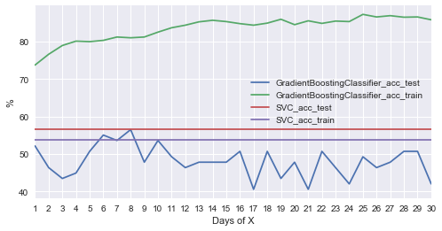


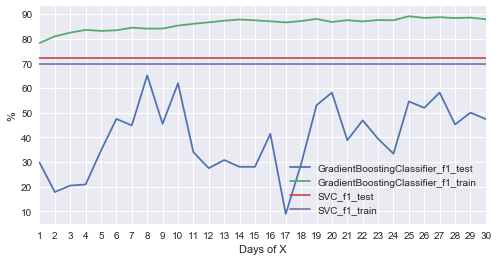


----
## Improving Results

### Choosing the Best Model

**GradientBoostingClassifier** is the best model of the three models because of the **best F score, predicting time** and **good training time**. The algorithm is also suitable to handle the **mixed type of data** (heterogeneous features, Ref.: [`sklearn/modules/gradient-tree-boosting`](http://scikit-learn.org/stable/modules/ensemble.html#gradient-tree-boosting)).

The **Ensemble (Gradient Tree Boosting)** is based on the
**Tree**s which are composed of many feature-evaluation flows to prediction the income of every individual. For each individual, each tree starts from a specified feature-evaluation, e.g., age, to select the next branched feature-evaluations. After a sequence of sophisticated feature classification, the individual is classified to a predicted income class by a tree. 
The **Gradient** means: the feature selections, orders, and evaluation criteria of trees are tuned based on the prediction trend of the large data calculated by the calculus. 
The **Boosting** means: when tuning the trees, the false-predicted data will be weighted high to improve the weakness. 
The **Ensemble** means: The trees can vote as a team to perform better prediction than an individual. Each tree has different weaknesses and strengths because they grow and are tuned by arbitrary different data to try any better possibility.

### Implementation: Model Tuning


```python
results_best          = score_day(X, y, clfs, size = Page_size*2/3,
     feature_days_max = 10,
     feature          = X_base
                      + X_vec
                      + X_up
                      + X_stat
                                 )
```

    The best classifier is GradientBoostingClassifier with 75.61% f1-score and 8-day features to predict Close_Close_next_up 
    


<div>
<style>
    .dataframe thead tr:only-child th {
        text-align: right;
    }

    .dataframe thead th {
        text-align: left;
    }

    .dataframe tbody tr th {
        vertical-align: top;
    }
</style>
<table border="1" class="dataframe">
  <thead>
    <tr style="text-align: right;">
      <th></th>
      <th>Up_predict</th>
      <th>Down_predict</th>
    </tr>
  </thead>
  <tbody>
    <tr>
      <th>Up_true</th>
      <td>31</td>
      <td>8</td>
    </tr>
    <tr>
      <th>Down_true</th>
      <td>12</td>
      <td>18</td>
    </tr>
  </tbody>
</table>
</div>


                 precision    recall  f1-score   support
    
             Up       0.72      0.79      0.76        39
           Down       0.69      0.60      0.64        30
    
    avg / total       0.71      0.71      0.71        69
    
    


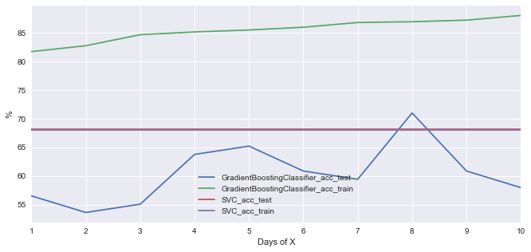


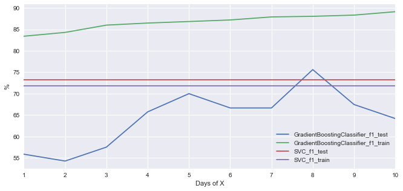


----
## Feature Importance

### Implementation - Extracting Feature Importance


```python
def        feature_importances(  features, clf):
    df = pd.DataFrame         ({
          'Features'           : features,
                  'Importances':           clf .
           feature_importances_*100})    . sort_values(by =
                  'Importances', ascending = 0). reset_index(drop = 1).rename(index = lambda c: c + 1)
    df [          'Importances'] = df['Importances'].map(percent.format)
    return df

from sklearn.ensemble import GradientBoostingRegressor
def        feature_importances_GBR(X_train, y_train,     random_state = random_state, X_test = None, y_test = None):
    return feature_importances(    X_train.columns,
                               GradientBoostingRegressor(random_state = random_state).
                               fit(X_train, y_train))

def        feature_importances_display(  results, n = 5):
    display(concat([
           feature_importances        (  results['features']  ,
                                         results['clf'     ]) ,
           feature_importances_GBR    (**results['Xy'      ])], ['Classifier', 'Regressor']).head(n = n))
```


```python
feature_importances_display(results_best)
```


<div>
<style>
    .dataframe thead tr:only-child th {
        text-align: right;
    }

    .dataframe thead th {
        text-align: left;
    }

    .dataframe tbody tr th {
        vertical-align: top;
    }
</style>
<table border="1" class="dataframe">
  <thead>
    <tr>
      <th></th>
      <th colspan="2" halign="left">Classifier</th>
      <th colspan="2" halign="left">Regressor</th>
    </tr>
    <tr>
      <th></th>
      <th>Features</th>
      <th>Importances</th>
      <th>Features</th>
      <th>Importances</th>
    </tr>
  </thead>
  <tbody>
    <tr>
      <th>1</th>
      <td>Close_Open_next</td>
      <td>15.74%</td>
      <td>Close_Open_next</td>
      <td>13.55%</td>
    </tr>
    <tr>
      <th>2</th>
      <td>Close_Open_next_pre1</td>
      <td>3.25%</td>
      <td>Close_Open_next_pre1</td>
      <td>3.24%</td>
    </tr>
    <tr>
      <th>3</th>
      <td>Volume_pre5</td>
      <td>2.82%</td>
      <td>Volume_pre1</td>
      <td>2.60%</td>
    </tr>
    <tr>
      <th>4</th>
      <td>Volume_pre1</td>
      <td>2.63%</td>
      <td>Volume_pre5</td>
      <td>2.54%</td>
    </tr>
    <tr>
      <th>5</th>
      <td>RSI6</td>
      <td>2.35%</td>
      <td>WR6_pre3</td>
      <td>2.42%</td>
    </tr>
  </tbody>
</table>
</div>


### Feature Relevance Observation


```python
from sklearn.model_selection import GridSearchCV
from sklearn.metrics         import make_scorer
from sklearn.model_selection import TimeSeriesSplit
from sklearn.pipeline        import Pipeline
# scaler     = MinMaxScaler()

def Grid   (clf, parameters,                     X = X, y = y, feature = X_all,  n_splits = 3, beta = beta , verbose = 1
                                                                      , feature_days = day_range_Max       ,       n = 5
                                                                      ,        label =    label , train_test_split = date_split):
    (X_train, X_test), (y_train, y_test) = Split(X[pre_feature(feature, feature_days)], y[label], train_test_split)
#     print '{}-day {} with:'.format(feature_days, csv(feature))
    display(concat([pd.DataFrame.from_dict(parameters, orient = 'index', dtype = object).T.fillna('').
                    rename(index = lambda c: c + 1)], ['Parameter Grid']))
#     pipe               = Pipeline(steps=[('scaler', scaler), ('clf', clf)])
#     grid               = GridSearchCV(clf, parameters, scoring = 'roc_auc'      (fbeta_score, beta = beta),
    grid               = GridSearchCV(clf, parameters, scoring = make_scorer    (fbeta_score,  beta = beta), verbose = verbose,
                                                       cv      = TimeSeriesSplit(n_splits = n_splits) .split(X_train))
    predict_train      = clf .fit(X_train, y_train)                 . predict(X_train)
    predict_test       = clf                                        . predict(X_test )
    estimator          = grid.fit(X_train, y_train).best_estimator_ 
    predict_train_best =                                 estimator  . predict(X_train)
    predict_test_best  =                                 estimator  . predict(X_test )

    display(concat([pd.DataFrame(OrderedDict([
      ('Train Accuracy'                  ,   [accuracy_score(y_train, predict_train                       )  ,
                                              accuracy_score(y_train, predict_train_best                  )]),
      ( 'Test Accuracy'                  ,   [accuracy_score(y_test , predict_test                        )  ,
                                              accuracy_score(y_test , predict_test_best                   )]),
      ('Train {}'.format(fbeta)          ,   [   fbeta_score(y_train, predict_train     ,      beta = beta)  ,
                                                 fbeta_score(y_train, predict_train_best,      beta = beta)]),
      ( 'Test {}'.format(fbeta)          ,   [   fbeta_score(y_test , predict_test      ,      beta = beta)  ,
                                                 fbeta_score(y_test , predict_test_best ,      beta = beta)]),
                                 ])).applymap(lambda s: '{:.1f}%'.format(100*s)),
         pd.concat([pd.DataFrame( clf. get_params(), index = [0])[parameters.keys()],
                    pd.DataFrame(grid.best_params_ , index = [1])[parameters.keys()]])])
                                             .rename(index = {0:   'Default Model',
                                                              1: 'Optimized Model'}))
    models =                                                 [     'Default' , 'Optimized']
    importances   = feature_importances(X_test.columns, grid.best_estimator_)
    display(concat([feature_importances(X_test.columns,           clf       ),
                            importances]                      , models).head(n = n))
    display(concat([up_down_matrix(y_test, predict_test     ) ,
                    up_down_matrix(y_test, predict_test_best)], models))
    print clf_report              (y_test, predict_test_best)
    return grid,            importances
```


```python
feature          = results_best['feature']
feature          = X_base + X_vec + X_up + X_stat

parameters = OrderedDict([
    ('learning_rate'    ,
#       list(np.arange    (
# #         0.005           ,
#         0.01            ,
# #         0.011           ,
#         0.05            , # cur
# #         0.1             , # default
# #         0.11            ,
# #         0.2             ,
# #         0.21            ,
# #         0.001
#         0.01
# #         0.05
#                        ))+
    [
#         0.02            ,
        0.03            , # up
        0.04            , # cur
        0.05            , # up
#         0.1             , # default, ini
    ]                  ),
    ('n_estimators'     ,
#       range            (
#        20               ,
# #        50               ,
#       100 +1            , # default
# #       101               ,
#        10
#                        )+
    [
#        30               ,
#        40               ,
       50               , # cur
#        60               ,
      100               , # default, up
#       110               ,
    ]                  ),
    ('max_depth'        ,
#       range            (
#         2               ,
# #         3               , # default
# #         5               ,
# #         8 +1            ,
#        16               ,
#                        )+
    [
        2               , # cur
        3               , # default, up
#         8               , # ini
    ]                  ),
    ('min_samples_split',
#       range            (
# #         2               , # default
#         7               , # 0.5*len(y)
#        15 +1            , #     len(y)
#                        )+
    [
#         2               , # default
        7               , # 0.5*len(y), ini
        8               , # cur
        9               ,
#        15               , #     len(y)
    ]                  ),
    ('min_samples_leaf' ,
#       range            (
#         1               , # default
#         7 +1            , # 0.5*len(y)
#                        )+
    [
        1               , # default, cur
        2               , # up
#         3               , # ini
    ]                  ),
    ('max_features'     ,
#       range            (
#         6               ,
#        20               ,
#                        )+
    [
#         0.3             ,
        'sqrt'          , # ini, cur
#         0.4             ,
#         None            , # default
    ]                  ),
    ('subsample'        ,
#       list(np.arange    (
#         0.6             ,
#         1               ,
#         0.05
#                        ))+
    [
        0.7             , # low
        0.8             , # ini, cur
        0.9             , # up
#         1               , # default
    ]                  ),
    ]                  )
# parameters       = OrderedDict([(k, [v]) for k, v in GBC.get_params().items() if k in parameters.keys()])
# parameters       = [{'kernel': ['rbf'   ], 'C': [1, 10, 100, 1000], 'gamma': [1e-3, 1e-4]},
#                     {'kernel': ['linear'], 'C': [1, 10, 100, 1000]                       }]

grid, importances = Grid(
    GradientBoostingClassifier(random_state = random_state, warm_start = True),
#     svc,
    parameters, X, y,
    feature,
    feature_days = results_best['days'], n = 10
)
```


<div>
<style>
    .dataframe thead tr:only-child th {
        text-align: right;
    }

    .dataframe thead th {
        text-align: left;
    }

    .dataframe tbody tr th {
        vertical-align: top;
    }
</style>
<table border="1" class="dataframe">
  <thead>
    <tr>
      <th></th>
      <th colspan="7" halign="left">Parameter Grid</th>
    </tr>
    <tr>
      <th></th>
      <th>learning_rate</th>
      <th>n_estimators</th>
      <th>max_depth</th>
      <th>min_samples_split</th>
      <th>min_samples_leaf</th>
      <th>max_features</th>
      <th>subsample</th>
    </tr>
  </thead>
  <tbody>
    <tr>
      <th>1</th>
      <td>0.03</td>
      <td>50</td>
      <td>2</td>
      <td>7</td>
      <td>1</td>
      <td>sqrt</td>
      <td>0.7</td>
    </tr>
    <tr>
      <th>2</th>
      <td>0.04</td>
      <td>100</td>
      <td>3</td>
      <td>8</td>
      <td>2</td>
      <td></td>
      <td>0.8</td>
    </tr>
    <tr>
      <th>3</th>
      <td>0.05</td>
      <td></td>
      <td></td>
      <td>9</td>
      <td></td>
      <td></td>
      <td>0.9</td>
    </tr>
  </tbody>
</table>
</div>


    Fitting 3 folds for each of 216 candidates, totalling 648 fits
    

    [Parallel(n_jobs=1)]: Done 648 out of 648 | elapsed:  4.2min finished
    


<div>
<style>
    .dataframe thead tr:only-child th {
        text-align: right;
    }

    .dataframe thead th {
        text-align: left;
    }

    .dataframe tbody tr th {
        vertical-align: top;
    }
</style>
<table border="1" class="dataframe">
  <thead>
    <tr style="text-align: right;">
      <th></th>
      <th>Train Accuracy</th>
      <th>Test Accuracy</th>
      <th>Train f1</th>
      <th>Test f1</th>
      <th>learning_rate</th>
      <th>n_estimators</th>
      <th>max_depth</th>
      <th>min_samples_split</th>
      <th>min_samples_leaf</th>
      <th>max_features</th>
      <th>subsample</th>
    </tr>
  </thead>
  <tbody>
    <tr>
      <th>Default Model</th>
      <td>87.0%</td>
      <td>71.0%</td>
      <td>88.0%</td>
      <td>75.6%</td>
      <td>0.10</td>
      <td>100</td>
      <td>3</td>
      <td>2</td>
      <td>1</td>
      <td>None</td>
      <td>1.0</td>
    </tr>
    <tr>
      <th>Optimized Model</th>
      <td>71.2%</td>
      <td>69.6%</td>
      <td>75.4%</td>
      <td>76.9%</td>
      <td>0.04</td>
      <td>50</td>
      <td>2</td>
      <td>8</td>
      <td>1</td>
      <td>sqrt</td>
      <td>0.8</td>
    </tr>
  </tbody>
</table>
</div>


<div>
<style>
    .dataframe thead tr:only-child th {
        text-align: right;
    }

    .dataframe thead th {
        text-align: left;
    }

    .dataframe tbody tr th {
        vertical-align: top;
    }
</style>
<table border="1" class="dataframe">
  <thead>
    <tr>
      <th></th>
      <th colspan="2" halign="left">Default</th>
      <th colspan="2" halign="left">Optimized</th>
    </tr>
    <tr>
      <th></th>
      <th>Features</th>
      <th>Importances</th>
      <th>Features</th>
      <th>Importances</th>
    </tr>
  </thead>
  <tbody>
    <tr>
      <th>1</th>
      <td>Close_Open_next</td>
      <td>15.74%</td>
      <td>Close_Open_next</td>
      <td>12.16%</td>
    </tr>
    <tr>
      <th>2</th>
      <td>Close_Open_next_pre1</td>
      <td>3.25%</td>
      <td>Close_Open_next_up</td>
      <td>9.78%</td>
    </tr>
    <tr>
      <th>3</th>
      <td>Volume_pre5</td>
      <td>2.82%</td>
      <td>RSI6</td>
      <td>3.86%</td>
    </tr>
    <tr>
      <th>4</th>
      <td>Volume_pre1</td>
      <td>2.63%</td>
      <td>Open_Open_next_pre6</td>
      <td>3.06%</td>
    </tr>
    <tr>
      <th>5</th>
      <td>RSI6</td>
      <td>2.35%</td>
      <td>WR10_pre6</td>
      <td>2.60%</td>
    </tr>
    <tr>
      <th>6</th>
      <td>Open_pre_Close_pre1</td>
      <td>2.05%</td>
      <td>WR10_pre3</td>
      <td>2.39%</td>
    </tr>
    <tr>
      <th>7</th>
      <td>WR10_pre2</td>
      <td>2.03%</td>
      <td>Close_pre_Close_pre5</td>
      <td>2.29%</td>
    </tr>
    <tr>
      <th>8</th>
      <td>Open_Open_next_pre7</td>
      <td>1.83%</td>
      <td>Open_Close</td>
      <td>1.94%</td>
    </tr>
    <tr>
      <th>9</th>
      <td>WR6_pre3</td>
      <td>1.74%</td>
      <td>Volume_pre2</td>
      <td>1.93%</td>
    </tr>
    <tr>
      <th>10</th>
      <td>RSI12_pre7</td>
      <td>1.69%</td>
      <td>WR10_pre2</td>
      <td>1.91%</td>
    </tr>
  </tbody>
</table>
</div>


<div>
<style>
    .dataframe thead tr:only-child th {
        text-align: right;
    }

    .dataframe thead th {
        text-align: left;
    }

    .dataframe tbody tr th {
        vertical-align: top;
    }
</style>
<table border="1" class="dataframe">
  <thead>
    <tr>
      <th></th>
      <th colspan="2" halign="left">Default</th>
      <th colspan="2" halign="left">Optimized</th>
    </tr>
    <tr>
      <th></th>
      <th>Up_predict</th>
      <th>Down_predict</th>
      <th>Up_predict</th>
      <th>Down_predict</th>
    </tr>
  </thead>
  <tbody>
    <tr>
      <th>Up_true</th>
      <td>31</td>
      <td>8</td>
      <td>35</td>
      <td>4</td>
    </tr>
    <tr>
      <th>Down_true</th>
      <td>12</td>
      <td>18</td>
      <td>17</td>
      <td>13</td>
    </tr>
  </tbody>
</table>
</div>


                 precision    recall  f1-score   support
    
             Up       0.67      0.90      0.77        39
           Down       0.76      0.43      0.55        30
    
    avg / total       0.71      0.70      0.68        69
    
    


```python
feature_days_max =  14
features         = [
#                     'Open'              ,
#                     'High'              ,
#                     'Low'               ,
#                     'Close'             ,
#                     'Open_next'         ,
                    'Volume'            ,
                    'Open_pre_Close'    ,
                    'Open_pre_Close_up' ,
                    'Close_pre_Close'   ,
                    'Close_pre_Close_up',
                    'Open_Close'        ,
                    'Open_Close_up'     ,
                    'Open_Open_next'    ,
                    'Open_Open_next_up' ,
                    'Close_Open_next'   ,
                    'Close_Open_next_up',
                    'WR10'              ,
#                     'WR6'               ,
#                     'RSI12'             ,
                    'RSI6'              ,
#                     'MACD'              ,
#                     'C2M'               ,
#                     'Boll_u'            ,
#                     'Boll'              ,
#                     'Boll_l'            ,
                   ]
clf              = [
                    GBC, 
#                     GradientBoostingClassifier(random_state = random_state, **grid.best_params_),
                   ]
# display(concat([pd.DataFrame({k: v for k, v in grid.best_params_.items() if k in parameters.keys()},
#                              index = ['best'])], ['params']))

from tqdm      import tqdm
from itertools import combinations
results_best = {fbeta: 0}
for n in range(6, 1   +                    len(features)   ):
    for feature in tqdm(map(list, combinations(features, n))):
        cur                     = score_day   (output = 0,
            clfs                = clf,
            feature_days_max    =              feature_days_max,
            feature             =              feature)
        if  results_best[fbeta] < cur         [fbeta]:
            results_best        = cur
            print '{:.2f}% {} by {}-day {}'.format(100*cur[fbeta], fbeta, cur['days'], csv(feature))
```

      0%|                                                                                         | 0/1716 [00:00<?, ?it/s]

    59.77% f1 by 4-day Volume, Open_pre_Close, Open_pre_Close_up, Close_pre_Close, Close_pre_Close_up & Open_Close
    

      0%|                                                                              | 1/1716 [00:35<16:45:31, 35.18s/it]

    65.26% f1 by 1-day Volume, Open_pre_Close, Open_pre_Close_up, Close_pre_Close, Close_pre_Close_up & Open_Close_up
    

      0%|                                                                              | 2/1716 [00:49<13:47:25, 28.96s/it]

    66.67% f1 by 1-day Volume, Open_pre_Close, Open_pre_Close_up, Close_pre_Close, Close_pre_Close_up & Open_Open_next
    

      0%|▏                                                                             | 3/1716 [01:15<13:19:45, 28.01s/it]

    68.89% f1 by 1-day Volume, Open_pre_Close, Open_pre_Close_up, Close_pre_Close, Close_pre_Close_up & Open_Open_next_up
    

      0%|▏                                                                             | 4/1716 [01:33<11:49:59, 24.88s/it]

    76.74% f1 by 8-day Volume, Open_pre_Close, Open_pre_Close_up, Close_pre_Close, Close_pre_Close_up & Close_Open_next
    

      2%|█▏                                                                            | 26/1716 [05:56<4:37:41,  9.86s/it]

    77.65% f1 by 8-day Volume, Open_pre_Close, Open_pre_Close_up, Close_pre_Close, Open_Open_next_up & Close_Open_next
    

      2%|█▌                                                                            | 34/1716 [07:07<4:12:42,  9.01s/it]

    77.78% f1 by 5-day Volume, Open_pre_Close, Open_pre_Close_up, Close_pre_Close, Close_Open_next_up & RSI6
    

      5%|████                                                                          | 90/1716 [16:24<5:12:16, 11.52s/it]

    78.57% f1 by 7-day Volume, Open_pre_Close, Open_pre_Close_up, Open_Close_up, Open_Open_next_up & Close_Open_next
    

      6%|████▎                                                                         | 96/1716 [17:21<4:33:05, 10.11s/it]

    80.46% f1 by 8-day Volume, Open_pre_Close, Open_pre_Close_up, Open_Close_up, Close_Open_next & RSI6
    

     14%|██████████▌                                                                  | 235/1716 [38:30<2:45:07,  6.69s/it]

    83.72% f1 by 12-day Volume, Open_pre_Close, Close_pre_Close_up, Open_Close_up, Close_Open_next & WR10
    

     15%|███████████▋                                                                 | 261/1716 [42:13<3:15:19,  8.05s/it]


```python
results_best         = score_day(    X, y, clfs,
    feature_days_max = 20,
    feature          = results_best['feature'])
```


```python
f = sns.barplot(results_best['features'],
                results_best['clf'     ].feature_importances_*100,
                ax  = plt.subplots(figsize = (Page_size, Page_size/2))[1]);
f.set_xticklabels(f.get_xticklabels(), rotation = 90)
f.set_ylabel   (                        'Feature Importances (%)');
```

### Final Model Evaluation


```python
labels          = ['Close_next', 'Open_next']
feature         =   X_base

from sklearn.metrics import           r2_score

data_train,       data_test = Split1(data_log[day_range_Max - 1:], date_split)
for label in   labels:
    y_train_raw = data_train[[label]]
    y_test_raw  = data_test [[label]]
    scaler_y    =     MinMaxScaler().fit            (                                             y_train_raw )
    regressor   = LinearRegression().fit            (X_train[feature], scaler_y.        transform(y_train_raw))
    predict     =       regressor   .       predict (X_test [feature])
    regression  = y_test_raw.copy()
    regression[label +'_Regression (Test)'] =                          scaler_y.inverse_transform(
                                            predict                                                           )
    print           '{} Regression r2-Score: {:6.2f}%'                                 .format   (label, 100*
                                   r2_score(predict                  , scaler_y        .transform(y_test_raw )))
    x           = label.split('_')[0]
    true        =           data_test['{}_{}_up'.format(x, label)]
    predict     =           data_test[                  x        ] <= regression.iloc[:, -1]
    acc, f1     = clf_scores(true,          predict, beta)
    print           '{} Regression to Up/Down Classification Accuracy Score: {:6.2f}%' .format   (label, 100* acc)
    print           '{} Regression to Up/Down Classification       F1-Score: {:6.2f}%' .format   (label, 100*  f1)
    confusion_report(true,                  predict)
    ax = regression.plot( figsize = (Page_size, Page_size/2));
    ax .    set_ylabel  ('Price')
    regression.insert(0, x, data_test[                  x        ])
    regression['Up_true'   ] = true
    regression['Up_predict'] = predict
    display(regression.tail())
    plt.show()
```
