# Machine Learning Engineer Nanodegree
## Investment and Trading Capstone Project
## Project: Build a Stock Price Indicator
----
The stucture of this Notebook is inherited from the [Udacity project template: Finding Donors for CharityML](https://github.com/udacity/machine-learning/blob/master/projects/finding_donors/finding_donors.ipynb).
### Load common Libraries, Constants and Functions.


```python
import numpy                as     np
import pandas               as     pd
import seaborn              as     sns
import matplotlib.pyplot    as     plt
import matplotlib.dates     as     dates
from   datetime             import date, timedelta
from   time                 import time
from   IPython.display      import display         # Allows the use of display() for DataFrames
from   collections          import OrderedDict

# Pretty display for notebooks
%matplotlib inline

# display_En   = True # Enable/Disable unnecessary complex figures to speed up the data flow
```


```python
random_state =  7
data_p       = '7Y'                # Years, data_period to get data from current date
Page_size    = 17                  # inch, for figure size
date_split   = date(2018,   1,  1) # Split train/test data by the date
day          = timedelta(days = 1)
class_name   = lambda c: c.__class__.__name__
percent      = '{:6.2f}%'
R            = '#dd4b39'           # Google Red
G            = '#3cba54'           # Google Green
B            = '#4885ed'           # Google Blue
Y            = '#f4c20d'           # Google Yellow

def     concat        (df,      keys = None): return pd.concat( df, axis = 1, keys = keys)
def     concat_idx    (df, idx, keys = None): return    concat([df[i] for i in idx], keys)
def     concat_display(df, idx, keys = None , n = 5, head = False):
    d = concat_idx    (df, idx, keys = keys)
    display(d.head(n = n) if head else d.tail(n = n))
    return  d
```

## Data Exploration
Load necessary Python libraries and the price data.
The datasets used in this project is obtained by the python module [googlefinance.client](http://pypi.python.org/pypi/googlefinance.client) instead of the planned popular [yahoo-finance](http://pypi.python.org/pypi/yahoo-finance) [which is being discontinued](http://yahoo.sdx.socialdynamx.com/portal/conversation/19248672).
### Raw Data Getting
Import 7-year data of the [S&P 500 Index](http://wikipedia.org/wiki/S%26P_500_Index), till the showed current day below.
The columns of this dataset will be calculated to our target labels (the next day price ups, flats or downs) for each day.
The column or index names from the two functions are needs to be cleaned respectively.


```python
try:
    from   googlefinance.client import get_price_data, get_prices_data #, get_prices_time_data
    
    # Load daily prices of the S&P 500
    data = get_price_data({
       'x': 'INDEXSP', # Stock exchange symbol (S&P 500: 'INDEXSP', Dow Jones: 'INDEXDJX', NYSE COMPOSITE: 'INDEXNYSEGIS'  )
       'q': '.INX'   , # Stock symbol          (S&P 500: '.INX'   , Dow Jones: '.DJI'    , NYSE COMPOSITE: 'NYA', 'AAPL'...)
       'i': '86400'  , # Interval seconds      ('86400' = 1 day  intervals)
       'p': data_p     # Period                (   '1Y' = 1 year period   )
    })                 # get price data        (return pandas dataframe)
    # Success - Display the first record
    display(data.tail(n = 1))
    
    # Comparing to get_price_data, get_prices_data focuses on daily data (avoid confusion although the same data) and flexibility
    data = get_prices_data([{
       'x': 'INDEXSP', # Stock exchange symbol (S&P 500: 'INDEXSP', Dow Jones: 'INDEXDJX', NYSE COMPOSITE: 'INDEXNYSEGIS'  )
       'q': '.INX'   , # Stock symbol          (S&P 500: '.INX'   , Dow Jones: '.DJI'    , NYSE COMPOSITE: 'NYA', 'AAPL'...)
    }],     data_p   ) # get price data        (return pandas dataframe)
    # Success - Display the first record
    display(data.tail(n = 1))
    
    data     .  to_csv  ('SP.csv.txt')                                    # Save the got data (10 years: 125 KB)
except:                                                                   # Load saved data if googlefinance is not available
    data = pd.read_csv  ('SP.csv.txt', index_col = 0, parse_dates = True) # Load the got data (when googlefinance fails)
```


<div>
<style>
    .dataframe thead tr:only-child th {
        text-align: right;


    }

    .dataframe thead th {
        text-align: left;
    }

    .dataframe tbody tr th {
        vertical-align: top;
    }
</style>
<table border="1" class="dataframe">
  <thead>
    <tr style="text-align: right;">
      <th></th>
      <th>Open</th>
      <th>High</th>
      <th>Low</th>
      <th>Close</th>
      <th>Volume</th>
    </tr>
  </thead>
  <tbody>
    <tr>
      <th>2018-04-21 04:00:00</th>
      <td>2692.56</td>
      <td>2693.94</td>
      <td>2660.61</td>
      <td>2670.14</td>
      <td>2308509070</td>
    </tr>
  </tbody>
</table>
</div>


<div>
<style>
    .dataframe thead tr:only-child th {
        text-align: right;
    }

    .dataframe thead th {
        text-align: left;
    }

    .dataframe tbody tr th {
        vertical-align: top;
    }
</style>
<table border="1" class="dataframe">
  <thead>
    <tr style="text-align: right;">
      <th></th>
      <th>.INX_Open</th>
      <th>.INX_High</th>
      <th>.INX_Low</th>
      <th>.INX_Close</th>
      <th>.INX_Volume</th>
    </tr>
  </thead>
  <tbody>
    <tr>
      <th>2018-04-21</th>
      <td>2692.56</td>
      <td>2693.94</td>
      <td>2660.61</td>
      <td>2670.14</td>
      <td>2308509070</td>
    </tr>
  </tbody>
</table>
</div>


### Data Cleaning
The column names are cleaned and the data with abnormal 0 also need to be checked.


```python
data  = data.rename(columns = lambda c: c.split('_')[-1]) # Clean column names
display(data.describe())                                  # Check data
```


<div>
<style>
    .dataframe thead tr:only-child th {
        text-align: right;
    }

    .dataframe thead th {
        text-align: left;
    }

    .dataframe tbody tr th {
        vertical-align: top;
    }
</style>
<table border="1" class="dataframe">
  <thead>
    <tr style="text-align: right;">
      <th></th>
      <th>Open</th>
      <th>High</th>
      <th>Low</th>
      <th>Close</th>
      <th>Volume</th>
    </tr>
  </thead>
  <tbody>
    <tr>
      <th>count</th>
      <td>1759.000000</td>
      <td>1759.000000</td>
      <td>1759.000000</td>
      <td>1759.000000</td>
      <td>1.759000e+03</td>
    </tr>
    <tr>
      <th>mean</th>
      <td>1891.851484</td>
      <td>1900.615560</td>
      <td>1882.525367</td>
      <td>1893.694110</td>
      <td>8.718129e+08</td>
    </tr>
    <tr>
      <th>std</th>
      <td>424.247043</td>
      <td>424.418541</td>
      <td>423.911355</td>
      <td>421.922569</td>
      <td>6.594759e+08</td>
    </tr>
    <tr>
      <th>min</th>
      <td>0.000000</td>
      <td>0.000000</td>
      <td>0.000000</td>
      <td>1099.230000</td>
      <td>0.000000e+00</td>
    </tr>
    <tr>
      <th>25%</th>
      <td>1486.915000</td>
      <td>1494.345000</td>
      <td>1483.085000</td>
      <td>1493.685000</td>
      <td>4.961337e+08</td>
    </tr>
    <tr>
      <th>50%</th>
      <td>1960.450000</td>
      <td>1967.680000</td>
      <td>1947.160000</td>
      <td>1959.530000</td>
      <td>5.866298e+08</td>
    </tr>
    <tr>
      <th>75%</th>
      <td>2129.850000</td>
      <td>2139.455000</td>
      <td>2123.255000</td>
      <td>2130.360000</td>
      <td>8.640995e+08</td>
    </tr>
    <tr>
      <th>max</th>
      <td>2867.230000</td>
      <td>2872.870000</td>
      <td>2851.480000</td>
      <td>2872.870000</td>
      <td>4.024144e+09</td>
    </tr>
  </tbody>
</table>
</div>


Check the 0 `Volume`. The early years lack `Volume` data need to be cleaned.


```python
data['Volume'].plot(title = 'Check the 0 Volume') # Check the 0 Volume
plt.xlabel('Day'  );
plt.ylabel('Share');
```


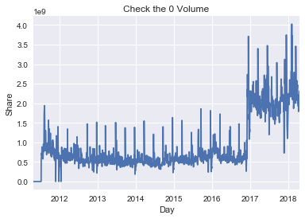


The cleaned data with complete `Volume` start from 2012-01-15.
However, there are still 0 prices need to be checked.


```python
# Drop days with 0 Volumn & check again
Day_Volume  = data[data['Volume'] == 0].index[-1] + day
print 'Cleaned data with Volume start from: ' + str(Day_Volume)
data_Volume = data[Day_Volume:]
display(data_Volume.describe())
```

    Cleaned data with Volume start from: 2012-01-15
    


<div>
<style>
    .dataframe thead tr:only-child th {
        text-align: right;
    }

    .dataframe thead th {
        text-align: left;
    }

    .dataframe tbody tr th {
        vertical-align: top;
    }
</style>
<table border="1" class="dataframe">
  <thead>
    <tr style="text-align: right;">
      <th></th>
      <th>Open</th>
      <th>High</th>
      <th>Low</th>
      <th>Close</th>
      <th>Volume</th>
    </tr>
  </thead>
  <tbody>
    <tr>
      <th>count</th>
      <td>1575.000000</td>
      <td>1575.000000</td>
      <td>1575.000000</td>
      <td>1575.000000</td>
      <td>1.575000e+03</td>
    </tr>
    <tr>
      <th>mean</th>
      <td>1966.563200</td>
      <td>1975.109378</td>
      <td>1957.504013</td>
      <td>1968.650508</td>
      <td>9.061319e+08</td>
    </tr>
    <tr>
      <th>std</th>
      <td>383.564918</td>
      <td>384.270396</td>
      <td>382.583551</td>
      <td>380.240121</td>
      <td>6.719603e+08</td>
    </tr>
    <tr>
      <th>min</th>
      <td>0.000000</td>
      <td>0.000000</td>
      <td>0.000000</td>
      <td>1278.040000</td>
      <td>1.839316e+08</td>
    </tr>
    <tr>
      <th>25%</th>
      <td>1675.740000</td>
      <td>1683.910000</td>
      <td>1666.940000</td>
      <td>1677.460000</td>
      <td>4.984295e+08</td>
    </tr>
    <tr>
      <th>50%</th>
      <td>2005.030000</td>
      <td>2018.660000</td>
      <td>1993.290000</td>
      <td>2003.690000</td>
      <td>5.801865e+08</td>
    </tr>
    <tr>
      <th>75%</th>
      <td>2166.980000</td>
      <td>2173.195000</td>
      <td>2159.070000</td>
      <td>2167.185000</td>
      <td>8.773401e+08</td>
    </tr>
    <tr>
      <th>max</th>
      <td>2867.230000</td>
      <td>2872.870000</td>
      <td>2851.480000</td>
      <td>2872.870000</td>
      <td>4.024144e+09</td>
    </tr>
  </tbody>
</table>
</div>


Check the data distributions.
The normal prices are over 1000.


```python
def       hist(data,                xlabel,   size = Page_size):
    col = len (data.columns)
    axs =      data.hist(figsize   =      (   size ,      size/(col*8/5)), layout = (1, col), sharey = True)
    axs[0][0]           .       set_ylabel('Count')
    for ax, x in zip(axs.flatten(), xlabel):
        ax              .       set_xlabel(x)

def stock_hist(data,                          size = Page_size): # Check the data distributions
    hist      (data, 4*['Price'] + ['Share'], size =      size)
        
stock_hist(data_Volume)
```


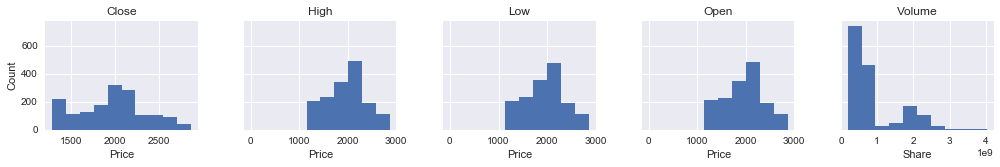


There is only one abnormal day needs to be dropped


```python
for c in ['Open', 'High', 'Low']:
    display(data_Volume[data_Volume[ c    ] < 1000]) # Check prices < 1000 (the strange gap in 'Open', 'High', and 'Low')
```


<div>
<style>
    .dataframe thead tr:only-child th {
        text-align: right;
    }

    .dataframe thead th {
        text-align: left;
    }

    .dataframe tbody tr th {
        vertical-align: top;
    }
</style>
<table border="1" class="dataframe">
  <thead>
    <tr style="text-align: right;">
      <th></th>
      <th>Open</th>
      <th>High</th>
      <th>Low</th>
      <th>Close</th>
      <th>Volume</th>
    </tr>
  </thead>
  <tbody>
    <tr>
      <th>2017-08-01</th>
      <td>0.0</td>
      <td>0.0</td>
      <td>0.0</td>
      <td>2470.3</td>
      <td>2189633778</td>
    </tr>
  </tbody>
</table>
</div>


<div>
<style>
    .dataframe thead tr:only-child th {
        text-align: right;
    }

    .dataframe thead th {
        text-align: left;
    }

    .dataframe tbody tr th {
        vertical-align: top;
    }
</style>
<table border="1" class="dataframe">
  <thead>
    <tr style="text-align: right;">
      <th></th>
      <th>Open</th>
      <th>High</th>
      <th>Low</th>
      <th>Close</th>
      <th>Volume</th>
    </tr>
  </thead>
  <tbody>
    <tr>
      <th>2017-08-01</th>
      <td>0.0</td>
      <td>0.0</td>
      <td>0.0</td>
      <td>2470.3</td>
      <td>2189633778</td>
    </tr>
  </tbody>
</table>
</div>


<div>
<style>
    .dataframe thead tr:only-child th {
        text-align: right;
    }

    .dataframe thead th {
        text-align: left;
    }

    .dataframe tbody tr th {
        vertical-align: top;
    }
</style>
<table border="1" class="dataframe">
  <thead>
    <tr style="text-align: right;">
      <th></th>
      <th>Open</th>
      <th>High</th>
      <th>Low</th>
      <th>Close</th>
      <th>Volume</th>
    </tr>
  </thead>
  <tbody>
    <tr>
      <th>2017-08-01</th>
      <td>0.0</td>
      <td>0.0</td>
      <td>0.0</td>
      <td>2470.3</td>
      <td>2189633778</td>
    </tr>
  </tbody>
</table>
</div>


The data statistics and distributions are clean.
The `Volume` values need Log-transform.


```python
data_Volume_Price = data_Volume[
                    data_Volume['Open'] > 1000]               # Drop the abnormal day
display           ( data_Volume_Price.describe())
data_cln          = data_Volume_Price                         # Cleaned data
stock_hist        ( data_Volume_Price)
```


<div>
<style>
    .dataframe thead tr:only-child th {
        text-align: right;
    }

    .dataframe thead th {
        text-align: left;
    }

    .dataframe tbody tr th {
        vertical-align: top;
    }
</style>
<table border="1" class="dataframe">
  <thead>
    <tr style="text-align: right;">
      <th></th>
      <th>Open</th>
      <th>High</th>
      <th>Low</th>
      <th>Close</th>
      <th>Volume</th>
    </tr>
  </thead>
  <tbody>
    <tr>
      <th>count</th>
      <td>1574.000000</td>
      <td>1574.000000</td>
      <td>1574.000000</td>
      <td>1574.000000</td>
      <td>1.574000e+03</td>
    </tr>
    <tr>
      <th>mean</th>
      <td>1967.812605</td>
      <td>1976.364212</td>
      <td>1958.747662</td>
      <td>1968.331798</td>
      <td>9.053165e+08</td>
    </tr>
    <tr>
      <th>std</th>
      <td>380.467368</td>
      <td>381.150921</td>
      <td>379.507156</td>
      <td>380.150472</td>
      <td>6.713938e+08</td>
    </tr>
    <tr>
      <th>min</th>
      <td>1277.820000</td>
      <td>1282.550000</td>
      <td>1266.740000</td>
      <td>1278.040000</td>
      <td>1.839316e+08</td>
    </tr>
    <tr>
      <th>25%</th>
      <td>1676.642500</td>
      <td>1684.195000</td>
      <td>1670.730000</td>
      <td>1676.860000</td>
      <td>4.984152e+08</td>
    </tr>
    <tr>
      <th>50%</th>
      <td>2005.290000</td>
      <td>2018.675000</td>
      <td>1993.335000</td>
      <td>2003.530000</td>
      <td>5.801516e+08</td>
    </tr>
    <tr>
      <th>75%</th>
      <td>2167.235000</td>
      <td>2173.367500</td>
      <td>2159.070000</td>
      <td>2166.812500</td>
      <td>8.759099e+08</td>
    </tr>
    <tr>
      <th>max</th>
      <td>2867.230000</td>
      <td>2872.870000</td>
      <td>2851.480000</td>
      <td>2872.870000</td>
      <td>4.024144e+09</td>
    </tr>
  </tbody>
</table>
</div>


### Feature Exploration and Derivation
Besides the base prices and `Volume` features, more price changing vectors, corresponding classes and statistics are derived for the proposed target and further improvement, e.g.,
`Close_pre_Close` vector: the price changes from Close of the last **pre**vious day to Close of the base day & `Close_Close_next_up` classification: the price **up**s from Close of the base day to Close of the **next** day.
Although the feature `Open_next` will limit the available time, the closest price is supposed to have the highest correlation with the target `Close_Close_next_up`.
The flatting prices are merged with upping prices, aligned with the [matplotlib.finance](http://matplotlib.org/api/finance_api.html)
The statistics are calculated by the [stockstats](http://pypi.python.org/pypi/stockstats).


```python
col_pre   =  ['Open' ,   'Close']                  # Collect previous daily data column to cancat together
col_next  =  ['Open' ,   'Close']                  # Collect next     daily data column to cancat together
d         = concat([   data_cln[     col_pre ].shift( 1).rename(columns = lambda c: c + '_pre' ),
                       data_cln])                  # d is the acronyms to cancat all data
d         = concat([d, data_cln[     col_next].shift(-1).rename(columns = lambda c: c + '_next')
                               ])[1:-1]            # Drop the 1st/last one which lacks a previous/next daily data
y_rgr     = list  ( d. columns [-len(col_next):])  # Select data column for regression y

X_vec, y_clf_vec = [], []
for                    p1,     p2 in [
   # Timeline: Open_pre > Close_pre > Open >  Close >  Open_next >  Close_next
             ('Open_pre'                   , 'Close'                           ), # Vector from Open_pre  to Close
             (           'Close_pre'       , 'Close'                           ), # Vector from Close_pre to Close
             (                       'Open', 'Close'                           ), # Vector from Open      to Close
             (                       'Open',          'Open_next'              ), # Vector from Open      to  Open_next
             (                               'Close', 'Open_next'              ), # Vector from Close     to  Open_next
             (                               'Close',              'Close_next'), # Vector from Close     to Close_next
             (                                        'Open_next', 'Close_next'), # Vector from Open_next to Close_next
             ]:
    p      = '_'.join([p1,     p2    ])
    d [p]  =  -      d[p1] + d[p2]
    if 0  <=    p.find  ('Close_next' ): # next daily data are usually for y
        y_clf_vec.append(      p      )  # Vectors for classification y
    else:
        X_vec    .append(      p      )

X_up, y_clf = [], []
for vec      in     X_vec + y_clf_vec  : # Index of records where the next daily prices up
    col    =          vec +     '_up'    # Merge 'flat' to 'up': Align to the 'up' of matplotlib.finance
    d[col] =  0 <=  d[vec]
    if 0  <=  col.find  ('Close_next' ): # next daily data are usually for y
        y_clf    .append(        col  )
    else:
        X_up     .append(        col  )

X_base     = list(data_cln.columns)
X_all      = X_base + X_vec + X_up     # Select data column for X
# Xy     = [c for c in d.columns if 0 <= c.find('Open_next') and c.find('Close_next') < 0  ] # X sometimes includes Open_next

Close_Close_next_flat =         0   == d.    Close_Close_next
Close_Open_next_flat  =         0   == d.     Close_Open_next

n_records             = d.shape[0]                                # Total number of records
n_up                  = sum    (       d.Close_Close_next_up    )
n_flat                = sum    (         Close_Close_next_flat  )
n_down                = sum    (0    > d.Close_Close_next       )
up_percent            = float  (n_up)/n_records*100               # Percentage of days whose price up

print '[Statistics of Close-to-Close (Close_Close_next) prices]'
print 'Total number of records: {}'               .format(n_records )
print 'Daily prices upping:     {}  ({})'         .format(n_up      , 'Close_Close_next_up, including flatting aligned w/ matplotlib.finance')
print 'Daily prices flatting:   {}'               .format(n_flat    )
print 'Daily prices downing:    {}'               .format(n_down    )
print 'Percentage of daily prices upping: {:.2f}%'.format(up_percent)

print '\nThe flat days with the same Close prices'
display       ( d[Close_Close_next_flat | Close_Close_next_flat.shift(1)])
print '\nThe flat day  with the same Open & Close prices'
display       ( d[    d.Open           ==  d.Close                      ])
# print '\n     {} days with the same Close & Open_next prices'.format(sum(Close_Open_next_flat))
# display       ( d[ Close_Open_next_flat |  Close_Open_next_flat.shift(1)].head(n = 2))
```

    [Statistics of Close-to-Close (Close_Close_next) prices]
    Total number of records: 1572
    Daily prices upping:     850  (Close_Close_next_up, including flatting aligned w/ matplotlib.finance)
    Daily prices flatting:   1
    Daily prices downing:    722
    Percentage of daily prices upping: 54.07%
    
    The flat days with the same Close prices
    


<div>
<style>
    .dataframe thead tr:only-child th {
        text-align: right;
    }

    .dataframe thead th {
        text-align: left;
    }

    .dataframe tbody tr th {
        vertical-align: top;
    }
</style>
<table border="1" class="dataframe">
  <thead>
    <tr style="text-align: right;">
      <th></th>
      <th>Open_pre</th>
      <th>Close_pre</th>
      <th>Open</th>
      <th>High</th>
      <th>Low</th>
      <th>Close</th>
      <th>Volume</th>
      <th>Open_next</th>
      <th>Close_next</th>
      <th>Open_pre_Close</th>
      <th>...</th>
      <th>Close_Open_next</th>
      <th>Close_Close_next</th>
      <th>Open_next_Close_next</th>
      <th>Open_pre_Close_up</th>
      <th>Close_pre_Close_up</th>
      <th>Open_Close_up</th>
      <th>Open_Open_next_up</th>
      <th>Close_Open_next_up</th>
      <th>Close_Close_next_up</th>
      <th>Open_next_Close_next_up</th>
    </tr>
  </thead>
  <tbody>
    <tr>
      <th>2017-01-10</th>
      <td>2271.14</td>
      <td>2276.98</td>
      <td>2273.59</td>
      <td>2275.49</td>
      <td>2268.90</td>
      <td>2268.9</td>
      <td>1914652521</td>
      <td>2269.72</td>
      <td>2268.90</td>
      <td>-2.24</td>
      <td>...</td>
      <td>0.82</td>
      <td>0.00</td>
      <td>-0.82</td>
      <td>False</td>
      <td>False</td>
      <td>False</td>
      <td>False</td>
      <td>True</td>
      <td>True</td>
      <td>False</td>
    </tr>
    <tr>
      <th>2017-01-11</th>
      <td>2273.59</td>
      <td>2268.90</td>
      <td>2269.72</td>
      <td>2279.27</td>
      <td>2265.27</td>
      <td>2268.9</td>
      <td>2138024556</td>
      <td>2268.60</td>
      <td>2275.32</td>
      <td>-4.69</td>
      <td>...</td>
      <td>-0.30</td>
      <td>6.42</td>
      <td>6.72</td>
      <td>False</td>
      <td>True</td>
      <td>False</td>
      <td>False</td>
      <td>False</td>
      <td>True</td>
      <td>True</td>
    </tr>
  </tbody>
</table>
<p>2 rows × 23 columns</p>
</div>


    
    The flat day  with the same Open & Close prices
    


<div>
<style>
    .dataframe thead tr:only-child th {
        text-align: right;
    }

    .dataframe thead th {
        text-align: left;
    }

    .dataframe tbody tr th {
        vertical-align: top;
    }
</style>
<table border="1" class="dataframe">
  <thead>
    <tr style="text-align: right;">
      <th></th>
      <th>Open_pre</th>
      <th>Close_pre</th>
      <th>Open</th>
      <th>High</th>
      <th>Low</th>
      <th>Close</th>
      <th>Volume</th>
      <th>Open_next</th>
      <th>Close_next</th>
      <th>Open_pre_Close</th>
      <th>...</th>
      <th>Close_Open_next</th>
      <th>Close_Close_next</th>
      <th>Open_next_Close_next</th>
      <th>Open_pre_Close_up</th>
      <th>Close_pre_Close_up</th>
      <th>Open_Close_up</th>
      <th>Open_Open_next_up</th>
      <th>Close_Open_next_up</th>
      <th>Close_Close_next_up</th>
      <th>Open_next_Close_next_up</th>
    </tr>
  </thead>
  <tbody>
    <tr>
      <th>2017-04-11</th>
      <td>2356.59</td>
      <td>2355.54</td>
      <td>2357.16</td>
      <td>2366.37</td>
      <td>2351.5</td>
      <td>2357.16</td>
      <td>1620328913</td>
      <td>2353.92</td>
      <td>2353.78</td>
      <td>0.57</td>
      <td>...</td>
      <td>-3.24</td>
      <td>-3.38</td>
      <td>-0.14</td>
      <td>True</td>
      <td>True</td>
      <td>True</td>
      <td>False</td>
      <td>False</td>
      <td>False</td>
      <td>False</td>
    </tr>
  </tbody>
</table>
<p>1 rows × 23 columns</p>
</div>


#### Featureset Exploration
The applied price-change Vectors are listed below and there are also corresponding up/down classes:

<table border = "1">
    <tr>
      <th style = "text-align: left"              >                   </th>
      <th style = "text-align: left" colspan = "6"> Timeline ===>     </th>
    </tr>
    <tr>
      <th style = "text-align: left"              >             3 Days</th>
      <th style = "text-align: left" colspan = "2"> Last previous Day </th>
      <th style = "text-align: left" colspan = "2">      Base     Day </th>
      <th style = "text-align: left" colspan = "2">      next     Day </th>
    </tr>
    <tr>
      <th style = "text-align: left"              > Prices            </th>
      <th style = "text-align: left"              > Open_pre          </th>
      <th style = "text-align: left"              > Close_pre         </th>
      <th style = "text-align: left"              > Open              </th>
      <th style = "text-align: left"              > Close             </th>
      <th style = "text-align: left"              > Open_next         </th>
      <th style = "text-align: left"              > Close_next        </th>
    </tr>
    <tr>
      <th style = "text-align: left"              >                   </th>
      <th style = "text-align: left" colspan = "5"> X (Features)      </th>
      <th style = "text-align: left"              > y (Label)         </th>
    </tr>
    <tr>
      <th style = "text-align: left" rowspan = "5"> Feature Vectors   </th>
      <th style = "text-align: left" colspan = "4">  Open_pre_Close   </th>
    </tr>
    <tr>
      <th style = "text-align: left"              >                   </th>
      <th style = "text-align: left" colspan = "3"> Close_pre_Close   </th>
    </tr>
    <tr>
      <th style = "text-align: left" colspan = "2">                   </th>
      <th style = "text-align: left" colspan = "2">  Open_Close       </th>
    </tr>
    <tr>
      <th style = "text-align: left" colspan = "2">                   </th>
      <th style = "text-align: left" colspan = "3">  Open_Open_next   </th>
    </tr>
    <tr>
      <th style = "text-align: left" colspan = "3">                   </th>
      <th style = "text-align: left" colspan = "2"> Close_Open_next   </th>
    </tr>
    <tr>
      <th style = "text-align: left" rowspan = "2">  Target Vectors   </th>
      <th style = "text-align: left" colspan = "3">                   </th>
      <th style = "text-align: left" colspan = "3"> Close_Close_next  </th>
    </tr>
    <tr>
      <th style = "text-align: left" colspan = "4">                   </th>
      <th style = "text-align: left" colspan = "2">  Open_Close_next  </th>
    </tr>
</table>
Here are the current data, the more `y` are for further discussion:


```python
hdr_base =       'Base Features ~  X_base' # Headers
hdr_vec  =     'Vector Features ~  X_vec'  #
hdr_up   =         'Up Features ~  X_up'   #
hdr_stat = 'Statistics Features ~  X_stat' # will add later
X_grp    =                      [  X_base             ,  X_vec,             X_up          ]
def X_display            (d,       X_grp = X_grp      , head = 0, n = 5):
    return concat_display(d,       X_grp              ,
                                [hdr_base             ,hdr_vec          , hdr_up, hdr_stat][:len(X_grp)], head = head, n = n)
def y_display            (d,       y_clf = y_clf      ,  y_rgr = y_rgr ):
    return concat_display(d,    [  y_clf              ,  y_rgr         ],
                                [ 'y (Classification)', 'y (Regressions)'])

X_display                (d)
y_display                (d);
# display                  (d[      y_clf_vec         ].rename(columns = lambda c: ('Vectors for Classification', c)).tail())
```


<div>
<style>
    .dataframe thead tr:only-child th {
        text-align: right;
    }

    .dataframe thead th {
        text-align: left;
    }

    .dataframe tbody tr th {
        vertical-align: top;
    }
</style>
<table border="1" class="dataframe">
  <thead>
    <tr>
      <th></th>
      <th colspan="5" halign="left">Base Features ~  X_base</th>
      <th colspan="5" halign="left">Vector Features ~  X_vec</th>
      <th colspan="5" halign="left">Up Features ~  X_up</th>
    </tr>
    <tr>
      <th></th>
      <th>Open</th>
      <th>High</th>
      <th>Low</th>
      <th>Close</th>
      <th>Volume</th>
      <th>Open_pre_Close</th>
      <th>Close_pre_Close</th>
      <th>Open_Close</th>
      <th>Open_Open_next</th>
      <th>Close_Open_next</th>
      <th>Open_pre_Close_up</th>
      <th>Close_pre_Close_up</th>
      <th>Open_Close_up</th>
      <th>Open_Open_next_up</th>
      <th>Close_Open_next_up</th>
    </tr>
  </thead>
  <tbody>
    <tr>
      <th>2018-04-14</th>
      <td>2676.90</td>
      <td>2680.26</td>
      <td>2645.05</td>
      <td>2656.30</td>
      <td>1823268887</td>
      <td>2.47</td>
      <td>-7.69</td>
      <td>-20.60</td>
      <td>-6.80</td>
      <td>13.80</td>
      <td>True</td>
      <td>False</td>
      <td>False</td>
      <td>False</td>
      <td>True</td>
    </tr>
    <tr>
      <th>2018-04-17</th>
      <td>2670.10</td>
      <td>2686.49</td>
      <td>2665.16</td>
      <td>2677.84</td>
      <td>1866870482</td>
      <td>0.94</td>
      <td>21.54</td>
      <td>7.74</td>
      <td>22.64</td>
      <td>14.90</td>
      <td>True</td>
      <td>True</td>
      <td>True</td>
      <td>True</td>
      <td>True</td>
    </tr>
    <tr>
      <th>2018-04-18</th>
      <td>2692.74</td>
      <td>2713.34</td>
      <td>2692.05</td>
      <td>2706.39</td>
      <td>1925630582</td>
      <td>36.29</td>
      <td>28.55</td>
      <td>13.65</td>
      <td>17.37</td>
      <td>3.72</td>
      <td>True</td>
      <td>True</td>
      <td>True</td>
      <td>True</td>
      <td>True</td>
    </tr>
    <tr>
      <th>2018-04-19</th>
      <td>2710.11</td>
      <td>2717.49</td>
      <td>2703.63</td>
      <td>2708.64</td>
      <td>1965630369</td>
      <td>15.90</td>
      <td>2.25</td>
      <td>-1.47</td>
      <td>-8.95</td>
      <td>-7.48</td>
      <td>True</td>
      <td>True</td>
      <td>False</td>
      <td>False</td>
      <td>False</td>
    </tr>
    <tr>
      <th>2018-04-20</th>
      <td>2701.16</td>
      <td>2702.84</td>
      <td>2681.90</td>
      <td>2693.13</td>
      <td>2168636678</td>
      <td>-16.98</td>
      <td>-15.51</td>
      <td>-8.03</td>
      <td>-8.60</td>
      <td>-0.57</td>
      <td>False</td>
      <td>False</td>
      <td>False</td>
      <td>False</td>
      <td>False</td>
    </tr>
  </tbody>
</table>
</div>


<div>
<style>
    .dataframe thead tr:only-child th {
        text-align: right;
    }

    .dataframe thead th {
        text-align: left;
    }

    .dataframe tbody tr th {
        vertical-align: top;
    }
</style>
<table border="1" class="dataframe">
  <thead>
    <tr>
      <th></th>
      <th colspan="2" halign="left">y (Classification)</th>
      <th colspan="2" halign="left">y (Regressions)</th>
    </tr>
    <tr>
      <th></th>
      <th>Close_Close_next_up</th>
      <th>Open_next_Close_next_up</th>
      <th>Open_next</th>
      <th>Close_next</th>
    </tr>
  </thead>
  <tbody>
    <tr>
      <th>2018-04-14</th>
      <td>True</td>
      <td>True</td>
      <td>2670.10</td>
      <td>2677.84</td>
    </tr>
    <tr>
      <th>2018-04-17</th>
      <td>True</td>
      <td>True</td>
      <td>2692.74</td>
      <td>2706.39</td>
    </tr>
    <tr>
      <th>2018-04-18</th>
      <td>True</td>
      <td>False</td>
      <td>2710.11</td>
      <td>2708.64</td>
    </tr>
    <tr>
      <th>2018-04-19</th>
      <td>False</td>
      <td>False</td>
      <td>2701.16</td>
      <td>2693.13</td>
    </tr>
    <tr>
      <th>2018-04-20</th>
      <td>False</td>
      <td>False</td>
      <td>2692.56</td>
      <td>2670.14</td>
    </tr>
  </tbody>
</table>
</div>


#### Exploratory Visualization of Basic Data
The price group (`Open`, `High`, `Low` & `Close`) indeed have high correlations inside the group but do not help to the target Close-to-Close price change (`Close_Close_next` & `Close_Close_next_up`).
The price-change vectors have better correlations with the target price change, but the vectors including `Close_next` cannot be the feature to predict `Close_Close_next_up`.
Therefore, the best feature is up/down classified by the Close-to-next-Open vector (`Close_Open_next_up`)


```python
data_corr = d  [[c for c in d.columns if c.find('up') < 0]]
mtrx_corr = data_corr.corr().as_matrix()
axs       = pd.plotting.scatter_matrix(data_corr, alpha = 0.3, figsize = (Page_size, Page_size*2/3), diagonal = 'kde')
for          i, j in  zip (*np.tril_indices_from(axs, k = 0)):
    ax = axs[i, j]
    if       i!=j:
        ax.annotate('%.3f' %mtrx_corr[i, j], ( 0.1, 0.8), xycoords = 'axes fraction', color = R)
    ax.get_yaxis().set_label_coords          (-0.9, 0.4)
    ax.xaxis.label.set_rotation(60)
    ax.yaxis.label.set_rotation(30)
    ax.set_xticks(())
    ax.set_yticks(())
plt.suptitle('Correlations of each Feature Pairs', y = 0.91, fontsize = 14);
```


```python
def corr_heatmap (data,                 size = Page_size) :
    corr =        data  .corr()
    _, _ = plt.subplots (figsize     = (size ,      size/ 2))
    heat = sns.heatmap  (corr, annot =  True)
    heat.set_xticklabels(heat.get_xticklabels()  , rotation = 75)
    heat.set_title('Correlations of Feature Pairs')
corr_heatmap     (d   )
```


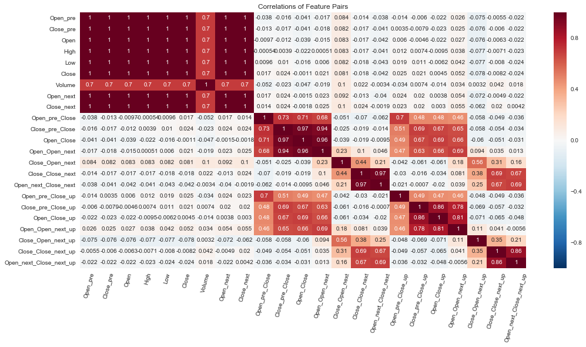


### Statistics Features
The statistics are calculated by the imported [stockstats](http://pypi.python.org/pypi/stockstats) module.
All the examples in the [Tutorial of the stockstats](http://pypi.python.org/pypi/stockstats) are listed below:


```python
from stockstats import StockDataFrame
# from copy       import deepcopy
# s_copy  =              deepcopy(d     )
# s       = StockDataFrame.retype(s_copy)          # The data => StockDataFrame
s       = StockDataFrame.retype(d.copy())          # The data => StockDataFrame
stats   = ['volume_delta', 'open_-2_r', 'cr', 'cr-ma1', 'cr-ma2', 'cr-ma3', 'volume_-3,2,-1_max', 'volume_-3~1_min',
           'kdjk', 'kdjd', 'kdjj', 'open_2_sma', 'macd', 'macds', 'macdh', 'boll', 'boll_ub', 'boll_lb', 'cr-ma2_xu_cr-ma1_20_c',
           'rsi_6', 'rsi_12', 'wr_10', 'wr_6', 'cci', 'cci_20', 'tr', 'atr', 'dma', 'pdi', 'mdi', 'dx', 'adx', 'adxr',
           'trix', 'trix_9_sma', 'vr', 'vr_6_sma'] # Examples from the Tutorial of the stockstats
```


```python
# [ s[stat] for stat in  stats]                    # Generate relative statistics
for             stat in  stats:                    # Generate relative statistics
    s[stat]                                        # The SettingWithCopyWarning might in stockstats.StockDataFrame
```


```python
def display_corr(        data, corr,     n   = 5):
    print '\nTop {} Positive/Negative Correlation with {} of Statistics'                                      .format(n, corr)
    corr   =    (        data. corr()[corr].sort_values(by = corr, ascending = False)*100).applymap('{:6.2f}%'.format)
    display     (  concat    ([corr.head(n   = n)      .reset_index().rename(columns = {'index': 'Features'}) ,
                               corr.tail(n   = n)[::-1].reset_index().rename(columns = {'index': 'Features'})],
                  ['Positive Correlation', 'Negitive Correlation'])  .rename(index   = lambda i: i + 1))
def display_n   (        data, corr = False, right = '',
                                         n   = 5):
    with pd.option_context('display.max_rows', None, 'display.max_columns', None):
        display ((       data. loc[:, right:] if right else data).describe())
        if          corr:
            display_corr(data, corr ,    n   = n)

_max = lambda s: max([int(n) for n in s.split('_') if n.isdigit()] or [1])

print 'Some statistics requiring multiple-day data might incomplete in the first few days and some are constant:'
display_n  (  s, right = stats[0])                          # display only new features

print '\nThe statistics with the most day number of data:'
stats_days = pd.DataFrame([(c, _max(c)) for c in s.columns],                 columns = ['Statistics', 'Days']
                                                               ).sort_values(by      =                'Days', ascending = False
                                                               ).reset_index(drop    = 1
                                                               ).     rename(index   = lambda i: i + 1)
display                 (stats_days.head())
stats_day  =         max(stats_days.Days  )
s_cplt     = s     .iloc[stats_day:-  stats_day                      ]
s_cplt     = s_cplt. loc[         :, (s_cplt  != s_cplt.iloc[0]).any()]
print 'Dropped the first and last {} days and constant statistics to guarantee the integrity'.format(stats_day)
```

    Some statistics requiring multiple-day data might incomplete in the first few days and some are constant:
    


<div>
<style>
    .dataframe thead tr:only-child th {
        text-align: right;
    }

    .dataframe thead th {
        text-align: left;
    }

    .dataframe tbody tr th {
        vertical-align: top;
    }
</style>
<table border="1" class="dataframe">
  <thead>
    <tr style="text-align: right;">
      <th></th>
      <th>volume_delta</th>
      <th>open_-2_r</th>
      <th>middle</th>
      <th>cr</th>
      <th>cr-ma1</th>
      <th>cr-ma2</th>
      <th>cr-ma3</th>
      <th>volume_-3_s</th>
      <th>volume_-1_s</th>
      <th>volume_2_s</th>
      <th>volume_-3,2,-1_max</th>
      <th>volume_-2_s</th>
      <th>volume_0_s</th>
      <th>volume_1_s</th>
      <th>volume_-3~1_min</th>
      <th>rsv_9</th>
      <th>kdjk_9</th>
      <th>kdjk</th>
      <th>kdjd_9</th>
      <th>kdjd</th>
      <th>kdjj_9</th>
      <th>kdjj</th>
      <th>open_2_sma</th>
      <th>close_26_ema</th>
      <th>macd</th>
      <th>macds</th>
      <th>macdh</th>
      <th>close_20_sma</th>
      <th>close_20_mstd</th>
      <th>boll</th>
      <th>boll_ub</th>
      <th>boll_lb</th>
      <th>cr-ma1_20_c</th>
      <th>close_-1_s</th>
      <th>close_-1_d</th>
      <th>rs_6</th>
      <th>rsi_6</th>
      <th>rs_12</th>
      <th>rsi_12</th>
      <th>wr_10</th>
      <th>wr_6</th>
      <th>middle_14_sma</th>
      <th>cci</th>
      <th>middle_20_sma</th>
      <th>cci_20</th>
      <th>tr</th>
      <th>atr</th>
      <th>close_10_sma</th>
      <th>close_50_sma</th>
      <th>dma</th>
      <th>high_delta</th>
      <th>um</th>
      <th>low_delta</th>
      <th>dm</th>
      <th>pdm</th>
      <th>pdm_14_ema</th>
      <th>pdm_14</th>
      <th>atr_14</th>
      <th>pdi_14</th>
      <th>pdi</th>
      <th>mdm</th>
      <th>mdm_14_ema</th>
      <th>mdm_14</th>
      <th>mdi_14</th>
      <th>mdi</th>
      <th>dx_14</th>
      <th>dx</th>
      <th>dx_6_ema</th>
      <th>adx</th>
      <th>adx_6_ema</th>
      <th>adxr</th>
      <th>trix</th>
      <th>trix_9_sma</th>
      <th>change</th>
      <th>vr</th>
      <th>vr_6_sma</th>
    </tr>
  </thead>
  <tbody>
    <tr>
      <th>count</th>
      <td>1.571000e+03</td>
      <td>1570.000000</td>
      <td>1572.000000</td>
      <td>1571.000000</td>
      <td>1567.000000</td>
      <td>1565.000000</td>
      <td>1561.000000</td>
      <td>1.569000e+03</td>
      <td>1.571000e+03</td>
      <td>1.570000e+03</td>
      <td>1.572000e+03</td>
      <td>1.570000e+03</td>
      <td>1.572000e+03</td>
      <td>1.571000e+03</td>
      <td>1.572000e+03</td>
      <td>1572.000000</td>
      <td>1572.000000</td>
      <td>1572.000000</td>
      <td>1572.000000</td>
      <td>1572.000000</td>
      <td>1572.000000</td>
      <td>1572.000000</td>
      <td>1572.000000</td>
      <td>1572.000000</td>
      <td>1572.000000</td>
      <td>1572.000000</td>
      <td>1572.000000</td>
      <td>1572.000000</td>
      <td>1571.000000</td>
      <td>1572.000000</td>
      <td>1571.000000</td>
      <td>1571.000000</td>
      <td>1548.0</td>
      <td>1571.000000</td>
      <td>1571.000000</td>
      <td>1571.000000</td>
      <td>1571.000000</td>
      <td>1571.000000</td>
      <td>1571.000000</td>
      <td>1572.000000</td>
      <td>1572.000000</td>
      <td>1572.000000</td>
      <td>1571.000000</td>
      <td>1572.000000</td>
      <td>1571.000000</td>
      <td>1571.000000</td>
      <td>1571.000000</td>
      <td>1572.000000</td>
      <td>1572.000000</td>
      <td>1572.000000</td>
      <td>1571.000000</td>
      <td>1571.000000</td>
      <td>1571.000000</td>
      <td>1571.000000</td>
      <td>1572.000000</td>
      <td>1572.000000</td>
      <td>1572.000000</td>
      <td>1571.000000</td>
      <td>1571.000000</td>
      <td>1571.000000</td>
      <td>1572.000000</td>
      <td>1572.000000</td>
      <td>1572.000000</td>
      <td>1571.000000</td>
      <td>1571.000000</td>
      <td>1571.000000</td>
      <td>1571.000000</td>
      <td>1571.000000</td>
      <td>1571.000000</td>
      <td>1571.000000</td>
      <td>1571.000000</td>
      <td>1571.000000</td>
      <td>1571.000000</td>
      <td>1571.000000</td>
      <td>1571.000000</td>
      <td>1568.000000</td>
    </tr>
    <tr>
      <th>mean</th>
      <td>9.502141e+05</td>
      <td>0.099092</td>
      <td>1967.792358</td>
      <td>inf</td>
      <td>123.892805</td>
      <td>124.260930</td>
      <td>124.786388</td>
      <td>9.024587e+08</td>
      <td>9.037868e+08</td>
      <td>9.048906e+08</td>
      <td>1.042161e+09</td>
      <td>9.031104e+08</td>
      <td>9.045914e+08</td>
      <td>9.047370e+08</td>
      <td>7.695646e+08</td>
      <td>63.310915</td>
      <td>63.266995</td>
      <td>63.266995</td>
      <td>63.226725</td>
      <td>63.226725</td>
      <td>63.347535</td>
      <td>63.347535</td>
      <td>1967.334927</td>
      <td>1957.604146</td>
      <td>5.971610</td>
      <td>6.004343</td>
      <td>-0.065466</td>
      <td>1960.192298</td>
      <td>23.168369</td>
      <td>1960.192298</td>
      <td>2006.944155</td>
      <td>1914.270680</td>
      <td>20.0</td>
      <td>1967.853157</td>
      <td>0.881661</td>
      <td>inf</td>
      <td>57.003454</td>
      <td>inf</td>
      <td>56.391302</td>
      <td>36.304644</td>
      <td>37.986727</td>
      <td>1962.161658</td>
      <td>27.626345</td>
      <td>1959.650467</td>
      <td>32.258693</td>
      <td>18.636556</td>
      <td>18.388732</td>
      <td>1964.392784</td>
      <td>1947.242004</td>
      <td>17.150781</td>
      <td>0.887798</td>
      <td>4.673202</td>
      <td>0.885366</td>
      <td>4.710146</td>
      <td>4.527812</td>
      <td>4.509193</td>
      <td>4.509193</td>
      <td>18.388732</td>
      <td>25.229843</td>
      <td>25.229843</td>
      <td>4.612882</td>
      <td>4.579200</td>
      <td>4.579200</td>
      <td>23.155807</td>
      <td>23.155807</td>
      <td>31.581981</td>
      <td>31.581981</td>
      <td>31.703188</td>
      <td>31.703188</td>
      <td>31.821910</td>
      <td>31.821910</td>
      <td>0.045396</td>
      <td>0.045820</td>
      <td>0.049098</td>
      <td>inf</td>
      <td>124.856750</td>
    </tr>
    <tr>
      <th>std</th>
      <td>2.631804e+08</td>
      <td>1.071718</td>
      <td>379.667187</td>
      <td>NaN</td>
      <td>48.687648</td>
      <td>46.349854</td>
      <td>41.678462</td>
      <td>6.697016e+08</td>
      <td>6.703088e+08</td>
      <td>6.712293e+08</td>
      <td>7.507952e+08</td>
      <td>6.699859e+08</td>
      <td>6.708544e+08</td>
      <td>6.710431e+08</td>
      <td>5.762298e+08</td>
      <td>30.651644</td>
      <td>23.295435</td>
      <td>23.295435</td>
      <td>20.290836</td>
      <td>20.290836</td>
      <td>36.436134</td>
      <td>36.436134</td>
      <td>379.778469</td>
      <td>377.014303</td>
      <td>13.340494</td>
      <td>12.199004</td>
      <td>9.526736</td>
      <td>378.198352</td>
      <td>13.501206</td>
      <td>378.198352</td>
      <td>385.763143</td>
      <td>371.958496</td>
      <td>0.0</td>
      <td>379.278334</td>
      <td>15.684395</td>
      <td>NaN</td>
      <td>17.439781</td>
      <td>NaN</td>
      <td>12.106215</td>
      <td>30.527410</td>
      <td>31.059966</td>
      <td>378.665311</td>
      <td>105.818775</td>
      <td>378.336345</td>
      <td>108.315279</td>
      <td>12.442014</td>
      <td>7.259842</td>
      <td>378.785313</td>
      <td>375.167727</td>
      <td>37.997400</td>
      <td>11.897649</td>
      <td>7.162343</td>
      <td>15.079956</td>
      <td>10.048075</td>
      <td>7.199437</td>
      <td>2.186874</td>
      <td>2.186874</td>
      <td>7.259842</td>
      <td>9.462062</td>
      <td>9.462062</td>
      <td>10.067816</td>
      <td>3.901867</td>
      <td>3.901867</td>
      <td>11.701681</td>
      <td>11.701681</td>
      <td>21.133665</td>
      <td>21.133665</td>
      <td>15.383195</td>
      <td>15.383195</td>
      <td>13.470806</td>
      <td>13.470806</td>
      <td>0.107978</td>
      <td>0.103702</td>
      <td>0.789227</td>
      <td>NaN</td>
      <td>52.009557</td>
    </tr>
    <tr>
      <th>min</th>
      <td>-1.854808e+09</td>
      <td>-6.911553</td>
      <td>1275.823333</td>
      <td>35.036925</td>
      <td>44.631415</td>
      <td>52.251135</td>
      <td>55.682846</td>
      <td>1.839316e+08</td>
      <td>1.839316e+08</td>
      <td>1.839316e+08</td>
      <td>3.782322e+08</td>
      <td>1.839316e+08</td>
      <td>1.839316e+08</td>
      <td>1.839316e+08</td>
      <td>1.839316e+08</td>
      <td>0.000000</td>
      <td>4.666604</td>
      <td>4.666604</td>
      <td>9.879499</td>
      <td>9.879499</td>
      <td>-22.128273</td>
      <td>-22.128273</td>
      <td>1278.055000</td>
      <td>1308.040000</td>
      <td>-47.639949</td>
      <td>-40.305676</td>
      <td>-61.144555</td>
      <td>1308.040000</td>
      <td>3.228371</td>
      <td>1308.040000</td>
      <td>1320.170742</td>
      <td>1270.300916</td>
      <td>20.0</td>
      <td>1278.040000</td>
      <td>-113.190000</td>
      <td>0.067665</td>
      <td>6.337629</td>
      <td>0.174513</td>
      <td>14.858333</td>
      <td>0.000000</td>
      <td>0.000000</td>
      <td>1302.380000</td>
      <td>-340.578134</td>
      <td>1302.380000</td>
      <td>-395.599439</td>
      <td>3.700000</td>
      <td>6.807037</td>
      <td>1305.426000</td>
      <td>1308.040000</td>
      <td>-125.243000</td>
      <td>-72.360000</td>
      <td>0.000000</td>
      <td>-121.800000</td>
      <td>0.000000</td>
      <td>0.000000</td>
      <td>0.000000</td>
      <td>0.000000</td>
      <td>6.807037</td>
      <td>4.532342</td>
      <td>4.532342</td>
      <td>0.000000</td>
      <td>0.000000</td>
      <td>0.000000</td>
      <td>0.000000</td>
      <td>0.000000</td>
      <td>0.010822</td>
      <td>0.010822</td>
      <td>6.959956</td>
      <td>6.959956</td>
      <td>10.029961</td>
      <td>10.029961</td>
      <td>-0.368495</td>
      <td>-0.346507</td>
      <td>-4.097924</td>
      <td>34.691762</td>
      <td>46.627682</td>
    </tr>
    <tr>
      <th>25%</th>
      <td>-6.636926e+07</td>
      <td>-0.411813</td>
      <td>1678.885000</td>
      <td>88.057774</td>
      <td>90.379138</td>
      <td>91.653030</td>
      <td>94.262853</td>
      <td>4.982664e+08</td>
      <td>4.983336e+08</td>
      <td>4.983000e+08</td>
      <td>5.646139e+08</td>
      <td>4.983000e+08</td>
      <td>4.983672e+08</td>
      <td>4.983336e+08</td>
      <td>4.449634e+08</td>
      <td>39.349021</td>
      <td>44.380197</td>
      <td>44.380197</td>
      <td>47.423261</td>
      <td>47.423261</td>
      <td>34.137156</td>
      <td>34.137156</td>
      <td>1677.065000</td>
      <td>1664.256991</td>
      <td>-0.846079</td>
      <td>-0.306965</td>
      <td>-5.150808</td>
      <td>1662.981375</td>
      <td>14.362797</td>
      <td>1662.981375</td>
      <td>1711.620069</td>
      <td>1617.536081</td>
      <td>20.0</td>
      <td>1677.460000</td>
      <td>-5.775000</td>
      <td>0.818814</td>
      <td>45.019113</td>
      <td>0.923823</td>
      <td>48.020154</td>
      <td>8.500546</td>
      <td>9.643421</td>
      <td>1666.364940</td>
      <td>-44.970957</td>
      <td>1663.430208</td>
      <td>-41.624883</td>
      <td>10.770000</td>
      <td>13.807197</td>
      <td>1670.615000</td>
      <td>1653.239150</td>
      <td>-2.413800</td>
      <td>-4.580000</td>
      <td>0.000000</td>
      <td>-5.690000</td>
      <td>0.000000</td>
      <td>0.000000</td>
      <td>2.977252</td>
      <td>2.977252</td>
      <td>13.807197</td>
      <td>18.418108</td>
      <td>18.418108</td>
      <td>0.000000</td>
      <td>2.241600</td>
      <td>2.241600</td>
      <td>14.680258</td>
      <td>14.680258</td>
      <td>14.073974</td>
      <td>14.073974</td>
      <td>20.160106</td>
      <td>20.160106</td>
      <td>21.812917</td>
      <td>21.812917</td>
      <td>-0.014542</td>
      <td>-0.012553</td>
      <td>-0.303274</td>
      <td>85.721166</td>
      <td>87.423199</td>
    </tr>
    <tr>
      <th>50%</th>
      <td>4.320160e+05</td>
      <td>0.142929</td>
      <td>2006.920000</td>
      <td>115.792765</td>
      <td>117.726716</td>
      <td>117.578439</td>
      <td>117.903044</td>
      <td>5.795952e+08</td>
      <td>5.796411e+08</td>
      <td>5.796182e+08</td>
      <td>6.644155e+08</td>
      <td>5.796182e+08</td>
      <td>5.798789e+08</td>
      <td>5.796411e+08</td>
      <td>5.028901e+08</td>
      <td>70.737463</td>
      <td>67.726093</td>
      <td>67.726093</td>
      <td>66.493549</td>
      <td>66.493549</td>
      <td>69.828138</td>
      <td>69.828138</td>
      <td>2006.747500</td>
      <td>1992.848483</td>
      <td>7.643090</td>
      <td>7.251396</td>
      <td>-0.019747</td>
      <td>1997.335750</td>
      <td>20.072444</td>
      <td>1997.335750</td>
      <td>2077.102662</td>
      <td>1948.439350</td>
      <td>20.0</td>
      <td>2003.370000</td>
      <td>0.880000</td>
      <td>1.400694</td>
      <td>58.345377</td>
      <td>1.354135</td>
      <td>57.521556</td>
      <td>29.047730</td>
      <td>30.786569</td>
      <td>1997.853452</td>
      <td>53.865248</td>
      <td>1996.353750</td>
      <td>58.455139</td>
      <td>15.260000</td>
      <td>16.445150</td>
      <td>2004.440000</td>
      <td>1988.632800</td>
      <td>21.640200</td>
      <td>0.910000</td>
      <td>0.910000</td>
      <td>1.950000</td>
      <td>0.000000</td>
      <td>0.000000</td>
      <td>4.067506</td>
      <td>4.067506</td>
      <td>16.445150</td>
      <td>24.864129</td>
      <td>24.864129</td>
      <td>0.000000</td>
      <td>3.487046</td>
      <td>3.487046</td>
      <td>21.310346</td>
      <td>21.310346</td>
      <td>29.366119</td>
      <td>29.366119</td>
      <td>27.991419</td>
      <td>27.991419</td>
      <td>28.721235</td>
      <td>28.721235</td>
      <td>0.059643</td>
      <td>0.060090</td>
      <td>0.048633</td>
      <td>110.870520</td>
      <td>112.297523</td>
    </tr>
    <tr>
      <th>75%</th>
      <td>6.964254e+07</td>
      <td>0.679271</td>
      <td>2166.543333</td>
      <td>145.430667</td>
      <td>145.021681</td>
      <td>144.121426</td>
      <td>147.801188</td>
      <td>8.690522e+08</td>
      <td>8.723305e+08</td>
      <td>8.759099e+08</td>
      <td>1.343127e+09</td>
      <td>8.698390e+08</td>
      <td>8.750098e+08</td>
      <td>8.754599e+08</td>
      <td>6.483238e+08</td>
      <td>91.172789</td>
      <td>83.352550</td>
      <td>83.352550</td>
      <td>80.164864</td>
      <td>80.164864</td>
      <td>95.346247</td>
      <td>95.346247</td>
      <td>2165.510000</td>
      <td>2157.802304</td>
      <td>14.542884</td>
      <td>13.691737</td>
      <td>5.407967</td>
      <td>2155.632750</td>
      <td>27.398233</td>
      <td>2155.632750</td>
      <td>2194.655401</td>
      <td>2120.938282</td>
      <td>20.0</td>
      <td>2165.875000</td>
      <td>8.905000</td>
      <td>2.398924</td>
      <td>70.578922</td>
      <td>1.862677</td>
      <td>65.067665</td>
      <td>59.758574</td>
      <td>62.960546</td>
      <td>2157.271488</td>
      <td>104.549430</td>
      <td>2154.356333</td>
      <td>111.581568</td>
      <td>22.560000</td>
      <td>19.626605</td>
      <td>2161.034500</td>
      <td>2151.449050</td>
      <td>42.402550</td>
      <td>7.105000</td>
      <td>7.105000</td>
      <td>8.640000</td>
      <td>5.690000</td>
      <td>6.937500</td>
      <td>5.569348</td>
      <td>5.569348</td>
      <td>19.626605</td>
      <td>31.614440</td>
      <td>31.614440</td>
      <td>5.477500</td>
      <td>5.571504</td>
      <td>5.571504</td>
      <td>29.777428</td>
      <td>29.777428</td>
      <td>45.720697</td>
      <td>45.720697</td>
      <td>40.956340</td>
      <td>40.956340</td>
      <td>39.768294</td>
      <td>39.768294</td>
      <td>0.118945</td>
      <td>0.117597</td>
      <td>0.467491</td>
      <td>150.651228</td>
      <td>149.220257</td>
    </tr>
    <tr>
      <th>max</th>
      <td>1.765587e+09</td>
      <td>6.050461</td>
      <td>2863.973333</td>
      <td>inf</td>
      <td>449.383886</td>
      <td>449.383886</td>
      <td>449.383886</td>
      <td>4.024144e+09</td>
      <td>4.024144e+09</td>
      <td>4.024144e+09</td>
      <td>4.024144e+09</td>
      <td>4.024144e+09</td>
      <td>4.024144e+09</td>
      <td>4.024144e+09</td>
      <td>2.838299e+09</td>
      <td>100.000000</td>
      <td>97.792533</td>
      <td>97.792533</td>
      <td>96.055363</td>
      <td>96.055363</td>
      <td>123.515157</td>
      <td>123.515157</td>
      <td>2857.355000</td>
      <td>2781.595585</td>
      <td>47.662717</td>
      <td>43.182659</td>
      <td>27.413893</td>
      <td>2801.856500</td>
      <td>91.627922</td>
      <td>2801.856500</td>
      <td>2945.158618</td>
      <td>2722.922774</td>
      <td>20.0</td>
      <td>2872.870000</td>
      <td>72.890000</td>
      <td>inf</td>
      <td>100.000000</td>
      <td>inf</td>
      <td>100.000000</td>
      <td>100.000000</td>
      <td>100.000000</td>
      <td>2821.722381</td>
      <td>318.649509</td>
      <td>2801.216333</td>
      <td>278.083764</td>
      <td>125.220000</td>
      <td>50.759978</td>
      <td>2835.381000</td>
      <td>2748.848600</td>
      <td>129.493200</td>
      <td>46.510000</td>
      <td>46.510000</td>
      <td>89.760000</td>
      <td>121.800000</td>
      <td>46.510000</td>
      <td>14.881184</td>
      <td>14.881184</td>
      <td>50.759978</td>
      <td>64.384652</td>
      <td>64.384652</td>
      <td>121.800000</td>
      <td>36.356521</td>
      <td>36.356521</td>
      <td>95.970924</td>
      <td>95.970924</td>
      <td>100.000000</td>
      <td>100.000000</td>
      <td>100.000000</td>
      <td>100.000000</td>
      <td>100.000000</td>
      <td>100.000000</td>
      <td>0.264922</td>
      <td>0.252039</td>
      <td>3.902828</td>
      <td>inf</td>
      <td>422.185018</td>
    </tr>
  </tbody>
</table>
</div>


    
    The statistics with the most day number of data:
    


<div>
<style>
    .dataframe thead tr:only-child th {
        text-align: right;
    }

    .dataframe thead th {
        text-align: left;
    }

    .dataframe tbody tr th {
        vertical-align: top;
    }
</style>
<table border="1" class="dataframe">
  <thead>
    <tr style="text-align: right;">
      <th></th>
      <th>Statistics</th>
      <th>Days</th>
    </tr>
  </thead>
  <tbody>
    <tr>
      <th>1</th>
      <td>close_50_sma</td>
      <td>50</td>
    </tr>
    <tr>
      <th>2</th>
      <td>close_26_ema</td>
      <td>26</td>
    </tr>
    <tr>
      <th>3</th>
      <td>close_20_sma</td>
      <td>20</td>
    </tr>
    <tr>
      <th>4</th>
      <td>close_20_mstd</td>
      <td>20</td>
    </tr>
    <tr>
      <th>5</th>
      <td>cr-ma1_20_c</td>
      <td>20</td>
    </tr>
  </tbody>
</table>
</div>


    Dropped the first and last 50 days and constant statistics to guarantee the integrity
    

#### Feature Comparison
The best statistics features are 6/12 days Relative Strength Index (RSI) and 6/10 days Williams Overbought/Oversold Index (WR) (the [stockstats](http://pypi.python.org/pypi/stockstats) changes all column names to lower case)


```python
display_n(s_cplt, right = stats[0], corr = ['close_close_next_up', 'close_close_next'], n = 10)
```


<div>
<style>
    .dataframe thead tr:only-child th {
        text-align: right;
    }

    .dataframe thead th {
        text-align: left;
    }

    .dataframe tbody tr th {
        vertical-align: top;
    }
</style>
<table border="1" class="dataframe">
  <thead>
    <tr style="text-align: right;">
      <th></th>
      <th>volume_delta</th>
      <th>open_-2_r</th>
      <th>middle</th>
      <th>cr</th>
      <th>cr-ma1</th>
      <th>cr-ma2</th>
      <th>cr-ma3</th>
      <th>volume_-3_s</th>
      <th>volume_-1_s</th>
      <th>volume_2_s</th>
      <th>volume_-3,2,-1_max</th>
      <th>volume_-2_s</th>
      <th>volume_0_s</th>
      <th>volume_1_s</th>
      <th>volume_-3~1_min</th>
      <th>rsv_9</th>
      <th>kdjk_9</th>
      <th>kdjk</th>
      <th>kdjd_9</th>
      <th>kdjd</th>
      <th>kdjj_9</th>
      <th>kdjj</th>
      <th>open_2_sma</th>
      <th>close_26_ema</th>
      <th>macd</th>
      <th>macds</th>
      <th>macdh</th>
      <th>close_20_sma</th>
      <th>close_20_mstd</th>
      <th>boll</th>
      <th>boll_ub</th>
      <th>boll_lb</th>
      <th>close_-1_s</th>
      <th>close_-1_d</th>
      <th>rs_6</th>
      <th>rsi_6</th>
      <th>rs_12</th>
      <th>rsi_12</th>
      <th>wr_10</th>
      <th>wr_6</th>
      <th>middle_14_sma</th>
      <th>cci</th>
      <th>middle_20_sma</th>
      <th>cci_20</th>
      <th>tr</th>
      <th>atr</th>
      <th>close_10_sma</th>
      <th>close_50_sma</th>
      <th>dma</th>
      <th>high_delta</th>
      <th>um</th>
      <th>low_delta</th>
      <th>dm</th>
      <th>pdm</th>
      <th>pdm_14_ema</th>
      <th>pdm_14</th>
      <th>atr_14</th>
      <th>pdi_14</th>
      <th>pdi</th>
      <th>mdm</th>
      <th>mdm_14_ema</th>
      <th>mdm_14</th>
      <th>mdi_14</th>
      <th>mdi</th>
      <th>dx_14</th>
      <th>dx</th>
      <th>dx_6_ema</th>
      <th>adx</th>
      <th>adx_6_ema</th>
      <th>adxr</th>
      <th>trix</th>
      <th>trix_9_sma</th>
      <th>change</th>
      <th>vr</th>
      <th>vr_6_sma</th>
    </tr>
  </thead>
  <tbody>
    <tr>
      <th>count</th>
      <td>1.472000e+03</td>
      <td>1472.000000</td>
      <td>1472.000000</td>
      <td>1472.000000</td>
      <td>1472.000000</td>
      <td>1472.000000</td>
      <td>1472.000000</td>
      <td>1.472000e+03</td>
      <td>1.472000e+03</td>
      <td>1.472000e+03</td>
      <td>1.472000e+03</td>
      <td>1.472000e+03</td>
      <td>1.472000e+03</td>
      <td>1.472000e+03</td>
      <td>1.472000e+03</td>
      <td>1472.000000</td>
      <td>1472.000000</td>
      <td>1472.000000</td>
      <td>1472.000000</td>
      <td>1472.000000</td>
      <td>1472.000000</td>
      <td>1472.000000</td>
      <td>1472.000000</td>
      <td>1472.000000</td>
      <td>1472.000000</td>
      <td>1472.000000</td>
      <td>1472.000000</td>
      <td>1472.000000</td>
      <td>1472.000000</td>
      <td>1472.000000</td>
      <td>1472.000000</td>
      <td>1472.000000</td>
      <td>1472.000000</td>
      <td>1472.000000</td>
      <td>1472.000000</td>
      <td>1472.000000</td>
      <td>1472.000000</td>
      <td>1472.000000</td>
      <td>1472.000000</td>
      <td>1472.000000</td>
      <td>1472.000000</td>
      <td>1472.000000</td>
      <td>1472.000000</td>
      <td>1472.000000</td>
      <td>1472.000000</td>
      <td>1472.000000</td>
      <td>1472.000000</td>
      <td>1472.000000</td>
      <td>1472.000000</td>
      <td>1472.000000</td>
      <td>1472.000000</td>
      <td>1472.000000</td>
      <td>1472.000000</td>
      <td>1472.000000</td>
      <td>1472.000000</td>
      <td>1472.000000</td>
      <td>1472.000000</td>
      <td>1472.000000</td>
      <td>1472.000000</td>
      <td>1472.000000</td>
      <td>1472.000000</td>
      <td>1472.000000</td>
      <td>1472.000000</td>
      <td>1472.000000</td>
      <td>1472.000000</td>
      <td>1472.000000</td>
      <td>1472.000000</td>
      <td>1472.000000</td>
      <td>1472.000000</td>
      <td>1472.000000</td>
      <td>1472.000000</td>
      <td>1472.000000</td>
      <td>1472.000000</td>
      <td>1472.000000</td>
      <td>1472.000000</td>
    </tr>
    <tr>
      <th>mean</th>
      <td>2.303946e+06</td>
      <td>0.092274</td>
      <td>1964.034040</td>
      <td>123.419394</td>
      <td>123.322519</td>
      <td>122.802107</td>
      <td>121.878734</td>
      <td>8.608471e+08</td>
      <td>8.643490e+08</td>
      <td>8.698611e+08</td>
      <td>9.998384e+08</td>
      <td>8.623177e+08</td>
      <td>8.666529e+08</td>
      <td>8.681595e+08</td>
      <td>7.336726e+08</td>
      <td>63.069912</td>
      <td>63.131494</td>
      <td>63.131494</td>
      <td>63.184202</td>
      <td>63.184202</td>
      <td>63.026077</td>
      <td>63.026077</td>
      <td>1963.596875</td>
      <td>1952.886015</td>
      <td>6.577054</td>
      <td>6.530726</td>
      <td>0.092656</td>
      <td>1955.596922</td>
      <td>22.362602</td>
      <td>1955.596922</td>
      <td>2000.322126</td>
      <td>1910.871717</td>
      <td>1963.715965</td>
      <td>0.876087</td>
      <td>1.834755</td>
      <td>56.904878</td>
      <td>1.475307</td>
      <td>56.265829</td>
      <td>36.542554</td>
      <td>38.146373</td>
      <td>1957.937232</td>
      <td>26.613734</td>
      <td>1955.024634</td>
      <td>31.884068</td>
      <td>17.950571</td>
      <td>17.734300</td>
      <td>1960.447692</td>
      <td>1941.630953</td>
      <td>18.816738</td>
      <td>0.874586</td>
      <td>4.520306</td>
      <td>0.812412</td>
      <td>4.501162</td>
      <td>4.384198</td>
      <td>4.384496</td>
      <td>4.384496</td>
      <td>17.734300</td>
      <td>25.197176</td>
      <td>25.197176</td>
      <td>4.412099</td>
      <td>4.304239</td>
      <td>4.304239</td>
      <td>23.054404</td>
      <td>23.054404</td>
      <td>31.360287</td>
      <td>31.360287</td>
      <td>31.304462</td>
      <td>31.304462</td>
      <td>31.264444</td>
      <td>31.264444</td>
      <td>0.047673</td>
      <td>0.047554</td>
      <td>0.047225</td>
      <td>123.547448</td>
      <td>123.560625</td>
    </tr>
    <tr>
      <th>std</th>
      <td>2.587513e+08</td>
      <td>1.052658</td>
      <td>351.438609</td>
      <td>49.750915</td>
      <td>47.305613</td>
      <td>43.500429</td>
      <td>36.326603</td>
      <td>6.251281e+08</td>
      <td>6.307888e+08</td>
      <td>6.411560e+08</td>
      <td>7.098477e+08</td>
      <td>6.269561e+08</td>
      <td>6.361133e+08</td>
      <td>6.381531e+08</td>
      <td>5.408766e+08</td>
      <td>30.798212</td>
      <td>23.378289</td>
      <td>23.378289</td>
      <td>20.355241</td>
      <td>20.355241</td>
      <td>36.571931</td>
      <td>36.571931</td>
      <td>351.391367</td>
      <td>345.945969</td>
      <td>13.141672</td>
      <td>12.109017</td>
      <td>8.897842</td>
      <td>347.138424</td>
      <td>11.701365</td>
      <td>347.138424</td>
      <td>349.604942</td>
      <td>346.239702</td>
      <td>351.306762</td>
      <td>14.866483</td>
      <td>1.519574</td>
      <td>17.393852</td>
      <td>0.762604</td>
      <td>11.834198</td>
      <td>30.678654</td>
      <td>31.190104</td>
      <td>348.521345</td>
      <td>106.263618</td>
      <td>347.096370</td>
      <td>108.557485</td>
      <td>11.043916</td>
      <td>5.619066</td>
      <td>349.599968</td>
      <td>341.905706</td>
      <td>37.652956</td>
      <td>11.411188</td>
      <td>6.889865</td>
      <td>13.866362</td>
      <td>9.264176</td>
      <td>6.925783</td>
      <td>2.013064</td>
      <td>2.013064</td>
      <td>5.619066</td>
      <td>9.480713</td>
      <td>9.480713</td>
      <td>9.284816</td>
      <td>3.197815</td>
      <td>3.197815</td>
      <td>11.343898</td>
      <td>11.343898</td>
      <td>20.911709</td>
      <td>20.911709</td>
      <td>14.934220</td>
      <td>14.934220</td>
      <td>12.717318</td>
      <td>12.717318</td>
      <td>0.107605</td>
      <td>0.103666</td>
      <td>0.772713</td>
      <td>53.719433</td>
      <td>51.375921</td>
    </tr>
    <tr>
      <th>min</th>
      <td>-1.854808e+09</td>
      <td>-6.911553</td>
      <td>1275.823333</td>
      <td>35.036925</td>
      <td>44.631415</td>
      <td>52.251135</td>
      <td>55.682846</td>
      <td>1.839316e+08</td>
      <td>1.839316e+08</td>
      <td>1.839316e+08</td>
      <td>3.782322e+08</td>
      <td>1.839316e+08</td>
      <td>1.839316e+08</td>
      <td>1.839316e+08</td>
      <td>1.839316e+08</td>
      <td>0.000000</td>
      <td>4.666604</td>
      <td>4.666604</td>
      <td>9.879499</td>
      <td>9.879499</td>
      <td>-22.128273</td>
      <td>-22.128273</td>
      <td>1278.055000</td>
      <td>1324.033020</td>
      <td>-47.639949</td>
      <td>-40.305676</td>
      <td>-47.470134</td>
      <td>1310.821000</td>
      <td>5.550314</td>
      <td>1310.821000</td>
      <td>1341.444192</td>
      <td>1270.300916</td>
      <td>1278.040000</td>
      <td>-113.190000</td>
      <td>0.067665</td>
      <td>6.337629</td>
      <td>0.174513</td>
      <td>14.858333</td>
      <td>0.000000</td>
      <td>0.000000</td>
      <td>1306.971190</td>
      <td>-340.578134</td>
      <td>1310.760500</td>
      <td>-395.599439</td>
      <td>3.700000</td>
      <td>9.318114</td>
      <td>1305.426000</td>
      <td>1332.767800</td>
      <td>-125.243000</td>
      <td>-72.360000</td>
      <td>0.000000</td>
      <td>-121.800000</td>
      <td>0.000000</td>
      <td>0.000000</td>
      <td>0.922930</td>
      <td>0.922930</td>
      <td>9.318114</td>
      <td>4.532342</td>
      <td>4.532342</td>
      <td>0.000000</td>
      <td>0.257627</td>
      <td>0.257627</td>
      <td>2.440395</td>
      <td>2.440395</td>
      <td>0.010822</td>
      <td>0.010822</td>
      <td>6.959956</td>
      <td>6.959956</td>
      <td>10.029961</td>
      <td>10.029961</td>
      <td>-0.368495</td>
      <td>-0.346507</td>
      <td>-4.097924</td>
      <td>34.691762</td>
      <td>46.627682</td>
    </tr>
    <tr>
      <th>25%</th>
      <td>-6.417349e+07</td>
      <td>-0.406773</td>
      <td>1691.396667</td>
      <td>89.647140</td>
      <td>91.389937</td>
      <td>91.930292</td>
      <td>94.496405</td>
      <td>4.944060e+08</td>
      <td>4.944060e+08</td>
      <td>4.944060e+08</td>
      <td>5.593118e+08</td>
      <td>4.944060e+08</td>
      <td>4.944060e+08</td>
      <td>4.944060e+08</td>
      <td>4.399152e+08</td>
      <td>38.791456</td>
      <td>44.142936</td>
      <td>44.142936</td>
      <td>47.078145</td>
      <td>47.078145</td>
      <td>33.572902</td>
      <td>33.572902</td>
      <td>1692.207500</td>
      <td>1680.923373</td>
      <td>-0.540566</td>
      <td>0.079696</td>
      <td>-5.210928</td>
      <td>1687.431125</td>
      <td>14.388780</td>
      <td>1687.431125</td>
      <td>1724.397995</td>
      <td>1644.630025</td>
      <td>1692.517500</td>
      <td>-5.750000</td>
      <td>0.818270</td>
      <td>45.002661</td>
      <td>0.927059</td>
      <td>48.107446</td>
      <td>8.421364</td>
      <td>9.613777</td>
      <td>1689.190833</td>
      <td>-46.169907</td>
      <td>1687.097208</td>
      <td>-42.206874</td>
      <td>10.767500</td>
      <td>13.907455</td>
      <td>1691.915750</td>
      <td>1674.834900</td>
      <td>-1.380150</td>
      <td>-4.580000</td>
      <td>0.000000</td>
      <td>-5.695000</td>
      <td>0.000000</td>
      <td>0.000000</td>
      <td>2.944043</td>
      <td>2.944043</td>
      <td>13.907455</td>
      <td>18.415501</td>
      <td>18.415501</td>
      <td>0.000000</td>
      <td>2.285722</td>
      <td>2.285722</td>
      <td>14.751877</td>
      <td>14.751877</td>
      <td>14.102412</td>
      <td>14.102412</td>
      <td>20.103053</td>
      <td>20.103053</td>
      <td>21.749174</td>
      <td>21.749174</td>
      <td>-0.010313</td>
      <td>-0.010396</td>
      <td>-0.299295</td>
      <td>85.244851</td>
      <td>86.674964</td>
    </tr>
    <tr>
      <th>50%</th>
      <td>4.659165e+05</td>
      <td>0.138629</td>
      <td>2006.920000</td>
      <td>115.742092</td>
      <td>117.612877</td>
      <td>117.136190</td>
      <td>116.567585</td>
      <td>5.712966e+08</td>
      <td>5.716424e+08</td>
      <td>5.716424e+08</td>
      <td>6.584245e+08</td>
      <td>5.713861e+08</td>
      <td>5.716424e+08</td>
      <td>5.716424e+08</td>
      <td>4.954783e+08</td>
      <td>70.485153</td>
      <td>67.346124</td>
      <td>67.346124</td>
      <td>66.148549</td>
      <td>66.148549</td>
      <td>69.441159</td>
      <td>69.441159</td>
      <td>2006.747500</td>
      <td>1992.848483</td>
      <td>8.258946</td>
      <td>7.988575</td>
      <td>-0.226096</td>
      <td>1997.335750</td>
      <td>20.006454</td>
      <td>1997.335750</td>
      <td>2077.036929</td>
      <td>1948.378731</td>
      <td>2002.990000</td>
      <td>0.860000</td>
      <td>1.399752</td>
      <td>58.329027</td>
      <td>1.356655</td>
      <td>57.566972</td>
      <td>29.262537</td>
      <td>31.077120</td>
      <td>1997.853452</td>
      <td>53.591389</td>
      <td>1996.353750</td>
      <td>58.571327</td>
      <td>15.060000</td>
      <td>16.435279</td>
      <td>2004.440000</td>
      <td>1988.632800</td>
      <td>23.076000</td>
      <td>0.835000</td>
      <td>0.835000</td>
      <td>1.935000</td>
      <td>0.000000</td>
      <td>0.000000</td>
      <td>4.022840</td>
      <td>4.022840</td>
      <td>16.435279</td>
      <td>24.861230</td>
      <td>24.861230</td>
      <td>0.000000</td>
      <td>3.474976</td>
      <td>3.474976</td>
      <td>21.264381</td>
      <td>21.264381</td>
      <td>29.286433</td>
      <td>29.286433</td>
      <td>27.836431</td>
      <td>27.836431</td>
      <td>28.291590</td>
      <td>28.291590</td>
      <td>0.061894</td>
      <td>0.060438</td>
      <td>0.043069</td>
      <td>109.395253</td>
      <td>110.423992</td>
    </tr>
    <tr>
      <th>75%</th>
      <td>6.842402e+07</td>
      <td>0.668174</td>
      <td>2147.618333</td>
      <td>144.436241</td>
      <td>143.469034</td>
      <td>142.865432</td>
      <td>143.448822</td>
      <td>7.965275e+08</td>
      <td>8.009252e+08</td>
      <td>8.031114e+08</td>
      <td>1.057433e+09</td>
      <td>7.988811e+08</td>
      <td>8.014918e+08</td>
      <td>8.022678e+08</td>
      <td>6.080786e+08</td>
      <td>91.172789</td>
      <td>83.387298</td>
      <td>83.387298</td>
      <td>80.344792</td>
      <td>80.344792</td>
      <td>95.346247</td>
      <td>95.346247</td>
      <td>2145.608750</td>
      <td>2144.087062</td>
      <td>15.125533</td>
      <td>14.188564</td>
      <td>5.519280</td>
      <td>2144.189625</td>
      <td>26.381501</td>
      <td>2144.189625</td>
      <td>2184.321934</td>
      <td>2089.923449</td>
      <td>2146.390000</td>
      <td>8.770000</td>
      <td>2.380532</td>
      <td>70.418846</td>
      <td>1.843266</td>
      <td>64.829182</td>
      <td>60.117289</td>
      <td>63.532854</td>
      <td>2144.369286</td>
      <td>104.217465</td>
      <td>2143.539083</td>
      <td>111.168163</td>
      <td>21.877500</td>
      <td>19.408169</td>
      <td>2144.642000</td>
      <td>2133.612950</td>
      <td>43.150350</td>
      <td>6.977500</td>
      <td>6.977500</td>
      <td>8.325000</td>
      <td>5.695000</td>
      <td>6.877500</td>
      <td>5.432722</td>
      <td>5.432722</td>
      <td>19.408169</td>
      <td>31.582978</td>
      <td>31.582978</td>
      <td>5.570000</td>
      <td>5.395117</td>
      <td>5.395117</td>
      <td>29.583368</td>
      <td>29.583368</td>
      <td>44.891584</td>
      <td>44.891584</td>
      <td>40.139546</td>
      <td>40.139546</td>
      <td>38.767142</td>
      <td>38.767142</td>
      <td>0.119344</td>
      <td>0.118243</td>
      <td>0.461829</td>
      <td>149.868569</td>
      <td>148.037597</td>
    </tr>
    <tr>
      <th>max</th>
      <td>1.765587e+09</td>
      <td>6.050461</td>
      <td>2863.973333</td>
      <td>411.752016</td>
      <td>357.413324</td>
      <td>342.063978</td>
      <td>267.749531</td>
      <td>3.745746e+09</td>
      <td>3.745746e+09</td>
      <td>4.024144e+09</td>
      <td>4.024144e+09</td>
      <td>3.745746e+09</td>
      <td>4.024144e+09</td>
      <td>4.024144e+09</td>
      <td>2.466174e+09</td>
      <td>100.000000</td>
      <td>97.792533</td>
      <td>97.792533</td>
      <td>96.055363</td>
      <td>96.055363</td>
      <td>123.515157</td>
      <td>123.515157</td>
      <td>2857.355000</td>
      <td>2781.595585</td>
      <td>47.662717</td>
      <td>43.182659</td>
      <td>27.413893</td>
      <td>2801.856500</td>
      <td>79.617104</td>
      <td>2801.856500</td>
      <td>2903.976826</td>
      <td>2722.922774</td>
      <td>2872.870000</td>
      <td>72.890000</td>
      <td>12.067142</td>
      <td>92.347217</td>
      <td>7.179207</td>
      <td>87.773876</td>
      <td>100.000000</td>
      <td>100.000000</td>
      <td>2821.722381</td>
      <td>318.649509</td>
      <td>2801.216333</td>
      <td>278.083764</td>
      <td>125.220000</td>
      <td>39.236068</td>
      <td>2835.381000</td>
      <td>2718.108200</td>
      <td>129.493200</td>
      <td>46.510000</td>
      <td>46.510000</td>
      <td>70.020000</td>
      <td>121.800000</td>
      <td>46.510000</td>
      <td>13.225444</td>
      <td>13.225444</td>
      <td>39.236068</td>
      <td>64.384652</td>
      <td>64.384652</td>
      <td>121.800000</td>
      <td>29.492933</td>
      <td>29.492933</td>
      <td>95.970924</td>
      <td>95.970924</td>
      <td>90.213402</td>
      <td>90.213402</td>
      <td>85.536074</td>
      <td>85.536074</td>
      <td>79.375693</td>
      <td>79.375693</td>
      <td>0.264922</td>
      <td>0.252039</td>
      <td>3.902828</td>
      <td>440.631438</td>
      <td>358.794197</td>
    </tr>
  </tbody>
</table>
</div>


    
    Top 10 Positive/Negative Correlation with ['close_close_next_up', 'close_close_next'] of Statistics
    


<div>
<style>
    .dataframe thead tr:only-child th {
        text-align: right;
    }

    .dataframe thead th {
        text-align: left;
    }

    .dataframe tbody tr th {
        vertical-align: top;
    }
</style>
<table border="1" class="dataframe">
  <thead>
    <tr>
      <th></th>
      <th colspan="3" halign="left">Positive Correlation</th>
      <th colspan="3" halign="left">Negitive Correlation</th>
    </tr>
    <tr>
      <th></th>
      <th>Features</th>
      <th>close_close_next_up</th>
      <th>close_close_next</th>
      <th>Features</th>
      <th>close_close_next_up</th>
      <th>close_close_next</th>
    </tr>
  </thead>
  <tbody>
    <tr>
      <th>1</th>
      <td>close_close_next_up</td>
      <td>100.00%</td>
      <td>70.40%</td>
      <td>open_close_up</td>
      <td>-7.84%</td>
      <td>-4.44%</td>
    </tr>
    <tr>
      <th>2</th>
      <td>open_next_close_next_up</td>
      <td>85.92%</td>
      <td>68.60%</td>
      <td>close_pre_close_up</td>
      <td>-6.64%</td>
      <td>-2.90%</td>
    </tr>
    <tr>
      <th>3</th>
      <td>close_close_next</td>
      <td>70.40%</td>
      <td>100.00%</td>
      <td>open_close</td>
      <td>-5.98%</td>
      <td>-1.61%</td>
    </tr>
    <tr>
      <th>4</th>
      <td>open_next_close_next</td>
      <td>68.12%</td>
      <td>97.52%</td>
      <td>close_-1_d</td>
      <td>-5.75%</td>
      <td>-1.25%</td>
    </tr>
    <tr>
      <th>5</th>
      <td>close_open_next_up</td>
      <td>35.81%</td>
      <td>40.20%</td>
      <td>close_pre_close</td>
      <td>-5.75%</td>
      <td>-1.25%</td>
    </tr>
    <tr>
      <th>6</th>
      <td>close_open_next</td>
      <td>34.96%</td>
      <td>46.59%</td>
      <td>rsi_12</td>
      <td>-5.60%</td>
      <td>-6.35%</td>
    </tr>
    <tr>
      <th>7</th>
      <td>wr_10</td>
      <td>5.07%</td>
      <td>5.37%</td>
      <td>rsi_6</td>
      <td>-5.25%</td>
      <td>-5.48%</td>
    </tr>
    <tr>
      <th>8</th>
      <td>wr_6</td>
      <td>5.07%</td>
      <td>5.05%</td>
      <td>change</td>
      <td>-5.24%</td>
      <td>-1.18%</td>
    </tr>
    <tr>
      <th>9</th>
      <td>volume</td>
      <td>4.64%</td>
      <td>3.51%</td>
      <td>rsv_9</td>
      <td>-5.15%</td>
      <td>-5.05%</td>
    </tr>
    <tr>
      <th>10</th>
      <td>volume_0_s</td>
      <td>4.64%</td>
      <td>3.51%</td>
      <td>rs_6</td>
      <td>-5.13%</td>
      <td>-2.95%</td>
    </tr>
  </tbody>
</table>
</div>


#### Feature Cleaned & Selection
Selecting the most correlated RSI6/12, WR6/10 and the popular rolling means (2 days simple moving average, C2M), Moving Average Convergence Divergence (MACD) and Bollinger Bands (Boll/u/l) suggested by proposal comment.
The first 11 days w/o sufficient data for 12-day rsi_12 are dropped as usual. 


```python
X_stat, days_max = [], 0
for    col          ,   stat     in [
     ('Boll_u'      ,  'boll_ub'    ),          # Bollinger Upper Bands
     ('Boll'        ,  'boll'       ),          # Bollinger       Bands
     ('Boll_l'      ,  'boll_lb'    ),          # Bollinger Lower Bands
     ('C2M'         ,  'close_2_sma'),          #  2 days simple moving average (rolling means) on close price
     ('MACD'        ,  'macd'       ),          # Moving Average Convergence Divergence (MACD)
     ('RSI12'       ,  'rsi_12'     ),          # 12 days Relative Strength Index (RSI)
     ('RSI6'        ,  'rsi_6'      ),          #  6 days Relative Strength Index (RSI)
     ('WR10'        ,  'wr_10'      ),          # 10 days Williams Overbought/Oversold Index
     ('WR6'         ,  'wr_6'       ),          #  6 days Williams Overbought/Oversold Index
                                    ]:
    d[ col      ]   = s[stat        ]
    X_stat.append      ( col)
    days_cur     = _max(stat)
    if  days_max <  days_cur:
        days_max =  days_cur
        stat_max =      stat
        col_max  =       col
X_all   += X_stat
display(       d.loc[        :,       X_stat[0]:].head(n = days_max))
data_raw =     d    [days_max:                  ]
print 'The first {} days w/o sufficient data for {}-day {} are dropped'.format(days_max - 1, days_max, stat_max)
display(data_raw.loc[        :,       X_stat[0]:].head(n = days_max))
```


<div>
<style>
    .dataframe thead tr:only-child th {
        text-align: right;
    }

    .dataframe thead th {
        text-align: left;
    }

    .dataframe tbody tr th {
        vertical-align: top;
    }
</style>
<table border="1" class="dataframe">
  <thead>
    <tr style="text-align: right;">
      <th></th>
      <th>Boll_u</th>
      <th>Boll</th>
      <th>Boll_l</th>
      <th>C2M</th>
      <th>MACD</th>
      <th>RSI12</th>
      <th>RSI6</th>
      <th>WR10</th>
      <th>WR6</th>
    </tr>
  </thead>
  <tbody>
    <tr>
      <th>2012-01-19</th>
      <td>NaN</td>
      <td>1308.040000</td>
      <td>NaN</td>
      <td>1308.040</td>
      <td>0.000000</td>
      <td>NaN</td>
      <td>NaN</td>
      <td>0.408879</td>
      <td>0.408879</td>
    </tr>
    <tr>
      <th>2012-01-20</th>
      <td>1320.405820</td>
      <td>1311.270000</td>
      <td>1302.134180</td>
      <td>1311.270</td>
      <td>0.144936</td>
      <td>100.000000</td>
      <td>100.000000</td>
      <td>4.040816</td>
      <td>4.040816</td>
    </tr>
    <tr>
      <th>2012-01-21</th>
      <td>1320.655884</td>
      <td>1312.640000</td>
      <td>1304.624116</td>
      <td>1314.940</td>
      <td>0.211966</td>
      <td>100.000000</td>
      <td>100.000000</td>
      <td>0.448980</td>
      <td>0.448980</td>
    </tr>
    <tr>
      <th>2012-01-24</th>
      <td>1320.837028</td>
      <td>1313.480000</td>
      <td>1306.122972</td>
      <td>1315.690</td>
      <td>0.259643</td>
      <td>100.000000</td>
      <td>100.000000</td>
      <td>20.070310</td>
      <td>20.070310</td>
    </tr>
    <tr>
      <th>2012-01-25</th>
      <td>1320.170742</td>
      <td>1313.714000</td>
      <td>1307.257258</td>
      <td>1315.325</td>
      <td>0.226364</td>
      <td>82.315081</td>
      <td>78.282565</td>
      <td>24.384787</td>
      <td>24.384787</td>
    </tr>
    <tr>
      <th>2012-01-26</th>
      <td>1327.389215</td>
      <td>1315.771667</td>
      <td>1304.154118</td>
      <td>1320.355</td>
      <td>0.690002</td>
      <td>93.277192</td>
      <td>93.218876</td>
      <td>6.003752</td>
      <td>6.003752</td>
    </tr>
    <tr>
      <th>2012-01-27</th>
      <td>1326.945454</td>
      <td>1316.151429</td>
      <td>1305.357403</td>
      <td>1322.245</td>
      <td>0.629801</td>
      <td>64.232195</td>
      <td>60.067847</td>
      <td>35.404896</td>
      <td>54.870485</td>
    </tr>
    <tr>
      <th>2012-01-28</th>
      <td>1326.167874</td>
      <td>1316.173750</td>
      <td>1306.179626</td>
      <td>1317.380</td>
      <td>0.479432</td>
      <td>58.740379</td>
      <td>53.754183</td>
      <td>40.348399</td>
      <td>62.531923</td>
    </tr>
    <tr>
      <th>2012-01-31</th>
      <td>1325.405843</td>
      <td>1315.822222</td>
      <td>1306.238602</td>
      <td>1314.670</td>
      <td>0.203292</td>
      <td>51.191713</td>
      <td>44.817317</td>
      <td>48.163842</td>
      <td>62.037599</td>
    </tr>
    <tr>
      <th>2012-02-01</th>
      <td>1324.770671</td>
      <td>1315.481000</td>
      <td>1306.191329</td>
      <td>1312.710</td>
      <td>-0.026457</td>
      <td>49.926777</td>
      <td>43.257655</td>
      <td>49.576271</td>
      <td>63.856883</td>
    </tr>
    <tr>
      <th>2012-02-02</th>
      <td>1326.491982</td>
      <td>1316.263636</td>
      <td>1306.035290</td>
      <td>1318.250</td>
      <td>0.430152</td>
      <td>67.159631</td>
      <td>68.701440</td>
      <td>28.441480</td>
      <td>28.441480</td>
    </tr>
    <tr>
      <th>2012-02-03</th>
      <td>1328.162847</td>
      <td>1317.036667</td>
      <td>1305.910487</td>
      <td>1324.815</td>
      <td>0.838713</td>
      <td>68.622109</td>
      <td>70.661286</td>
      <td>24.044876</td>
      <td>24.044876</td>
    </tr>
  </tbody>
</table>
</div>


    The first 11 days w/o sufficient data for 12-day rsi_12 are dropped
    


<div>
<style>
    .dataframe thead tr:only-child th {
        text-align: right;
    }

    .dataframe thead th {
        text-align: left;
    }

    .dataframe tbody tr th {
        vertical-align: top;
    }
</style>
<table border="1" class="dataframe">
  <thead>
    <tr style="text-align: right;">
      <th></th>
      <th>Boll_u</th>
      <th>Boll</th>
      <th>Boll_l</th>
      <th>C2M</th>
      <th>MACD</th>
      <th>RSI12</th>
      <th>RSI6</th>
      <th>WR10</th>
      <th>WR6</th>
    </tr>
  </thead>
  <tbody>
    <tr>
      <th>2012-02-04</th>
      <td>1337.951189</td>
      <td>1319.180000</td>
      <td>1300.408811</td>
      <td>1335.220</td>
      <td>2.224198</td>
      <td>80.967466</td>
      <td>85.354560</td>
      <td>0.981048</td>
      <td>0.981048</td>
    </tr>
    <tr>
      <th>2012-02-07</th>
      <td>1343.470290</td>
      <td>1320.976429</td>
      <td>1298.482567</td>
      <td>1344.615</td>
      <td>3.199329</td>
      <td>79.957062</td>
      <td>83.870547</td>
      <td>2.251951</td>
      <td>2.251951</td>
    </tr>
    <tr>
      <th>2012-02-08</th>
      <td>1348.231742</td>
      <td>1322.714667</td>
      <td>1297.197591</td>
      <td>1345.690</td>
      <td>4.055313</td>
      <td>81.179688</td>
      <td>85.330998</td>
      <td>4.492308</td>
      <td>5.146886</td>
    </tr>
    <tr>
      <th>2012-02-09</th>
      <td>1352.582906</td>
      <td>1324.417500</td>
      <td>1296.252094</td>
      <td>1348.505</td>
      <td>4.830348</td>
      <td>82.430534</td>
      <td>86.858612</td>
      <td>2.058998</td>
      <td>2.697795</td>
    </tr>
    <tr>
      <th>2012-02-10</th>
      <td>1356.402689</td>
      <td>1326.037059</td>
      <td>1295.671429</td>
      <td>1350.955</td>
      <td>5.484627</td>
      <td>83.260513</td>
      <td>87.893236</td>
      <td>4.402749</td>
      <td>7.236641</td>
    </tr>
    <tr>
      <th>2012-02-11</th>
      <td>1357.440410</td>
      <td>1326.959444</td>
      <td>1296.478479</td>
      <td>1347.295</td>
      <td>5.331374</td>
      <td>67.086157</td>
      <td>60.952444</td>
      <td>21.697938</td>
      <td>41.551049</td>
    </tr>
    <tr>
      <th>2012-02-14</th>
      <td>1359.999559</td>
      <td>1328.265263</td>
      <td>1296.530967</td>
      <td>1347.205</td>
      <td>5.734429</td>
      <td>72.749491</td>
      <td>71.303527</td>
      <td>5.353769</td>
      <td>13.858696</td>
    </tr>
    <tr>
      <th>2012-02-15</th>
      <td>1361.826018</td>
      <td>1329.377000</td>
      <td>1296.927982</td>
      <td>1351.135</td>
      <td>5.893100</td>
      <td>70.898302</td>
      <td>68.282094</td>
      <td>9.123477</td>
      <td>20.760870</td>
    </tr>
    <tr>
      <th>2012-02-16</th>
      <td>1362.512590</td>
      <td>1331.136500</td>
      <td>1299.760410</td>
      <td>1346.865</td>
      <td>5.464084</td>
      <td>61.176923</td>
      <td>52.887537</td>
      <td>36.851312</td>
      <td>68.250540</td>
    </tr>
    <tr>
      <th>2012-02-17</th>
      <td>1365.849857</td>
      <td>1333.313500</td>
      <td>1300.777143</td>
      <td>1350.635</td>
      <td>6.060229</td>
      <td>70.244136</td>
      <td>69.627209</td>
      <td>2.986894</td>
      <td>4.522381</td>
    </tr>
    <tr>
      <th>2012-02-18</th>
      <td>1369.263809</td>
      <td>1335.606000</td>
      <td>1301.948191</td>
      <td>1359.635</td>
      <td>6.667444</td>
      <td>71.792160</td>
      <td>72.181993</td>
      <td>7.896652</td>
      <td>8.330134</td>
    </tr>
    <tr>
      <th>2012-02-22</th>
      <td>1372.245061</td>
      <td>1337.916500</td>
      <td>1303.587939</td>
      <td>1361.720</td>
      <td>7.127730</td>
      <td>72.275544</td>
      <td>73.018654</td>
      <td>17.430905</td>
      <td>20.586053</td>
    </tr>
  </tbody>
</table>
</div>


#### Correlation of Current Data


```python
display_corr(d, corr = ['Close_Close_next_up', 'Close_Close_next'], n = 10)
```

    
    Top 10 Positive/Negative Correlation with ['Close_Close_next_up', 'Close_Close_next'] of Statistics
    


<div>
<style>
    .dataframe thead tr:only-child th {
        text-align: right;
    }

    .dataframe thead th {
        text-align: left;
    }

    .dataframe tbody tr th {
        vertical-align: top;
    }
</style>
<table border="1" class="dataframe">
  <thead>
    <tr>
      <th></th>
      <th colspan="3" halign="left">Positive Correlation</th>
      <th colspan="3" halign="left">Negitive Correlation</th>
    </tr>
    <tr>
      <th></th>
      <th>Features</th>
      <th>Close_Close_next_up</th>
      <th>Close_Close_next</th>
      <th>Features</th>
      <th>Close_Close_next_up</th>
      <th>Close_Close_next</th>
    </tr>
  </thead>
  <tbody>
    <tr>
      <th>1</th>
      <td>Close_Close_next_up</td>
      <td>100.00%</td>
      <td>69.14%</td>
      <td>Open_Close_up</td>
      <td>-6.51%</td>
      <td>-3.42%</td>
    </tr>
    <tr>
      <th>2</th>
      <td>Open_next_Close_next_up</td>
      <td>86.05%</td>
      <td>67.35%</td>
      <td>RSI12</td>
      <td>-5.84%</td>
      <td>-6.43%</td>
    </tr>
    <tr>
      <th>3</th>
      <td>Close_Close_next</td>
      <td>69.14%</td>
      <td>100.00%</td>
      <td>Close_pre_Close_up</td>
      <td>-5.67%</td>
      <td>-1.62%</td>
    </tr>
    <tr>
      <th>4</th>
      <td>Open_next_Close_next</td>
      <td>66.80%</td>
      <td>96.86%</td>
      <td>RSI6</td>
      <td>-5.65%</td>
      <td>-5.61%</td>
    </tr>
    <tr>
      <th>5</th>
      <td>Close_Open_next_up</td>
      <td>34.69%</td>
      <td>37.54%</td>
      <td>Close_pre_Close</td>
      <td>-5.41%</td>
      <td>-1.90%</td>
    </tr>
    <tr>
      <th>6</th>
      <td>Close_Open_next</td>
      <td>31.24%</td>
      <td>44.27%</td>
      <td>MACD</td>
      <td>-5.37%</td>
      <td>-7.52%</td>
    </tr>
    <tr>
      <th>7</th>
      <td>WR10</td>
      <td>5.45%</td>
      <td>5.42%</td>
      <td>Open_Close</td>
      <td>-5.06%</td>
      <td>-1.85%</td>
    </tr>
    <tr>
      <th>8</th>
      <td>WR6</td>
      <td>4.99%</td>
      <td>4.64%</td>
      <td>Open_pre_Close</td>
      <td>-4.92%</td>
      <td>-6.99%</td>
    </tr>
    <tr>
      <th>9</th>
      <td>Volume</td>
      <td>4.16%</td>
      <td>2.22%</td>
      <td>Open_pre_Close_up</td>
      <td>-4.88%</td>
      <td>-2.97%</td>
    </tr>
    <tr>
      <th>10</th>
      <td>Open_Open_next_up</td>
      <td>4.12%</td>
      <td>8.08%</td>
      <td>Close</td>
      <td>-0.82%</td>
      <td>-1.77%</td>
    </tr>
  </tbody>
</table>
</div>


#### Exploratory Visualization of All Data
Checking data by stick plots which including all base features (`Open`, `High`, `Low`, `Close` and `Volume`) and Bollinger bands and zooming in the test data


```python
from matplotlib.finance import candlestick_ohlc #, volume_overlay3
from matplotlib.patches import Patch

def FigStock(    x, title = '', size = 17, boll = True): # Candle Stick Plot of open, high, low, close and Volume
    x=           x. reset_index()
    x['index'] = x      ['index'].apply (dates.  date2num)
    fig, axP   = plt.subplots(figsize = (size , size/2  ))
    candlestick_ohlc(axP, x.values,    colorup = R ,   colordown = G, width = .5)
    axP. set_facecolor  ('#000000')
    axP.xaxis_date()
    axP. set_prop_cycle (  'color' ,      [      R ,  B    ,       G ])
    if  boll:
        boll = axP.plot (x['index'],    x[['Boll_u', 'Boll', 'Boll_l']].values, alpha = 0.75)
    axV      = axP.twinx()
    axV           .plot (x['index'],    x[ 'Volume'                   ].values, alpha = 0.75, label = 'Volume', color = Y)
    axV.grid      (False)
    axV.set_ylim  (None            ,  3*x[ 'Volume'].max())
    axV.set_ylabel(                        'Shape' )
    axP.set_ylabel(                        'Price' )
    axP.set_xlabel(                        'Day'   )
    axP.set_title (title, fontsize = 14)
    axV                   .legend( prop   = {'size': size}, loc = 'best'         ).get_texts()[0].set_color(Y)
    for text, c in zip(axP.legend([Patch(color = R), Patch(color = G)] +   boll,
                                  [            'Up',              'Down', 'Bollinger Upper Bands' ,
                                                                          'Bollinger Bands'       ,
                                                                          'Bollinger Lower Bands'],
                                   prop   = {'size': size}, loc = 'upper left'   ).get_texts()    ,
                                  [              R ,               G,      R, B, G]):
        text.set_color(c)
    plt.tight_layout()
    return axP, x

FigStock(d[date_split:], 'Test Data');
# plt.show()
# FigStock(d             ,  'All Data');
```


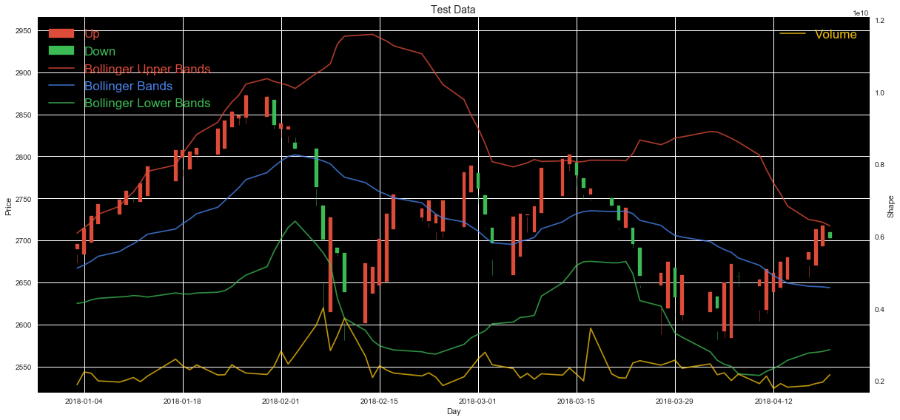


Checking individual data and zoom in the test data according to scale groups of Prices, Price Changes and Indices


```python
def subplot(data, units, size = Page_size):
    axs = data.plot  (figsize =     (size, size), subplots = True, layout = (len(data.columns)/3 + 1, 3), sharex = True)
    for ax, y, title in zip(axs.flatten(), units, data.columns):
        ax.set_xlabel('Day' )
        ax.set_ylabel( y    )
        ax.set_title ( title)

subplot(d[X_base[:-1] + X_stat[:4] + X_base[-1:] +     X_vec          + ['MACD'      ] +  X_stat[-4:]    ],
          8*['Price']              + ['Share'  ] + 5*['Price Change'] + ['Price Diff'] +          4*['%'])
```


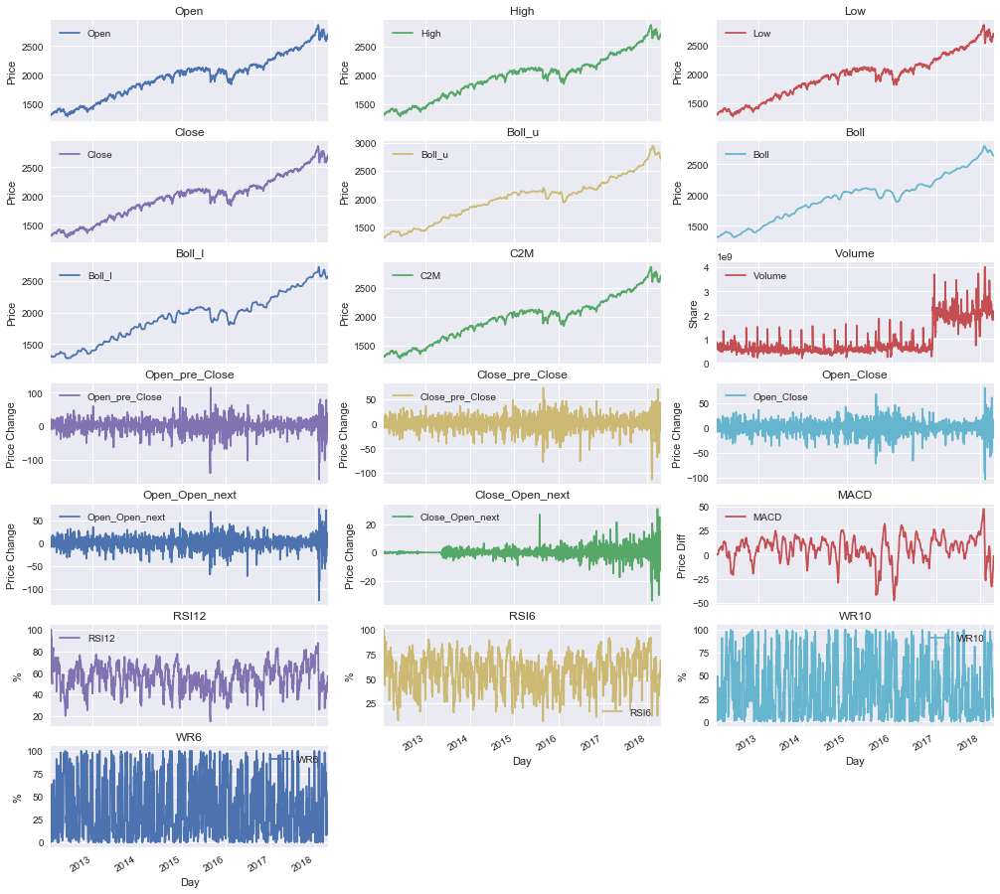


```python
d_test  = d[date_split  :]
def plot( data,     ylabel = '', title = '', secondary_y = None       , secondary_ylabel = '', size = Page_size   ):
    ax  = data.plot       (                  secondary_y = secondary_y, figsize          =   ( size ,      size/2));
    ax        . set_title (      title     )
    ax        . set_ylabel(          ylabel)
    ax        . set_xlabel('Day'           )
    ax2 = ax.twinx()
    ax2       . set_yticks( ()             )
    ax2       . set_ylabel(secondary_ylabel)

plot    ( d_test   [X_base + X_stat[:4 ]]                 , 'Price'            , 'Price Group', 'Volume', 'Share')
plot    ( d_test   [X_vec  + ['Close_Close_next', 'MACD']], 'Price Change/Diff', 'Price Change/Diff Group'       )
plot    ( d_test   [         X_stat[-4:]]                 ,  '%'               , 'Index Group'                   )
```


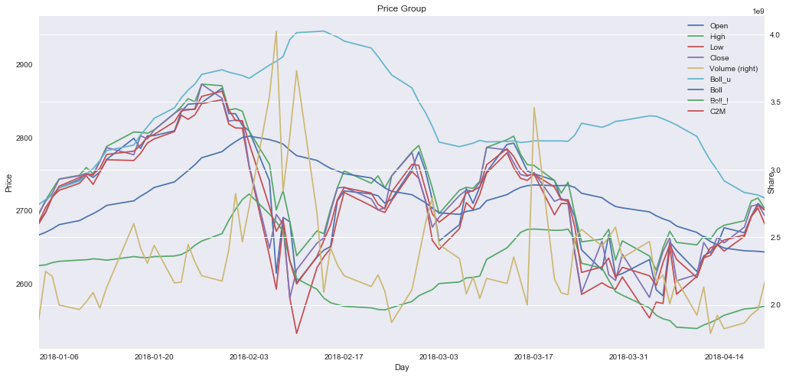


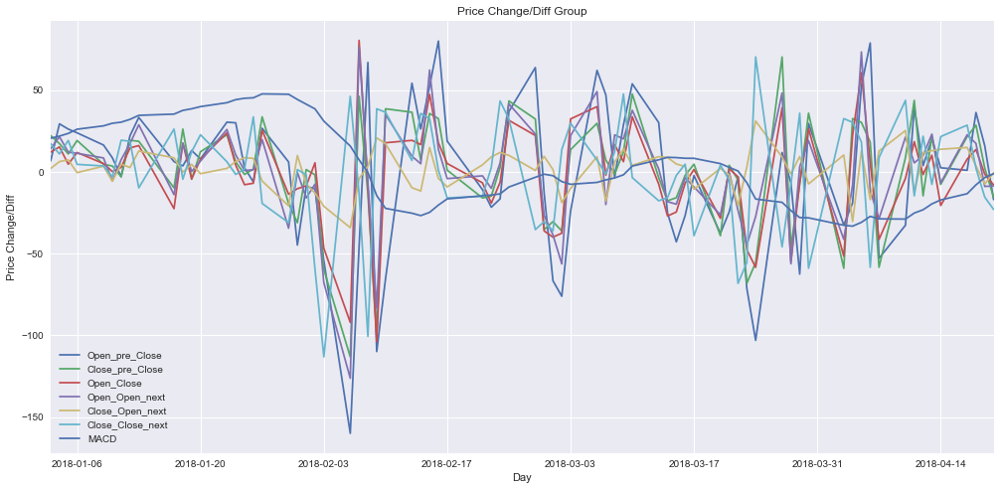


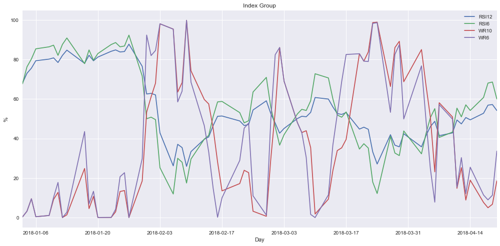


----
## Data Preprocessing
### Log-Transforming the Skewed Continuous Feature


```python
# Try Log-transform for the special feature
log           = ['Volume']
data_log      = data_raw     .copy  ()
data_log[log] = data_log[log].apply (          lambda x: np.log(x  + 1))
hist( concat( [       data_raw[log],
                data_log[log].rename(columns = lambda c: 'log of ' + c)]), ['Share', 'log of Share'], Page_size/2)
```


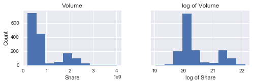


### Normalizing Numerical Features
Log-transformed data with MinMaxScaler is referred because it seems the most normal and cleanest


```python
from sklearn.preprocessing import MinMaxScaler, StandardScaler, RobustScaler
numerical = [c for c in data_raw.columns if c.find('up') < 0]
for data_scale, name in ((data_raw, 'data_raw'), (data_log, 'data_log'),):
    for scaler in (  RobustScaler(), StandardScaler(), MinMaxScaler(),):
        data_scaled                  =                           data_scale .copy()
        data_scaled[numerical]       =      scaler.fit_transform(data_scaled[numerical])
        print '\n[{} with {}]'.format(name, class_name(scaler))
#         display(data_scaled.head(n = 5)) # Show examples of records with scaling applied
        display(data_scaled.tail(n = 5))
        display(data_scaled.describe())
```

    
    [data_raw with RobustScaler]
    


<div>
<style>
    .dataframe thead tr:only-child th {
        text-align: right;
    }

    .dataframe thead th {
        text-align: left;
    }

    .dataframe tbody tr th {
        vertical-align: top;
    }
</style>
<table border="1" class="dataframe">
  <thead>
    <tr style="text-align: right;">
      <th></th>
      <th>Open_pre</th>
      <th>Close_pre</th>
      <th>Open</th>
      <th>High</th>
      <th>Low</th>
      <th>Close</th>
      <th>Volume</th>
      <th>Open_next</th>
      <th>Close_next</th>
      <th>Open_pre_Close</th>
      <th>...</th>
      <th>Open_next_Close_next_up</th>
      <th>Boll_u</th>
      <th>Boll</th>
      <th>Boll_l</th>
      <th>C2M</th>
      <th>MACD</th>
      <th>RSI12</th>
      <th>RSI6</th>
      <th>WR10</th>
      <th>WR6</th>
    </tr>
  </thead>
  <tbody>
    <tr>
      <th>2018-04-14</th>
      <td>1.328292</td>
      <td>1.353248</td>
      <td>1.374339</td>
      <td>1.364489</td>
      <td>1.348007</td>
      <td>1.335405</td>
      <td>3.231152</td>
      <td>1.360532</td>
      <td>1.378828</td>
      <td>0.011452</td>
      <td>...</td>
      <td>True</td>
      <td>1.388207</td>
      <td>1.345022</td>
      <td>1.212198</td>
      <td>1.345859</td>
      <td>-1.611790</td>
      <td>-0.471042</td>
      <td>-0.159583</td>
      <td>-0.197837</td>
      <td>-0.101628</td>
    </tr>
    <tr>
      <th>2018-04-17</th>
      <td>1.375961</td>
      <td>1.337304</td>
      <td>1.360279</td>
      <td>1.377394</td>
      <td>1.389795</td>
      <td>1.380031</td>
      <td>3.344295</td>
      <td>1.407412</td>
      <td>1.437970</td>
      <td>-0.063109</td>
      <td>...</td>
      <td>True</td>
      <td>1.354584</td>
      <td>1.337350</td>
      <td>1.229415</td>
      <td>1.360211</td>
      <td>-1.365479</td>
      <td>-0.276094</td>
      <td>0.098655</td>
      <td>-0.417726</td>
      <td>-0.364632</td>
    </tr>
    <tr>
      <th>2018-04-18</th>
      <td>1.361910</td>
      <td>1.381965</td>
      <td>1.407091</td>
      <td>1.433008</td>
      <td>1.445672</td>
      <td>1.439180</td>
      <td>3.496772</td>
      <td>1.443380</td>
      <td>1.442631</td>
      <td>1.659600</td>
      <td>...</td>
      <td>False</td>
      <td>1.351548</td>
      <td>1.336675</td>
      <td>1.231003</td>
      <td>1.412114</td>
      <td>-1.015258</td>
      <td>-0.035645</td>
      <td>0.385165</td>
      <td>-0.470129</td>
      <td>-0.410741</td>
    </tr>
    <tr>
      <th>2018-04-19</th>
      <td>1.408691</td>
      <td>1.441160</td>
      <td>1.443007</td>
      <td>1.441604</td>
      <td>1.469734</td>
      <td>1.443842</td>
      <td>3.600569</td>
      <td>1.424847</td>
      <td>1.410502</td>
      <td>0.665936</td>
      <td>...</td>
      <td>False</td>
      <td>1.347473</td>
      <td>1.335816</td>
      <td>1.233227</td>
      <td>1.444029</td>
      <td>-0.723368</td>
      <td>-0.016908</td>
      <td>0.406848</td>
      <td>-0.435627</td>
      <td>-0.366788</td>
    </tr>
    <tr>
      <th>2018-04-20</th>
      <td>1.444582</td>
      <td>1.445825</td>
      <td>1.424501</td>
      <td>1.411260</td>
      <td>1.424580</td>
      <td>1.411709</td>
      <td>4.127354</td>
      <td>1.407039</td>
      <td>1.362877</td>
      <td>-0.936404</td>
      <td>...</td>
      <td>False</td>
      <td>1.339077</td>
      <td>1.333872</td>
      <td>1.237471</td>
      <td>1.430289</td>
      <td>-0.572175</td>
      <td>-0.194067</td>
      <td>0.069577</td>
      <td>-0.205290</td>
      <td>0.050500</td>
    </tr>
  </tbody>
</table>
<p>5 rows × 32 columns</p>
</div>


<div>
<style>
    .dataframe thead tr:only-child th {
        text-align: right;
    }

    .dataframe thead th {
        text-align: left;
    }

    .dataframe tbody tr th {
        vertical-align: top;
    }
</style>
<table border="1" class="dataframe">
  <thead>
    <tr style="text-align: right;">
      <th></th>
      <th>Open_pre</th>
      <th>Close_pre</th>
      <th>Open</th>
      <th>High</th>
      <th>Low</th>
      <th>Close</th>
      <th>Volume</th>
      <th>Open_next</th>
      <th>Close_next</th>
      <th>Open_pre_Close</th>
      <th>...</th>
      <th>Open_next_Close_next</th>
      <th>Boll_u</th>
      <th>Boll</th>
      <th>Boll_l</th>
      <th>C2M</th>
      <th>MACD</th>
      <th>RSI12</th>
      <th>RSI6</th>
      <th>WR10</th>
      <th>WR6</th>
    </tr>
  </thead>
  <tbody>
    <tr>
      <th>count</th>
      <td>1560.000000</td>
      <td>1.560000e+03</td>
      <td>1.560000e+03</td>
      <td>1.560000e+03</td>
      <td>1560.000000</td>
      <td>1.560000e+03</td>
      <td>1560.000000</td>
      <td>1.560000e+03</td>
      <td>1560.000000</td>
      <td>1560.000000</td>
      <td>...</td>
      <td>1560.000000</td>
      <td>1560.000000</td>
      <td>1.560000e+03</td>
      <td>1.560000e+03</td>
      <td>1560.000000</td>
      <td>1560.000000</td>
      <td>1560.000000</td>
      <td>1560.000000</td>
      <td>1.560000e+03</td>
      <td>1560.000000</td>
    </tr>
    <tr>
      <th>mean</th>
      <td>-0.080717</td>
      <td>-8.058698e-02</td>
      <td>-8.150063e-02</td>
      <td>-8.312321e-02</td>
      <td>-0.067751</td>
      <td>-7.956791e-02</td>
      <td>0.851869</td>
      <td>-8.152379e-02</td>
      <td>-0.078845</td>
      <td>-0.040772</td>
      <td>...</td>
      <td>-0.033883</td>
      <td>-0.139806</td>
      <td>-7.006202e-02</td>
      <td>-6.273680e-02</td>
      <td>-0.078423</td>
      <td>-0.109495</td>
      <td>-0.073428</td>
      <td>-0.054816</td>
      <td>1.423486e-01</td>
      <td>0.133261</td>
    </tr>
    <tr>
      <th>std</th>
      <td>0.778748</td>
      <td>7.808997e-01</td>
      <td>7.794712e-01</td>
      <td>7.822654e-01</td>
      <td>0.781474</td>
      <td>7.804689e-01</td>
      <td>1.746589</td>
      <td>7.807750e-01</td>
      <td>0.780538</td>
      <td>1.029750</td>
      <td>...</td>
      <td>1.072061</td>
      <td>0.802238</td>
      <td>7.765462e-01</td>
      <td>7.378048e-01</td>
      <td>0.780449</td>
      <td>0.865916</td>
      <td>0.699459</td>
      <td>0.682783</td>
      <td>5.960572e-01</td>
      <td>0.581484</td>
    </tr>
    <tr>
      <th>min</th>
      <td>-1.514939</td>
      <td>-1.520363e+00</td>
      <td>-1.518519e+00</td>
      <td>-1.530609e+00</td>
      <td>-1.516073</td>
      <td>-1.520042e+00</td>
      <td>-1.022797</td>
      <td>-1.522438e+00</td>
      <td>-1.520915</td>
      <td>-7.905214</td>
      <td>...</td>
      <td>-7.804796</td>
      <td>-1.551832</td>
      <td>-1.423742e+00</td>
      <td>-1.356381e+00</td>
      <td>-1.518284</td>
      <td>-3.581232</td>
      <td>-2.500174</td>
      <td>-2.043579</td>
      <td>-5.670563e-01</td>
      <td>-0.578296</td>
    </tr>
    <tr>
      <th>25%</th>
      <td>-0.674715</td>
      <td>-6.757999e-01</td>
      <td>-6.762521e-01</td>
      <td>-6.847147e-01</td>
      <td>-0.660445</td>
      <td>-6.755753e-01</td>
      <td>-0.207693</td>
      <td>-6.774032e-01</td>
      <td>-0.676042</td>
      <td>-0.509503</td>
      <td>...</td>
      <td>-0.489868</td>
      <td>-0.754610</td>
      <td>-6.730555e-01</td>
      <td>-6.568996e-01</td>
      <td>-0.673362</td>
      <td>-0.554690</td>
      <td>-0.562382</td>
      <td>-0.522303</td>
      <td>-4.004108e-01</td>
      <td>-0.397538</td>
    </tr>
    <tr>
      <th>50%</th>
      <td>0.000000</td>
      <td>-2.357123e-16</td>
      <td>2.350550e-16</td>
      <td>-2.354887e-16</td>
      <td>0.000000</td>
      <td>-2.355429e-16</td>
      <td>0.000000</td>
      <td>2.354345e-16</td>
      <td>0.000000</td>
      <td>0.000000</td>
      <td>...</td>
      <td>0.000000</td>
      <td>0.000000</td>
      <td>-2.351906e-16</td>
      <td>-2.268693e-16</td>
      <td>0.000000</td>
      <td>0.000000</td>
      <td>0.000000</td>
      <td>0.000000</td>
      <td>-3.461315e-17</td>
      <td>0.000000</td>
    </tr>
    <tr>
      <th>75%</th>
      <td>0.325285</td>
      <td>3.242001e-01</td>
      <td>3.237479e-01</td>
      <td>3.152853e-01</td>
      <td>0.339555</td>
      <td>3.244247e-01</td>
      <td>0.792307</td>
      <td>3.225968e-01</td>
      <td>0.323958</td>
      <td>0.490497</td>
      <td>...</td>
      <td>0.510132</td>
      <td>0.245390</td>
      <td>3.269445e-01</td>
      <td>3.431004e-01</td>
      <td>0.326638</td>
      <td>0.445310</td>
      <td>0.437618</td>
      <td>0.477697</td>
      <td>5.995892e-01</td>
      <td>0.602462</td>
    </tr>
    <tr>
      <th>max</th>
      <td>1.769237</td>
      <td>1.786337e+00</td>
      <td>1.767882e+00</td>
      <td>1.763445e+00</td>
      <td>1.776962</td>
      <td>1.784090e+00</td>
      <td>8.942246</td>
      <td>1.768725e+00</td>
      <td>1.782840</td>
      <td>5.490984</td>
      <td>...</td>
      <td>5.905559</td>
      <td>1.816224</td>
      <td>1.660872e+00</td>
      <td>1.542407e+00</td>
      <td>1.766673</td>
      <td>2.585324</td>
      <td>1.774432</td>
      <td>1.340469</td>
      <td>1.381667e+00</td>
      <td>1.291573</td>
    </tr>
  </tbody>
</table>
<p>8 rows × 25 columns</p>
</div>


    
    [data_raw with StandardScaler]
    


<div>
<style>
    .dataframe thead tr:only-child th {
        text-align: right;
    }

    .dataframe thead th {
        text-align: left;
    }

    .dataframe tbody tr th {
        vertical-align: top;
    }
</style>
<table border="1" class="dataframe">
  <thead>
    <tr style="text-align: right;">
      <th></th>
      <th>Open_pre</th>
      <th>Close_pre</th>
      <th>Open</th>
      <th>High</th>
      <th>Low</th>
      <th>Close</th>
      <th>Volume</th>
      <th>Open_next</th>
      <th>Close_next</th>
      <th>Open_pre_Close</th>
      <th>...</th>
      <th>Open_next_Close_next_up</th>
      <th>Boll_u</th>
      <th>Boll</th>
      <th>Boll_l</th>
      <th>C2M</th>
      <th>MACD</th>
      <th>RSI12</th>
      <th>RSI6</th>
      <th>WR10</th>
      <th>WR6</th>
    </tr>
  </thead>
  <tbody>
    <tr>
      <th>2018-04-14</th>
      <td>1.809905</td>
      <td>1.836721</td>
      <td>1.868326</td>
      <td>1.851132</td>
      <td>1.812232</td>
      <td>1.813559</td>
      <td>1.362682</td>
      <td>1.847546</td>
      <td>1.868123</td>
      <td>0.050732</td>
      <td>...</td>
      <td>True</td>
      <td>1.905299</td>
      <td>1.822864</td>
      <td>1.728566</td>
      <td>1.825537</td>
      <td>-1.735475</td>
      <td>-0.568642</td>
      <td>-0.153490</td>
      <td>-0.570910</td>
      <td>-0.404076</td>
    </tr>
    <tr>
      <th>2018-04-17</th>
      <td>1.871137</td>
      <td>1.816297</td>
      <td>1.850282</td>
      <td>1.867634</td>
      <td>1.865722</td>
      <td>1.870756</td>
      <td>1.427482</td>
      <td>1.907609</td>
      <td>1.943918</td>
      <td>-0.021699</td>
      <td>...</td>
      <td>True</td>
      <td>1.863374</td>
      <td>1.812981</td>
      <td>1.751909</td>
      <td>1.843932</td>
      <td>-1.450934</td>
      <td>-0.289840</td>
      <td>0.224845</td>
      <td>-0.939933</td>
      <td>-0.856519</td>
    </tr>
    <tr>
      <th>2018-04-18</th>
      <td>1.853089</td>
      <td>1.873506</td>
      <td>1.910358</td>
      <td>1.938751</td>
      <td>1.937247</td>
      <td>1.946567</td>
      <td>1.514810</td>
      <td>1.953690</td>
      <td>1.949892</td>
      <td>1.651778</td>
      <td>...</td>
      <td>False</td>
      <td>1.859588</td>
      <td>1.812111</td>
      <td>1.754061</td>
      <td>1.910458</td>
      <td>-1.046352</td>
      <td>0.054035</td>
      <td>0.644601</td>
      <td>-1.027878</td>
      <td>-0.935840</td>
    </tr>
    <tr>
      <th>2018-04-19</th>
      <td>1.913180</td>
      <td>1.949334</td>
      <td>1.956450</td>
      <td>1.949743</td>
      <td>1.968048</td>
      <td>1.952542</td>
      <td>1.574257</td>
      <td>1.929947</td>
      <td>1.908715</td>
      <td>0.686511</td>
      <td>...</td>
      <td>False</td>
      <td>1.854507</td>
      <td>1.811005</td>
      <td>1.757077</td>
      <td>1.951364</td>
      <td>-0.709156</td>
      <td>0.080830</td>
      <td>0.676368</td>
      <td>-0.969975</td>
      <td>-0.860229</td>
    </tr>
    <tr>
      <th>2018-04-20</th>
      <td>1.959283</td>
      <td>1.955310</td>
      <td>1.932701</td>
      <td>1.910940</td>
      <td>1.910249</td>
      <td>1.911357</td>
      <td>1.875962</td>
      <td>1.907131</td>
      <td>1.847680</td>
      <td>-0.870035</td>
      <td>...</td>
      <td>False</td>
      <td>1.844038</td>
      <td>1.808500</td>
      <td>1.762830</td>
      <td>1.933753</td>
      <td>-0.534496</td>
      <td>-0.172531</td>
      <td>0.182243</td>
      <td>-0.583418</td>
      <td>-0.142372</td>
    </tr>
  </tbody>
</table>
<p>5 rows × 32 columns</p>
</div>


<div>
<style>
    .dataframe thead tr:only-child th {
        text-align: right;
    }

    .dataframe thead th {
        text-align: left;
    }

    .dataframe tbody tr th {
        vertical-align: top;
    }
</style>
<table border="1" class="dataframe">
  <thead>
    <tr style="text-align: right;">
      <th></th>
      <th>Open_pre</th>
      <th>Close_pre</th>
      <th>Open</th>
      <th>High</th>
      <th>Low</th>
      <th>Close</th>
      <th>Volume</th>
      <th>Open_next</th>
      <th>Close_next</th>
      <th>Open_pre_Close</th>
      <th>...</th>
      <th>Open_next_Close_next</th>
      <th>Boll_u</th>
      <th>Boll</th>
      <th>Boll_l</th>
      <th>C2M</th>
      <th>MACD</th>
      <th>RSI12</th>
      <th>RSI6</th>
      <th>WR10</th>
      <th>WR6</th>
    </tr>
  </thead>
  <tbody>
    <tr>
      <th>count</th>
      <td>1.560000e+03</td>
      <td>1.560000e+03</td>
      <td>1.560000e+03</td>
      <td>1.560000e+03</td>
      <td>1.560000e+03</td>
      <td>1.560000e+03</td>
      <td>1.560000e+03</td>
      <td>1.560000e+03</td>
      <td>1.560000e+03</td>
      <td>1.560000e+03</td>
      <td>...</td>
      <td>1.560000e+03</td>
      <td>1.560000e+03</td>
      <td>1.560000e+03</td>
      <td>1.560000e+03</td>
      <td>1.560000e+03</td>
      <td>1.560000e+03</td>
      <td>1.560000e+03</td>
      <td>1.560000e+03</td>
      <td>1.560000e+03</td>
      <td>1.560000e+03</td>
    </tr>
    <tr>
      <th>mean</th>
      <td>-3.333516e-16</td>
      <td>-1.081756e-17</td>
      <td>-1.605553e-16</td>
      <td>-1.337961e-16</td>
      <td>-1.944314e-16</td>
      <td>-2.206212e-16</td>
      <td>-1.353618e-16</td>
      <td>-2.246067e-16</td>
      <td>9.123756e-17</td>
      <td>-9.251859e-19</td>
      <td>...</td>
      <td>-4.270089e-18</td>
      <td>-2.322928e-16</td>
      <td>-3.814612e-16</td>
      <td>-1.682415e-16</td>
      <td>-9.757152e-16</td>
      <td>8.412074e-17</td>
      <td>-3.813367e-16</td>
      <td>-3.949120e-16</td>
      <td>4.697097e-18</td>
      <td>3.592212e-17</td>
    </tr>
    <tr>
      <th>std</th>
      <td>1.000321e+00</td>
      <td>1.000321e+00</td>
      <td>1.000321e+00</td>
      <td>1.000321e+00</td>
      <td>1.000321e+00</td>
      <td>1.000321e+00</td>
      <td>1.000321e+00</td>
      <td>1.000321e+00</td>
      <td>1.000321e+00</td>
      <td>1.000321e+00</td>
      <td>...</td>
      <td>1.000321e+00</td>
      <td>1.000321e+00</td>
      <td>1.000321e+00</td>
      <td>1.000321e+00</td>
      <td>1.000321e+00</td>
      <td>1.000321e+00</td>
      <td>1.000321e+00</td>
      <td>1.000321e+00</td>
      <td>1.000321e+00</td>
      <td>1.000321e+00</td>
    </tr>
    <tr>
      <th>min</th>
      <td>-1.842292e+00</td>
      <td>-1.844331e+00</td>
      <td>-1.844172e+00</td>
      <td>-1.850970e+00</td>
      <td>-1.853915e+00</td>
      <td>-1.846244e+00</td>
      <td>-1.073674e+00</td>
      <td>-1.846085e+00</td>
      <td>-1.848126e+00</td>
      <td>-7.639684e+00</td>
      <td>...</td>
      <td>-7.250898e+00</td>
      <td>-1.760672e+00</td>
      <td>-1.743765e+00</td>
      <td>-1.753932e+00</td>
      <td>-1.845504e+00</td>
      <td>-4.010607e+00</td>
      <td>-3.470577e+00</td>
      <td>-2.913667e+00</td>
      <td>-1.190544e+00</td>
      <td>-1.224083e+00</td>
    </tr>
    <tr>
      <th>25%</th>
      <td>-7.630037e-01</td>
      <td>-7.624587e-01</td>
      <td>-7.632639e-01</td>
      <td>-7.692842e-01</td>
      <td>-7.586741e-01</td>
      <td>-7.638978e-01</td>
      <td>-6.068411e-01</td>
      <td>-7.634343e-01</td>
      <td>-7.653549e-01</td>
      <td>-4.553347e-01</td>
      <td>...</td>
      <td>-4.254713e-01</td>
      <td>-7.666063e-01</td>
      <td>-7.767558e-01</td>
      <td>-8.055699e-01</td>
      <td>-7.625479e-01</td>
      <td>-5.142963e-01</td>
      <td>-6.992711e-01</td>
      <td>-6.848989e-01</td>
      <td>-9.108747e-01</td>
      <td>-9.131269e-01</td>
    </tr>
    <tr>
      <th>50%</th>
      <td>1.036834e-01</td>
      <td>1.032307e-01</td>
      <td>1.045924e-01</td>
      <td>1.062937e-01</td>
      <td>8.672415e-02</td>
      <td>1.019815e-01</td>
      <td>-4.878894e-01</td>
      <td>1.044474e-01</td>
      <td>1.010463e-01</td>
      <td>3.960706e-02</td>
      <td>...</td>
      <td>3.161557e-02</td>
      <td>1.743263e-01</td>
      <td>9.025153e-02</td>
      <td>8.505897e-02</td>
      <td>1.005167e-01</td>
      <td>1.264904e-01</td>
      <td>1.050118e-01</td>
      <td>8.030922e-02</td>
      <td>-2.388936e-01</td>
      <td>-2.292474e-01</td>
    </tr>
    <tr>
      <th>75%</th>
      <td>5.215198e-01</td>
      <td>5.185260e-01</td>
      <td>5.200686e-01</td>
      <td>5.094642e-01</td>
      <td>5.213695e-01</td>
      <td>5.177940e-01</td>
      <td>-3.411299e-02</td>
      <td>5.177551e-01</td>
      <td>5.162238e-01</td>
      <td>5.160862e-01</td>
      <td>...</td>
      <td>5.076104e-01</td>
      <td>4.803061e-01</td>
      <td>5.114104e-01</td>
      <td>5.502369e-01</td>
      <td>5.191761e-01</td>
      <td>6.409200e-01</td>
      <td>7.308646e-01</td>
      <td>7.801658e-01</td>
      <td>7.673546e-01</td>
      <td>8.071620e-01</td>
    </tr>
    <tr>
      <th>max</th>
      <td>2.376310e+00</td>
      <td>2.391502e+00</td>
      <td>2.373372e+00</td>
      <td>2.361297e+00</td>
      <td>2.361312e+00</td>
      <td>2.388635e+00</td>
      <td>4.633586e+00</td>
      <td>2.370520e+00</td>
      <td>2.385897e+00</td>
      <td>5.373664e+00</td>
      <td>...</td>
      <td>5.541985e+00</td>
      <td>2.438999e+00</td>
      <td>2.229731e+00</td>
      <td>2.176265e+00</td>
      <td>2.364903e+00</td>
      <td>3.113099e+00</td>
      <td>2.642691e+00</td>
      <td>2.044183e+00</td>
      <td>2.079861e+00</td>
      <td>1.992631e+00</td>
    </tr>
  </tbody>
</table>
<p>8 rows × 25 columns</p>
</div>


    
    [data_raw with MinMaxScaler]
    


<div>
<style>
    .dataframe thead tr:only-child th {
        text-align: right;
    }

    .dataframe thead th {
        text-align: left;
    }

    .dataframe tbody tr th {
        vertical-align: top;
    }
</style>
<table border="1" class="dataframe">
  <thead>
    <tr style="text-align: right;">
      <th></th>
      <th>Open_pre</th>
      <th>Close_pre</th>
      <th>Open</th>
      <th>High</th>
      <th>Low</th>
      <th>Close</th>
      <th>Volume</th>
      <th>Open_next</th>
      <th>Close_next</th>
      <th>Open_pre_Close</th>
      <th>...</th>
      <th>Open_next_Close_next_up</th>
      <th>Boll_u</th>
      <th>Boll</th>
      <th>Boll_l</th>
      <th>C2M</th>
      <th>MACD</th>
      <th>RSI12</th>
      <th>RSI6</th>
      <th>WR10</th>
      <th>WR6</th>
    </tr>
  </thead>
  <tbody>
    <tr>
      <th>2018-04-14</th>
      <td>0.865736</td>
      <td>0.869027</td>
      <td>0.880251</td>
      <td>0.878886</td>
      <td>0.869739</td>
      <td>0.864205</td>
      <td>0.426887</td>
      <td>0.875973</td>
      <td>0.877711</td>
      <td>0.590964</td>
      <td>...</td>
      <td>True</td>
      <td>0.872919</td>
      <td>0.897605</td>
      <td>0.886087</td>
      <td>0.871897</td>
      <td>0.319375</td>
      <td>0.474695</td>
      <td>0.556729</td>
      <td>0.189467</td>
      <td>0.254921</td>
    </tr>
    <tr>
      <th>2018-04-17</th>
      <td>0.880251</td>
      <td>0.864205</td>
      <td>0.875973</td>
      <td>0.882803</td>
      <td>0.882429</td>
      <td>0.877711</td>
      <td>0.438241</td>
      <td>0.890217</td>
      <td>0.895613</td>
      <td>0.585398</td>
      <td>...</td>
      <td>True</td>
      <td>0.862936</td>
      <td>0.895118</td>
      <td>0.892027</td>
      <td>0.876266</td>
      <td>0.359318</td>
      <td>0.520301</td>
      <td>0.633039</td>
      <td>0.076630</td>
      <td>0.114267</td>
    </tr>
    <tr>
      <th>2018-04-18</th>
      <td>0.875973</td>
      <td>0.877711</td>
      <td>0.890217</td>
      <td>0.899687</td>
      <td>0.899397</td>
      <td>0.895613</td>
      <td>0.453542</td>
      <td>0.901146</td>
      <td>0.897024</td>
      <td>0.713995</td>
      <td>...</td>
      <td>False</td>
      <td>0.862034</td>
      <td>0.894899</td>
      <td>0.892574</td>
      <td>0.892066</td>
      <td>0.416111</td>
      <td>0.576551</td>
      <td>0.717704</td>
      <td>0.049739</td>
      <td>0.089608</td>
    </tr>
    <tr>
      <th>2018-04-19</th>
      <td>0.890217</td>
      <td>0.895613</td>
      <td>0.901146</td>
      <td>0.902296</td>
      <td>0.906704</td>
      <td>0.897024</td>
      <td>0.463958</td>
      <td>0.895515</td>
      <td>0.887298</td>
      <td>0.639820</td>
      <td>...</td>
      <td>False</td>
      <td>0.860824</td>
      <td>0.894620</td>
      <td>0.893342</td>
      <td>0.901782</td>
      <td>0.463446</td>
      <td>0.580934</td>
      <td>0.724111</td>
      <td>0.067444</td>
      <td>0.113113</td>
    </tr>
    <tr>
      <th>2018-04-20</th>
      <td>0.901146</td>
      <td>0.897024</td>
      <td>0.895515</td>
      <td>0.893084</td>
      <td>0.892992</td>
      <td>0.887298</td>
      <td>0.516822</td>
      <td>0.890104</td>
      <td>0.872883</td>
      <td>0.520208</td>
      <td>...</td>
      <td>False</td>
      <td>0.858332</td>
      <td>0.893990</td>
      <td>0.894805</td>
      <td>0.897599</td>
      <td>0.487964</td>
      <td>0.539490</td>
      <td>0.624446</td>
      <td>0.185642</td>
      <td>0.336278</td>
    </tr>
  </tbody>
</table>
<p>5 rows × 32 columns</p>
</div>


<div>
<style>
    .dataframe thead tr:only-child th {
        text-align: right;
    }

    .dataframe thead th {
        text-align: left;
    }

    .dataframe tbody tr th {
        vertical-align: top;
    }
</style>
<table border="1" class="dataframe">
  <thead>
    <tr style="text-align: right;">
      <th></th>
      <th>Open_pre</th>
      <th>Close_pre</th>
      <th>Open</th>
      <th>High</th>
      <th>Low</th>
      <th>Close</th>
      <th>Volume</th>
      <th>Open_next</th>
      <th>Close_next</th>
      <th>Open_pre_Close</th>
      <th>...</th>
      <th>Open_next_Close_next</th>
      <th>Boll_u</th>
      <th>Boll</th>
      <th>Boll_l</th>
      <th>C2M</th>
      <th>MACD</th>
      <th>RSI12</th>
      <th>RSI6</th>
      <th>WR10</th>
      <th>WR6</th>
    </tr>
  </thead>
  <tbody>
    <tr>
      <th>count</th>
      <td>1560.000000</td>
      <td>1560.000000</td>
      <td>1560.000000</td>
      <td>1560.000000</td>
      <td>1560.000000</td>
      <td>1560.000000</td>
      <td>1560.000000</td>
      <td>1560.000000</td>
      <td>1560.000000</td>
      <td>1560.000000</td>
      <td>...</td>
      <td>1560.000000</td>
      <td>1560.000000</td>
      <td>1560.000000</td>
      <td>1560.000000</td>
      <td>1560.000000</td>
      <td>1560.000000</td>
      <td>1560.000000</td>
      <td>1560.000000</td>
      <td>1560.000000</td>
      <td>1560.000000</td>
    </tr>
    <tr>
      <th>mean</th>
      <td>0.436707</td>
      <td>0.435412</td>
      <td>0.437262</td>
      <td>0.439424</td>
      <td>0.439814</td>
      <td>0.435961</td>
      <td>0.188124</td>
      <td>0.437813</td>
      <td>0.436494</td>
      <td>0.587065</td>
      <td>...</td>
      <td>0.566792</td>
      <td>0.419240</td>
      <td>0.438849</td>
      <td>0.446271</td>
      <td>0.438320</td>
      <td>0.562994</td>
      <td>0.567712</td>
      <td>0.587688</td>
      <td>0.364036</td>
      <td>0.380538</td>
    </tr>
    <tr>
      <th>std</th>
      <td>0.237121</td>
      <td>0.236157</td>
      <td>0.237181</td>
      <td>0.237478</td>
      <td>0.237311</td>
      <td>0.236210</td>
      <td>0.175272</td>
      <td>0.237234</td>
      <td>0.236258</td>
      <td>0.076869</td>
      <td>...</td>
      <td>0.078194</td>
      <td>0.238190</td>
      <td>0.251748</td>
      <td>0.254522</td>
      <td>0.237583</td>
      <td>0.140421</td>
      <td>0.163631</td>
      <td>0.201765</td>
      <td>0.305871</td>
      <td>0.310976</td>
    </tr>
    <tr>
      <th>min</th>
      <td>0.000000</td>
      <td>0.000000</td>
      <td>0.000000</td>
      <td>0.000000</td>
      <td>0.000000</td>
      <td>0.000000</td>
      <td>0.000000</td>
      <td>0.000000</td>
      <td>0.000000</td>
      <td>0.000000</td>
      <td>...</td>
      <td>0.000000</td>
      <td>0.000000</td>
      <td>0.000000</td>
      <td>0.000000</td>
      <td>0.000000</td>
      <td>0.000000</td>
      <td>0.000000</td>
      <td>0.000000</td>
      <td>0.000000</td>
      <td>0.000000</td>
    </tr>
    <tr>
      <th>25%</th>
      <td>0.255840</td>
      <td>0.255410</td>
      <td>0.256288</td>
      <td>0.256794</td>
      <td>0.259830</td>
      <td>0.255579</td>
      <td>0.081796</td>
      <td>0.256759</td>
      <td>0.255731</td>
      <td>0.552075</td>
      <td>...</td>
      <td>0.533533</td>
      <td>0.236701</td>
      <td>0.243365</td>
      <td>0.241301</td>
      <td>0.257209</td>
      <td>0.490799</td>
      <td>0.453326</td>
      <td>0.449543</td>
      <td>0.085515</td>
      <td>0.096669</td>
    </tr>
    <tr>
      <th>50%</th>
      <td>0.461284</td>
      <td>0.459783</td>
      <td>0.462061</td>
      <td>0.464658</td>
      <td>0.460388</td>
      <td>0.460043</td>
      <td>0.102639</td>
      <td>0.462584</td>
      <td>0.460359</td>
      <td>0.590109</td>
      <td>...</td>
      <td>0.569263</td>
      <td>0.460750</td>
      <td>0.461562</td>
      <td>0.467913</td>
      <td>0.462193</td>
      <td>0.580751</td>
      <td>0.584890</td>
      <td>0.603886</td>
      <td>0.290989</td>
      <td>0.309271</td>
    </tr>
    <tr>
      <th>75%</th>
      <td>0.560331</td>
      <td>0.557826</td>
      <td>0.560573</td>
      <td>0.560371</td>
      <td>0.563501</td>
      <td>0.558230</td>
      <td>0.182147</td>
      <td>0.560603</td>
      <td>0.558417</td>
      <td>0.626723</td>
      <td>...</td>
      <td>0.606471</td>
      <td>0.533608</td>
      <td>0.567554</td>
      <td>0.586273</td>
      <td>0.561627</td>
      <td>0.652964</td>
      <td>0.687266</td>
      <td>0.745047</td>
      <td>0.598672</td>
      <td>0.631466</td>
    </tr>
    <tr>
      <th>max</th>
      <td>1.000000</td>
      <td>1.000000</td>
      <td>1.000000</td>
      <td>1.000000</td>
      <td>1.000000</td>
      <td>1.000000</td>
      <td>1.000000</td>
      <td>1.000000</td>
      <td>1.000000</td>
      <td>1.000000</td>
      <td>...</td>
      <td>1.000000</td>
      <td>1.000000</td>
      <td>1.000000</td>
      <td>1.000000</td>
      <td>1.000000</td>
      <td>1.000000</td>
      <td>1.000000</td>
      <td>1.000000</td>
      <td>1.000000</td>
      <td>1.000000</td>
    </tr>
  </tbody>
</table>
<p>8 rows × 25 columns</p>
</div>


    
    [data_log with RobustScaler]
    


<div>
<style>
    .dataframe thead tr:only-child th {
        text-align: right;
    }

    .dataframe thead th {
        text-align: left;
    }

    .dataframe tbody tr th {
        vertical-align: top;
    }
</style>
<table border="1" class="dataframe">
  <thead>
    <tr style="text-align: right;">
      <th></th>
      <th>Open_pre</th>
      <th>Close_pre</th>
      <th>Open</th>
      <th>High</th>
      <th>Low</th>
      <th>Close</th>
      <th>Volume</th>
      <th>Open_next</th>
      <th>Close_next</th>
      <th>Open_pre_Close</th>
      <th>...</th>
      <th>Open_next_Close_next_up</th>
      <th>Boll_u</th>
      <th>Boll</th>
      <th>Boll_l</th>
      <th>C2M</th>
      <th>MACD</th>
      <th>RSI12</th>
      <th>RSI6</th>
      <th>WR10</th>
      <th>WR6</th>
    </tr>
  </thead>
  <tbody>
    <tr>
      <th>2018-04-14</th>
      <td>1.328292</td>
      <td>1.353248</td>
      <td>1.374339</td>
      <td>1.364489</td>
      <td>1.348007</td>
      <td>1.335405</td>
      <td>2.004301</td>
      <td>1.360532</td>
      <td>1.378828</td>
      <td>0.011452</td>
      <td>...</td>
      <td>True</td>
      <td>1.388207</td>
      <td>1.345022</td>
      <td>1.212198</td>
      <td>1.345859</td>
      <td>-1.611790</td>
      <td>-0.471042</td>
      <td>-0.159583</td>
      <td>-0.197837</td>
      <td>-0.101628</td>
    </tr>
    <tr>
      <th>2018-04-17</th>
      <td>1.375961</td>
      <td>1.337304</td>
      <td>1.360279</td>
      <td>1.377394</td>
      <td>1.389795</td>
      <td>1.380031</td>
      <td>2.045537</td>
      <td>1.407412</td>
      <td>1.437970</td>
      <td>-0.063109</td>
      <td>...</td>
      <td>True</td>
      <td>1.354584</td>
      <td>1.337350</td>
      <td>1.229415</td>
      <td>1.360211</td>
      <td>-1.365479</td>
      <td>-0.276094</td>
      <td>0.098655</td>
      <td>-0.417726</td>
      <td>-0.364632</td>
    </tr>
    <tr>
      <th>2018-04-18</th>
      <td>1.361910</td>
      <td>1.381965</td>
      <td>1.407091</td>
      <td>1.433008</td>
      <td>1.445672</td>
      <td>1.439180</td>
      <td>2.099612</td>
      <td>1.443380</td>
      <td>1.442631</td>
      <td>1.659600</td>
      <td>...</td>
      <td>False</td>
      <td>1.351548</td>
      <td>1.336675</td>
      <td>1.231003</td>
      <td>1.412114</td>
      <td>-1.015258</td>
      <td>-0.035645</td>
      <td>0.385165</td>
      <td>-0.470129</td>
      <td>-0.410741</td>
    </tr>
    <tr>
      <th>2018-04-19</th>
      <td>1.408691</td>
      <td>1.441160</td>
      <td>1.443007</td>
      <td>1.441604</td>
      <td>1.469734</td>
      <td>1.443842</td>
      <td>2.135486</td>
      <td>1.424847</td>
      <td>1.410502</td>
      <td>0.665936</td>
      <td>...</td>
      <td>False</td>
      <td>1.347473</td>
      <td>1.335816</td>
      <td>1.233227</td>
      <td>1.444029</td>
      <td>-0.723368</td>
      <td>-0.016908</td>
      <td>0.406848</td>
      <td>-0.435627</td>
      <td>-0.366788</td>
    </tr>
    <tr>
      <th>2018-04-20</th>
      <td>1.444582</td>
      <td>1.445825</td>
      <td>1.424501</td>
      <td>1.411260</td>
      <td>1.424580</td>
      <td>1.411709</td>
      <td>2.306984</td>
      <td>1.407039</td>
      <td>1.362877</td>
      <td>-0.936404</td>
      <td>...</td>
      <td>False</td>
      <td>1.339077</td>
      <td>1.333872</td>
      <td>1.237471</td>
      <td>1.430289</td>
      <td>-0.572175</td>
      <td>-0.194067</td>
      <td>0.069577</td>
      <td>-0.205290</td>
      <td>0.050500</td>
    </tr>
  </tbody>
</table>
<p>5 rows × 32 columns</p>
</div>


<div>
<style>
    .dataframe thead tr:only-child th {
        text-align: right;
    }

    .dataframe thead th {
        text-align: left;
    }

    .dataframe tbody tr th {
        vertical-align: top;
    }
</style>
<table border="1" class="dataframe">
  <thead>
    <tr style="text-align: right;">
      <th></th>
      <th>Open_pre</th>
      <th>Close_pre</th>
      <th>Open</th>
      <th>High</th>
      <th>Low</th>
      <th>Close</th>
      <th>Volume</th>
      <th>Open_next</th>
      <th>Close_next</th>
      <th>Open_pre_Close</th>
      <th>...</th>
      <th>Open_next_Close_next</th>
      <th>Boll_u</th>
      <th>Boll</th>
      <th>Boll_l</th>
      <th>C2M</th>
      <th>MACD</th>
      <th>RSI12</th>
      <th>RSI6</th>
      <th>WR10</th>
      <th>WR6</th>
    </tr>
  </thead>
  <tbody>
    <tr>
      <th>count</th>
      <td>1560.000000</td>
      <td>1.560000e+03</td>
      <td>1.560000e+03</td>
      <td>1.560000e+03</td>
      <td>1560.000000</td>
      <td>1.560000e+03</td>
      <td>1.560000e+03</td>
      <td>1.560000e+03</td>
      <td>1560.000000</td>
      <td>1560.000000</td>
      <td>...</td>
      <td>1560.000000</td>
      <td>1560.000000</td>
      <td>1.560000e+03</td>
      <td>1.560000e+03</td>
      <td>1560.000000</td>
      <td>1560.000000</td>
      <td>1560.000000</td>
      <td>1560.000000</td>
      <td>1.560000e+03</td>
      <td>1560.000000</td>
    </tr>
    <tr>
      <th>mean</th>
      <td>-0.080717</td>
      <td>-8.058698e-02</td>
      <td>-8.150063e-02</td>
      <td>-8.312321e-02</td>
      <td>-0.067751</td>
      <td>-7.956791e-02</td>
      <td>4.283287e-01</td>
      <td>-8.152379e-02</td>
      <td>-0.078845</td>
      <td>-0.040772</td>
      <td>...</td>
      <td>-0.033883</td>
      <td>-0.139806</td>
      <td>-7.006202e-02</td>
      <td>-6.273680e-02</td>
      <td>-0.078423</td>
      <td>-0.109495</td>
      <td>-0.073428</td>
      <td>-0.054816</td>
      <td>1.423486e-01</td>
      <td>0.133261</td>
    </tr>
    <tr>
      <th>std</th>
      <td>0.778748</td>
      <td>7.808997e-01</td>
      <td>7.794712e-01</td>
      <td>7.822654e-01</td>
      <td>0.781474</td>
      <td>7.804689e-01</td>
      <td>1.032668e+00</td>
      <td>7.807750e-01</td>
      <td>0.780538</td>
      <td>1.029750</td>
      <td>...</td>
      <td>1.072061</td>
      <td>0.802238</td>
      <td>7.765462e-01</td>
      <td>7.378048e-01</td>
      <td>0.780449</td>
      <td>0.865916</td>
      <td>0.699459</td>
      <td>0.682783</td>
      <td>5.960572e-01</td>
      <td>0.581484</td>
    </tr>
    <tr>
      <th>min</th>
      <td>-1.514939</td>
      <td>-1.520363e+00</td>
      <td>-1.518519e+00</td>
      <td>-1.530609e+00</td>
      <td>-1.516073</td>
      <td>-1.520042e+00</td>
      <td>-1.998181e+00</td>
      <td>-1.522438e+00</td>
      <td>-1.520915</td>
      <td>-7.905214</td>
      <td>...</td>
      <td>-7.804796</td>
      <td>-1.551832</td>
      <td>-1.423742e+00</td>
      <td>-1.356381e+00</td>
      <td>-1.518284</td>
      <td>-3.581232</td>
      <td>-2.500174</td>
      <td>-2.043579</td>
      <td>-5.670563e-01</td>
      <td>-0.578296</td>
    </tr>
    <tr>
      <th>25%</th>
      <td>-0.674715</td>
      <td>-6.757999e-01</td>
      <td>-6.762521e-01</td>
      <td>-6.847147e-01</td>
      <td>-0.660445</td>
      <td>-6.755753e-01</td>
      <td>-2.600367e-01</td>
      <td>-6.774032e-01</td>
      <td>-0.676042</td>
      <td>-0.509503</td>
      <td>...</td>
      <td>-0.489868</td>
      <td>-0.754610</td>
      <td>-6.730555e-01</td>
      <td>-6.568996e-01</td>
      <td>-0.673362</td>
      <td>-0.554690</td>
      <td>-0.562382</td>
      <td>-0.522303</td>
      <td>-4.004108e-01</td>
      <td>-0.397538</td>
    </tr>
    <tr>
      <th>50%</th>
      <td>0.000000</td>
      <td>-2.357123e-16</td>
      <td>2.350550e-16</td>
      <td>-2.354887e-16</td>
      <td>0.000000</td>
      <td>-2.355429e-16</td>
      <td>-3.099571e-15</td>
      <td>2.354345e-16</td>
      <td>0.000000</td>
      <td>0.000000</td>
      <td>...</td>
      <td>0.000000</td>
      <td>0.000000</td>
      <td>-2.351906e-16</td>
      <td>-2.268693e-16</td>
      <td>0.000000</td>
      <td>0.000000</td>
      <td>0.000000</td>
      <td>0.000000</td>
      <td>-3.461315e-17</td>
      <td>0.000000</td>
    </tr>
    <tr>
      <th>75%</th>
      <td>0.325285</td>
      <td>3.242001e-01</td>
      <td>3.237479e-01</td>
      <td>3.152853e-01</td>
      <td>0.339555</td>
      <td>3.244247e-01</td>
      <td>7.399633e-01</td>
      <td>3.225968e-01</td>
      <td>0.323958</td>
      <td>0.490497</td>
      <td>...</td>
      <td>0.510132</td>
      <td>0.245390</td>
      <td>3.269445e-01</td>
      <td>3.431004e-01</td>
      <td>0.326638</td>
      <td>0.445310</td>
      <td>0.437618</td>
      <td>0.477697</td>
      <td>5.995892e-01</td>
      <td>0.602462</td>
    </tr>
    <tr>
      <th>max</th>
      <td>1.769237</td>
      <td>1.786337e+00</td>
      <td>1.767882e+00</td>
      <td>1.763445e+00</td>
      <td>1.776962</td>
      <td>1.784090e+00</td>
      <td>3.385702e+00</td>
      <td>1.768725e+00</td>
      <td>1.782840</td>
      <td>5.490984</td>
      <td>...</td>
      <td>5.905559</td>
      <td>1.816224</td>
      <td>1.660872e+00</td>
      <td>1.542407e+00</td>
      <td>1.766673</td>
      <td>2.585324</td>
      <td>1.774432</td>
      <td>1.340469</td>
      <td>1.381667e+00</td>
      <td>1.291573</td>
    </tr>
  </tbody>
</table>
<p>8 rows × 25 columns</p>
</div>


    
    [data_log with StandardScaler]
    


<div>
<style>
    .dataframe thead tr:only-child th {
        text-align: right;
    }

    .dataframe thead th {
        text-align: left;
    }

    .dataframe tbody tr th {
        vertical-align: top;
    }
</style>
<table border="1" class="dataframe">
  <thead>
    <tr style="text-align: right;">
      <th></th>
      <th>Open_pre</th>
      <th>Close_pre</th>
      <th>Open</th>
      <th>High</th>
      <th>Low</th>
      <th>Close</th>
      <th>Volume</th>
      <th>Open_next</th>
      <th>Close_next</th>
      <th>Open_pre_Close</th>
      <th>...</th>
      <th>Open_next_Close_next_up</th>
      <th>Boll_u</th>
      <th>Boll</th>
      <th>Boll_l</th>
      <th>C2M</th>
      <th>MACD</th>
      <th>RSI12</th>
      <th>RSI6</th>
      <th>WR10</th>
      <th>WR6</th>
    </tr>
  </thead>
  <tbody>
    <tr>
      <th>2018-04-14</th>
      <td>1.809905</td>
      <td>1.836721</td>
      <td>1.868326</td>
      <td>1.851132</td>
      <td>1.812232</td>
      <td>1.813559</td>
      <td>1.526606</td>
      <td>1.847546</td>
      <td>1.868123</td>
      <td>0.050732</td>
      <td>...</td>
      <td>True</td>
      <td>1.905299</td>
      <td>1.822864</td>
      <td>1.728566</td>
      <td>1.825537</td>
      <td>-1.735475</td>
      <td>-0.568642</td>
      <td>-0.153490</td>
      <td>-0.570910</td>
      <td>-0.404076</td>
    </tr>
    <tr>
      <th>2018-04-17</th>
      <td>1.871137</td>
      <td>1.816297</td>
      <td>1.850282</td>
      <td>1.867634</td>
      <td>1.865722</td>
      <td>1.870756</td>
      <td>1.566550</td>
      <td>1.907609</td>
      <td>1.943918</td>
      <td>-0.021699</td>
      <td>...</td>
      <td>True</td>
      <td>1.863374</td>
      <td>1.812981</td>
      <td>1.751909</td>
      <td>1.843932</td>
      <td>-1.450934</td>
      <td>-0.289840</td>
      <td>0.224845</td>
      <td>-0.939933</td>
      <td>-0.856519</td>
    </tr>
    <tr>
      <th>2018-04-18</th>
      <td>1.853089</td>
      <td>1.873506</td>
      <td>1.910358</td>
      <td>1.938751</td>
      <td>1.937247</td>
      <td>1.946567</td>
      <td>1.618931</td>
      <td>1.953690</td>
      <td>1.949892</td>
      <td>1.651778</td>
      <td>...</td>
      <td>False</td>
      <td>1.859588</td>
      <td>1.812111</td>
      <td>1.754061</td>
      <td>1.910458</td>
      <td>-1.046352</td>
      <td>0.054035</td>
      <td>0.644601</td>
      <td>-1.027878</td>
      <td>-0.935840</td>
    </tr>
    <tr>
      <th>2018-04-19</th>
      <td>1.913180</td>
      <td>1.949334</td>
      <td>1.956450</td>
      <td>1.949743</td>
      <td>1.968048</td>
      <td>1.952542</td>
      <td>1.653681</td>
      <td>1.929947</td>
      <td>1.908715</td>
      <td>0.686511</td>
      <td>...</td>
      <td>False</td>
      <td>1.854507</td>
      <td>1.811005</td>
      <td>1.757077</td>
      <td>1.951364</td>
      <td>-0.709156</td>
      <td>0.080830</td>
      <td>0.676368</td>
      <td>-0.969975</td>
      <td>-0.860229</td>
    </tr>
    <tr>
      <th>2018-04-20</th>
      <td>1.959283</td>
      <td>1.955310</td>
      <td>1.932701</td>
      <td>1.910940</td>
      <td>1.910249</td>
      <td>1.911357</td>
      <td>1.819808</td>
      <td>1.907131</td>
      <td>1.847680</td>
      <td>-0.870035</td>
      <td>...</td>
      <td>False</td>
      <td>1.844038</td>
      <td>1.808500</td>
      <td>1.762830</td>
      <td>1.933753</td>
      <td>-0.534496</td>
      <td>-0.172531</td>
      <td>0.182243</td>
      <td>-0.583418</td>
      <td>-0.142372</td>
    </tr>
  </tbody>
</table>
<p>5 rows × 32 columns</p>
</div>


<div>
<style>
    .dataframe thead tr:only-child th {
        text-align: right;
    }

    .dataframe thead th {
        text-align: left;
    }

    .dataframe tbody tr th {
        vertical-align: top;
    }
</style>
<table border="1" class="dataframe">
  <thead>
    <tr style="text-align: right;">
      <th></th>
      <th>Open_pre</th>
      <th>Close_pre</th>
      <th>Open</th>
      <th>High</th>
      <th>Low</th>
      <th>Close</th>
      <th>Volume</th>
      <th>Open_next</th>
      <th>Close_next</th>
      <th>Open_pre_Close</th>
      <th>...</th>
      <th>Open_next_Close_next</th>
      <th>Boll_u</th>
      <th>Boll</th>
      <th>Boll_l</th>
      <th>C2M</th>
      <th>MACD</th>
      <th>RSI12</th>
      <th>RSI6</th>
      <th>WR10</th>
      <th>WR6</th>
    </tr>
  </thead>
  <tbody>
    <tr>
      <th>count</th>
      <td>1.560000e+03</td>
      <td>1.560000e+03</td>
      <td>1.560000e+03</td>
      <td>1.560000e+03</td>
      <td>1.560000e+03</td>
      <td>1.560000e+03</td>
      <td>1.560000e+03</td>
      <td>1.560000e+03</td>
      <td>1.560000e+03</td>
      <td>1.560000e+03</td>
      <td>...</td>
      <td>1.560000e+03</td>
      <td>1.560000e+03</td>
      <td>1.560000e+03</td>
      <td>1.560000e+03</td>
      <td>1.560000e+03</td>
      <td>1.560000e+03</td>
      <td>1.560000e+03</td>
      <td>1.560000e+03</td>
      <td>1.560000e+03</td>
      <td>1.560000e+03</td>
    </tr>
    <tr>
      <th>mean</th>
      <td>-3.333516e-16</td>
      <td>-1.081756e-17</td>
      <td>-1.605553e-16</td>
      <td>-1.337961e-16</td>
      <td>-1.944314e-16</td>
      <td>-2.206212e-16</td>
      <td>1.801977e-15</td>
      <td>-2.246067e-16</td>
      <td>9.123756e-17</td>
      <td>-9.251859e-19</td>
      <td>...</td>
      <td>-4.270089e-18</td>
      <td>-2.322928e-16</td>
      <td>-3.814612e-16</td>
      <td>-1.682415e-16</td>
      <td>-9.757152e-16</td>
      <td>8.412074e-17</td>
      <td>-3.813367e-16</td>
      <td>-3.949120e-16</td>
      <td>4.697097e-18</td>
      <td>3.592212e-17</td>
    </tr>
    <tr>
      <th>std</th>
      <td>1.000321e+00</td>
      <td>1.000321e+00</td>
      <td>1.000321e+00</td>
      <td>1.000321e+00</td>
      <td>1.000321e+00</td>
      <td>1.000321e+00</td>
      <td>1.000321e+00</td>
      <td>1.000321e+00</td>
      <td>1.000321e+00</td>
      <td>1.000321e+00</td>
      <td>...</td>
      <td>1.000321e+00</td>
      <td>1.000321e+00</td>
      <td>1.000321e+00</td>
      <td>1.000321e+00</td>
      <td>1.000321e+00</td>
      <td>1.000321e+00</td>
      <td>1.000321e+00</td>
      <td>1.000321e+00</td>
      <td>1.000321e+00</td>
      <td>1.000321e+00</td>
    </tr>
    <tr>
      <th>min</th>
      <td>-1.842292e+00</td>
      <td>-1.844331e+00</td>
      <td>-1.844172e+00</td>
      <td>-1.850970e+00</td>
      <td>-1.853915e+00</td>
      <td>-1.846244e+00</td>
      <td>-2.350500e+00</td>
      <td>-1.846085e+00</td>
      <td>-1.848126e+00</td>
      <td>-7.639684e+00</td>
      <td>...</td>
      <td>-7.250898e+00</td>
      <td>-1.760672e+00</td>
      <td>-1.743765e+00</td>
      <td>-1.753932e+00</td>
      <td>-1.845504e+00</td>
      <td>-4.010607e+00</td>
      <td>-3.470577e+00</td>
      <td>-2.913667e+00</td>
      <td>-1.190544e+00</td>
      <td>-1.224083e+00</td>
    </tr>
    <tr>
      <th>25%</th>
      <td>-7.630037e-01</td>
      <td>-7.624587e-01</td>
      <td>-7.632639e-01</td>
      <td>-7.692842e-01</td>
      <td>-7.586741e-01</td>
      <td>-7.638978e-01</td>
      <td>-6.668028e-01</td>
      <td>-7.634343e-01</td>
      <td>-7.653549e-01</td>
      <td>-4.553347e-01</td>
      <td>...</td>
      <td>-4.254713e-01</td>
      <td>-7.666063e-01</td>
      <td>-7.767558e-01</td>
      <td>-8.055699e-01</td>
      <td>-7.625479e-01</td>
      <td>-5.142963e-01</td>
      <td>-6.992711e-01</td>
      <td>-6.848989e-01</td>
      <td>-9.108747e-01</td>
      <td>-9.131269e-01</td>
    </tr>
    <tr>
      <th>50%</th>
      <td>1.036834e-01</td>
      <td>1.032307e-01</td>
      <td>1.045924e-01</td>
      <td>1.062937e-01</td>
      <td>8.672415e-02</td>
      <td>1.019815e-01</td>
      <td>-4.149116e-01</td>
      <td>1.044474e-01</td>
      <td>1.010463e-01</td>
      <td>3.960706e-02</td>
      <td>...</td>
      <td>3.161557e-02</td>
      <td>1.743263e-01</td>
      <td>9.025153e-02</td>
      <td>8.505897e-02</td>
      <td>1.005167e-01</td>
      <td>1.264904e-01</td>
      <td>1.050118e-01</td>
      <td>8.030922e-02</td>
      <td>-2.388936e-01</td>
      <td>-2.292474e-01</td>
    </tr>
    <tr>
      <th>75%</th>
      <td>5.215198e-01</td>
      <td>5.185260e-01</td>
      <td>5.200686e-01</td>
      <td>5.094642e-01</td>
      <td>5.213695e-01</td>
      <td>5.177940e-01</td>
      <td>3.018728e-01</td>
      <td>5.177551e-01</td>
      <td>5.162238e-01</td>
      <td>5.160862e-01</td>
      <td>...</td>
      <td>5.076104e-01</td>
      <td>4.803061e-01</td>
      <td>5.114104e-01</td>
      <td>5.502369e-01</td>
      <td>5.191761e-01</td>
      <td>6.409200e-01</td>
      <td>7.308646e-01</td>
      <td>7.801658e-01</td>
      <td>7.673546e-01</td>
      <td>8.071620e-01</td>
    </tr>
    <tr>
      <th>max</th>
      <td>2.376310e+00</td>
      <td>2.391502e+00</td>
      <td>2.373372e+00</td>
      <td>2.361297e+00</td>
      <td>2.361312e+00</td>
      <td>2.388635e+00</td>
      <td>2.864736e+00</td>
      <td>2.370520e+00</td>
      <td>2.385897e+00</td>
      <td>5.373664e+00</td>
      <td>...</td>
      <td>5.541985e+00</td>
      <td>2.438999e+00</td>
      <td>2.229731e+00</td>
      <td>2.176265e+00</td>
      <td>2.364903e+00</td>
      <td>3.113099e+00</td>
      <td>2.642691e+00</td>
      <td>2.044183e+00</td>
      <td>2.079861e+00</td>
      <td>1.992631e+00</td>
    </tr>
  </tbody>
</table>
<p>8 rows × 25 columns</p>
</div>


    
    [data_log with MinMaxScaler]
    


<div>
<style>
    .dataframe thead tr:only-child th {
        text-align: right;
    }

    .dataframe thead th {
        text-align: left;
    }

    .dataframe tbody tr th {
        vertical-align: top;
    }
</style>
<table border="1" class="dataframe">
  <thead>
    <tr style="text-align: right;">
      <th></th>
      <th>Open_pre</th>
      <th>Close_pre</th>
      <th>Open</th>
      <th>High</th>
      <th>Low</th>
      <th>Close</th>
      <th>Volume</th>
      <th>Open_next</th>
      <th>Close_next</th>
      <th>Open_pre_Close</th>
      <th>...</th>
      <th>Open_next_Close_next_up</th>
      <th>Boll_u</th>
      <th>Boll</th>
      <th>Boll_l</th>
      <th>C2M</th>
      <th>MACD</th>
      <th>RSI12</th>
      <th>RSI6</th>
      <th>WR10</th>
      <th>WR6</th>
    </tr>
  </thead>
  <tbody>
    <tr>
      <th>2018-04-14</th>
      <td>0.865736</td>
      <td>0.869027</td>
      <td>0.880251</td>
      <td>0.878886</td>
      <td>0.869739</td>
      <td>0.864205</td>
      <td>0.743419</td>
      <td>0.875973</td>
      <td>0.877711</td>
      <td>0.590964</td>
      <td>...</td>
      <td>True</td>
      <td>0.872919</td>
      <td>0.897605</td>
      <td>0.886087</td>
      <td>0.871897</td>
      <td>0.319375</td>
      <td>0.474695</td>
      <td>0.556729</td>
      <td>0.189467</td>
      <td>0.254921</td>
    </tr>
    <tr>
      <th>2018-04-17</th>
      <td>0.880251</td>
      <td>0.864205</td>
      <td>0.875973</td>
      <td>0.882803</td>
      <td>0.882429</td>
      <td>0.877711</td>
      <td>0.751078</td>
      <td>0.890217</td>
      <td>0.895613</td>
      <td>0.585398</td>
      <td>...</td>
      <td>True</td>
      <td>0.862936</td>
      <td>0.895118</td>
      <td>0.892027</td>
      <td>0.876266</td>
      <td>0.359318</td>
      <td>0.520301</td>
      <td>0.633039</td>
      <td>0.076630</td>
      <td>0.114267</td>
    </tr>
    <tr>
      <th>2018-04-18</th>
      <td>0.875973</td>
      <td>0.877711</td>
      <td>0.890217</td>
      <td>0.899687</td>
      <td>0.899397</td>
      <td>0.895613</td>
      <td>0.761122</td>
      <td>0.901146</td>
      <td>0.897024</td>
      <td>0.713995</td>
      <td>...</td>
      <td>False</td>
      <td>0.862034</td>
      <td>0.894899</td>
      <td>0.892574</td>
      <td>0.892066</td>
      <td>0.416111</td>
      <td>0.576551</td>
      <td>0.717704</td>
      <td>0.049739</td>
      <td>0.089608</td>
    </tr>
    <tr>
      <th>2018-04-19</th>
      <td>0.890217</td>
      <td>0.895613</td>
      <td>0.901146</td>
      <td>0.902296</td>
      <td>0.906704</td>
      <td>0.897024</td>
      <td>0.767785</td>
      <td>0.895515</td>
      <td>0.887298</td>
      <td>0.639820</td>
      <td>...</td>
      <td>False</td>
      <td>0.860824</td>
      <td>0.894620</td>
      <td>0.893342</td>
      <td>0.901782</td>
      <td>0.463446</td>
      <td>0.580934</td>
      <td>0.724111</td>
      <td>0.067444</td>
      <td>0.113113</td>
    </tr>
    <tr>
      <th>2018-04-20</th>
      <td>0.901146</td>
      <td>0.897024</td>
      <td>0.895515</td>
      <td>0.893084</td>
      <td>0.892992</td>
      <td>0.887298</td>
      <td>0.799639</td>
      <td>0.890104</td>
      <td>0.872883</td>
      <td>0.520208</td>
      <td>...</td>
      <td>False</td>
      <td>0.858332</td>
      <td>0.893990</td>
      <td>0.894805</td>
      <td>0.897599</td>
      <td>0.487964</td>
      <td>0.539490</td>
      <td>0.624446</td>
      <td>0.185642</td>
      <td>0.336278</td>
    </tr>
  </tbody>
</table>
<p>5 rows × 32 columns</p>
</div>


<div>
<style>
    .dataframe thead tr:only-child th {
        text-align: right;
    }

    .dataframe thead th {
        text-align: left;
    }

    .dataframe tbody tr th {
        vertical-align: top;
    }
</style>
<table border="1" class="dataframe">
  <thead>
    <tr style="text-align: right;">
      <th></th>
      <th>Open_pre</th>
      <th>Close_pre</th>
      <th>Open</th>
      <th>High</th>
      <th>Low</th>
      <th>Close</th>
      <th>Volume</th>
      <th>Open_next</th>
      <th>Close_next</th>
      <th>Open_pre_Close</th>
      <th>...</th>
      <th>Open_next_Close_next</th>
      <th>Boll_u</th>
      <th>Boll</th>
      <th>Boll_l</th>
      <th>C2M</th>
      <th>MACD</th>
      <th>RSI12</th>
      <th>RSI6</th>
      <th>WR10</th>
      <th>WR6</th>
    </tr>
  </thead>
  <tbody>
    <tr>
      <th>count</th>
      <td>1560.000000</td>
      <td>1560.000000</td>
      <td>1560.000000</td>
      <td>1560.000000</td>
      <td>1560.000000</td>
      <td>1560.000000</td>
      <td>1560.000000</td>
      <td>1560.000000</td>
      <td>1560.000000</td>
      <td>1560.000000</td>
      <td>...</td>
      <td>1560.000000</td>
      <td>1560.000000</td>
      <td>1560.000000</td>
      <td>1560.000000</td>
      <td>1560.000000</td>
      <td>1560.000000</td>
      <td>1560.000000</td>
      <td>1560.000000</td>
      <td>1560.000000</td>
      <td>1560.000000</td>
    </tr>
    <tr>
      <th>mean</th>
      <td>0.436707</td>
      <td>0.435412</td>
      <td>0.437262</td>
      <td>0.439424</td>
      <td>0.439814</td>
      <td>0.435961</td>
      <td>0.450699</td>
      <td>0.437813</td>
      <td>0.436494</td>
      <td>0.587065</td>
      <td>...</td>
      <td>0.566792</td>
      <td>0.419240</td>
      <td>0.438849</td>
      <td>0.446271</td>
      <td>0.438320</td>
      <td>0.562994</td>
      <td>0.567712</td>
      <td>0.587688</td>
      <td>0.364036</td>
      <td>0.380538</td>
    </tr>
    <tr>
      <th>std</th>
      <td>0.237121</td>
      <td>0.236157</td>
      <td>0.237181</td>
      <td>0.237478</td>
      <td>0.237311</td>
      <td>0.236210</td>
      <td>0.191807</td>
      <td>0.237234</td>
      <td>0.236258</td>
      <td>0.076869</td>
      <td>...</td>
      <td>0.078194</td>
      <td>0.238190</td>
      <td>0.251748</td>
      <td>0.254522</td>
      <td>0.237583</td>
      <td>0.140421</td>
      <td>0.163631</td>
      <td>0.201765</td>
      <td>0.305871</td>
      <td>0.310976</td>
    </tr>
    <tr>
      <th>min</th>
      <td>0.000000</td>
      <td>0.000000</td>
      <td>0.000000</td>
      <td>0.000000</td>
      <td>0.000000</td>
      <td>0.000000</td>
      <td>0.000000</td>
      <td>0.000000</td>
      <td>0.000000</td>
      <td>0.000000</td>
      <td>...</td>
      <td>0.000000</td>
      <td>0.000000</td>
      <td>0.000000</td>
      <td>0.000000</td>
      <td>0.000000</td>
      <td>0.000000</td>
      <td>0.000000</td>
      <td>0.000000</td>
      <td>0.000000</td>
      <td>0.000000</td>
    </tr>
    <tr>
      <th>25%</th>
      <td>0.255840</td>
      <td>0.255410</td>
      <td>0.256288</td>
      <td>0.256794</td>
      <td>0.259830</td>
      <td>0.255579</td>
      <td>0.322842</td>
      <td>0.256759</td>
      <td>0.255731</td>
      <td>0.552075</td>
      <td>...</td>
      <td>0.533533</td>
      <td>0.236701</td>
      <td>0.243365</td>
      <td>0.241301</td>
      <td>0.257209</td>
      <td>0.490799</td>
      <td>0.453326</td>
      <td>0.449543</td>
      <td>0.085515</td>
      <td>0.096669</td>
    </tr>
    <tr>
      <th>50%</th>
      <td>0.461284</td>
      <td>0.459783</td>
      <td>0.462061</td>
      <td>0.464658</td>
      <td>0.460388</td>
      <td>0.460043</td>
      <td>0.371141</td>
      <td>0.462584</td>
      <td>0.460359</td>
      <td>0.590109</td>
      <td>...</td>
      <td>0.569263</td>
      <td>0.460750</td>
      <td>0.461562</td>
      <td>0.467913</td>
      <td>0.462193</td>
      <td>0.580751</td>
      <td>0.584890</td>
      <td>0.603886</td>
      <td>0.290989</td>
      <td>0.309271</td>
    </tr>
    <tr>
      <th>75%</th>
      <td>0.560331</td>
      <td>0.557826</td>
      <td>0.560573</td>
      <td>0.560371</td>
      <td>0.563501</td>
      <td>0.558230</td>
      <td>0.508582</td>
      <td>0.560603</td>
      <td>0.558417</td>
      <td>0.626723</td>
      <td>...</td>
      <td>0.606471</td>
      <td>0.533608</td>
      <td>0.567554</td>
      <td>0.586273</td>
      <td>0.561627</td>
      <td>0.652964</td>
      <td>0.687266</td>
      <td>0.745047</td>
      <td>0.598672</td>
      <td>0.631466</td>
    </tr>
    <tr>
      <th>max</th>
      <td>1.000000</td>
      <td>1.000000</td>
      <td>1.000000</td>
      <td>1.000000</td>
      <td>1.000000</td>
      <td>1.000000</td>
      <td>1.000000</td>
      <td>1.000000</td>
      <td>1.000000</td>
      <td>1.000000</td>
      <td>...</td>
      <td>1.000000</td>
      <td>1.000000</td>
      <td>1.000000</td>
      <td>1.000000</td>
      <td>1.000000</td>
      <td>1.000000</td>
      <td>1.000000</td>
      <td>1.000000</td>
      <td>1.000000</td>
      <td>1.000000</td>
    </tr>
  </tbody>
</table>
<p>8 rows × 25 columns</p>
</div>


### Feature Preprocessing
Original Scaled/Normalized Features and 29-day previous-data-concatenated Features are shown below and the best day range will be tried later


```python
day_range_Max =  30

pre           =  '{}_pre{}'
def pre_data  (                         X0,             day_range_Max = 2):  # Combine previous daily data
    X         =                         X0.copy()
    for shf in range       ( 1,                         day_range_Max    ):
        X     =  concat    ([X,         X0.shift(shf).rename(columns = lambda c: pre.format(c, shf))])
    return                   X                        [ day_range_Max - 1 :] # Dropout days which lack previous daily data

pre_feature   = lambda feature, shf: list(feature) + [pre.format(f, s) for s in range(1, shf) for f in feature]

print      'Scaled/Normalized Features:'
X_display                  (data_scaled)

X             = pre_data   (data_scaled[X_all        ], day_range_Max      )
y             =             data_scaled[y_clf + y_rgr][ day_range_Max - 1 :]
X_pre         =[pre_feature( f,                         day_range_Max      ) for f in [X_base, X_vec, X_up, X_stat]]

print      '\n{}-day Previous-data-concated Features:'.format(day_range_Max - 1)
display                    ( X.tail()  );
# y_display                  ( y         );
```

    Scaled/Normalized Features:
    


<div>
<style>
    .dataframe thead tr:only-child th {
        text-align: right;
    }

    .dataframe thead th {
        text-align: left;
    }

    .dataframe tbody tr th {
        vertical-align: top;
    }
</style>
<table border="1" class="dataframe">
  <thead>
    <tr>
      <th></th>
      <th colspan="5" halign="left">Base Features ~  X_base</th>
      <th colspan="5" halign="left">Vector Features ~  X_vec</th>
      <th colspan="5" halign="left">Up Features ~  X_up</th>
    </tr>
    <tr>
      <th></th>
      <th>Open</th>
      <th>High</th>
      <th>Low</th>
      <th>Close</th>
      <th>Volume</th>
      <th>Open_pre_Close</th>
      <th>Close_pre_Close</th>
      <th>Open_Close</th>
      <th>Open_Open_next</th>
      <th>Close_Open_next</th>
      <th>Open_pre_Close_up</th>
      <th>Close_pre_Close_up</th>
      <th>Open_Close_up</th>
      <th>Open_Open_next_up</th>
      <th>Close_Open_next_up</th>
    </tr>
  </thead>
  <tbody>
    <tr>
      <th>2018-04-14</th>
      <td>0.880251</td>
      <td>0.878886</td>
      <td>0.869739</td>
      <td>0.864205</td>
      <td>0.743419</td>
      <td>0.590964</td>
      <td>0.566960</td>
      <td>0.452405</td>
      <td>0.590170</td>
      <td>0.735019</td>
      <td>True</td>
      <td>False</td>
      <td>False</td>
      <td>False</td>
      <td>True</td>
    </tr>
    <tr>
      <th>2018-04-17</th>
      <td>0.875973</td>
      <td>0.882803</td>
      <td>0.882429</td>
      <td>0.877711</td>
      <td>0.751078</td>
      <td>0.585398</td>
      <td>0.724043</td>
      <td>0.606118</td>
      <td>0.735589</td>
      <td>0.751877</td>
      <td>True</td>
      <td>True</td>
      <td>True</td>
      <td>True</td>
      <td>True</td>
    </tr>
    <tr>
      <th>2018-04-18</th>
      <td>0.890217</td>
      <td>0.899687</td>
      <td>0.899397</td>
      <td>0.895613</td>
      <td>0.761122</td>
      <td>0.713995</td>
      <td>0.761715</td>
      <td>0.638173</td>
      <td>0.709558</td>
      <td>0.580536</td>
      <td>True</td>
      <td>True</td>
      <td>True</td>
      <td>True</td>
      <td>True</td>
    </tr>
    <tr>
      <th>2018-04-19</th>
      <td>0.901146</td>
      <td>0.902296</td>
      <td>0.906704</td>
      <td>0.897024</td>
      <td>0.767785</td>
      <td>0.639820</td>
      <td>0.620378</td>
      <td>0.556164</td>
      <td>0.579551</td>
      <td>0.408889</td>
      <td>True</td>
      <td>True</td>
      <td>False</td>
      <td>False</td>
      <td>False</td>
    </tr>
    <tr>
      <th>2018-04-20</th>
      <td>0.895515</td>
      <td>0.893084</td>
      <td>0.892992</td>
      <td>0.887298</td>
      <td>0.799639</td>
      <td>0.520208</td>
      <td>0.524936</td>
      <td>0.520584</td>
      <td>0.581279</td>
      <td>0.514789</td>
      <td>False</td>
      <td>False</td>
      <td>False</td>
      <td>False</td>
      <td>False</td>
    </tr>
  </tbody>
</table>
</div>


    
    29-day Previous-data-concated Features:
    


<div>
<style>
    .dataframe thead tr:only-child th {
        text-align: right;
    }

    .dataframe thead th {
        text-align: left;
    }

    .dataframe tbody tr th {
        vertical-align: top;
    }
</style>
<table border="1" class="dataframe">
  <thead>
    <tr style="text-align: right;">
      <th></th>
      <th>Open</th>
      <th>High</th>
      <th>Low</th>
      <th>Close</th>
      <th>Volume</th>
      <th>Open_pre_Close</th>
      <th>Close_pre_Close</th>
      <th>Open_Close</th>
      <th>Open_Open_next</th>
      <th>Close_Open_next</th>
      <th>...</th>
      <th>Close_Open_next_up_pre29</th>
      <th>Boll_u_pre29</th>
      <th>Boll_pre29</th>
      <th>Boll_l_pre29</th>
      <th>C2M_pre29</th>
      <th>MACD_pre29</th>
      <th>RSI12_pre29</th>
      <th>RSI6_pre29</th>
      <th>WR10_pre29</th>
      <th>WR6_pre29</th>
    </tr>
  </thead>
  <tbody>
    <tr>
      <th>2018-04-14</th>
      <td>0.880251</td>
      <td>0.878886</td>
      <td>0.869739</td>
      <td>0.864205</td>
      <td>0.743419</td>
      <td>0.590964</td>
      <td>0.566960</td>
      <td>0.452405</td>
      <td>0.590170</td>
      <td>0.735019</td>
      <td>...</td>
      <td>False</td>
      <td>0.905777</td>
      <td>0.929839</td>
      <td>0.915906</td>
      <td>0.887237</td>
      <td>0.419851</td>
      <td>0.414874</td>
      <td>0.414242</td>
      <td>0.690263</td>
      <td>0.690263</td>
    </tr>
    <tr>
      <th>2018-04-17</th>
      <td>0.875973</td>
      <td>0.882803</td>
      <td>0.882429</td>
      <td>0.877711</td>
      <td>0.751078</td>
      <td>0.585398</td>
      <td>0.724043</td>
      <td>0.606118</td>
      <td>0.735589</td>
      <td>0.751877</td>
      <td>...</td>
      <td>True</td>
      <td>0.901906</td>
      <td>0.928458</td>
      <td>0.917354</td>
      <td>0.900886</td>
      <td>0.431970</td>
      <td>0.483427</td>
      <td>0.535934</td>
      <td>0.480928</td>
      <td>0.480928</td>
    </tr>
    <tr>
      <th>2018-04-18</th>
      <td>0.890217</td>
      <td>0.899687</td>
      <td>0.899397</td>
      <td>0.895613</td>
      <td>0.761122</td>
      <td>0.713995</td>
      <td>0.761715</td>
      <td>0.638173</td>
      <td>0.709558</td>
      <td>0.580536</td>
      <td>...</td>
      <td>False</td>
      <td>0.903391</td>
      <td>0.931113</td>
      <td>0.921162</td>
      <td>0.912516</td>
      <td>0.448249</td>
      <td>0.499480</td>
      <td>0.563440</td>
      <td>0.430304</td>
      <td>0.430304</td>
    </tr>
    <tr>
      <th>2018-04-19</th>
      <td>0.901146</td>
      <td>0.902296</td>
      <td>0.906704</td>
      <td>0.897024</td>
      <td>0.767785</td>
      <td>0.639820</td>
      <td>0.620378</td>
      <td>0.556164</td>
      <td>0.579551</td>
      <td>0.408889</td>
      <td>...</td>
      <td>True</td>
      <td>0.904878</td>
      <td>0.932175</td>
      <td>0.921696</td>
      <td>0.914364</td>
      <td>0.460486</td>
      <td>0.496186</td>
      <td>0.556525</td>
      <td>0.439611</td>
      <td>0.304028</td>
    </tr>
    <tr>
      <th>2018-04-20</th>
      <td>0.895515</td>
      <td>0.893084</td>
      <td>0.892992</td>
      <td>0.887298</td>
      <td>0.799639</td>
      <td>0.520208</td>
      <td>0.524936</td>
      <td>0.520584</td>
      <td>0.581279</td>
      <td>0.514789</td>
      <td>...</td>
      <td>True</td>
      <td>0.907325</td>
      <td>0.934097</td>
      <td>0.922933</td>
      <td>0.917787</td>
      <td>0.480710</td>
      <td>0.526392</td>
      <td>0.613606</td>
      <td>0.353804</td>
      <td>0.015892</td>
    </tr>
  </tbody>
</table>
<p>5 rows × 720 columns</p>
</div>


### Split Data
Split the data (both features and their labels) into training and test sets.
Data before 2018 will be used for training and the other for testing.


```python
def Split1(        y, date):
    return         y[:date],        y[ date:]
def Split (        X,               y, date):
    return Split1( X, date), Split1(y, date)

(X_train,          X_test ),       (y_train, y_test) = Split(X, y, date_split)

print  'Training set has {} samples, tail:'.format(X_train.shape[0]) # Show the results of the split
X_display(X_train, X_pre);
y_display(y_train       );
print '\nThe date to split: ', date_split.strftime('%d %b %Y')
print '\nTesting set has {} samples, head:'.format(X_test .shape[0])
X_display(X_test , X_pre);
y_display(y_test        );
```

    Training set has 1456 samples, tail:
    


<div>
<style>
    .dataframe thead tr:only-child th {
        text-align: right;
    }

    .dataframe thead th {
        text-align: left;
    }

    .dataframe tbody tr th {
        vertical-align: top;
    }
</style>
<table border="1" class="dataframe">
  <thead>
    <tr>
      <th></th>
      <th colspan="10" halign="left">Base Features ~  X_base</th>
      <th>...</th>
      <th colspan="10" halign="left">Statistics Features ~  X_stat</th>
    </tr>
    <tr>
      <th></th>
      <th>Open</th>
      <th>High</th>
      <th>Low</th>
      <th>Close</th>
      <th>Volume</th>
      <th>Open_pre1</th>
      <th>High_pre1</th>
      <th>Low_pre1</th>
      <th>Close_pre1</th>
      <th>Volume_pre1</th>
      <th>...</th>
      <th>WR6_pre28</th>
      <th>Boll_u_pre29</th>
      <th>Boll_pre29</th>
      <th>Boll_l_pre29</th>
      <th>C2M_pre29</th>
      <th>MACD_pre29</th>
      <th>RSI12_pre29</th>
      <th>RSI6_pre29</th>
      <th>WR10_pre29</th>
      <th>WR6_pre29</th>
    </tr>
  </thead>
  <tbody>
    <tr>
      <th>2017-12-23</th>
      <td>0.884857</td>
      <td>0.882087</td>
      <td>0.890613</td>
      <td>0.881160</td>
      <td>0.663970</td>
      <td>0.884102</td>
      <td>0.886671</td>
      <td>0.893307</td>
      <td>0.881931</td>
      <td>0.764933</td>
      <td>...</td>
      <td>0.396872</td>
      <td>0.784466</td>
      <td>0.847401</td>
      <td>0.880889</td>
      <td>0.823518</td>
      <td>0.655688</td>
      <td>0.627961</td>
      <td>0.517548</td>
      <td>0.477147</td>
      <td>0.479635</td>
    </tr>
    <tr>
      <th>2017-12-27</th>
      <td>0.881629</td>
      <td>0.880445</td>
      <td>0.890506</td>
      <td>0.879379</td>
      <td>0.579744</td>
      <td>0.884857</td>
      <td>0.882087</td>
      <td>0.890613</td>
      <td>0.881160</td>
      <td>0.663970</td>
      <td>...</td>
      <td>0.591398</td>
      <td>0.784753</td>
      <td>0.848313</td>
      <td>0.882444</td>
      <td>0.823587</td>
      <td>0.647377</td>
      <td>0.649814</td>
      <td>0.570448</td>
      <td>0.394814</td>
      <td>0.396872</td>
    </tr>
    <tr>
      <th>2017-12-28</th>
      <td>0.883523</td>
      <td>0.882269</td>
      <td>0.891105</td>
      <td>0.880708</td>
      <td>0.604336</td>
      <td>0.881629</td>
      <td>0.880445</td>
      <td>0.890506</td>
      <td>0.879379</td>
      <td>0.579744</td>
      <td>...</td>
      <td>0.811415</td>
      <td>0.784572</td>
      <td>0.848967</td>
      <td>0.883988</td>
      <td>0.822505</td>
      <td>0.634188</td>
      <td>0.569531</td>
      <td>0.437084</td>
      <td>0.588331</td>
      <td>0.591398</td>
    </tr>
    <tr>
      <th>2017-12-29</th>
      <td>0.886039</td>
      <td>0.883539</td>
      <td>0.893490</td>
      <td>0.883793</td>
      <td>0.588721</td>
      <td>0.883523</td>
      <td>0.882269</td>
      <td>0.891105</td>
      <td>0.880708</td>
      <td>0.604336</td>
      <td>...</td>
      <td>0.136336</td>
      <td>0.784401</td>
      <td>0.849080</td>
      <td>0.884408</td>
      <td>0.816127</td>
      <td>0.610396</td>
      <td>0.417400</td>
      <td>0.246940</td>
      <td>0.818802</td>
      <td>0.811415</td>
    </tr>
    <tr>
      <th>2017-12-30</th>
      <td>0.887958</td>
      <td>0.886344</td>
      <td>0.887761</td>
      <td>0.875059</td>
      <td>0.647104</td>
      <td>0.886039</td>
      <td>0.883539</td>
      <td>0.893490</td>
      <td>0.883793</td>
      <td>0.588721</td>
      <td>...</td>
      <td>0.344363</td>
      <td>0.784622</td>
      <td>0.849869</td>
      <td>0.885784</td>
      <td>0.818263</td>
      <td>0.608090</td>
      <td>0.597805</td>
      <td>0.581406</td>
      <td>0.287592</td>
      <td>0.136336</td>
    </tr>
  </tbody>
</table>
<p>5 rows × 720 columns</p>
</div>


<div>
<style>
    .dataframe thead tr:only-child th {
        text-align: right;
    }

    .dataframe thead th {
        text-align: left;
    }

    .dataframe tbody tr th {
        vertical-align: top;
    }
</style>
<table border="1" class="dataframe">
  <thead>
    <tr>
      <th></th>
      <th colspan="2" halign="left">y (Classification)</th>
      <th colspan="2" halign="left">y (Regressions)</th>
    </tr>
    <tr>
      <th></th>
      <th>Close_Close_next_up</th>
      <th>Open_next_Close_next_up</th>
      <th>Open_next</th>
      <th>Close_next</th>
    </tr>
  </thead>
  <tbody>
    <tr>
      <th>2017-12-23</th>
      <td>False</td>
      <td>True</td>
      <td>0.881629</td>
      <td>0.879379</td>
    </tr>
    <tr>
      <th>2017-12-27</th>
      <td>True</td>
      <td>True</td>
      <td>0.883523</td>
      <td>0.880708</td>
    </tr>
    <tr>
      <th>2017-12-28</th>
      <td>True</td>
      <td>True</td>
      <td>0.886039</td>
      <td>0.883793</td>
    </tr>
    <tr>
      <th>2017-12-29</th>
      <td>False</td>
      <td>False</td>
      <td>0.887958</td>
      <td>0.875059</td>
    </tr>
    <tr>
      <th>2017-12-30</th>
      <td>True</td>
      <td>True</td>
      <td>0.884548</td>
      <td>0.888979</td>
    </tr>
  </tbody>
</table>
</div>


    
    The date to split:  01 Jan 2018
    
    Testing set has 75 samples, head:
    


<div>
<style>
    .dataframe thead tr:only-child th {
        text-align: right;
    }

    .dataframe thead th {
        text-align: left;
    }

    .dataframe tbody tr th {
        vertical-align: top;
    }
</style>
<table border="1" class="dataframe">
  <thead>
    <tr>
      <th></th>
      <th colspan="10" halign="left">Base Features ~  X_base</th>
      <th>...</th>
      <th colspan="10" halign="left">Statistics Features ~  X_stat</th>
    </tr>
    <tr>
      <th></th>
      <th>Open</th>
      <th>High</th>
      <th>Low</th>
      <th>Close</th>
      <th>Volume</th>
      <th>Open_pre1</th>
      <th>High_pre1</th>
      <th>Low_pre1</th>
      <th>Close_pre1</th>
      <th>Volume_pre1</th>
      <th>...</th>
      <th>WR6_pre28</th>
      <th>Boll_u_pre29</th>
      <th>Boll_pre29</th>
      <th>Boll_l_pre29</th>
      <th>C2M_pre29</th>
      <th>MACD_pre29</th>
      <th>RSI12_pre29</th>
      <th>RSI6_pre29</th>
      <th>WR10_pre29</th>
      <th>WR6_pre29</th>
    </tr>
  </thead>
  <tbody>
    <tr>
      <th>2018-04-14</th>
      <td>0.880251</td>
      <td>0.878886</td>
      <td>0.869739</td>
      <td>0.864205</td>
      <td>0.743419</td>
      <td>0.865736</td>
      <td>0.875402</td>
      <td>0.875279</td>
      <td>0.869027</td>
      <td>0.760673</td>
      <td>...</td>
      <td>0.480928</td>
      <td>0.905777</td>
      <td>0.929839</td>
      <td>0.915906</td>
      <td>0.887237</td>
      <td>0.419851</td>
      <td>0.414874</td>
      <td>0.414242</td>
      <td>0.690263</td>
      <td>0.690263</td>
    </tr>
    <tr>
      <th>2018-04-17</th>
      <td>0.875973</td>
      <td>0.882803</td>
      <td>0.882429</td>
      <td>0.877711</td>
      <td>0.751078</td>
      <td>0.880251</td>
      <td>0.878886</td>
      <td>0.869739</td>
      <td>0.864205</td>
      <td>0.743419</td>
      <td>...</td>
      <td>0.430304</td>
      <td>0.901906</td>
      <td>0.928458</td>
      <td>0.917354</td>
      <td>0.900886</td>
      <td>0.431970</td>
      <td>0.483427</td>
      <td>0.535934</td>
      <td>0.480928</td>
      <td>0.480928</td>
    </tr>
    <tr>
      <th>2018-04-18</th>
      <td>0.890217</td>
      <td>0.899687</td>
      <td>0.899397</td>
      <td>0.895613</td>
      <td>0.761122</td>
      <td>0.875973</td>
      <td>0.882803</td>
      <td>0.882429</td>
      <td>0.877711</td>
      <td>0.751078</td>
      <td>...</td>
      <td>0.304028</td>
      <td>0.903391</td>
      <td>0.931113</td>
      <td>0.921162</td>
      <td>0.912516</td>
      <td>0.448249</td>
      <td>0.499480</td>
      <td>0.563440</td>
      <td>0.430304</td>
      <td>0.430304</td>
    </tr>
    <tr>
      <th>2018-04-19</th>
      <td>0.901146</td>
      <td>0.902296</td>
      <td>0.906704</td>
      <td>0.897024</td>
      <td>0.767785</td>
      <td>0.890217</td>
      <td>0.899687</td>
      <td>0.899397</td>
      <td>0.895613</td>
      <td>0.761122</td>
      <td>...</td>
      <td>0.015892</td>
      <td>0.904878</td>
      <td>0.932175</td>
      <td>0.921696</td>
      <td>0.914364</td>
      <td>0.460486</td>
      <td>0.496186</td>
      <td>0.556525</td>
      <td>0.439611</td>
      <td>0.304028</td>
    </tr>
    <tr>
      <th>2018-04-20</th>
      <td>0.895515</td>
      <td>0.893084</td>
      <td>0.892992</td>
      <td>0.887298</td>
      <td>0.799639</td>
      <td>0.901146</td>
      <td>0.902296</td>
      <td>0.906704</td>
      <td>0.897024</td>
      <td>0.767785</td>
      <td>...</td>
      <td>0.000000</td>
      <td>0.907325</td>
      <td>0.934097</td>
      <td>0.922933</td>
      <td>0.917787</td>
      <td>0.480710</td>
      <td>0.526392</td>
      <td>0.613606</td>
      <td>0.353804</td>
      <td>0.015892</td>
    </tr>
  </tbody>
</table>
<p>5 rows × 720 columns</p>
</div>


<div>
<style>
    .dataframe thead tr:only-child th {
        text-align: right;
    }

    .dataframe thead th {
        text-align: left;
    }

    .dataframe tbody tr th {
        vertical-align: top;
    }
</style>
<table border="1" class="dataframe">
  <thead>
    <tr>
      <th></th>
      <th colspan="2" halign="left">y (Classification)</th>
      <th colspan="2" halign="left">y (Regressions)</th>
    </tr>
    <tr>
      <th></th>
      <th>Close_Close_next_up</th>
      <th>Open_next_Close_next_up</th>
      <th>Open_next</th>
      <th>Close_next</th>
    </tr>
  </thead>
  <tbody>
    <tr>
      <th>2018-04-14</th>
      <td>True</td>
      <td>True</td>
      <td>0.875973</td>
      <td>0.877711</td>
    </tr>
    <tr>
      <th>2018-04-17</th>
      <td>True</td>
      <td>True</td>
      <td>0.890217</td>
      <td>0.895613</td>
    </tr>
    <tr>
      <th>2018-04-18</th>
      <td>True</td>
      <td>False</td>
      <td>0.901146</td>
      <td>0.897024</td>
    </tr>
    <tr>
      <th>2018-04-19</th>
      <td>False</td>
      <td>False</td>
      <td>0.895515</td>
      <td>0.887298</td>
    </tr>
    <tr>
      <th>2018-04-20</th>
      <td>False</td>
      <td>False</td>
      <td>0.890104</td>
      <td>0.872883</td>
    </tr>
  </tbody>
</table>
</div>


----
## Evaluating Model Performance
### Metrics and the Naive Predictor
Use **F-beta score** as a metric that considers both precision and recall:

$$ F_{\beta} = (1 + \beta^2) \cdot \frac{precision \cdot recall}{\left( \beta^2 \cdot precision \right) + recall} $$

In particular, when $\beta = 1$, precision and recall are balanced. This is called the **F$_{1}$ score** (or F-score for simplicity).
The $F_1-score$ is chosen because it is the majority common scoring rule for binary classification on the [scikit-learn.org](http://scikit-learn.org/stable/modules/model_evaluation.html#common-cases-predefined-values) and considered the $precision$ and $recall$.
The `accuracy` will also be evaluated for reference in parallel, while the advanced [Receiver Operating Characteristic (ROC)](http://scikit-learn.org/stable/modules/model_evaluation.html#common-cases-predefined-values) is a future work.

### Target Model
- [**Ensemble Tree Gradient Boosting Classifier**](http://scikit-learn.org/stable/modules/generated/sklearn.ensemble.GradientBoostingClassifier.html)
    - Application: Ranking webs for the commercial search engines, e.g., Yahoo and Yandex (Ref.: [`wikipedia/Gradient_boosting`](https://wikipedia.org/wiki/Gradient_boosting))
    - Pros (Ref.: [`sklearn/ensemble#gradient-tree-boosting`](http://scikit-learn.org/stable/modules/ensemble.html#gradient-tree-boosting))
        - Natural handling of mixed-type data (heterogeneous features)
        - High predictive power
        - Robustness to outliers in output space (via robust loss functions)
        - Fast training & prediction (based on the following experiment)
    - Cons (Ref.: [`sklearn/ensemble#gradient-tree-boosting`](http://scikit-learn.org/stable/modules/ensemble.html#gradient-tree-boosting))
        - Scalability, due to the sequential nature of boosting it can hardly be parallelized
    - Natural handling of mixed-type data (heterogeneous features) and more powerful for classification when the number of samples < 100K (Ref.: [`sklearn/ensemble#gradient-tree-boosting`](http://scikit-learn.org/stable/modules/ensemble.html#gradient-tree-boosting) & [`machine_learning_map`](http://scikit-learn.org/stable/tutorial/machine_learning_map))
    - [Default Training Process of the scikit-learn for Binary Classification](http://scikit-learn.org/stable/modules/ensemble.html#gradient-tree-boosting)
      - From the default initial model $F_{0}$ (`loss.init_estimator`), at each stage, adding a weak decision tree $h_m(x)$ chosen by minimizing the [default loss function $L$ (binomial `deviance`, negative binomial log-likelihood)](http://scikit-learn.org/stable/modules/generated/sklearn.ensemble.GradientBoostingClassifier.html), given the current model $F_{m-1}$ and its fit $F_{m-1}(x_i)$:
        $$F_m(x)=F_{m-1}(x)+\arg\min_h\sum_{i=1}^{n}L(y_i, F_{m-1}(x_i)+h(x_i))$$
      - Minimizing the loss function $L$ by its negative gradient (steepest descent) from the partial differentiation at the current model $F_{m-1}$:
        $$F_m(x)=F_{m-1}(x)-\gamma_m\sum_{i=1}^{n}\nabla_F L(y_i, F_{m-1}(x_i))$$
      - </font>Where the $\gamma_m$ (step length) is chosen by line search:<font size=2 style="line-height:11px">
        $$\gamma_m=\arg\min_\gamma\sum_{i=1}^n L(y_i, F_{m-1}(x_i)-\gamma\frac{\partial L(y_i, F_{m-1}(x_i))}{\partial F_{m-1}(x_i)})$$
        
    
### Benchmark Model
- [**Support Vector Machines**](http://scikit-learn.org/stable/modules/generated/sklearn.svm.SVC.html)
    - Application: Text and hypertext categorization (Ref.: [`wikipedia/Support_vector_machine`](https://wikipedia.org/wiki/Support_vector_machine))
    - Pros (Ref.: [`sklearn/svm`](http://scikit-learn.org/stable/modules/svm.html))
        - Effective in high dimensional spaces (even when the number of dimensions is greater than the number of samples)
        - Memory efficient (use some training points for the decision function ~ support vectors)
        - Versatile in the decision function (common and custom kernel functions)
    - Cons (Ref.: [`youtube/Udacity/SVM Strengths and Weaknesses`](https://youtu.be/U9-ZsbaaGAs) & [`sklearn/svm`](http://scikit-learn.org/stable/modules/svm.html))
        - When the number of features is much greater than the number of samples, need specified kernel function and regularization to avoid over-fitting
        - Do not directly provide probability estimates
        - High computation cost when training large data
        - Low noise/overlapping tolerance
    - Efficient for classification when the number of samples < 100K (Ref.: [`sklearn/machine_learning_map`](http://scikit-learn.org/stable/tutorial/machine_learning_map))
    - [Default Training Process of the scikit-learn](http://wikipedia.org/wiki/Support_vector_machinehttp://wikipedia.org/wiki/Support_vector_machine) ~ To separate/classify the training data with maximum margins in the multi-dimension space of the features, calculate a [hyperplane](http://wikipedia.org/wiki/Support_vector_machine) by the [default kernel (Radial Basis Function, $e^{-\gamma\|x-x'\|^2}$)](http://scikit-learn.org/stable/modules/svm.html) and the default [$\gamma$ ($\tfrac{1}{number\_of\_features}$)](http://scikit-learn.org/stable/modules/generated/sklearn.svm.SVC.html)
    
### Creating a Training and Predicting Pipeline
 - Import `fbeta_score` and `accuracy_score` from [`sklearn.metrics`](http://scikit-learn.org/stable/modules/classes.html#sklearn-metrics-metrics).
 - Fit the learner to the sampled training data and record the training time.
 - Perform predictions on the test data `X_test`
 - Calculate the accuracy score for both the training subset and testing set.
 - Calculate the F-score for both the training subset and testing set.


```python
from sklearn.metrics import accuracy_score,  fbeta_score, confusion_matrix, classification_report
beta = 1
Acc  = 'Acc'
F    = 'F'

def clf_scores                                            (                 y,               predict      , beta = beta):
    return                               (accuracy_score  (                 y,               predict                   ),
                                             fbeta_score  (                 y,               predict      , beta = beta))
                                                                                    
def train_predict                            ( clf,        X_train, X_test, y_train, y_test,                beta = beta):
    scores                                   = {}                                        
    clf                                           .fit    (X_train,         y_train        )
    predict_train                            = clf.predict(X_train                         )
    predict_test                             = clf.predict(         X_test                 )
    (scores[  '{}_train'.format(Acc      )],                                             
     scores['{}{}_train'.format(F  , beta)]) = clf_scores (                 y_train,         predict_train, beta = beta)
    (scores[  '{}_test' .format(Acc      )],                                             
     scores['{}{}_test' .format(F  , beta)]) = clf_scores (                          y_test, predict_test , beta = beta)
    return scores, clf, predict_test
```


```python
from sklearn.svm          import SVC
from sklearn.neighbors    import KNeighborsClassifier
from sklearn.ensemble     import GradientBoostingClassifier
from sklearn.linear_model import LinearRegression
from copy                 import deepcopy

import warnings
import sklearn.exceptions
warnings.filterwarnings('ignore', category = sklearn.exceptions.UndefinedMetricWarning)

label          =  'Close_Close_next_up'
random_state   = random_state
fbeta          = F + str(beta)
csv            =    lambda l: l[0] if len(l) < 2 else '{} & {}'.format(', '.join(l[:-1]), l[-1])

def plot_score(score, sels = [Acc, fbeta], xlabel = '', size = Page_size, rot = None):
    score = pd.DataFrame(score)
    ax    = []
    for sel in list(sels):
        (score[[c for c in score.keys() if 0 <= c.find(sel)]]*100).plot(figsize = (size, size/2), xticks = score.index, rot = rot)
        plt.ylabel(            '%')
        plt.xlabel(xlabel         )
        plt. title(sel + ' Scores')
    return ax

score_format   = '{:.2f}%'.format
scores_matrix  =    lambda        scores:(pd.Series   ({tuple(k.split('_')): v for k, v in scores.items()}).unstack()*100).applymap(score_format)
up_down_matrix =    lambda true, predict: pd.DataFrame(
       confusion_matrix   (true, predict), index        = ['Down_true'   ,   'Up_true'   ] ,
                                           columns      = ['Down_predict',   'Up_predict']). iloc     [::-1].iloc[:, ::-1]
clf_report     =    lambda true, predict: classification_report(
                           true, predict , target_names = [  'Up'        , 'Down'        ] , labels = [1, 0])
def    confusion_report   (true, predict , scores       = None):
    if scores:
        display(
             scores_matrix(                scores))
    display(up_down_matrix(true, predict)         )
    print       clf_report(true, predict)

GBC  =  GradientBoostingClassifier(random_state = random_state)
svc  =  SVC                       (random_state = random_state)
clfs = [
        svc,
        GBC,
#         KNeighborsClassifier(),
       ]

def score_day(X = X, y = y, clfs = clfs, feature_days_max = day_range_Max, feature = X_all, label = label, verbose = 1,
              train_test_split = date_split, scorer = fbeta, beta = beta, random_state = random_state, size = Page_size):
    scores,     Days = {} , {} 
    best     = {scorer: 0}
#     print "Train: {} ~ {}; Test {} ~ {}".format(y_train.index[0], y_train.index[-1], y_test.index[0], y_test.index[-1])
#     feature     = list(set   (feature))
    featureset  = pre_feature(feature, feature_days_max)
    feature_len = len        (feature )
    for features, days in [  (featureset[:d*feature_len], d) for d in range(1, feature_days_max + 1)]:
        (                 X_train,            X_test), (y_train, y_test) = Split  (X[features], y[label], train_test_split)
        for clf0 in deepcopy(clfs):
            clf_name =  class_name(clf0)
            scores [clf_name],     clf, predict_test =    train_predict(
                    clf0, X_train,            X_test ,  y_train, y_test)
            for l, s in [(clf_name + '_' +              s , scores[clf_name][s]) for s in scores[clf_name].keys()]:
                Days.setdefault(l, {})[days] =          s
                if 0 <= l.find (  scorer + '_test') and s > best[scorer]:
                    best.update({ scorer   :            s ,
                                 'scores'  :   scores[clf_name],
                                 'clf'     :          clf ,
                                 'feature' :      feature ,
                                 'features':      features,
                                 'days'    :         days ,
                                 'Xy'      :    {'X_train': X_train, 'y_train': y_train, 'X_test': X_test, 'y_test': y_test},
                                 'predict' :                                                                   predict_test ,
                                })
    if  verbose:
        print ('The best classifier is {} with {:.2f}% {}-score and {}-day '
#               +'{} '
              +'features to predict {}:'
#               +'since {}'
              ).format(class_name(best['clf']), 100*best[scorer], scorer, best['days'],
#                        csv(feature),
                       label,
#                        train_test_split
                      )
        confusion_report(best['Xy']['y_test'], best['predict'], best['scores'])
        plot_score(Days, size = size, xlabel = 'Days of X')
    return best
```

### Initial Model Evaluation
Using the default settings and fixed `random_state` for each model.
Applying originally proposed base features (`Open`, `High`, `Low`, `Close`, `Volume`) from the raw data and trying the concatenated previous features to 29 days (totally 30 days).
The confusion matrix and classification report are clear to show that the predictions are **always up**.
The reason might be **the prices in 2018 are usually higher than previous years** even after normalization.
Therefore, the **relative price change Vectors** will be involved besides the **absolute prices**.


```python
results_best          = score_day(X, y, clfs, size = Page_size/2,
     feature_days_max = 30,
     feature          = X_base)
```

    The best classifier is SVC with 71.79% F1-score and 1-day features to predict Close_Close_next_up:
    


<div>
<style>
    .dataframe thead tr:only-child th {
        text-align: right;
    }

    .dataframe thead th {
        text-align: left;
    }

    .dataframe tbody tr th {
        vertical-align: top;
    }
</style>
<table border="1" class="dataframe">
  <thead>
    <tr style="text-align: right;">
      <th></th>
      <th>test</th>
      <th>train</th>
    </tr>
  </thead>
  <tbody>
    <tr>
      <th>Acc</th>
      <td>56.00%</td>
      <td>53.71%</td>
    </tr>
    <tr>
      <th>F1</th>
      <td>71.79%</td>
      <td>69.88%</td>
    </tr>
  </tbody>
</table>
</div>


<div>
<style>
    .dataframe thead tr:only-child th {
        text-align: right;
    }

    .dataframe thead th {
        text-align: left;
    }

    .dataframe tbody tr th {
        vertical-align: top;
    }
</style>
<table border="1" class="dataframe">
  <thead>
    <tr style="text-align: right;">
      <th></th>
      <th>Up_predict</th>
      <th>Down_predict</th>
    </tr>
  </thead>
  <tbody>
    <tr>
      <th>Up_true</th>
      <td>42</td>
      <td>0</td>
    </tr>
    <tr>
      <th>Down_true</th>
      <td>33</td>
      <td>0</td>
    </tr>
  </tbody>
</table>
</div>


                 precision    recall  f1-score   support
    
             Up       0.56      1.00      0.72        42
           Down       0.00      0.00      0.00        33
    
    avg / total       0.31      0.56      0.40        75
    
    


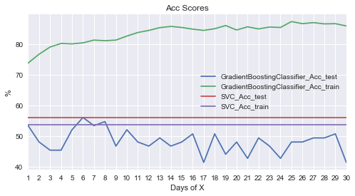


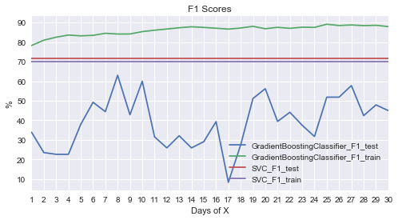


----
## Improving Results
### Advanced Features
Besides the previous base features, all researched features above are applied here.
The classifier trained with 8-day features has great improvement while too long days with weak correlations cause too much overfitting.
Therefore, the next tuning will use the same 8-day features to tune the hyperparameters to reduce the **overfitting**.


```python
results_best          = score_day(X, y, clfs, size = Page_size*2/3,
     feature_days_max = 10,
     feature          =
                        X_base +
                        X_vec  +
                        X_up   +
#                         X_stat
                       [
                       'RSI12' ,
                       'RSI6'  ,
                       'WR10'  ,
                       'WR6'   ,
                       'C2M'   ,
                       'MACD'  ,
                       'Boll_u',
                       'Boll'  ,
                       'Boll_l',
                       ]
                                 )
```

    The best classifier is GradientBoostingClassifier with 75.86% F1-score and 8-day features to predict Close_Close_next_up:
    


<div>
<style>
    .dataframe thead tr:only-child th {
        text-align: right;
    }

    .dataframe thead th {
        text-align: left;
    }

    .dataframe tbody tr th {
        vertical-align: top;
    }
</style>
<table border="1" class="dataframe">
  <thead>
    <tr style="text-align: right;">
      <th></th>
      <th>test</th>
      <th>train</th>
    </tr>
  </thead>
  <tbody>
    <tr>
      <th>Acc</th>
      <td>72.00%</td>
      <td>86.95%</td>
    </tr>
    <tr>
      <th>F1</th>
      <td>75.86%</td>
      <td>88.04%</td>
    </tr>
  </tbody>
</table>
</div>


<div>
<style>
    .dataframe thead tr:only-child th {
        text-align: right;
    }

    .dataframe thead th {
        text-align: left;
    }

    .dataframe tbody tr th {
        vertical-align: top;
    }
</style>
<table border="1" class="dataframe">
  <thead>
    <tr style="text-align: right;">
      <th></th>
      <th>Up_predict</th>
      <th>Down_predict</th>
    </tr>
  </thead>
  <tbody>
    <tr>
      <th>Up_true</th>
      <td>33</td>
      <td>9</td>
    </tr>
    <tr>
      <th>Down_true</th>
      <td>12</td>
      <td>21</td>
    </tr>
  </tbody>
</table>
</div>


                 precision    recall  f1-score   support
    
             Up       0.73      0.79      0.76        42
           Down       0.70      0.64      0.67        33
    
    avg / total       0.72      0.72      0.72        75
    
    


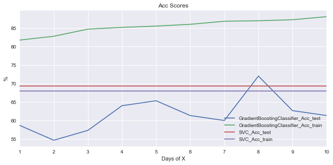


### Feature Importance
The best feature is the vector `Close_Open_next` as expected.
The importances of the [Ensemble Tree Gradient Boosting Regressor](http://scikit-learn.org/stable/modules/generated/sklearn.ensemble.GradientBoostingRegressor.html) are also listed by the way for reference.


```python
def        feature_importances(  features, clf):
    df = pd.DataFrame         ({
          'Features'           : features,
                  'Importances':           clf .
           feature_importances_*100})    . sort_values(by =
                  'Importances', ascending = 0). reset_index(drop = 1).rename(index = lambda c: c + 1)
    df [          'Importances'] = df['Importances'].map(percent.format)
    return df

from sklearn.ensemble import GradientBoostingRegressor
def        feature_importances_GBR(X_train, y_train,     random_state = random_state, X_test = None, y_test = None):
    return feature_importances(    X_train.columns,
                               GradientBoostingRegressor(random_state = random_state).
                               fit(X_train, y_train))

def        feature_importances_display(  results, n = 5):
    display(concat([
           feature_importances        (  results['features']  ,
                                         results['clf'     ]) ,
           feature_importances_GBR    (**results['Xy'      ])], ['Classifier', 'Regressor']).head(n = n))
```


```python
feature_importances_display(results_best)
```


<div>
<style>
    .dataframe thead tr:only-child th {
        text-align: right;
    }

    .dataframe thead th {
        text-align: left;
    }

    .dataframe tbody tr th {
        vertical-align: top;
    }
</style>
<table border="1" class="dataframe">
  <thead>
    <tr>
      <th></th>
      <th colspan="2" halign="left">Classifier</th>
      <th colspan="2" halign="left">Regressor</th>
    </tr>
    <tr>
      <th></th>
      <th>Features</th>
      <th>Importances</th>
      <th>Features</th>
      <th>Importances</th>
    </tr>
  </thead>
  <tbody>
    <tr>
      <th>1</th>
      <td>Close_Open_next</td>
      <td>15.74%</td>
      <td>Close_Open_next</td>
      <td>13.55%</td>
    </tr>
    <tr>
      <th>2</th>
      <td>Close_Open_next_pre1</td>
      <td>3.25%</td>
      <td>Close_Open_next_pre1</td>
      <td>3.24%</td>
    </tr>
    <tr>
      <th>3</th>
      <td>Volume_pre5</td>
      <td>2.82%</td>
      <td>Volume_pre1</td>
      <td>2.60%</td>
    </tr>
    <tr>
      <th>4</th>
      <td>Volume_pre1</td>
      <td>2.63%</td>
      <td>Volume_pre5</td>
      <td>2.54%</td>
    </tr>
    <tr>
      <th>5</th>
      <td>RSI6</td>
      <td>2.35%</td>
      <td>WR6_pre3</td>
      <td>2.42%</td>
    </tr>
  </tbody>
</table>
</div>


### Hyperparameters Tuning
Based on the 8-day features, tuning the key hyperparameters of the [Ensemble Tree Gradient Boosting Classifier](http://scikit-learn.org/stable/modules/generated/sklearn.ensemble.GradientBoostingClassifier.html) by [Exhaustive Grid Search](http://scikit-learn.org/stable/modules/grid_search.html#exhaustive-grid-search) with [Cross-validation](http://scikit-learn.org/stable/modules/cross_validation.html) and [TimeSeriesSplit](http://scikit-learn.org/stable/modules/generated/sklearn.model_selection.TimeSeriesSplit.html) to overcome the **overfitting**.
Wide-range hyperparameters has been tested: `learning_rate` (0.005~0.2), `n_estimators` (20~110), `max_depth` (2~16), `min_samples_split` (2~15), `min_samples_leaf` (1~8), `max_features` (0.1~None) and `subsample` (0.6~1).
However, the huge combinations need to be partitioned into many [steps](http://www.analyticsvidhya.com/blog/2016/02/complete-guide-parameter-tuning-gradient-boosting-gbm-python) to reduce the time complexity. The detail ranges are in the notebook and the sample is demonstrated below.
The overfitting is easy to overcome but, the required [$F_1-score$](http://wikipedia.org/wiki/F1_score) is improved minor and losing a little accuracy.


```python
from sklearn.model_selection import GridSearchCV
from sklearn.metrics         import make_scorer
from sklearn.model_selection import TimeSeriesSplit
from sklearn.pipeline        import Pipeline
# scaler     = MinMaxScaler()

def Grid   (clf, parameters,                     X = X, y = y, feature = X_all,  n_splits = 3, beta = beta , verbose = 1
                                                                      , feature_days = day_range_Max       ,       n = 5
                                                                      ,        label =    label , train_test_split = date_split):
    (X_train, X_test), (y_train, y_test) = Split(X[pre_feature(feature, feature_days)], y[label], train_test_split)
#     print '{}-day {} with:'.format(feature_days, csv(feature))
    display(concat([pd.DataFrame.from_dict(parameters, orient = 'index', dtype = object).T.fillna('').
                    rename(index = lambda c: c + 1)], ['Parameter Grid']))
#     pipe               = Pipeline(steps=[('scaler', scaler), ('clf', clf)])
#     grid               = GridSearchCV(clf, parameters, scoring = 'roc_auc'      (fbeta_score, beta = beta),
    grid               = GridSearchCV(clf, parameters, scoring = make_scorer    (fbeta_score,  beta = beta), verbose = verbose,
                                                       cv      = TimeSeriesSplit(n_splits = n_splits) .split(X_train))
    predict_train      = clf .fit(X_train, y_train)                 . predict(X_train)
    predict_test       = clf                                        . predict(X_test )
    estimator          = grid.fit(X_train, y_train).best_estimator_ 
    predict_train_best =                                 estimator  . predict(X_train)
    predict_test_best  =                                 estimator  . predict(X_test )

    display(concat([pd.DataFrame(OrderedDict([
      ('Train Accuracy'                  ,   [accuracy_score(y_train, predict_train                       )  ,
                                              accuracy_score(y_train, predict_train_best                  )]),
      ( 'Test Accuracy'                  ,   [accuracy_score(y_test , predict_test                        )  ,
                                              accuracy_score(y_test , predict_test_best                   )]),
      ('Train {}'.format(fbeta)          ,   [   fbeta_score(y_train, predict_train     ,      beta = beta)  ,
                                                 fbeta_score(y_train, predict_train_best,      beta = beta)]),
      ( 'Test {}'.format(fbeta)          ,   [   fbeta_score(y_test , predict_test      ,      beta = beta)  ,
                                                 fbeta_score(y_test , predict_test_best ,      beta = beta)]),
                                 ])).applymap(lambda s: '{:.1f}%'.format(100*s)),
         pd.concat([pd.DataFrame( clf. get_params(), index = [0])[parameters.keys()],
                    pd.DataFrame(grid.best_params_ , index = [1])[parameters.keys()]])])
                                             .rename(index = {0:   'Default Model',
                                                              1: 'Optimized Model'}))
    models =                                                 [     'Default' , 'Optimized']
    importances   = feature_importances(X_test.columns, grid.best_estimator_)
    display(concat([feature_importances(X_test.columns,           clf       ),
                            importances]                      , models).head(n = n))
    display(concat([up_down_matrix(y_test, predict_test     ) ,
                    up_down_matrix(y_test, predict_test_best)], models))
    print clf_report              (y_test, predict_test_best)
    return grid,            importances
```


```python
feature          = results_best['feature']
feature          = X_base + X_vec + X_up + X_stat

parameters = OrderedDict([
    ('learning_rate'    ,
#       list(np.arange    (
# #         0.005           ,
#         0.01            ,
# #         0.011           ,
#         0.05            , # cur
# #         0.1             , # default
# #         0.11            ,
# #         0.2             ,
# #         0.21            ,
# #         0.001
#         0.01
# #         0.05
#                        ))+
    [
#         0.02            ,
        0.03            , # up
        0.04            , # cur
        0.05            , # up
#         0.1             , # default, ini
    ]                  ),
    ('n_estimators'     ,
#       range            (
#        20               ,
# #        50               ,
#       100 +1            , # default
# #       101               ,
#        10
#                        )+
    [
#        30               ,
#        40               ,
       50               , # cur
#        60               ,
      100               , # default, up
#       110               ,
    ]                  ),
    ('max_depth'        ,
#       range            (
#         2               ,
# #         3               , # default
# #         5               ,
# #         8 +1            ,
#        16               ,
#                        )+
    [
        2               , # cur
        3               , # default, up
#         8               , # ini
    ]                  ),
    ('min_samples_split',
#       range            (
# #         2               , # default
#         7               , # 0.5*len(y)
#        15 +1            , #     len(y)
#                        )+
    [
#         2               , # default
        7               , # 0.5*len(y), ini
        8               , # cur
        9               ,
#        15               , #     len(y)
    ]                  ),
    ('min_samples_leaf' ,
#       range            (
#         1               , # default
#         7 +1            , # 0.5*len(y)
#                        )+
    [
        1               , # default, cur
        2               , # up
#         3               , # ini
    ]                  ),
    ('max_features'     ,
#       list(np.arange    (
#         0.1             ,
#         0.5             ,
#         0.1
#                        ))+
    [
#         0.3             ,
        'sqrt'          , # ini, cur
#         0.4             ,
#         None            , # default
    ]                  ),
    ('subsample'        ,
#       list(np.arange    (
#         0.6             ,
#         1               ,
#         0.05
#                        ))+
    [
        0.7             , # low
        0.8             , # ini, cur
        0.9             , # up
#         1               , # default
    ]                  ),
    ]                  )
# parameters       = OrderedDict([(k, [v]) for k, v in GBC.get_params().items() if k in parameters.keys()])
# parameters       = [{'kernel': ['rbf'   ], 'C': [1, 10, 100, 1000], 'gamma': [1e-3, 1e-4]},
#                     {'kernel': ['linear'], 'C': [1, 10, 100, 1000]                       }]

grid, importances = Grid(
    GradientBoostingClassifier(random_state = random_state, warm_start = True),
#     svc,
    parameters, X, y,
    feature,
    n = 10 ,
    feature_days = results_best['days']
#     feature_days = 8
)
```


<div>
<style>
    .dataframe thead tr:only-child th {
        text-align: right;
    }

    .dataframe thead th {
        text-align: left;
    }

    .dataframe tbody tr th {
        vertical-align: top;
    }
</style>
<table border="1" class="dataframe">
  <thead>
    <tr>
      <th></th>
      <th colspan="7" halign="left">Parameter Grid</th>
    </tr>
    <tr>
      <th></th>
      <th>learning_rate</th>
      <th>n_estimators</th>
      <th>max_depth</th>
      <th>min_samples_split</th>
      <th>min_samples_leaf</th>
      <th>max_features</th>
      <th>subsample</th>
    </tr>
  </thead>
  <tbody>
    <tr>
      <th>1</th>
      <td>0.03</td>
      <td>50</td>
      <td>2</td>
      <td>7</td>
      <td>1</td>
      <td>sqrt</td>
      <td>0.7</td>
    </tr>
    <tr>
      <th>2</th>
      <td>0.04</td>
      <td>100</td>
      <td>3</td>
      <td>8</td>
      <td>2</td>
      <td></td>
      <td>0.8</td>
    </tr>
    <tr>
      <th>3</th>
      <td>0.05</td>
      <td></td>
      <td></td>
      <td>9</td>
      <td></td>
      <td></td>
      <td>0.9</td>
    </tr>
  </tbody>
</table>
</div>


    Fitting 3 folds for each of 216 candidates, totalling 648 fits
    

    [Parallel(n_jobs=1)]: Done 648 out of 648 | elapsed:  1.9min finished
    


<div>
<style>
    .dataframe thead tr:only-child th {
        text-align: right;
    }

    .dataframe thead th {
        text-align: left;
    }

    .dataframe tbody tr th {
        vertical-align: top;
    }
</style>
<table border="1" class="dataframe">
  <thead>
    <tr style="text-align: right;">
      <th></th>
      <th>Train Accuracy</th>
      <th>Test Accuracy</th>
      <th>Train F1</th>
      <th>Test F1</th>
      <th>learning_rate</th>
      <th>n_estimators</th>
      <th>max_depth</th>
      <th>min_samples_split</th>
      <th>min_samples_leaf</th>
      <th>max_features</th>
      <th>subsample</th>
    </tr>
  </thead>
  <tbody>
    <tr>
      <th>Default Model</th>
      <td>87.0%</td>
      <td>69.3%</td>
      <td>88.0%</td>
      <td>73.6%</td>
      <td>0.10</td>
      <td>100</td>
      <td>3</td>
      <td>2</td>
      <td>1</td>
      <td>None</td>
      <td>1.0</td>
    </tr>
    <tr>
      <th>Optimized Model</th>
      <td>71.7%</td>
      <td>66.7%</td>
      <td>76.6%</td>
      <td>75.2%</td>
      <td>0.03</td>
      <td>50</td>
      <td>2</td>
      <td>7</td>
      <td>1</td>
      <td>sqrt</td>
      <td>0.8</td>
    </tr>
  </tbody>
</table>
</div>


<div>
<style>
    .dataframe thead tr:only-child th {
        text-align: right;
    }

    .dataframe thead th {
        text-align: left;
    }

    .dataframe tbody tr th {
        vertical-align: top;
    }
</style>
<table border="1" class="dataframe">
  <thead>
    <tr>
      <th></th>
      <th colspan="2" halign="left">Default</th>
      <th colspan="2" halign="left">Optimized</th>
    </tr>
    <tr>
      <th></th>
      <th>Features</th>
      <th>Importances</th>
      <th>Features</th>
      <th>Importances</th>
    </tr>
  </thead>
  <tbody>
    <tr>
      <th>1</th>
      <td>Close_Open_next</td>
      <td>15.73%</td>
      <td>Close_Open_next</td>
      <td>14.17%</td>
    </tr>
    <tr>
      <th>2</th>
      <td>Close_Open_next_pre1</td>
      <td>3.25%</td>
      <td>Close_Open_next_up</td>
      <td>8.63%</td>
    </tr>
    <tr>
      <th>3</th>
      <td>Volume_pre5</td>
      <td>2.82%</td>
      <td>RSI12_pre2</td>
      <td>3.20%</td>
    </tr>
    <tr>
      <th>4</th>
      <td>Volume_pre1</td>
      <td>2.63%</td>
      <td>WR6_pre3</td>
      <td>2.81%</td>
    </tr>
    <tr>
      <th>5</th>
      <td>RSI6</td>
      <td>2.32%</td>
      <td>RSI6</td>
      <td>2.52%</td>
    </tr>
    <tr>
      <th>6</th>
      <td>Open_pre_Close_pre1</td>
      <td>2.05%</td>
      <td>RSI6_pre3</td>
      <td>2.39%</td>
    </tr>
    <tr>
      <th>7</th>
      <td>WR10_pre2</td>
      <td>2.03%</td>
      <td>Open_Close_pre6</td>
      <td>2.21%</td>
    </tr>
    <tr>
      <th>8</th>
      <td>WR6_pre3</td>
      <td>1.89%</td>
      <td>Close_pre_Close_pre5</td>
      <td>2.20%</td>
    </tr>
    <tr>
      <th>9</th>
      <td>Open_Open_next_pre7</td>
      <td>1.83%</td>
      <td>RSI12_pre1</td>
      <td>2.19%</td>
    </tr>
    <tr>
      <th>10</th>
      <td>RSI12_pre7</td>
      <td>1.67%</td>
      <td>Open_Close_pre5</td>
      <td>2.05%</td>
    </tr>
  </tbody>
</table>
</div>


<div>
<style>
    .dataframe thead tr:only-child th {
        text-align: right;
    }

    .dataframe thead th {
        text-align: left;
    }

    .dataframe tbody tr th {
        vertical-align: top;
    }
</style>
<table border="1" class="dataframe">
  <thead>
    <tr>
      <th></th>
      <th colspan="2" halign="left">Default</th>
      <th colspan="2" halign="left">Optimized</th>
    </tr>
    <tr>
      <th></th>
      <th>Up_predict</th>
      <th>Down_predict</th>
      <th>Up_predict</th>
      <th>Down_predict</th>
    </tr>
  </thead>
  <tbody>
    <tr>
      <th>Up_true</th>
      <td>32</td>
      <td>10</td>
      <td>38</td>
      <td>4</td>
    </tr>
    <tr>
      <th>Down_true</th>
      <td>13</td>
      <td>20</td>
      <td>21</td>
      <td>12</td>
    </tr>
  </tbody>
</table>
</div>


                 precision    recall  f1-score   support
    
             Up       0.64      0.90      0.75        42
           Down       0.75      0.36      0.49        33
    
    avg / total       0.69      0.67      0.64        75
    
    

### Feature Selection
Based on the high feature importances and correlations above, `Volume` (Base Feature), `WR10`, `RSI6` (Statistics Features), Vector and corresponding Up Features are selected to explore huge feature combinations with extended day range for improvement of overfitting and accuracy at the same time.
Finally, the [$F_1-score$](http://wikipedia.org/wiki/F1_score) can be improved to 84.09%.


```python
features         = [
#                     'Open'              ,
#                     'High'              ,
#                     'Low'               ,
#                     'Close'             ,
#                     'Open_next'         ,
                    'Volume'            ,
                    'Open_pre_Close'    ,
                    'Open_pre_Close_up' ,
                    'Close_pre_Close'   ,
                    'Close_pre_Close_up',
                    'Open_Close'        ,
                    'Open_Close_up'     ,
                    'Open_Open_next'    ,
                    'Open_Open_next_up' ,
                    'Close_Open_next'   ,
                    'Close_Open_next_up',
                    'WR10'              ,
#                     'WR6'               ,
#                     'RSI12'             ,
                    'RSI6'              ,
#                     'MACD'              ,
#                     'C2M'               ,
#                     'Boll_u'            ,
#                     'Boll'              ,
#                     'Boll_l'            ,
                   ]
clf              = [
                    GBC, 
#                     GradientBoostingClassifier(random_state = random_state, **grid.best_params_),
                   ]
# display(concat([pd.DataFrame({k: v for k, v in grid.best_params_.items() if k in parameters.keys()},
#                              index = ['best'])], ['params']))
feature_days_max =  14

from tqdm      import tqdm
from itertools import combinations
results_best = {fbeta: 0}
for n in range(6, 1   +                    len(features)   ):
    for feature in tqdm(map(list, combinations(features, n))):
        cur                     = score_day   (verbose = 0,
            clfs                = clf,
            feature_days_max    =              feature_days_max,
            feature             =              feature)
        if  results_best[fbeta] < cur         [fbeta]:
            results_best        = cur
            print '{:.2f}% {} by {}-day {}'.format(100*cur[fbeta], fbeta, cur['days'], csv(feature))
```

      0%|                       | 0/1716 [00:00<?, ?it/s]

    59.57% f1 by 4-day Volume, Open_pre_Close, Open_pre_Close_up, Close_pre_Close, Close_pre_Close_up & Open_Close
    

      0%|             | 1/1716 [00:07<3:38:31,  7.64s/it]

    65.35% f1 by 1-day Volume, Open_pre_Close, Open_pre_Close_up, Close_pre_Close, Close_pre_Close_up & Open_Close_up
    

      0%|             | 2/1716 [00:14<3:34:15,  7.50s/it]

    65.91% f1 by 1-day Volume, Open_pre_Close, Open_pre_Close_up, Close_pre_Close, Close_pre_Close_up & Open_Open_next
    

      0%|             | 3/1716 [00:23<3:44:29,  7.86s/it]

    68.75% f1 by 1-day Volume, Open_pre_Close, Open_pre_Close_up, Close_pre_Close, Close_pre_Close_up & Open_Open_next_up
    

      0%|             | 4/1716 [00:29<3:32:21,  7.44s/it]

    77.42% f1 by 8-day Volume, Open_pre_Close, Open_pre_Close_up, Close_pre_Close, Close_pre_Close_up & Close_Open_next
    

      2%|▏           | 26/1716 [03:15<3:33:57,  7.60s/it]

    78.26% f1 by 8-day Volume, Open_pre_Close, Open_pre_Close_up, Close_pre_Close, Open_Open_next_up & Close_Open_next
    

      2%|▏           | 34/1716 [04:14<3:31:48,  7.56s/it]

    78.35% f1 by 5-day Volume, Open_pre_Close, Open_pre_Close_up, Close_pre_Close, Close_Open_next_up & RSI6
    

      5%|▋           | 90/1716 [10:54<3:15:04,  7.20s/it]

    79.12% f1 by 7-day Volume, Open_pre_Close, Open_pre_Close_up, Open_Close_up, Open_Open_next_up & Close_Open_next
    

      6%|▋           | 96/1716 [11:32<2:58:40,  6.62s/it]

    80.85% f1 by 8-day Volume, Open_pre_Close, Open_pre_Close_up, Open_Close_up, Close_Open_next & RSI6
    

     14%|█▌         | 235/1716 [29:34<2:42:02,  6.56s/it]

    84.78% f1 by 12-day Volume, Open_pre_Close, Close_pre_Close_up, Open_Close_up, Close_Open_next & WR10
    

    100%|██████████| 1716/1716 [3:40:15<00:00,  7.30s/it]
    100%|██████████| 1716/1716 [4:07:53<00:00,  7.70s/it]
    100%|██████████| 1287/1287 [3:10:40<00:00,  8.85s/it]
    100%|████████████| 715/715 [1:59:33<00:00,  9.48s/it]
    100%|██████████████| 286/286 [53:16<00:00, 10.01s/it]
    100%|████████████████| 78/78 [15:22<00:00, 11.65s/it]
    100%|████████████████| 13/13 [02:46<00:00, 12.72s/it]
    100%|██████████████████| 1/1 [00:13<00:00, 13.26s/it]
    

### Model Evaluation, Validation, Justification and Visualization
Based on the features above and wide-range hyperparameters tested, the best result tested with the unseen data this year has very near training/testing scores that are quite reasonable, trusted and good than expectation and the [SVC](http://scikit-learn.org/stable/modules/generated/sklearn.svm.SVC.html) benchmark model, although the testing set is a little small and still have chance to overfit.
The model is robust to the incoming data everyday, e.g., the [$F_1-score$](http://wikipedia.org/wiki/F1_score) is improved from 83.72% to 84.09% with the last coming data of 2018-04-17 (comparing the notebooks Stock_Up_Mincent_0414.ipynb and Stock_Up_Mincent_0417.ipynb).
The solution should be enough for the defined problem and conditions (only daily prices and volume features) currently, but for practical applications, the model should be re-trained continuously with the latest incoming data to learn the latest evolution of the market behavior.


```python
feature              = [
                        'Volume'            ,
                        'Open_pre_Close'    ,
                        'Close_pre_Close_up',
                        'Open_Close_up'     ,
                        'Close_Open_next'   ,
                        'WR10'              ,
                       ]
feature              = results_best['feature']

results_best         = score_day(X, y, clfs,
    feature_days_max = 20,
    feature          =               feature )
```

    The best classifier is GradientBoostingClassifier with 84.78% F1-score and 12-day features to predict Close_Close_next_up:
    


<div>
<style>
    .dataframe thead tr:only-child th {
        text-align: right;
    }

    .dataframe thead th {
        text-align: left;
    }

    .dataframe tbody tr th {
        vertical-align: top;
    }
</style>
<table border="1" class="dataframe">
  <thead>
    <tr style="text-align: right;">
      <th></th>
      <th>test</th>
      <th>train</th>
    </tr>
  </thead>
  <tbody>
    <tr>
      <th>Acc</th>
      <td>81.33%</td>
      <td>86.33%</td>
    </tr>
    <tr>
      <th>F1</th>
      <td>84.78%</td>
      <td>87.46%</td>
    </tr>
  </tbody>
</table>
</div>


<div>
<style>
    .dataframe thead tr:only-child th {
        text-align: right;
    }

    .dataframe thead th {
        text-align: left;
    }

    .dataframe tbody tr th {
        vertical-align: top;
    }
</style>
<table border="1" class="dataframe">
  <thead>
    <tr style="text-align: right;">
      <th></th>
      <th>Up_predict</th>
      <th>Down_predict</th>
    </tr>
  </thead>
  <tbody>
    <tr>
      <th>Up_true</th>
      <td>39</td>
      <td>3</td>
    </tr>
    <tr>
      <th>Down_true</th>
      <td>11</td>
      <td>22</td>
    </tr>
  </tbody>
</table>
</div>


                 precision    recall  f1-score   support
    
             Up       0.78      0.93      0.85        42
           Down       0.88      0.67      0.76        33
    
    avg / total       0.82      0.81      0.81        75
    
    


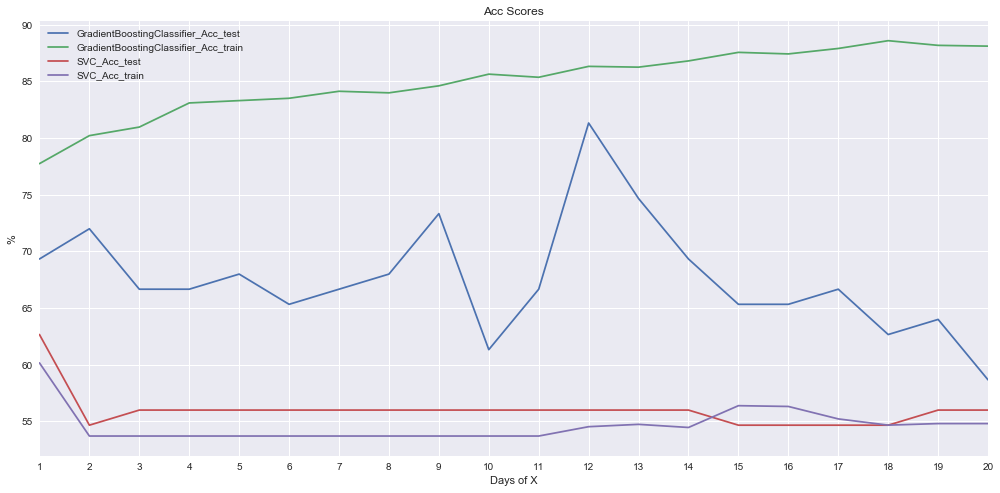


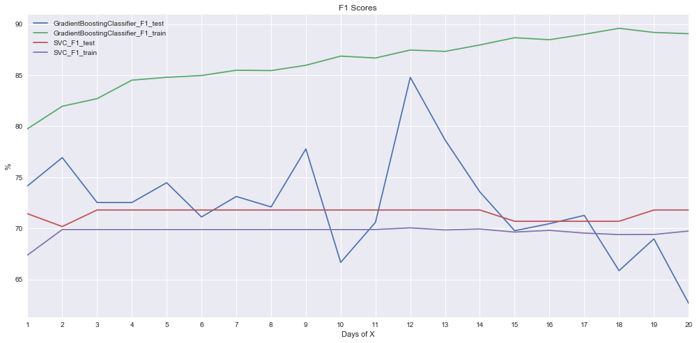


### Time-Series-Split Cross Validation
When the folder size (72 test samples, 20 splits) is similar to the previous test set (75 samples), the cross validation cannot improve the scores.
However, when the folder size is much reduced (25 test samples, 60 splits), the [$F_1-score$](http://wikipedia.org/wiki/F1_score) can be significantly improved to 88%.


```python
def score_cv(X = X, y = y, clf = GBC, feature_days = day_range_Max, feature = X_all, label = label, verbose = 1,
             n_splits = 3, scorer = fbeta, beta = beta, random_state = random_state, size = Page_size):
    features = pre_feature(feature, feature_days)
    X_sel    =   X        [features]
    y_sel    =   y        [ label  ]
    scores, Days = {} , {} 
    best     = {scorer: 0}
    for train,     test in TimeSeriesSplit(n_splits = n_splits).split(X_sel):
        X_train, X_test = X_sel.iloc[train], X_sel.iloc[test]
        y_train, y_test = y_sel.iloc[train], y_sel.iloc[test]
#         (X_train, X_test), (y_train, y_test) = Split  (X_sel, y_sel, date_split)
        train_i         = y_train.index
        test_i          = y_test .index
        scores , clf   ,     predict_test =  train_predict(
#         scores , Clf   ,     predict_test =  train_predict(
                 clf   ,  X_train, X_test  , y_train, y_test)
        for l, s in        [(                       s , scores[s]) for s in scores.keys()]:
            Days.setdefault(l, {})[ train_i[-1]] =  s
            if 0 <= l.find (  scorer + '_test') and s > best[scorer]:
                best.update({ scorer     :          s     ,
                             'scores'    :          scores,
                             'clf'       :            clf ,
                             'feature'   :        feature ,
                             'features'  :        features,
                             'date_split':     train_i[-1],
                             'Xy'        : {'X_train': X_train, 'y_train': y_train, 'X_test': X_test, 'y_test': y_test},
                             'predict'   :                                                                predict_test ,
                            })
        if  verbose > 1:
            display(pd.DataFrame(OrderedDict([('Train', [train_i[0], train_i[-1]])  ,
                                              ('Test' , [ test_i[0],  test_i[-1]])]), index = ['Start', 'End']).T)
    if      verbose > 0:
        print 'The best date_split is {} with {:.2f}% {}-score' . format(
                   best['date_split'],          100*best[ scorer], scorer)
        confusion_report(best['Xy']['y_test'], best['predict'], best['scores'])
        plot_score(Days, size = size, xlabel = 'day_split', rot = 90)
    return best

score_cv(X, y,  clf[0],
    n_splits     = 20 ,
    feature_days = 12 ,
    feature      = feature);
```

    The best date_split is 2014-01-01 with 78.65% F1-score
    


<div>
<style>
    .dataframe thead tr:only-child th {
        text-align: right;
    }

    .dataframe thead th {
        text-align: left;
    }

    .dataframe tbody tr th {
        vertical-align: top;
    }
</style>
<table border="1" class="dataframe">
  <thead>
    <tr style="text-align: right;">
      <th></th>
      <th>test</th>
      <th>train</th>
    </tr>
  </thead>
  <tbody>
    <tr>
      <th>Acc</th>
      <td>73.61%</td>
      <td>100.00%</td>
    </tr>
    <tr>
      <th>F1</th>
      <td>78.65%</td>
      <td>100.00%</td>
    </tr>
  </tbody>
</table>
</div>


<div>
<style>
    .dataframe thead tr:only-child th {
        text-align: right;
    }

    .dataframe thead th {
        text-align: left;
    }

    .dataframe tbody tr th {
        vertical-align: top;
    }
</style>
<table border="1" class="dataframe">
  <thead>
    <tr style="text-align: right;">
      <th></th>
      <th>Up_predict</th>
      <th>Down_predict</th>
    </tr>
  </thead>
  <tbody>
    <tr>
      <th>Up_true</th>
      <td>35</td>
      <td>4</td>
    </tr>
    <tr>
      <th>Down_true</th>
      <td>15</td>
      <td>18</td>
    </tr>
  </tbody>
</table>
</div>


                 precision    recall  f1-score   support
    
             Up       0.70      0.90      0.79        39
           Down       0.82      0.55      0.65        33
    
    avg / total       0.75      0.74      0.73        72
    
    


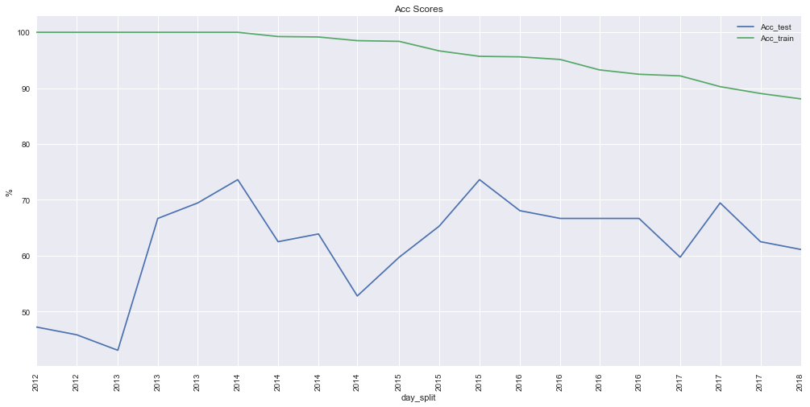


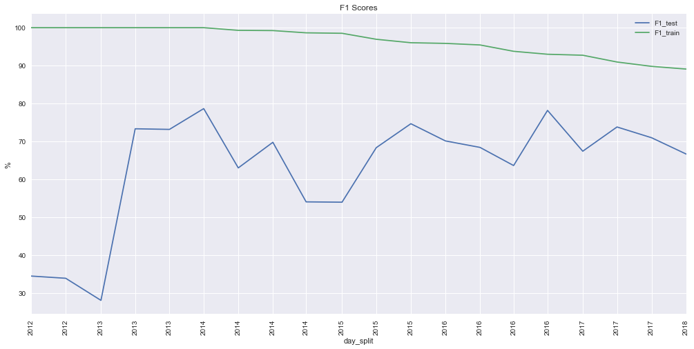


```python
results_best     = score_cv(X, y,  clf[0],
    n_splits     = 60 ,
    feature_days = 12 ,
    feature      = feature);
```

<div>
<style>
    .dataframe thead tr:only-child th {
        text-align: right;
    }

    .dataframe thead th {
        text-align: left;
    }

    .dataframe tbody tr th {
        vertical-align: top;
    }
</style>
<table border="1" class="dataframe">
  <thead>
    <tr style="text-align: right;">
      <th></th>
      <th>test</th>
      <th>train</th>
    </tr>
  </thead>
  <tbody>
    <tr>
      <th>Acc</th>
      <td>88.00%</td>
      <td>96.03%</td>
    </tr>
    <tr>
      <th>F1</th>
      <td>88.00%</td>
      <td>96.29%</td>
    </tr>
  </tbody>
</table>
</div>


<div>
<style>
    .dataframe thead tr:only-child th {
        text-align: right;
    }

    .dataframe thead th {
        text-align: left;
    }

    .dataframe tbody tr th {
        vertical-align: top;
    }
</style>
<table border="1" class="dataframe">
  <thead>
    <tr style="text-align: right;">
      <th></th>
      <th>Up_predict</th>
      <th>Down_predict</th>
    </tr>
  </thead>
  <tbody>
    <tr>
      <th>Up_true</th>
      <td>11</td>
      <td>0</td>
    </tr>
    <tr>
      <th>Down_true</th>
      <td>3</td>
      <td>11</td>
    </tr>
  </tbody>
</table>
</div>


                 precision    recall  f1-score   support
    
             Up       0.79      1.00      0.88        11
           Down       1.00      0.79      0.88        14
    
    avg / total       0.91      0.88      0.88        25
    
    


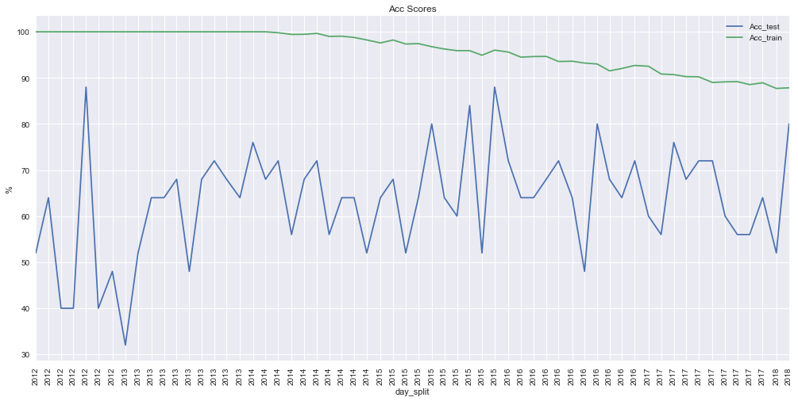


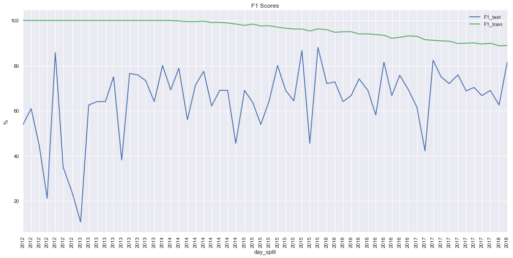


```python
def score(X_train = X_train, X_test = X_test, y_train = y_train, y_test = y_test, clf = GBC, verbose = 1,
          scorer  = fbeta, beta = beta, size = Page_size):
    scores, clf, predict_test = train_predict(
            clf,    X_train,          X_test,           y_train,          y_test)
    if  verbose:
        confusion_report(y_test, predict_test, scores)
    return scores[scorer + '_test']

feature_days = 12
(Xtrain, Xtest), (ytrain, ytest) = Split(X[pre_feature(feature, feature_days)], y[label], date_split)

scores = {}
for i in range(1, 11):
    scores[i] = score(Xtrain, Xtest, ytrain, ytest, GradientBoostingClassifier(random_state = i), verbose = 0)
scores = pd.Series(dict(scores, **{'Mean': np.mean(scores.values()),
                                   'Std.': np.std (scores.values())}), name = fbeta + ' Score')*100
scores.index.name = 'random_state'
display(pd.DataFrame(scores).applymap(score_format))
```


<div>
<style>
    .dataframe thead tr:only-child th {
        text-align: right;
    }

    .dataframe thead th {
        text-align: left;
    }

    .dataframe tbody tr th {
        vertical-align: top;
    }
</style>
<table border="1" class="dataframe">
  <thead>
    <tr style="text-align: right;">
      <th></th>
      <th>F1 Score</th>
    </tr>
    <tr>
      <th>random_state</th>
      <th></th>
    </tr>
  </thead>
  <tbody>
    <tr>
      <th>1</th>
      <td>81.32%</td>
    </tr>
    <tr>
      <th>2</th>
      <td>81.32%</td>
    </tr>
    <tr>
      <th>3</th>
      <td>81.72%</td>
    </tr>
    <tr>
      <th>4</th>
      <td>82.22%</td>
    </tr>
    <tr>
      <th>5</th>
      <td>82.22%</td>
    </tr>
    <tr>
      <th>6</th>
      <td>80.00%</td>
    </tr>
    <tr>
      <th>7</th>
      <td>84.78%</td>
    </tr>
    <tr>
      <th>8</th>
      <td>80.90%</td>
    </tr>
    <tr>
      <th>9</th>
      <td>80.00%</td>
    </tr>
    <tr>
      <th>10</th>
      <td>82.22%</td>
    </tr>
    <tr>
      <th>Mean</th>
      <td>81.67%</td>
    </tr>
    <tr>
      <th>Std.</th>
      <td>1.30%</td>
    </tr>
  </tbody>
</table>
</div>


```python
score(Xtrain[1:], Xtest, ytrain[1:], ytest);
score(Xtrain    , Xtest, ytrain    , ytest);
```


<div>
<style>
    .dataframe thead tr:only-child th {
        text-align: right;
    }

    .dataframe thead th {
        text-align: left;
    }

    .dataframe tbody tr th {
        vertical-align: top;
    }
</style>
<table border="1" class="dataframe">
  <thead>
    <tr style="text-align: right;">
      <th></th>
      <th>test</th>
      <th>train</th>
    </tr>
  </thead>
  <tbody>
    <tr>
      <th>Acc</th>
      <td>69.33%</td>
      <td>86.53%</td>
    </tr>
    <tr>
      <th>F1</th>
      <td>73.56%</td>
      <td>87.58%</td>
    </tr>
  </tbody>
</table>
</div>


<div>
<style>
    .dataframe thead tr:only-child th {
        text-align: right;
    }

    .dataframe thead th {
        text-align: left;
    }

    .dataframe tbody tr th {
        vertical-align: top;
    }
</style>
<table border="1" class="dataframe">
  <thead>
    <tr style="text-align: right;">
      <th></th>
      <th>Up_predict</th>
      <th>Down_predict</th>
    </tr>
  </thead>
  <tbody>
    <tr>
      <th>Up_true</th>
      <td>32</td>
      <td>10</td>
    </tr>
    <tr>
      <th>Down_true</th>
      <td>13</td>
      <td>20</td>
    </tr>
  </tbody>
</table>
</div>


                 precision    recall  f1-score   support
    
             Up       0.71      0.76      0.74        42
           Down       0.67      0.61      0.63        33
    
    avg / total       0.69      0.69      0.69        75
    
    


<div>
<style>
    .dataframe thead tr:only-child th {
        text-align: right;
    }

    .dataframe thead th {
        text-align: left;
    }

    .dataframe tbody tr th {
        vertical-align: top;
    }
</style>
<table border="1" class="dataframe">
  <thead>
    <tr style="text-align: right;">
      <th></th>
      <th>test</th>
      <th>train</th>
    </tr>
  </thead>
  <tbody>
    <tr>
      <th>Acc</th>
      <td>81.33%</td>
      <td>86.33%</td>
    </tr>
    <tr>
      <th>F1</th>
      <td>84.78%</td>
      <td>87.46%</td>
    </tr>
  </tbody>
</table>
</div>


<div>
<style>
    .dataframe thead tr:only-child th {
        text-align: right;
    }

    .dataframe thead th {
        text-align: left;
    }

    .dataframe tbody tr th {
        vertical-align: top;
    }
</style>
<table border="1" class="dataframe">
  <thead>
    <tr style="text-align: right;">
      <th></th>
      <th>Up_predict</th>
      <th>Down_predict</th>
    </tr>
  </thead>
  <tbody>
    <tr>
      <th>Up_true</th>
      <td>39</td>
      <td>3</td>
    </tr>
    <tr>
      <th>Down_true</th>
      <td>11</td>
      <td>22</td>
    </tr>
  </tbody>
</table>
</div>


                 precision    recall  f1-score   support
    
             Up       0.78      0.93      0.85        42
           Down       0.88      0.67      0.76        33
    
    avg / total       0.82      0.81      0.81        75
    
    

### Reflection
#### _Process Summary_
- Data Engineering
  - Data Getting
  - Data Cleaning
- Feature Engineering
  - **Deriving** Statistics, Vector and Corresponding Classification Features and Labels
  - **Feature Selection** by Visualization and Comparison of Data Correlations
  - Log-Transforming the Skewed Continuous Feature
  - Normalizing Numerical Features
  - Feature Preprocessing for Stacking Daily Data of Day Range
  - Splitting Data for Training and Testing
- Model Tuning
  - Initial Model Evaluation
  - Applying Advanced Features
  - Feature Importance Evaluation
  - Hyperparameters Tuning
  - Feature Selection
- Many Iterations for Feature Engineering and Parameters Tuning

Predicting stock price is very interesting but difficult.
Notably, the classification is expected initially to be easier than regression.
However, the long-term trend of prices is easy to follow and regress, but the daily small fluctuation is very hard to predict and classify the price up/down.
A default [Ensemble Tree Gradient Boosting Regressor](http://scikit-learn.org/stable/modules/generated/sklearn.ensemble.GradientBoostingRegressor.html) with only the base features (`Open`, `High`, `Low`, `Close` and `Volume`) can easily follow the prices, but the predicted prices cannot provide good up/down predictions.
Predicting the nearer prices, e.g., `Open_next` (`Open` prices of the next day), is better.


```python
labels          = ['Close_next', 'Open_next']
feature         =   X_base

from sklearn.metrics import           r2_score

data_train,       data_test = Split1(data_log[day_range_Max - 1:], date_split)
for Label in   labels:
    y_train_raw = data_train[[Label]]
    y_test_raw  = data_test [[Label]]
    scaler_y    =     MinMaxScaler().fit            (                                             y_train_raw )
    regressor   = LinearRegression().fit            (X_train[feature], scaler_y.        transform(y_train_raw))
    predict     =       regressor   .       predict (X_test [feature])
    regression  = y_test_raw.copy()
    regression[Label +'_Regression (Test)'] =                          scaler_y.inverse_transform(
                                            predict                                                           )
    print           '{} Regression r2-Score: {:6.2f}%'                                 .format   (Label, 100*
                                   r2_score(predict                  , scaler_y        .transform(y_test_raw )))
    x           = Label.split('_')[0]
    true        =           data_test['{}_{}_up'.format(x, Label)]
    predict     =           data_test[                  x        ] <= regression.iloc[:, -1]
    acc, f1     = clf_scores(true,          predict, beta)
    print           '{} Regression to Up/Down Classification Accuracy Score: {:6.2f}%' .format   (Label, 100* acc)
    print           '{} Regression to Up/Down Classification       F1-Score: {:6.2f}%' .format   (Label, 100*  f1)
    confusion_report(true,                  predict)
    ax = regression.plot( figsize = (Page_size, Page_size/2));
    ax .    set_ylabel('Price')
    ax .    set_xlabel('Day'  )
    ax .    set_title ('Regression of {} by only Base Features'.format(Label))
    regression.insert(0, x, data_test[                  x                   ])
    regression['Up_true'   ] = true
    regression['Up_predict'] = predict
    display(regression.tail())
    plt.show()
```

    Close_next Regression r2-Score:  77.18%
    Close_next Regression to Up/Down Classification Accuracy Score:  56.00%
    Close_next Regression to Up/Down Classification       F1-Score:  71.79%
    


<div>
<style>
    .dataframe thead tr:only-child th {
        text-align: right;
    }

    .dataframe thead th {
        text-align: left;
    }

    .dataframe tbody tr th {
        vertical-align: top;
    }
</style>
<table border="1" class="dataframe">
  <thead>
    <tr style="text-align: right;">
      <th></th>
      <th>Up_predict</th>
      <th>Down_predict</th>
    </tr>
  </thead>
  <tbody>
    <tr>
      <th>Up_true</th>
      <td>42</td>
      <td>0</td>
    </tr>
    <tr>
      <th>Down_true</th>
      <td>33</td>
      <td>0</td>
    </tr>
  </tbody>
</table>
</div>


                 precision    recall  f1-score   support
    
             Up       0.56      1.00      0.72        42
           Down       0.00      0.00      0.00        33
    
    avg / total       0.31      0.56      0.40        75
    
    


<div>
<style>
    .dataframe thead tr:only-child th {
        text-align: right;
    }

    .dataframe thead th {
        text-align: left;
    }

    .dataframe tbody tr th {
        vertical-align: top;
    }
</style>
<table border="1" class="dataframe">
  <thead>
    <tr style="text-align: right;">
      <th></th>
      <th>Close</th>
      <th>Close_next</th>
      <th>Close_next_Regression (Test)</th>
      <th>Up_true</th>
      <th>Up_predict</th>
    </tr>
  </thead>
  <tbody>
    <tr>
      <th>2018-04-14</th>
      <td>2656.30</td>
      <td>2677.84</td>
      <td>2658.342917</td>
      <td>True</td>
      <td>True</td>
    </tr>
    <tr>
      <th>2018-04-17</th>
      <td>2677.84</td>
      <td>2706.39</td>
      <td>2679.551933</td>
      <td>True</td>
      <td>True</td>
    </tr>
    <tr>
      <th>2018-04-18</th>
      <td>2706.39</td>
      <td>2708.64</td>
      <td>2708.160875</td>
      <td>True</td>
      <td>True</td>
    </tr>
    <tr>
      <th>2018-04-19</th>
      <td>2708.64</td>
      <td>2693.13</td>
      <td>2710.113514</td>
      <td>False</td>
      <td>True</td>
    </tr>
    <tr>
      <th>2018-04-20</th>
      <td>2693.13</td>
      <td>2670.14</td>
      <td>2694.660330</td>
      <td>False</td>
      <td>True</td>
    </tr>
  </tbody>
</table>
</div>


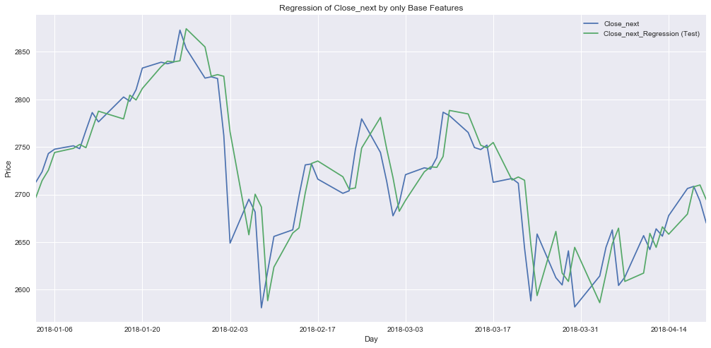


    Open_next Regression r2-Score:  97.06%
    Open_next Regression to Up/Down Classification Accuracy Score:  80.00%
    Open_next Regression to Up/Down Classification       F1-Score:  81.48%
    


<div>
<style>
    .dataframe thead tr:only-child th {
        text-align: right;
    }

    .dataframe thead th {
        text-align: left;
    }

    .dataframe tbody tr th {
        vertical-align: top;
    }
</style>
<table border="1" class="dataframe">
  <thead>
    <tr style="text-align: right;">
      <th></th>
      <th>Up_predict</th>
      <th>Down_predict</th>
    </tr>
  </thead>
  <tbody>
    <tr>
      <th>Up_true</th>
      <td>33</td>
      <td>8</td>
    </tr>
    <tr>
      <th>Down_true</th>
      <td>7</td>
      <td>27</td>
    </tr>
  </tbody>
</table>
</div>


                 precision    recall  f1-score   support
    
             Up       0.82      0.80      0.81        41
           Down       0.77      0.79      0.78        34
    
    avg / total       0.80      0.80      0.80        75
    
    


<div>
<style>
    .dataframe thead tr:only-child th {
        text-align: right;
    }

    .dataframe thead th {
        text-align: left;
    }

    .dataframe tbody tr th {
        vertical-align: top;
    }
</style>
<table border="1" class="dataframe">
  <thead>
    <tr style="text-align: right;">
      <th></th>
      <th>Open</th>
      <th>Open_next</th>
      <th>Open_next_Regression (Test)</th>
      <th>Up_true</th>
      <th>Up_predict</th>
    </tr>
  </thead>
  <tbody>
    <tr>
      <th>2018-04-14</th>
      <td>2676.90</td>
      <td>2670.10</td>
      <td>2657.525731</td>
      <td>False</td>
      <td>False</td>
    </tr>
    <tr>
      <th>2018-04-17</th>
      <td>2670.10</td>
      <td>2692.74</td>
      <td>2678.778982</td>
      <td>True</td>
      <td>True</td>
    </tr>
    <tr>
      <th>2018-04-18</th>
      <td>2692.74</td>
      <td>2710.11</td>
      <td>2707.293721</td>
      <td>True</td>
      <td>True</td>
    </tr>
    <tr>
      <th>2018-04-19</th>
      <td>2710.11</td>
      <td>2701.16</td>
      <td>2709.692339</td>
      <td>False</td>
      <td>False</td>
    </tr>
    <tr>
      <th>2018-04-20</th>
      <td>2701.16</td>
      <td>2692.56</td>
      <td>2694.308699</td>
      <td>False</td>
      <td>False</td>
    </tr>
  </tbody>
</table>
</div>


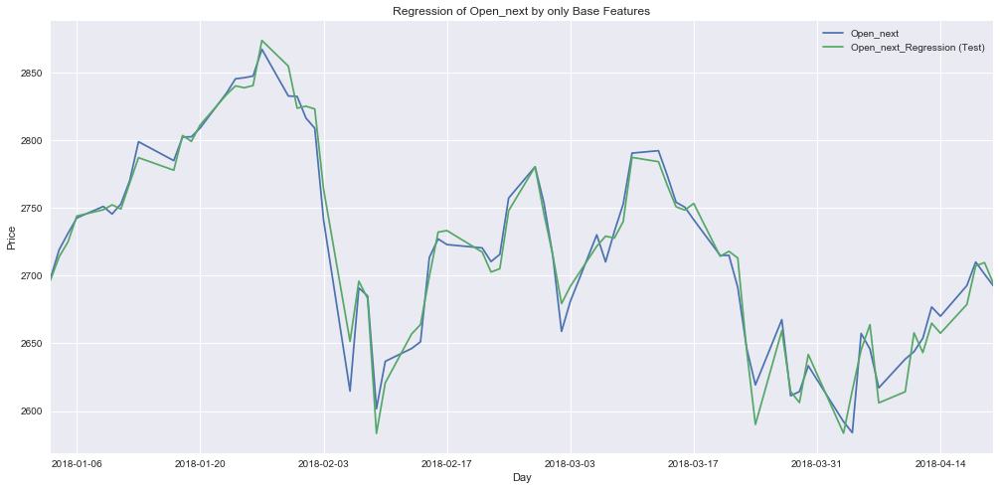


### Improvement
The features importances shows that the model still pays too much attention to the previous days.
The models which consider the critical feature of time sequence, e.g., [Long Short-Term Memory (LSTM)](http://wikipedia.org/wiki/Long_short-term_memory),
[Recurrent Neural Network (RNN)](http://wikipedia.org/wiki/Recurrent_neural_network), and the more advanced
[attention mechanism](http://arxiv.org/abs/1706.03762), should work better.
More important features of the global stock market, currency market, company status and financial related news, etc. and more data, maybe hourly prices, also should be considered.


```python
f = sns.barplot(results_best['features'],
                results_best['clf'     ].feature_importances_*100,
                ax  = plt.subplots(figsize = (Page_size, Page_size/2))[1]);
f.set_xticklabels(f.get_xticklabels(), rotation = 90)
f.set_ylabel   (                        'Feature Importances (%)'              )
f.set_title    (                        'Feature Importances of the Best Model');
```


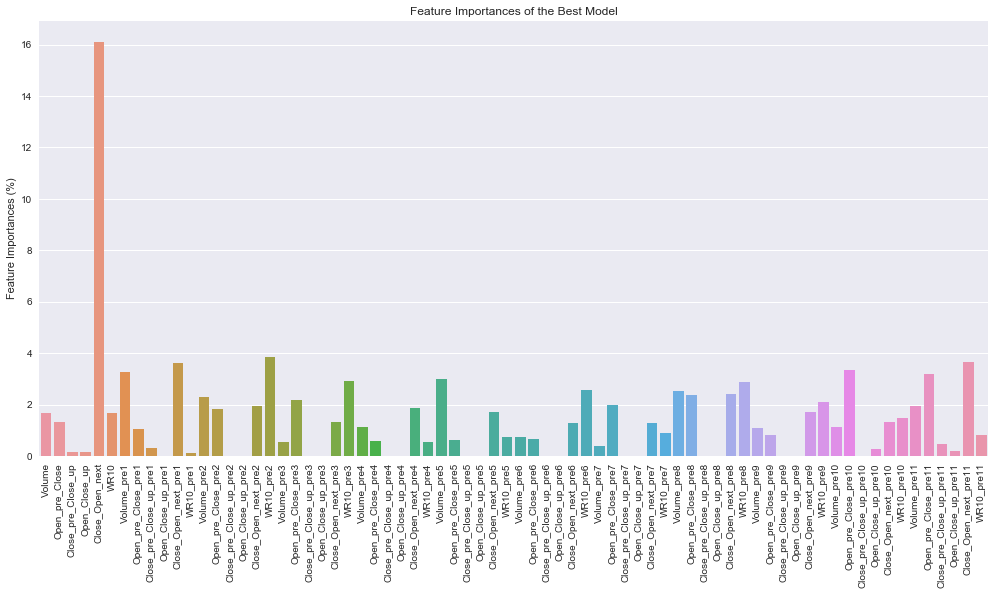

