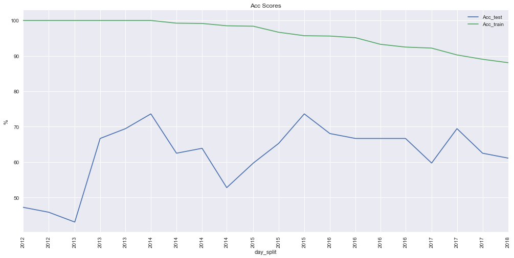
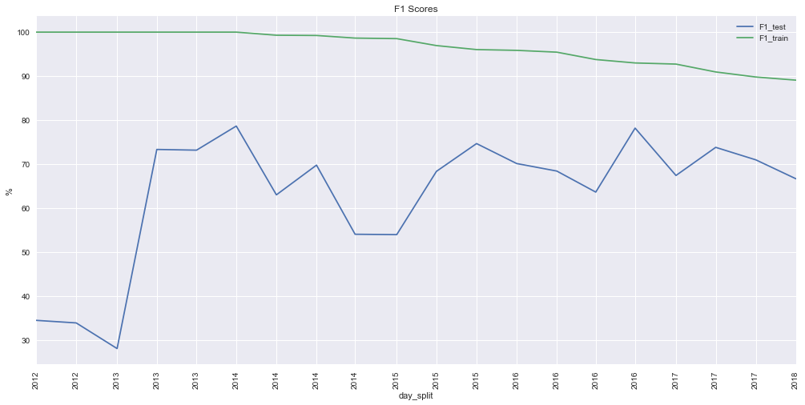
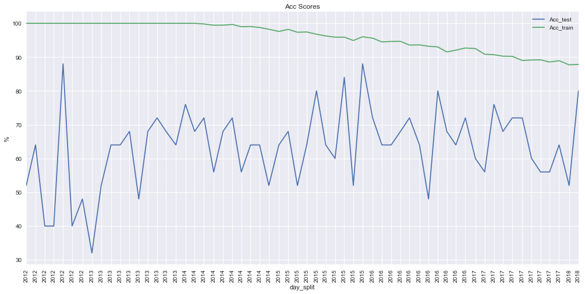
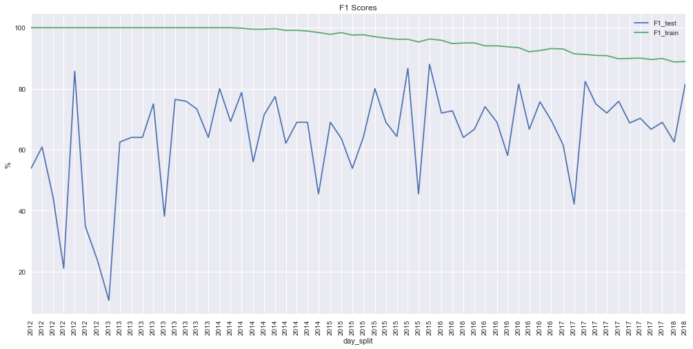

# Prediction Up/Down of Stock Prices (Capstone Project)
Mincent Lee, 13 April  2018

## I. Definition
### Project Overview

#### _Domain Background_
This project will develop a stock price predictor by machine learning. The proposal is historically simplified from the [Project Description ~ Investment and Trading](http://docs.google.com/document/d/1ycGeb1QYKATG6jvz74SAMqxrlek9Ed4RYrzWNhWS-0Q/pub)[^descript] and based on the [Course ~ Machine Learning for Trading](http://udacity.com/course/machine-learning-for-trading--ud501)[^course] for my first solid step to study machine learning for trading. Because the risk free rate of return from a bank account or a very short-term treasury bond is about 0 lately, folks have put so much money into the stock market[^course]. The stock prediction can help us to understand market behaviour and trade profitable investments according to the wealthy information in the stock history and company data which is suitable for machine learning process[^descript]. There are lot related academic research support the stock prediction[^course][^predict] while there are also opponent Efficient-Market Hypothesis[^hypo].

[^descript]: ["MLND Capstone Project Description - Investment and Trading," *Udacity*](http://docs.google.com/document/d/1ycGeb1QYKATG6jvz74SAMqxrlek9Ed4RYrzWNhWS-0Q/pub)

[^course]: [Tucker Balch, "Machine Learning for Trading," *Georgia Tech* and *Udacity*](http://udacity.com/course/machine-learning-for-trading--ud501)

[^predict]: ["Stock market prediction," *Wikipedia*](http://wikipedia.org/wiki/Stock_market_prediction)

[^hypo]: ["Efficient-market hypothesis," *Wikipedia*](http://en.wikipedia.org/wiki/Efficient-market_hypothesis)

#### _Datasets and Inputs_
The datasets used in this project is obtained by the python module [googlefinance.client](http://pypi.python.org/pypi/googlefinance.client)[^goog] instead of the planned popular [yahoo-finance](http://pypi.python.org/pypi/yahoo-finance)[^yhoo] [which is being discontinued](http://yahoo.sdx.socialdynamx.com/portal/conversation/19248672)[^dis].

[^goog]: ["googlefinance.client," *PyPI - the Python Package Index*](http://pypi.python.org/pypi/googlefinance.client)

[^yhoo]: ["yahoo-finance 1.4.0," *PyPI - the Python Package Index*](http://pypi.python.org/pypi/yahoo-finance)

[^dis]: [YahooCare, "the service is being discontinued," *yahoo.sdx.socialdynamx.com*](http://yahoo.sdx.socialdynamx.com/portal/conversation/19248672)

The target stock might be the [S&P 500 Index](http://wikipedia.org/wiki/S%26P_500_Index)[^sp] that might be the best representation of the U.S. stock market[^sp]. The inputs include daily *Opening price*, *Highest price*, *traded Volume*, *Closing price*, and so on. 
Each price prediction is according to the trading data of a consistent **day range**, e.g., considering 2+1-day range in a trading week, the input ($X_1, X_2, X_3...$) and predicted ($y_1, y_2, y_3...$) days are:

| |X (2-day range)|y (the next day of the range)|
|-|---------------|-----------------------------|
|1|Mon. Tue.      |Wed.                         |
|2|Tue. Wed.      |Thu.                         |
|3|Wed. Thu.      |Fri.                         |

The sampled days for this project should include the current day for practicality and then trace back to find a balanced day range in which the distribution of the target classes (price *Up*/*Down*) is balanced for balanced evaluation metrics. The balanced day range could be searched from the same-price ranges in which the prices of the first and last day are the same to have balanced probability of *Ups* and *Downs*. The sampled day range might also larger than one year to cover annual and monthly characteristics. The first experiment is planned to train with the data last year (Jan. 2017 to Dec. 2017) and test this year (Jan. 2018 to Apr. 2018).

[^sp]: ["Standard & Poor's 500," *Wikipedia*](http://wikipedia.org/wiki/S%26P_500_Index)

### Problem Statement
#### _Problem Define_
For reality and accuracy[^hypo] concerns, the target problem of my first stock study is simplified to predict whether the *Closing price* ups or downs. The stock price predictor is inputted a certain range of daily trading data and outputs whether the *Closing price* ups or downs (might ignore the rare flat cases at the first step) next to the certain range, i.e., the predicted day is the *next day*, e.g., predicting the last Thursday according to the data of the last Monday to Wednesday. The next day is supposed to have the highest correlation and predictability according to the input features, and suitable to be the basic first step. This is quantifiable, measurable, and replicable. The relevant potential solution are the Classifiers of the [scikit-learn](http://scikit-learn.org/stable/tutorial/machine_learning_map)[^map], e.g., the  [Ensemble Tree Gradient Boosting Classifier](http://scikit-learn.org/stable/modules/generated/sklearn.ensemble.GradientBoostingClassifier.html)[^GBC].

[^map]: ["Choosing the right estimator," *scikit-learn.org*](http://scikit-learn.org/stable/tutorial/machine_learning_map)

[^GBC]: ["sklearn.ensemble.GradientBoostingClassifier," *scikit-learn.org*](http://scikit-learn.org/stable/modules/generated/sklearn.ensemble.GradientBoostingClassifier.html)

#### _Strategy_
The potential solution is training a Classifier by daily trading data within specific ranges of days to predict *Upping* or *Downing* of the *Closing price* following the range. The daily trading data are obtained from the python module [googlefinance.client](http://pypi.python.org/pypi/googlefinance.client)[^goog]. The machine learning libraries and Classifiers might come from [scikit-learn](http://scikit-learn.org/stable/tutorial/machine_learning_map)[^map], e.g., the  [Ensemble Tree Gradient Boosting Classifier](http://scikit-learn.org/stable/modules/generated/sklearn.ensemble.GradientBoostingClassifier.html)[^GBC], and the parameter [random_state](http://scikit-learn.org/stable/developers/utilities.html)[^rand] will be recorded. Therefore, the solution is quantifiable, measurable, and replicable.

[^rand]: ["Utilities for Developers," *scikit-learn.org*](http://scikit-learn.org/stable/developers/utilities.html)

### Metrics
The solution model will be evaluated with the exact benchmark of specific daily prices from the python module [googlefinance.client](http://pypi.python.org/pypi/googlefinance.client)[^goog] by the [$F_{\beta}-score$](http://wikipedia.org/wiki/F1_score)[^f1] with the [fbeta_score function of scikit-learn](http://scikit-learn.org/stable/modules/generated/sklearn.metrics.fbeta_score.html)[^beta]. The mathematical representations is:
$$F_{\beta} = (1+\beta^{2})\tfrac{precision\cdot recall}{\beta^2precision+recall}$$

  
The $\beta$ might be 1 for balanced precision and recall[^f1].
The $F_1-score$ is chosen because it is the majority common scoring rule for binary classification on the [scikit-learn.org](http://scikit-learn.org/stable/modules/model_evaluation.html#common-cases-predefined-values)[^score] and considered the $precision$ and $recall$.
The `accuracy` will also be evaluated for reference in parallel, while the advanced [Receiver Operating Characteristic (ROC)](http://scikit-learn.org/stable/modules/model_evaluation.html#common-cases-predefined-values)[^score] is a future work.

[^f1]: ["F1 score," *Wikipedia*](http://wikipedia.org/wiki/F1_score)

[^beta]: ["sklearn.metrics.fbeta_score," *scikit-learn.org*](http://scikit-learn.org/stable/modules/generated/sklearn.metrics.fbeta_score.html)

[^score]: ["The scoring parameter: defining model evaluation rules," *scikit-learn.org*](http://scikit-learn.org/stable/modules/model_evaluation.html#common-cases-predefined-values)

## II. Analysis

### Data Exploration
#### _Raw Data_
Import 7-year data of the [S&P 500 Index](http://wikipedia.org/wiki/S%26P_500_Index), till the showed current day below.
The columns of this dataset will be calculated to our target labels (the next day price ups, flats or downs) for each day.
The column or index names from the two functions are needs to be cleaned respectively.

<table border=0>
  <thead>
    <tr style="text-align: right;">
      <th></th>
      <th>Open</th>
      <th>High</th>
      <th>Low</th>
      <th>Close</th>
      <th>Volume</th>
    </tr>
  </thead>
  <tbody>
    <tr>
      <th>2018-04-21 04:00:00</th>
      <td>2692.56</td>
      <td>2693.94</td>
      <td>2660.61</td>
      <td>2670.14</td>
      <td>2308509070</td>
    </tr>
  </tbody>
</table>
<table border=0>
  <thead>
    <tr style="text-align: right;">
      <th></th>
      <th>.INX_Open</th>
      <th>.INX_High</th>
      <th>.INX_Low</th>
      <th>.INX_Close</th>
      <th>.INX_Volume</th>
    </tr>
  </thead>
  <tbody>
    <tr>
      <th>2018-04-21 04:00:00</th>
      <td>2692.56</td>
      <td>2693.94</td>
      <td>2660.61</td>
      <td>2670.14</td>
      <td>2308509070</td>
    </tr>
  </tbody>
</table>

#### _Data Cleaning_
The column names are cleaned and the data with abnormal 0 also need to be checked

<table border=0>
  <thead>
    <tr style="text-align: right;">
      <th></th>
      <th>Open</th>
      <th>High</th>
      <th>Low</th>
      <th>Close</th>
      <th>Volume</th>
    </tr>
  </thead>
  <tbody>
    <tr>
      <th>min</th>
      <td>0.00000</td>
      <td>0.000000</td>
      <td>0.000000</td>
      <td>1099.230000</td>
      <td>0.000000e+00</td>
    </tr>
  </tbody>
</table>

  
Check the 0 `Volume`.
The early years lack `Volume` data need to be cleaned.

The cleaned data with complete `Volume` start from 2012-01-15.
However, there are still 0 prices need to be checked.

<table border=0>
  <thead>
    <tr style="text-align: right;">
      <th></th>
      <th>Open</th>
      <th>High</th>
      <th>Low</th>
      <th>Close</th>
      <th>Volume</th>
    </tr>
  </thead>
  <tbody>
      <tr>
      <th>min</th>
      <td>0.000000</td>
      <td>0.000000</td>
      <td>0.000000</td>
      <td>1278.040000</td>
      <td>1.839316e+08</td>
    </tr>
    </tbody>
</table>

Check the data distributions.
The normal prices are over 1000.

There is only one abnormal day needs to be dropped

<table border=0>
  <thead>
    <tr style="text-align: right;">
      <th></th>
      <th>Open</th>
      <th>High</th>
      <th>Low</th>
      <th>Close</th>
      <th>Volume</th>
    </tr>
  </thead>
  <tbody>
    <tr>
      <th>2017-08-01</th>
      <td>0.0</td>
      <td>0.0</td>
      <td>0.0</td>
      <td>2470.3</td>
      <td>2189633778</td>
    </tr>
  </tbody>
</table>

The data statistics and distributions are clean
The `Volume` values need Log-transform.

<table border=0>
  <thead>
    <tr style="text-align: right;">
      <th></th>
      <th>Open</th>
      <th>High</th>
      <th>Low</th>
      <th>Close</th>
      <th>Volume</th>
    </tr>
  </thead>
  <tbody>
    <tr>
      <th>count</th>
      <td>1574.000000</td>
      <td>1574.000000</td>
      <td>1574.000000</td>
      <td>1574.000000</td>
      <td>1.574000e+03</td>
    </tr>
    <tr>
      <th>mean</th>
      <td>1967.812605</td>
      <td>1976.364212</td>
      <td>1958.747662</td>
      <td>1968.331798</td>
      <td>9.053165e+08</td>
    </tr>
    <tr>
      <th>std</th>
      <td>380.467368</td>
      <td>381.150921</td>
      <td>379.507156</td>
      <td>380.150472</td>
      <td>6.713938e+08</td>
    </tr>
    <tr>
      <th>min</th>
      <td>1277.820000</td>
      <td>1282.550000</td>
      <td>1266.740000</td>
      <td>1278.040000</td>
      <td>1.839316e+08</td>
    </tr>
    <tr>
      <th>25%</th>
      <td>1676.642500</td>
      <td>1684.195000</td>
      <td>1670.730000</td>
      <td>1676.860000</td>
      <td>4.984152e+08</td>
    </tr>
    <tr>
      <th>50%</th>
      <td>2005.290000</td>
      <td>2018.675000</td>
      <td>1993.335000</td>
      <td>2003.530000</td>
      <td>5.801516e+08</td>
    </tr>
    <tr>
      <th>75%</th>
      <td>2167.235000</td>
      <td>2173.367500</td>
      <td>2159.070000</td>
      <td>2166.812500</td>
      <td>8.759099e+08</td>
    </tr>
    <tr>
      <th>max</th>
      <td>2867.230000</td>
      <td>2872.870000</td>
      <td>2851.480000</td>
      <td>2872.870000</td>
      <td>4.024144e+09</td>
    </tr>
  </tbody>
</table>

#### _Feature Exploration_
Besides the base prices and `Volume` features, more price changing vectors and corresponding classes are derived for the proposed target and further improvement, e.g.,
`Close_pre_Close` vector: the price changes from Close of the last **pre**vious day to Close of the base day & `Close_Close_next_up` classification: the price **up**s from Close of the base day to Close of the **next** day.
Although the feature `Open_next` will limit the available time, the closest price is supposed to have the highest correlation with the target `Close_Close_next_up`.
The flatting prices are merged with upping prices, aligned with the [matplotlib.finance](http://matplotlib.org/api/finance_api.html)

    [Statistics of Close-to-Close (Close_Close_next) prices]
    Total number of records: 1572
    Daily prices upping:     850  (Close_Close_next_up, including flatting aligned w/ matplotlib.finance)
    Daily prices flatting:   1
    Daily prices downing:    722
    Percentage of daily prices upping: 54.07%
    

The applied price-change Vectors are listed below and there are also corresponding  up/down classes:

<table border=1>
    <tr>
      <th              >               </th>
      <th colspan = "6"> Timeline ===> </th>
    </tr>
    <tr>
      <th              >             3 Days</th>
      <th colspan = "2"> Last previous Day </th>
      <th colspan = "2">      Base     Day </th>
      <th colspan = "2">      next     Day </th>
    </tr>
    <tr>
      <th>Prices    </th>
      <th>Open_pre  </th>
      <th>Close_pre </th>
      <th>Open      </th>
      <th>Close     </th>
      <th>Open_next </th>
      <th>Close_next</th>
    </tr>
    <tr>
      <th              >              </th>
      <th colspan = "5"> X (Features) </th>
      <th              > y (Label)    </th>
    </tr>
    <tr>
      <th rowspan = "5"> Feature Vectors </th>
      <th colspan = "4">  Open_pre_Close </th>
    </tr>
    <tr>
      <th              >                 </th>
      <th colspan = "3"> Close_pre_Close </th>
    </tr>
    <tr>
      <th colspan = "2">                 </th>
      <th colspan = "2">  Open_Close     </th>
    </tr>
    <tr>
      <th colspan = "2">                 </th>
      <th colspan = "3">  Open_Open_next </th>
    </tr>
    <tr>
      <th colspan = "3">                 </th>
      <th colspan = "2"> Close_Open_next </th>
    </tr>
    <tr>
      <th rowspan = "2">  Target Vectors </th>
      <th colspan = "3">                 </th>
      <th colspan = "3"> Close_Close_next</th>
    </tr>
    <tr>
      <th colspan = "4">                 </th>
      <th colspan = "2">  Open_Close_next</th>
    </tr>
</table>

Here are the current data, the more `y` are for further discussion:

<table border=0>
  <thead>
    <tr>
      <th></th>
      <th colspan="5" halign="left">Base Features ~  X_base</th>
      <th colspan="5" halign="left">Vector Features ~  X_vec</th>
      <th colspan="5" halign="left">Up Features ~  X_up</th>
    </tr>
    <tr>
      <th></th>
      <th>Open</th>
      <th>High</th>
      <th>Low</th>
      <th>Close</th>
      <th>Volume</th>
      <th>Open_pre_Close</th>
      <th>Close_pre_Close</th>
      <th>Open_Close</th>
      <th>Open_Open_next</th>
      <th>Close_Open_next</th>
      <th>Open_pre_Close_up</th>
      <th>Close_pre_Close_up</th>
      <th>Open_Close_up</th>
      <th>Open_Open_next_up</th>
      <th>Close_Open_next_up</th>
    </tr>
  </thead>
  <tbody>
    <tr>
      <th>2018-04-20</th>
      <td>2701.16</td>
      <td>2702.84</td>
      <td>2681.90</td>
      <td>2693.13</td>
      <td>2168636678</td>
      <td>-16.98</td>
      <td>-15.51</td>
      <td>-8.03</td>
      <td>-8.60</td>
      <td>-0.57</td>
      <td>False</td>
      <td>False</td>
      <td>False</td>
      <td>False</td>
      <td>False</td>
    </tr>
  </tbody>
</table>
<table border=0>
  <thead>
    <tr>
      <th></th>
      <th colspan="2" halign="left">y (Classification)</th>
      <th colspan="2" halign="left">y (Regressions)</th>
    </tr>
    <tr>
      <th></th>
      <th>Close_Close_next_up</th>
      <th>Open_next_Close_next_up</th>
      <th>Open_next</th>
      <th>Close_next</th>
    </tr>
  </thead>
  <tbody>
    <tr>
      <th>2018-04-20</th>
      <td>False</td>
      <td>False</td>
      <td>2692.56</td>
      <td>2670.14</td>
    </tr>
  </tbody>
</table>

### Exploratory Visualization of Basic Data
The price group (`Open`, `High`, `Low` & `Close`) indeed have high correlations inside the group but do not help to the target Close-to-Close price change (`Close_Close_next` & `Close_Close_next_up`).
The price-change vectors have better correlations with the target price change, but the vectors including `Close_next` cannot be the feature to predict `Close_Close_next_up`.
Therefore, the best feature is up/down classified by the Close-to-next-Open vector (`Close_Open_next_up`)

### Statistics Features
The statistics are calculated by the imported [stockstats](http://pypi.python.org/pypi/stockstats)[^stats] module.
All the examples in the [Tutorial of the stockstats](http://pypi.python.org/pypi/stockstats)[^stats] are listed below and some statistics requiring multiple-day data might incomplete in the first few days:

[^stats]: ["stockstats", *PyPI - the Python Package Index*](http://pypi.python.org/pypi/stockstats).

<table border=0>
  <thead>
    <tr style="text-align: right;">
      <th></th>
      <th>volume_delta</th>
      <th>open_-2_r</th>
      <th>middle</th>
      <th>cr</th>
      <th>cr-ma1</th>
      <th>cr-ma2</th>
      <th>cr-ma3</th>
      <th>volume_-3_s</th>
      <th>volume_-1_s</th>
      <th>volume_2_s</th>
      <th>volume_-3,2,-1_max</th>
      <th>volume_-2_s</th>
      <th>volume_0_s</th>
      <th>volume_1_s</th>
      <th>volume_-3~1_min</th>
      <th>rsv_9</th>
      <th>kdjk_9</th>
      <th>kdjk</th>
      <th>kdjd_9</th>
      <th>kdjd</th>
      <th>kdjj_9</th>
      <th>kdjj</th>
      <th>open_2_sma</th>
      <th>close_26_ema</th>
      <th>macd</th>
      <th>macds</th>
      <th>macdh</th>
      <th>close_20_sma</th>
      <th>close_20_mstd</th>
      <th>boll</th>
      <th>boll_ub</th>
      <th>boll_lb</th>
      <th>cr-ma1_20_c</th>
      <th>close_-1_s</th>
      <th>close_-1_d</th>
      <th>rs_6</th>
      <th>rsi_6</th>
      <th>rs_12</th>
      <th>rsi_12</th>
      <th>wr_10</th>
      <th>wr_6</th>
      <th>middle_14_sma</th>
      <th>cci</th>
      <th>middle_20_sma</th>
      <th>cci_20</th>
      <th>tr</th>
      <th>atr</th>
      <th>close_10_sma</th>
      <th>close_50_sma</th>
      <th>dma</th>
      <th>high_delta</th>
      <th>um</th>
      <th>low_delta</th>
      <th>dm</th>
      <th>pdm</th>
      <th>pdm_14_ema</th>
      <th>pdm_14</th>
      <th>atr_14</th>
      <th>pdi_14</th>
      <th>pdi</th>
      <th>mdm</th>
      <th>mdm_14_ema</th>
      <th>mdm_14</th>
      <th>mdi_14</th>
      <th>mdi</th>
      <th>dx_14</th>
      <th>dx</th>
      <th>dx_6_ema</th>
      <th>adx</th>
      <th>adx_6_ema</th>
      <th>adxr</th>
      <th>trix</th>
      <th>trix_9_sma</th>
      <th>change</th>
      <th>vr</th>
      <th>vr_6_sma</th>
    </tr>
  </thead>
  <tbody>
    <tr>
      <th>mean</th>
      <td>9.502141e+05</td>
      <td>0.099092</td>
      <td>1967.792358</td>
      <td>inf</td>
      <td>123.892805</td>
      <td>124.260930</td>
      <td>124.786388</td>
      <td>9.024587e+08</td>
      <td>9.037868e+08</td>
      <td>9.048906e+08</td>
      <td>1.042161e+09</td>
      <td>9.031104e+08</td>
      <td>9.045914e+08</td>
      <td>9.047370e+08</td>
      <td>7.695646e+08</td>
      <td>63.310915</td>
      <td>63.266995</td>
      <td>63.266995</td>
      <td>63.226725</td>
      <td>63.226725</td>
      <td>63.347535</td>
      <td>63.347535</td>
      <td>1967.334927</td>
      <td>1957.604146</td>
      <td>5.971610</td>
      <td>6.004343</td>
      <td>-0.065466</td>
      <td>1960.192298</td>
      <td>23.168369</td>
      <td>1960.192298</td>
      <td>2006.944155</td>
      <td>1914.270680</td>
      <td>20.0</td>
      <td>1967.853157</td>
      <td>0.881661</td>
      <td>inf</td>
      <td>57.003454</td>
      <td>inf</td>
      <td>56.391302</td>
      <td>36.304644</td>
      <td>37.986727</td>
      <td>1962.161658</td>
      <td>27.626345</td>
      <td>1959.650467</td>
      <td>32.258693</td>
      <td>18.636556</td>
      <td>18.388732</td>
      <td>1964.392784</td>
      <td>1947.242004</td>
      <td>17.150781</td>
      <td>0.887798</td>
      <td>4.673202</td>
      <td>0.885366</td>
      <td>4.710146</td>
      <td>4.527812</td>
      <td>4.509193</td>
      <td>4.509193</td>
      <td>18.388732</td>
      <td>25.229843</td>
      <td>25.229843</td>
      <td>4.612882</td>
      <td>4.579200</td>
      <td>4.579200</td>
      <td>23.155807</td>
      <td>23.155807</td>
      <td>31.581981</td>
      <td>31.581981</td>
      <td>31.703188</td>
      <td>31.703188</td>
      <td>31.821910</td>
      <td>31.821910</td>
      <td>0.045396</td>
      <td>0.045820</td>
      <td>0.049098</td>
      <td>inf</td>
      <td>124.856750</td>
    </tr>
    <tr>
      <th>std</th>
      <td>2.631804e+08</td>
      <td>1.071718</td>
      <td>379.667187</td>
      <td>NaN</td>
      <td>48.687648</td>
      <td>46.349854</td>
      <td>41.678462</td>
      <td>6.697016e+08</td>
      <td>6.703088e+08</td>
      <td>6.712293e+08</td>
      <td>7.507952e+08</td>
      <td>6.699859e+08</td>
      <td>6.708544e+08</td>
      <td>6.710431e+08</td>
      <td>5.762298e+08</td>
      <td>30.651644</td>
      <td>23.295435</td>
      <td>23.295435</td>
      <td>20.290836</td>
      <td>20.290836</td>
      <td>36.436134</td>
      <td>36.436134</td>
      <td>379.778469</td>
      <td>377.014303</td>
      <td>13.340494</td>
      <td>12.199004</td>
      <td>9.526736</td>
      <td>378.198352</td>
      <td>13.501206</td>
      <td>378.198352</td>
      <td>385.763143</td>
      <td>371.958496</td>
      <td>0.0</td>
      <td>379.278334</td>
      <td>15.684395</td>
      <td>NaN</td>
      <td>17.439781</td>
      <td>NaN</td>
      <td>12.106215</td>
      <td>30.527410</td>
      <td>31.059966</td>
      <td>378.665311</td>
      <td>105.818775</td>
      <td>378.336345</td>
      <td>108.315279</td>
      <td>12.442014</td>
      <td>7.259842</td>
      <td>378.785313</td>
      <td>375.167727</td>
      <td>37.997400</td>
      <td>11.897649</td>
      <td>7.162343</td>
      <td>15.079956</td>
      <td>10.048075</td>
      <td>7.199437</td>
      <td>2.186874</td>
      <td>2.186874</td>
      <td>7.259842</td>
      <td>9.462062</td>
      <td>9.462062</td>
      <td>10.067816</td>
      <td>3.901867</td>
      <td>3.901867</td>
      <td>11.701681</td>
      <td>11.701681</td>
      <td>21.133665</td>
      <td>21.133665</td>
      <td>15.383195</td>
      <td>15.383195</td>
      <td>13.470806</td>
      <td>13.470806</td>
      <td>0.107978</td>
      <td>0.103702</td>
      <td>0.789227</td>
      <td>NaN</td>
      <td>52.009557</td>
    </tr>
    <tr>
      <th>min</th>
      <td>-1.854808e+09</td>
      <td>-6.911553</td>
      <td>1275.823333</td>
      <td>35.036925</td>
      <td>44.631415</td>
      <td>52.251135</td>
      <td>55.682846</td>
      <td>1.839316e+08</td>
      <td>1.839316e+08</td>
      <td>1.839316e+08</td>
      <td>3.782322e+08</td>
      <td>1.839316e+08</td>
      <td>1.839316e+08</td>
      <td>1.839316e+08</td>
      <td>1.839316e+08</td>
      <td>0.000000</td>
      <td>4.666604</td>
      <td>4.666604</td>
      <td>9.879499</td>
      <td>9.879499</td>
      <td>-22.128273</td>
      <td>-22.128273</td>
      <td>1278.055000</td>
      <td>1308.040000</td>
      <td>-47.639949</td>
      <td>-40.305676</td>
      <td>-61.144555</td>
      <td>1308.040000</td>
      <td>3.228371</td>
      <td>1308.040000</td>
      <td>1320.170742</td>
      <td>1270.300916</td>
      <td>20.0</td>
      <td>1278.040000</td>
      <td>-113.190000</td>
      <td>0.067665</td>
      <td>6.337629</td>
      <td>0.174513</td>
      <td>14.858333</td>
      <td>0.000000</td>
      <td>0.000000</td>
      <td>1302.380000</td>
      <td>-340.578134</td>
      <td>1302.380000</td>
      <td>-395.599439</td>
      <td>3.700000</td>
      <td>6.807037</td>
      <td>1305.426000</td>
      <td>1308.040000</td>
      <td>-125.243000</td>
      <td>-72.360000</td>
      <td>0.000000</td>
      <td>-121.800000</td>
      <td>0.000000</td>
      <td>0.000000</td>
      <td>0.000000</td>
      <td>0.000000</td>
      <td>6.807037</td>
      <td>4.532342</td>
      <td>4.532342</td>
      <td>0.000000</td>
      <td>0.000000</td>
      <td>0.000000</td>
      <td>0.000000</td>
      <td>0.000000</td>
      <td>0.010822</td>
      <td>0.010822</td>
      <td>6.959956</td>
      <td>6.959956</td>
      <td>10.029961</td>
      <td>10.029961</td>
      <td>-0.368495</td>
      <td>-0.346507</td>
      <td>-4.097924</td>
      <td>34.691762</td>
      <td>46.627682</td>
    </tr>
    <tr>
      <th>max</th>
      <td>1.765587e+09</td>
      <td>6.050461</td>
      <td>2863.973333</td>
      <td>inf</td>
      <td>449.383886</td>
      <td>449.383886</td>
      <td>449.383886</td>
      <td>4.024144e+09</td>
      <td>4.024144e+09</td>
      <td>4.024144e+09</td>
      <td>4.024144e+09</td>
      <td>4.024144e+09</td>
      <td>4.024144e+09</td>
      <td>4.024144e+09</td>
      <td>2.838299e+09</td>
      <td>100.000000</td>
      <td>97.792533</td>
      <td>97.792533</td>
      <td>96.055363</td>
      <td>96.055363</td>
      <td>123.515157</td>
      <td>123.515157</td>
      <td>2857.355000</td>
      <td>2781.595585</td>
      <td>47.662717</td>
      <td>43.182659</td>
      <td>27.413893</td>
      <td>2801.856500</td>
      <td>91.627922</td>
      <td>2801.856500</td>
      <td>2945.158618</td>
      <td>2722.922774</td>
      <td>20.0</td>
      <td>2872.870000</td>
      <td>72.890000</td>
      <td>inf</td>
      <td>100.000000</td>
      <td>inf</td>
      <td>100.000000</td>
      <td>100.000000</td>
      <td>100.000000</td>
      <td>2821.722381</td>
      <td>318.649509</td>
      <td>2801.216333</td>
      <td>278.083764</td>
      <td>125.220000</td>
      <td>50.759978</td>
      <td>2835.381000</td>
      <td>2748.848600</td>
      <td>129.493200</td>
      <td>46.510000</td>
      <td>46.510000</td>
      <td>89.760000</td>
      <td>121.800000</td>
      <td>46.510000</td>
      <td>14.881184</td>
      <td>14.881184</td>
      <td>50.759978</td>
      <td>64.384652</td>
      <td>64.384652</td>
      <td>121.800000</td>
      <td>36.356521</td>
      <td>36.356521</td>
      <td>95.970924</td>
      <td>95.970924</td>
      <td>100.000000</td>
      <td>100.000000</td>
      <td>100.000000</td>
      <td>100.000000</td>
      <td>100.000000</td>
      <td>100.000000</td>
      <td>0.264922</td>
      <td>0.252039</td>
      <td>3.902828</td>
      <td>inf</td>
      <td>422.185018</td>
    </tr>
  </tbody>
</table>

The statistics with the most day number of data:

<table border=0>
  <thead>
    <tr style="text-align: right;">
      <th></th>
      <th>Statistics</th>
      <th>Days</th>
    </tr>
  </thead>
  <tbody>
    <tr>
      <th>1</th>
      <td>close_50_sma</td>
      <td>50</td>
    </tr>
    <tr>
      <th>2</th>
      <td>close_26_ema</td>
      <td>26</td>
    </tr>
    <tr>
      <th>3</th>
      <td>close_20_sma</td>
      <td>20</td>
    </tr>
    <tr>
      <th>4</th>
      <td>close_20_mstd</td>
      <td>20</td>
    </tr>
    <tr>
      <th>5</th>
      <td>cr-ma1_20_c</td>
      <td>20</td>
    </tr>
  </tbody>
</table>

#### _Feature Comparison_
The first and last 50 days and constant statistics will be dropped to guarantee the integrity.
In the Top 10 Positive/Negative Correlation with `close_close_next_up`/`close_close_next` (the [stockstats](http://pypi.python.org/pypi/stockstats)[^stats] changes all column names to lower case), the best statistics features are 6/12 days Relative Strength Index (RSI) and 6/10 days Williams Overbought/Oversold Index (WR):

<table border=0>
  <thead>
    <tr>
      <th></th>
      <th colspan="3" halign="left">Positive Correlation</th>
      <th colspan="3" halign="left">Negitive Correlation</th>
    </tr>
    <tr>
      <th></th>
      <th>Features</th>
      <th>close_close_next_up</th>
      <th>close_close_next</th>
      <th>Features</th>
      <th>close_close_next_up</th>
      <th>close_close_next</th>
    </tr>
  </thead>
  <tbody>
    <tr>
      <th>1</th>
      <td>close_close_next_up</td>
      <td>100.00%</td>
      <td>70.40%</td>
      <td>open_close_up</td>
      <td>-7.84%</td>
      <td>-4.44%</td>
    </tr>
    <tr>
      <th>2</th>
      <td>open_next_close_next_up</td>
      <td>85.92%</td>
      <td>68.60%</td>
      <td>close_pre_close_up</td>
      <td>-6.64%</td>
      <td>-2.90%</td>
    </tr>
    <tr>
      <th>3</th>
      <td>close_close_next</td>
      <td>70.40%</td>
      <td>100.00%</td>
      <td>open_close</td>
      <td>-5.98%</td>
      <td>-1.61%</td>
    </tr>
    <tr>
      <th>4</th>
      <td>open_next_close_next</td>
      <td>68.12%</td>
      <td>97.52%</td>
      <td>close_-1_d</td>
      <td>-5.75%</td>
      <td>-1.25%</td>
    </tr>
    <tr>
      <th>5</th>
      <td>close_open_next_up</td>
      <td>35.81%</td>
      <td>40.20%</td>
      <td>close_pre_close</td>
      <td>-5.75%</td>
      <td>-1.25%</td>
    </tr>
    <tr>
      <th>6</th>
      <td>close_open_next</td>
      <td>34.96%</td>
      <td>46.59%</td>
      <td>rsi_12</td>
      <td>-5.60%</td>
      <td>-6.35%</td>
    </tr>
    <tr>
      <th>7</th>
      <td>wr_10</td>
      <td>5.07%</td>
      <td>5.37%</td>
      <td>rsi_6</td>
      <td>-5.25%</td>
      <td>-5.48%</td>
    </tr>
    <tr>
      <th>8</th>
      <td>wr_6</td>
      <td>5.07%</td>
      <td>5.05%</td>
      <td>change</td>
      <td>-5.24%</td>
      <td>-1.18%</td>
    </tr>
    <tr>
      <th>9</th>
      <td>volume</td>
      <td>4.64%</td>
      <td>3.51%</td>
      <td>rsv_9</td>
      <td>-5.15%</td>
      <td>-5.05%</td>
    </tr>
    <tr>
      <th>10</th>
      <td>volume_0_s</td>
      <td>4.64%</td>
      <td>3.51%</td>
      <td>rs_6</td>
      <td>-5.13%</td>
      <td>-2.95%</td>
    </tr>
  </tbody>
</table>

#### _Feature Cleaning & Selection_
Selecting and setup the most correlated RSI6/12, WR6/10 and the popular rolling means (2 days simple moving average, C2M), Moving Average Convergence Divergence (MACD) and Bollinger Bands (Boll/u/l) suggested by proposal comment.
The first 11 days without sufficient data for 12-day rsi_12 should be dropped as usual.

<table border=0>
  <thead>
    <tr style="text-align: right;">
      <th></th>
      <th>Boll_u</th>
      <th>Boll</th>
      <th>Boll_l</th>
      <th>C2M</th>
      <th>MACD</th>
      <th>RSI12</th>
      <th>RSI6</th>
      <th>WR10</th>
      <th>WR6</th>
    </tr>
  </thead>
  <tbody>
    <tr>
      <th>2012-01-19</th>
      <td>NaN</td>
      <td>1308.040000</td>
      <td>NaN</td>
      <td>1308.040</td>
      <td>0.000000</td>
      <td>NaN</td>
      <td>NaN</td>
      <td>0.408879</td>
      <td>0.408879</td>
    </tr>
    <tr>
      <th>2012-01-20</th>
      <td>1320.405820</td>
      <td>1311.270000</td>
      <td>1302.134180</td>
      <td>1311.270</td>
      <td>0.144936</td>
      <td>100.000000</td>
      <td>100.000000</td>
      <td>4.040816</td>
      <td>4.040816</td>
    </tr>
  </tbody>
</table>

#### _Correlation of Current Data_

<table border=0>
  <thead>
    <tr>
      <th></th>
      <th colspan="3" halign="left">Positive Correlation</th>
      <th colspan="3" halign="left">Negitive Correlation</th>
    </tr>
    <tr>
      <th></th>
      <th>Features</th>
      <th>Close_Close_next_up</th>
      <th>Close_Close_next</th>
      <th>Features</th>
      <th>Close_Close_next_up</th>
      <th>Close_Close_next</th>
    </tr>
  </thead>
  <tbody>
    <tr>
      <th>1</th>
      <td>Close_Close_next_up</td>
      <td>100.00%</td>
      <td>69.14%</td>
      <td>Open_Close_up</td>
      <td>-6.51%</td>
      <td>-3.42%</td>
    </tr>
    <tr>
      <th>2</th>
      <td>Open_next_Close_next_up</td>
      <td>86.05%</td>
      <td>67.35%</td>
      <td>RSI12</td>
      <td>-5.84%</td>
      <td>-6.43%</td>
    </tr>
    <tr>
      <th>3</th>
      <td>Close_Close_next</td>
      <td>69.14%</td>
      <td>100.00%</td>
      <td>Close_pre_Close_up</td>
      <td>-5.67%</td>
      <td>-1.62%</td>
    </tr>
    <tr>
      <th>4</th>
      <td>Open_next_Close_next</td>
      <td>66.80%</td>
      <td>96.86%</td>
      <td>RSI6</td>
      <td>-5.65%</td>
      <td>-5.61%</td>
    </tr>
    <tr>
      <th>5</th>
      <td>Close_Open_next_up</td>
      <td>34.69%</td>
      <td>37.54%</td>
      <td>Close_pre_Close</td>
      <td>-5.41%</td>
      <td>-1.90%</td>
    </tr>
    <tr>
      <th>6</th>
      <td>Close_Open_next</td>
      <td>31.24%</td>
      <td>44.27%</td>
      <td>MACD</td>
      <td>-5.37%</td>
      <td>-7.52%</td>
    </tr>
    <tr>
      <th>7</th>
      <td>WR10</td>
      <td>5.45%</td>
      <td>5.42%</td>
      <td>Open_Close</td>
      <td>-5.06%</td>
      <td>-1.85%</td>
    </tr>
    <tr>
      <th>8</th>
      <td>WR6</td>
      <td>4.99%</td>
      <td>4.64%</td>
      <td>Open_pre_Close</td>
      <td>-4.92%</td>
      <td>-6.99%</td>
    </tr>
    <tr>
      <th>9</th>
      <td>Volume</td>
      <td>4.16%</td>
      <td>2.22%</td>
      <td>Open_pre_Close_up</td>
      <td>-4.88%</td>
      <td>-2.97%</td>
    </tr>
    <tr>
      <th>10</th>
      <td>Open_Open_next_up</td>
      <td>4.12%</td>
      <td>8.08%</td>
      <td>Close</td>
      <td>-0.82%</td>
      <td>-1.77%</td>
    </tr>
  </tbody>
</table>

### Exploratory Visualization of All Data
Checking data by stick plots which including all base features (`Open`, `High`, `Low`, `Close` and `Volume`) and Bollinger bands and zooming in the test data

Checking individual data and zoom in the test data according to scale groups of Prices, Price Changes and Indices

## Algorithms and Techniques
### Target Model
- [**Ensemble Tree Gradient Boosting Classifier**](http://scikit-learn.org/stable/modules/generated/sklearn.ensemble.GradientBoostingClassifier.html)[^GBC]
    - Application: [Ranking webs for the commercial search engines, e.g., Yahoo and Yandex](http://wikipedia.org/wiki/Gradient_boosting)[^gb]
    - [Pros](http://scikit-learn.org/stable/modules/ensemble.html#gradient-tree-boosting)[^gtb]
        - Natural handling of mixed-type data (heterogeneous features)
        - High predictive power
        - Robustness to outliers in output space (via robust loss functions)
        - Fast training & prediction (based on the following experiment)
    - [Cons](http://scikit-learn.org/stable/modules/ensemble.html#gradient-tree-boosting)[^gtb]
        - Scalability, due to the sequential nature of boosting it can hardly be parallelized
    - [Natural handling of mixed-type data (heterogeneous features)](http://scikit-learn.org/stable/modules/ensemble.html#gradient-tree-boosting)[^gtb] and [more powerful for classification when the number of samples < 100K](http://scikit-learn.org/stable/tutorial/machine_learning_map)[^map]
    - [Default Training Process of the scikit-learn for Binary Classification](http://scikit-learn.org/stable/modules/ensemble.html#gradient-tree-boosting)[^gtb]
      - From the default initial model $F_{0}$ (`loss.init_estimator`), at each stage, adding a weak decision tree $h_m(x)$ chosen by minimizing the [default loss function $L$ (binomial `deviance`, negative binomial log-likelihood)](http://scikit-learn.org/stable/modules/generated/sklearn.ensemble.GradientBoostingClassifier.html)[^GBC], given the current model $F_{m-1}$ and its fit $F_{m-1}(x_i)$:
        $$F_m(x)=F_{m-1}(x)+\arg\min_h\sum_{i=1}^{n}L(y_i, F_{m-1}(x_i)+h(x_i))$$
      - Minimizing the loss function $L$ by its negative gradient (steepest descent) from the partial differentiation at the current model $F_{m-1}$:
        $$F_m(x)=F_{m-1}(x)-\gamma_m\sum_{i=1}^{n}\nabla_F L(y_i, F_{m-1}(x_i))$$
      - Where the $\gamma_m$ (step length) is chosen by line search:
        $$\gamma_m=\arg\min_\gamma\sum_{i=1}^n L(y_i, F_{m-1}(x_i)-\gamma\frac{\partial L(y_i, F_{m-1}(x_i))}{\partial F_{m-1}(x_i)})$$
        
        
[^gb]: ["Gradient Boosting," *Wikipedia*](http://wikipedia.org/wiki/Gradient_boosting))

[^gtb]: ["Gradient Tree Boosting," *scikit-learn.org*](http://scikit-learn.org/stable/modules/ensemble.html#gradient-tree-boosting)
    
### Benchmark Model
- [**Support Vector Machines (SVM)**](http://scikit-learn.org/stable/modules/generated/sklearn.svm.SVC.html)[^svc] 
    - Application: [Text and hypertext categorization](http://wikipedia.org/wiki/Support_vector_machine)[^svm]
    - [Pros](http://scikit-learn.org/stable/modules/svm.html)[^svms]
        - Effective in high dimensional spaces (even when the number of dimensions is greater than the number of samples)
        - Memory efficient (use some training points for the decision function ~ support vectors)
        - Versatile in the decision function (common and custom kernel functions)
    - [Cons](http://youtu.be/U9-ZsbaaGAs)[^SVMSW][^svms]
        - When the number of features is much greater than the number of samples, need specified kernel function and regularization to avoid over-fitting
        - Do not directly provide probability estimates
        - High computation cost when training large data
        - Low noise/overlapping tolerance
    - [Efficient for classification when the number of samples < 100K](http://scikit-learn.org/stable/tutorial/machine_learning_map)[^map]
    - [Default Training Process of the scikit-learn](http://wikipedia.org/wiki/Support_vector_machinehttp://wikipedia.org/wiki/Support_vector_machine)[^svm] ~ To separate/classify the training data with maximum margins in the multi-dimension space of the features, calculate a [hyperplane](http://wikipedia.org/wiki/Support_vector_machine)[^svm] by the [default kernel (Radial Basis Function, $e^{-\gamma\|x-x'\|^2}$)](http://scikit-learn.org/stable/modules/svm.html)[^svms] and the default [$\gamma$ ($\tfrac{1}{number\_of\_features}$)](http://scikit-learn.org/stable/modules/generated/sklearn.svm.SVC.html)[^svc]

The selected benchmark model will be trained and tested in parallel with the target solution model.

[^svc]: ["sklearn.svm.SVC," *scikit-learn.org*](http://scikit-learn.org/stable/modules/generated/sklearn.svm.SVC.html)

[^svm]: ["Support Vector Machine," *Wikipedia*](http://wikipedia.org/wiki/Support_vector_machine)

[^svms]: ["Support Vector Machines," *scikit-learn.org*](http://scikit-learn.org/stable/modules/svm.html)

[^SVMSW]: ["SVM Strengths and Weaknesses," *youtube/Udacity*](http://youtu.be/U9-ZsbaaGAs)

[^k]: ["sklearn.neighbors.KNeighborsClassifier," *scikit-learn.org*](http://scikit-learn.org/stable/modules/generated/sklearn.neighbors.KNeighborsClassifier.html)

[^naïve]: [udacity, "Project: Finding Donors for CharityML," *github.com*](http://github.com/udacity/machine-learning/blob/master/projects/finding_donors/finding_donors.ipynb)

## III. Methodology

### Data Preprocessing
#### _Log-Transforming the Skewed Continuous Feature_

#### _Normalizing Numerical Features_
Log-transformed data with MinMaxScaler is referred because it seems the most normal and cleanest

    [data_log with MinMaxScaler]   
<table border=0>
  <thead>
    <tr style="text-align: right;">
      <th></th>
      <th>Open_pre</th>
      <th>Close_pre</th>
      <th>Open</th>
      <th>High</th>
      <th>Low</th>
      <th>Close</th>
      <th>Volume</th>
      <th>Open_next</th>
      <th>Close_next</th>
      <th>Open_pre_Close</th>
      <th>...</th>
      <th>Open_next_Close_next_up</th>
      <th>Boll_u</th>
      <th>Boll</th>
      <th>Boll_l</th>
      <th>C2M</th>
      <th>MACD</th>
      <th>RSI12</th>
      <th>RSI6</th>
      <th>WR10</th>
      <th>WR6</th>
    </tr>
  </thead>
  <tbody>
    <tr>
      <th>2018-04-20</th>
      <td>0.901146</td>
      <td>0.897024</td>
      <td>0.895515</td>
      <td>0.893084</td>
      <td>0.892992</td>
      <td>0.887298</td>
      <td>0.799639</td>
      <td>0.890104</td>
      <td>0.872883</td>
      <td>0.520208</td>
      <td>...</td>
      <td>False</td>
      <td>0.858332</td>
      <td>0.893990</td>
      <td>0.894805</td>
      <td>0.897599</td>
      <td>0.487964</td>
      <td>0.539490</td>
      <td>0.624446</td>
      <td>0.185642</td>
      <td>0.336278</td>
    </tr>
  </tbody>
</table>
<table border=0>
  <thead>
    <tr style="text-align: right;">
      <th></th>
      <th>Open_pre</th>
      <th>Close_pre</th>
      <th>Open</th>
      <th>High</th>
      <th>Low</th>
      <th>Close</th>
      <th>Volume</th>
      <th>Open_next</th>
      <th>Close_next</th>
      <th>Open_pre_Close</th>
      <th>...</th>
      <th>Open_next_Close_next</th>
      <th>Boll_u</th>
      <th>Boll</th>
      <th>Boll_l</th>
      <th>C2M</th>
      <th>MACD</th>
      <th>RSI12</th>
      <th>RSI6</th>
      <th>WR10</th>
      <th>WR6</th>
    </tr>
  </thead>
  <tbody>
    <tr>
      <th>count</th>
      <td>1560.000000</td>
      <td>1560.000000</td>
      <td>1560.000000</td>
      <td>1560.000000</td>
      <td>1560.000000</td>
      <td>1560.000000</td>
      <td>1560.000000</td>
      <td>1560.000000</td>
      <td>1560.000000</td>
      <td>1560.000000</td>
      <td>...</td>
      <td>1560.000000</td>
      <td>1560.000000</td>
      <td>1560.000000</td>
      <td>1560.000000</td>
      <td>1560.000000</td>
      <td>1560.000000</td>
      <td>1560.000000</td>
      <td>1560.000000</td>
      <td>1560.000000</td>
      <td>1560.000000</td>
    </tr>
    <tr>
      <th>mean</th>
      <td>0.436707</td>
      <td>0.435412</td>
      <td>0.437262</td>
      <td>0.439424</td>
      <td>0.439814</td>
      <td>0.435961</td>
      <td>0.450699</td>
      <td>0.437813</td>
      <td>0.436494</td>
      <td>0.587065</td>
      <td>...</td>
      <td>0.566792</td>
      <td>0.419240</td>
      <td>0.438849</td>
      <td>0.446271</td>
      <td>0.438320</td>
      <td>0.562994</td>
      <td>0.567712</td>
      <td>0.587688</td>
      <td>0.364036</td>
      <td>0.380538</td>
    </tr>
    <tr>
      <th>std</th>
      <td>0.237121</td>
      <td>0.236157</td>
      <td>0.237181</td>
      <td>0.237478</td>
      <td>0.237311</td>
      <td>0.236210</td>
      <td>0.191807</td>
      <td>0.237234</td>
      <td>0.236258</td>
      <td>0.076869</td>
      <td>...</td>
      <td>0.078194</td>
      <td>0.238190</td>
      <td>0.251748</td>
      <td>0.254522</td>
      <td>0.237583</td>
      <td>0.140421</td>
      <td>0.163631</td>
      <td>0.201765</td>
      <td>0.305871</td>
      <td>0.310976</td>
    </tr>
    <tr>
      <th>min</th>
      <td>0.000000</td>
      <td>0.000000</td>
      <td>0.000000</td>
      <td>0.000000</td>
      <td>0.000000</td>
      <td>0.000000</td>
      <td>0.000000</td>
      <td>0.000000</td>
      <td>0.000000</td>
      <td>0.000000</td>
      <td>...</td>
      <td>0.000000</td>
      <td>0.000000</td>
      <td>0.000000</td>
      <td>0.000000</td>
      <td>0.000000</td>
      <td>0.000000</td>
      <td>0.000000</td>
      <td>0.000000</td>
      <td>0.000000</td>
      <td>0.000000</td>
    </tr>
    <tr>
      <th>max</th>
      <td>1.000000</td>
      <td>1.000000</td>
      <td>1.000000</td>
      <td>1.000000</td>
      <td>1.000000</td>
      <td>1.000000</td>
      <td>1.000000</td>
      <td>1.000000</td>
      <td>1.000000</td>
      <td>1.000000</td>
      <td>...</td>
      <td>1.000000</td>
      <td>1.000000</td>
      <td>1.000000</td>
      <td>1.000000</td>
      <td>1.000000</td>
      <td>1.000000</td>
      <td>1.000000</td>
      <td>1.000000</td>
      <td>1.000000</td>
      <td>1.000000</td>
    </tr>
  </tbody>
</table>

#### _Data Preprocessing_
Original Scaled/Normalized Features and 29-day previous-data-concatenated Features are shown below and the best day range will be tried later

    Original Scaled/Normalized Features:
<table border=0>
  <thead>
    <tr>
      <th></th>
      <th colspan="5" halign="left">Base Features ~  X_base</th>
      <th colspan="5" halign="left">Vector Features ~  X_vec</th>
      <th colspan="5" halign="left">Up Features ~  X_up</th>
    </tr>
    <tr>
      <th></th>
      <th>Open</th>
      <th>High</th>
      <th>Low</th>
      <th>Close</th>
      <th>Volume</th>
      <th>Open_pre_Close</th>
      <th>Close_pre_Close</th>
      <th>Open_Close</th>
      <th>Open_Open_next</th>
      <th>Close_Open_next</th>
      <th>Open_pre_Close_up</th>
      <th>Close_pre_Close_up</th>
      <th>Open_Close_up</th>
      <th>Open_Open_next_up</th>
      <th>Close_Open_next_up</th>
    </tr>
  </thead>
  <tbody>
    <tr>
      <th>2018-04-20</th>
      <td>0.895515</td>
      <td>0.893084</td>
      <td>0.892992</td>
      <td>0.887298</td>
      <td>0.799639</td>
      <td>0.520208</td>
      <td>0.524936</td>
      <td>0.520584</td>
      <td>0.581279</td>
      <td>0.514789</td>
      <td>False</td>
      <td>False</td>
      <td>False</td>
      <td>False</td>
      <td>False</td>
    </tr>
  </tbody>
</table>
    29-day Previous-data-concated Features:
<table border=0>
  <thead>
    <tr style="text-align: right;">
      <th></th>
      <th>Open</th>
      <th>High</th>
      <th>Low</th>
      <th>Close</th>
      <th>Volume</th>
      <th>Open_pre_Close</th>
      <th>Close_pre_Close</th>
      <th>Open_Close</th>
      <th>Open_Open_next</th>
      <th>Close_Open_next</th>
      <th>...</th>
      <th>Close_Open_next_up_pre29</th>
      <th>Boll_u_pre29</th>
      <th>Boll_pre29</th>
      <th>Boll_l_pre29</th>
      <th>C2M_pre29</th>
      <th>MACD_pre29</th>
      <th>RSI12_pre29</th>
      <th>RSI6_pre29</th>
      <th>WR10_pre29</th>
      <th>WR6_pre29</th>
    </tr>
  </thead>
  <tbody>
    <tr>
      <th>2018-04-20</th>
      <td>0.895515</td>
      <td>0.893084</td>
      <td>0.892992</td>
      <td>0.887298</td>
      <td>0.799639</td>
      <td>0.520208</td>
      <td>0.524936</td>
      <td>0.520584</td>
      <td>0.581279</td>
      <td>0.514789</td>
      <td>...</td>
      <td>True</td>
      <td>0.907325</td>
      <td>0.934097</td>
      <td>0.922933</td>
      <td>0.917787</td>
      <td>0.480710</td>
      <td>0.526392</td>
      <td>0.613606</td>
      <td>0.353804</td>
      <td>0.015892</td>
    </tr>
  </tbody>
</table>

#### _Split Data_
Split the data (both features and their labels) into training and test sets.
Data before 2018 will be used for training and the other for testing.

    Training set has 1456 samples, tail:
<table border=0>
  <thead>
    <tr>
      <th></th>
      <th colspan="10" halign="left">Base Features ~  X_base</th>
      <th>...</th>
      <th colspan="10" halign="left">Statistics Features ~  X_stat</th>
    </tr>
    <tr>
      <th></th>
      <th>Open</th>
      <th>High</th>
      <th>Low</th>
      <th>Close</th>
      <th>Volume</th>
      <th>Open_pre1</th>
      <th>High_pre1</th>
      <th>Low_pre1</th>
      <th>Close_pre1</th>
      <th>Volume_pre1</th>
      <th>...</th>
      <th>WR6_pre28</th>
      <th>Boll_u_pre29</th>
      <th>Boll_pre29</th>
      <th>Boll_l_pre29</th>
      <th>C2M_pre29</th>
      <th>MACD_pre29</th>
      <th>RSI12_pre29</th>
      <th>RSI6_pre29</th>
      <th>WR10_pre29</th>
      <th>WR6_pre29</th>
    </tr>
  </thead>
  <tbody>
    <tr>
      <th>2017-12-30</th>
      <td>0.887958</td>
      <td>0.886344</td>
      <td>0.887761</td>
      <td>0.875059</td>
      <td>0.647104</td>
      <td>0.886039</td>
      <td>0.883539</td>
      <td>0.893490</td>
      <td>0.883793</td>
      <td>0.588721</td>
      <td>...</td>
      <td>0.885936</td>
      <td>0.597805</td>
      <td>0.581406</td>
      <td>0.287592</td>
      <td>0.136336</td>
      <td>0.818263</td>
      <td>0.608090</td>
      <td>0.784622</td>
      <td>0.849869</td>
      <td>0.885784</td>
    </tr>
  </tbody>
</table>
<table border=0>
  <thead>
    <tr>
      <th></th>
      <th colspan="2" halign="left">y (Classification)</th>
      <th colspan="2" halign="left">y (Regressions)</th>
    </tr>
    <tr>
      <th></th>
      <th>Close_Close_next_up</th>
      <th>Open_next_Close_next_up</th>
      <th>Open_next</th>
      <th>Close_next</th>
    </tr>
  </thead>
  <tbody>
    <tr>
      <th>2017-12-30</th>
      <td>True</td>
      <td>True</td>
      <td>0.884548</td>
      <td>0.888979</td>
    </tr>
  </tbody>
</table>

    The Date to Split:  01 Jan 2018    
    Testing set has 75 samples, head:
<table border=0>
  <thead>
    <tr>
      <th></th>
      <th colspan="10" halign="left">Base Features ~  X_base</th>
      <th>...</th>
      <th colspan="10" halign="left">Statistics Features ~  X_stat</th>
    </tr>
    <tr>
      <th></th>
      <th>Open</th>
      <th>High</th>
      <th>Low</th>
      <th>Close</th>
      <th>Volume</th>
      <th>Open_pre1</th>
      <th>High_pre1</th>
      <th>Low_pre1</th>
      <th>Close_pre1</th>
      <th>Volume_pre1</th>
      <th>...</th>
      <th>WR6_pre28</th>
      <th>Boll_u_pre29</th>
      <th>Boll_pre29</th>
      <th>Boll_l_pre29</th>
      <th>C2M_pre29</th>
      <th>MACD_pre29</th>
      <th>RSI12_pre29</th>
      <th>RSI6_pre29</th>
      <th>WR10_pre29</th>
      <th>WR6_pre29</th>
    </tr>
  </thead>
  <tbody>
     <tr>
      <th>2018-04-20</th>
      <td>0.895515</td>
      <td>0.893084</td>
      <td>0.892992</td>
      <td>0.887298</td>
      <td>0.799639</td>
      <td>0.901146</td>
      <td>0.902296</td>
      <td>0.906704</td>
      <td>0.897024</td>
      <td>0.767785</td>
      <td>...</td>
      <td>0.000000</td>
      <td>0.907325</td>
      <td>0.934097</td>
      <td>0.922933</td>
      <td>0.917787</td>
      <td>0.480710</td>
      <td>0.526392</td>
      <td>0.613606</td>
      <td>0.353804</td>
      <td>0.015892</td>
    </tr>
  </tbody>
</table>
<table border=0>
  <thead>
    <tr>
      <th></th>
      <th colspan="2" halign="left">y (Classification)</th>
      <th colspan="2" halign="left">y (Regressions)</th>
    </tr>
    <tr>
      <th></th>
      <th>Close_Close_next_up</th>
      <th>Open_next_Close_next_up</th>
      <th>Open_next</th>
      <th>Close_next</th>
    </tr>
  </thead>
  <tbody>
    <tr>
      <th>2018-04-20</th>
      <td>False</td>
      <td>False</td>
      <td>0.890104</td>
      <td>0.872883</td>
    </tr>
  </tbody>
</table>

### Implementation
#### _Initial Model Evaluation_
Using the default settings and fixed `random_state` for each model.
Applying originally proposed base features (`Open`, `High`, `Low`, `Close`, `Volume`) from the raw data and trying the concatenated previous features to 29 days (totally 30 days).
The confusion matrix and classification report are clear to show that the predictions are **always up**.
The reason might be **the prices in 2018 are usually higher than previous years** even after normalization.
Therefore, the **relative price change Vectors** will be involved besides the **absolute prices**.

    The best classifier is SVC with 71.79% F1-score and 1-day features to predict Close_Close_next_up: 

<table border=0>
  <thead>
    <tr style="text-align: right;">
      <th></th>
      <th>test</th>
      <th>train</th>
    </tr>
  </thead>
  <tbody>
    <tr>
      <th>Acc</th>
      <td>56.00%</td>
      <td>53.71%</td>
    </tr>
    <tr>
      <th>F1</th>
      <td>71.79%</td>
      <td>69.88%</td>
    </tr>
  </tbody>
</table>
<table border=0>
  <thead>
    <tr style="text-align: right;">
      <th></th>
      <th>Up_predict</th>
      <th>Down_predict</th>
    </tr>
  </thead>
  <tbody>
    <tr>
      <th>Up_true</th>
      <td>42</td>
      <td>0</td>
    </tr>
    <tr>
      <th>Down_true</th>
      <td>33</td>
      <td>0</td>
    </tr>
  </tbody>
</table>

                 precision    recall  f1-score   support
             Up       0.56      1.00      0.72        42
           Down       0.00      0.00      0.00        33
    avg / total       0.31      0.56      0.40        75

The previous stick plot shows that the prices in 2018 usually higher than previous years.

### Refinement
#### _Advanced Features_
Besides the previous base features, all researched features above are applied here.
The classifier trained with 8-day features has great improvement while too long days with weak correlations cause too much overfitting.
Therefore, the next tuning will use the same 8-day features to tune the hyperparameters to reduce the **overfitting**.

    The best classifier is GradientBoostingClassifier with 75.86% F1-score and 8-day features to predict Close_Close_next_up:
<table border=0>
  <thead>
    <tr style="text-align: right;">
      <th></th>
      <th>test</th>
      <th>train</th>
    </tr>
  </thead>
  <tbody>
    <tr>
      <th>Acc</th>
      <td>72.00%</td>
      <td>86.95%</td>
    </tr>
    <tr>
      <th>F1</th>
      <td>75.86%</td>
      <td>88.04%</td>
    </tr>
  </tbody>
</table>
<table border=0>
  <thead>
    <tr style="text-align: right;">
      <th></th>
      <th>Up_predict</th>
      <th>Down_predict</th>
    </tr>
  </thead>
  <tbody>
    <tr>
      <th>Up_true</th>
      <td>33</td>
      <td>9</td>
    </tr>
    <tr>
      <th>Down_true</th>
      <td>12</td>
      <td>21</td>
    </tr>
  </tbody>
</table>

                 precision    recall  f1-score   support
             Up       0.73      0.79      0.76        42
           Down       0.70      0.64      0.67        33
    avg / total       0.72      0.72      0.72        75

#### _Feature Importance_
The best feature is the vector `Close_Open_next` as expected. The importances of the [Ensemble Tree Gradient Boosting Regressor](http://scikit-learn.org/stable/modules/generated/sklearn.ensemble.GradientBoostingRegressor.html)[^GBR] are also listed by the way for reference.

[^GBR]: ["sklearn.ensemble.GradientBoostingRegressor," *scikit-learn.org*](http://scikit-learn.org/stable/modules/generated/sklearn.ensemble.GradientBoostingRegressor.html)

<table border=0>
  <thead>
    <tr>
      <th></th>
      <th colspan="2" halign="left">Classifier</th>
      <th colspan="2" halign="left">Regressor</th>
    </tr>
    <tr>
      <th></th>
      <th>Features</th>
      <th>Importances</th>
      <th>Features</th>
      <th>Importances</th>
    </tr>
  </thead>
  <tbody>
    <tr>
      <th>1</th>
      <td>Close_Open_next</td>
      <td>15.74%</td>
      <td>Close_Open_next</td>
      <td>13.55%</td>
    </tr>
    <tr>
      <th>2</th>
      <td>Close_Open_next_pre1</td>
      <td>3.25%</td>
      <td>Close_Open_next_pre1</td>
      <td>3.24%</td>
    </tr>
    <tr>
      <th>3</th>
      <td>Volume_pre5</td>
      <td>2.82%</td>
      <td>Volume_pre1</td>
      <td>2.60%</td>
    </tr>
  </tbody>
</table>

#### _Model Tuning_
Based on the 8-day features, tuning the key hyperparameters of the [Ensemble Tree Gradient Boosting Classifier](http://scikit-learn.org/stable/modules/generated/sklearn.ensemble.GradientBoostingClassifier.html)[^GBC] by [Exhaustive Grid Search](http://scikit-learn.org/stable/modules/grid_search.html#exhaustive-grid-search)[^hyper] with [Cross-validation](http://scikit-learn.org/stable/modules/cross_validation.html)[^cv] and [TimeSeriesSplit](http://scikit-learn.org/stable/modules/generated/sklearn.model_selection.TimeSeriesSplit.html)[^time] to overcome the **overfitting**.

[^hyper]: ["Tuning the hyper-parameters of an estimator," *scikit-learn.org*](http://scikit-learn.org/stable/modules/grid_search.html)

[^cv]: ["Cross-validation: evaluating estimator performance," *scikit-learn.org*](http://scikit-learn.org/stable/modules/cross_validation.html)

[^time]: ["sklearn.model_selection.TimeSeriesSplit," *scikit-learn.org*](http://scikit-learn.org/stable/modules/generated/sklearn.model_selection.TimeSeriesSplit.html)

Wide-range hyperparameters has been tested: `learning_rate` (0.005~0.2), `n_estimators` (20~110), `max_depth` (2~16), `min_samples_split` (2~15), `min_samples_leaf` (1~8), `max_features` (0.1~None) and `subsample` (0.6~1).
However, the huge combinations need to be partitioned into many [steps](http://www.analyticsvidhya.com/blog/2016/02/complete-guide-parameter-tuning-gradient-boosting-gbm-python)[^GBM_param] to reduce the time complexity.
The detail ranges are in the notebooks and the sample is demonstrated below.
The overfitting is easy to overcome but, the required [$F_1-score$](http://wikipedia.org/wiki/F1_score)[^f1] is improved minor and losing a little accuracy.

[^GBM_param]: [AARSHAY JAIN, "Complete Guide to Parameter Tuning in Gradient Boosting (GBM) in Python," *analyticsvidhya.com*](http://www.analyticsvidhya.com/blog/2016/02/complete-guide-parameter-tuning-gradient-boosting-gbm-python)

<table border=0>
  <thead>
    <tr>
      <th></th>
      <th colspan="7" halign="left">Parameter Grid</th>
    </tr>
    <tr>
      <th></th>
      <th>learning_rate</th>
      <th>n_estimators</th>
      <th>max_depth</th>
      <th>min_samples_split</th>
      <th>min_samples_leaf</th>
      <th>max_features</th>
      <th>subsample</th>
    </tr>
  </thead>
  <tbody>
    <tr>
      <th>1</th>
      <td>0.03</td>
      <td>50</td>
      <td>2</td>
      <td>7</td>
      <td>1</td>
      <td>sqrt</td>
      <td>0.7</td>
    </tr>
    <tr>
      <th>2</th>
      <td>0.04</td>
      <td>100</td>
      <td>3</td>
      <td>8</td>
      <td>2</td>
      <td></td>
      <td>0.8</td>
    </tr>
    <tr>
      <th>3</th>
      <td>0.05</td>
      <td></td>
      <td></td>
      <td>9</td>
      <td></td>
      <td></td>
      <td>0.9</td>
    </tr>
  </tbody>
</table>

    Fitting 3 folds for each of 216 candidates, totalling 648 fits    
    [Parallel(n_jobs=1)]: Done 648 out of 648 | elapsed:  1.4min finished

<table border=0>
  <thead>
    <tr style="text-align: right;">
      <th></th>
      <th>Train Accuracy</th>
      <th>Test Accuracy</th>
      <th>Train f1</th>
      <th>Test f1</th>
      <th>learning_rate</th>
      <th>n_estimators</th>
      <th>max_depth</th>
      <th>min_samples_split</th>
      <th>min_samples_leaf</th>
      <th>max_features</th>
      <th>subsample</th>
    </tr>
  </thead>
  <tbody>
    <tr>
      <th>Default Model</th>
      <td>87.0%</td>
      <td>69.3%</td>
      <td>88.0%</td>
      <td>73.6%</td>
      <td>0.10</td>
      <td>100</td>
      <td>3</td>
      <td>2</td>
      <td>1</td>
      <td>None</td>
      <td>1.0</td>
    </tr>
    <tr>
      <th>Optimized Model</th>
      <td>71.7%</td>
      <td>66.7%</td>
      <td>76.6%</td>
      <td>75.2%</td>
      <td>0.03</td>
      <td>50</td>
      <td>2</td>
      <td>7</td>
      <td>1</td>
      <td>sqrt</td>
      <td>0.8</td>
    </tr>
  </tbody>
</table>
<table border=0>
  <thead>
    <tr>
      <th></th>
      <th colspan="2" halign="left">Default</th>
      <th colspan="2" halign="left">Optimized</th>
    </tr>
    <tr>
      <th></th>
      <th>Features</th>
      <th>Importances</th>
      <th>Features</th>
      <th>Importances</th>
    </tr>
  </thead>
  <tbody>
    <tr>
      <th>1</th>
      <td>Close_Open_next</td>
      <td>15.73%</td>
      <td>Close_Open_next</td>
      <td>14.17%</td>
    </tr>
    <tr>
      <th>2</th>
      <td>Close_Open_next_pre1</td>
      <td>3.25%</td>
      <td>Close_Open_next_up</td>
      <td>8.63%</td>
    </tr>
    <tr>
      <th>3</th>
      <td>Volume_pre5</td>
      <td>2.82%</td>
      <td>RSI12_pre2</td>
      <td>3.20%</td>
    </tr>
    <tr>
      <th>4</th>
      <td>Volume_pre1</td>
      <td>2.63%</td>
      <td>WR6_pre3</td>
      <td>2.81%</td>
    </tr>
    <tr>
      <th>5</th>
      <td>RSI6</td>
      <td>2.32%</td>
      <td>RSI6</td>
      <td>2.52%</td>
    </tr>
  </tbody>
</table>
<table border=0>
  <thead>
    <tr>
      <th></th>
      <th colspan="2" halign="left">Default</th>
      <th colspan="2" halign="left">Optimized</th>
    </tr>
    <tr>
      <th></th>
      <th>Up_predict</th>
      <th>Down_predict</th>
      <th>Up_predict</th>
      <th>Down_predict</th>
    </tr>
  </thead>
  <tbody>
    <tr>
      <th>Up_true</th>
      <td>32</td>
      <td>10</td>
      <td>38</td>
      <td>4</td>
    </tr>
    <tr>
      <th>Down_true</th>
      <td>13</td>
      <td>20</td>
      <td>21</td>
      <td>12</td>
    </tr>
  </tbody>
</table>

                 precision    recall  f1-score   support
             Up       0.64      0.90      0.75        42
           Down       0.75      0.36      0.49        33
    avg / total       0.69      0.67      0.64        75

#### _Feature Selection_
Based on the high feature importances and correlations above, `Volume` (Base Feature), `WR10`, `RSI6` (Statistics Features), Vector and corresponding Up Features are selected to explore huge feature combinations for improvement of overfitting and accuracy at the same time.
Finally, the [$F_1-score$](http://wikipedia.org/wiki/F1_score)[^f1] can be improved to 84.78%.

     14%|█▌         | 235/1716 [29:34<2:42:02,  6.56s/it]
    84.78% f1 by 12-day Volume, Open_pre_Close, Close_pre_Close_up, Open_Close_up, Close_Open_next & WR10

## IV. Results

### Model Evaluation, Validation, Justification and Visualization
Based on the features above and wide-range hyperparameters tested, the best result tested with the unseen data this year has very near training/testing scores that are quite reasonable, trusted and good than expectation and the [SVC](http://scikit-learn.org/stable/modules/generated/sklearn.svm.SVC.html)[^svc] benchmark model, although the testing set is a little small and still have chance to overfit.
The model is robust to the incoming data everyday, e.g., the [$F_1-score$](http://wikipedia.org/wiki/F1_score)[^f1] is improved from 83.72% to 84.78% with the last coming data of 2018-04-17~21 (comparing the notebooks Stock_Up_Mincent_0414.ipynb and Stock_Up_Mincent_0421.ipynb).
The solution should be enough for the defined problem and conditions (only daily prices and volume features) currently, but for practical applications, the model should be re-trained continuously with the latest incoming data to learn the latest evolution of the market behavior.

    The best classifier is GradientBoostingClassifier with 84.78% f1-score and 12-day features to predict Close_Close_next_up 

<table border=0>
  <thead>
    <tr style="text-align: right;">
      <th></th>
      <th>test</th>
      <th>train</th>
    </tr>
  </thead>
  <tbody>
    <tr>
      <th>Acc</th>
      <td>81.33%</td>
      <td>86.33%</td>
    </tr>
    <tr>
      <th>F1</th>
      <td>84.78%</td>
      <td>87.46%</td>
    </tr>
  </tbody>
</table>
<table border=0>
  <thead>
    <tr style="text-align: right;">
      <th></th>
      <th>Up_predict</th>
      <th>Down_predict</th>
    </tr>
  </thead>
  <tbody>
    <tr>
      <th>Up_true</th>
      <td>39</td>
      <td>3</td>
    </tr>
    <tr>
      <th>Down_true</th>
      <td>11</td>
      <td>22</td>
    </tr>
  </tbody>
</table>

                 precision    recall  f1-score   support
             Up       0.78      0.93      0.85        42
           Down       0.88      0.67      0.76        33
    avg / total       0.82      0.81      0.81        75

### Time-Series-Split Cross Validation
When the folder size (72 test samples, 20 splits) is similar to the previous test set (75 samples), the cross validation cannot improve the scores.
However, when the folder size is much reduced (25 test samples, 60 splits), the [$F_1-score$](http://wikipedia.org/wiki/F1_score)[^f1] can be significantly improved to 88%.

[n_split = 20]

    The best date_split is 2014-01-01 with 78.65% F1-score
<table border=0>
  <thead>
    <tr style="text-align: right;">
      <th></th>
      <th>test</th>
      <th>train</th>
    </tr>
  </thead>
  <tbody>
    <tr>
      <th>Acc</th>
      <td>73.61%</td>
      <td>100.00%</td>
    </tr>
    <tr>
      <th>F1</th>
      <td>78.65%</td>
      <td>100.00%</td>
    </tr>
  </tbody>
</table>
<table border=0>
  <thead>
    <tr style="text-align: right;">
      <th></th>
      <th>Up_predict</th>
      <th>Down_predict</th>
    </tr>
  </thead>
  <tbody>
    <tr>
      <th>Up_true</th>
      <td>35</td>
      <td>4</td>
    </tr>
    <tr>
      <th>Down_true</th>
      <td>15</td>
      <td>18</td>
    </tr>
  </tbody>
</table>

                 precision    recall  f1-score   support
             Up       0.70      0.90      0.79        39
           Down       0.82      0.55      0.65        33
    avg / total       0.75      0.74      0.73        72

[nSplit = 60]

    The best date_split is 2015-11-28 with 88.00% F1-score

<table border=0>
  <thead>
    <tr style="text-align: right;">
      <th></th>
      <th>test</th>
      <th>train</th>
    </tr>
  </thead>
  <tbody>
    <tr>
      <th>Acc</th>
      <td>88.00%</td>
      <td>96.03%</td>
    </tr>
    <tr>
      <th>F1</th>
      <td>88.00%</td>
      <td>96.29%</td>
    </tr>
  </tbody>
</table>
<table border=0>
  <thead>
    <tr style="text-align: right;">
      <th></th>
      <th>Up_predict</th>
      <th>Down_predict</th>
    </tr>
  </thead>
  <tbody>
    <tr>
      <th>Up_true</th>
      <td>11</td>
      <td>0</td>
    </tr>
    <tr>
      <th>Down_true</th>
      <td>3</td>
      <td>11</td>
    </tr>
  </tbody>
</table>

                 precision    recall  f1-score   support
             Up       0.79      1.00      0.88        11
           Down       1.00      0.79      0.88        14
    avg / total       0.91      0.88      0.88        25

### Random States and Dataset Variations
#### *Random States Variations*
The `random_state` **`7`** applied above is at least a local optimized by the steps above.
The variation is better than expectation and the below dataset variation.

<table border=0>
  <thead>
    <tr style="text-align: right;">
      <th></th>
      <th>F1 Score</th>
    </tr>
    <tr>
      <th>random_state</th>
      <th></th>
    </tr>
  </thead>
  <tbody>
    <tr>
      <th>1</th>
      <td>81.32%</td>
    </tr>
    <tr>
      <th>2</th>
      <td>81.32%</td>
    </tr>
    <tr>
      <th>3</th>
      <td>81.72%</td>
    </tr>
    <tr>
      <th>4</th>
      <td>82.22%</td>
    </tr>
    <tr>
      <th>5</th>
      <td>82.22%</td>
    </tr>
    <tr>
      <th>6</th>
      <td>80.00%</td>
    </tr>
    <tr>
      <th>7</th>
      <td>84.78%</td>
    </tr>
    <tr>
      <th>8</th>
      <td>80.90%</td>
    </tr>
    <tr>
      <th>9</th>
      <td>80.00%</td>
    </tr>
    <tr>
      <th>10</th>
      <td>82.22%</td>
    </tr>
    <tr>
      <th>Mean</th>
      <td>81.67%</td>
    </tr>
    <tr>
      <th>Std.</th>
      <td>1.30%</td>
    </tr>
  </tbody>
</table>

#### *Dataset Variations*
The [$F_1-score$](http://wikipedia.org/wiki/F1_score)[^f1] drops significantly by only removing the first training sample.
The model and features might be optimized too sophisticated and sensitive to fit the data over and should be improved in the future work.

<table border=0>
  <thead>
    <tr style="text-align: right;">
      <th></th>
      <th>test</th>
      <th>train</th>
    </tr>
  </thead>
  <tbody>
    <tr>
      <th>Acc</th>
      <td>69.33%</td>
      <td>86.53%</td>
    </tr>
    <tr>
      <th>F1</th>
      <td>73.56%</td>
      <td>87.58%</td>
    </tr>
  </tbody>
</table>
<table border=0>
  <thead>
    <tr style="text-align: right;">
      <th></th>
      <th>Up_predict</th>
      <th>Down_predict</th>
    </tr>
  </thead>
  <tbody>
    <tr>
      <th>Up_true</th>
      <td>32</td>
      <td>10</td>
    </tr>
    <tr>
      <th>Down_true</th>
      <td>13</td>
      <td>20</td>
    </tr>
  </tbody>
</table>

                 precision    recall  f1-score   support
             Up       0.71      0.76      0.74        42
           Down       0.67      0.61      0.63        33
    avg / total       0.69      0.69      0.69        75

## V. Conclusion
The best significant visualization of this project is the latest high score plotting.
### Reflection
#### _Process Summary_
- Data Engineering
  - Data Getting
  - Data Cleaning
- Feature Engineering
  - **Deriving** Statistics, Vector and Corresponding Classification Features and Labels
  - **Feature Selection** by Visualization and Comparison of Data Correlations
  - Log-Transforming the Skewed Continuous Feature
  - Normalizing Numerical Features
  - Feature Preprocessing for Stacking Daily Data of Day Range
  - Splitting Data for Training and Testing
- Model Tuning
  - Initial Model Evaluation
  - Applying Advanced Features
  - Feature Importance Evaluation
  - Hyperparameters Tuning
  - Feature Selection
- Many Iterations for Feature Engineering and Parameters Tuning

Predicting stock price is very interesting but difficult.
Notably, the classification is expected initially to be easier than regression.
However, the long-term trend of prices is easy to follow and regress, but the daily small fluctuation is very hard to predict and classify the price up/down.
A default [Ensemble Tree Gradient Boosting Regressor](http://scikit-learn.org/stable/modules/generated/sklearn.ensemble.GradientBoostingRegressor.html)[^GBR] with only the base features (`Open`, `High`, `Low`, `Close` and `Volume`) can easily follow the prices, but the predicted prices cannot provide good up/down predictions.
Predicting the nearer prices, e.g., `Open_next` (`Open` prices of the next day), is better.

    Close_next Regression r2-Score:  77.29%
    Close_next Regression to Up/Down Classification Accuracy Score:  55.71%
    Close_next Regression to Up/Down Classification       F1-Score:  71.56%

<table border=0>
  <thead>
    <tr style="text-align: right;">
      <th></th>
      <th>Up_predict</th>
      <th>Down_predict</th>
    </tr>
  </thead>
  <tbody>
    <tr>
      <th>Up_true</th>
      <td>39</td>
      <td>0</td>
    </tr>
    <tr>
      <th>Down_true</th>
      <td>31</td>
      <td>0</td>
    </tr>
  </tbody>
</table>

                 precision    recall  f1-score   support
             Up       0.56      1.00      0.72        39
           Down       0.00      0.00      0.00        31
    avg / total       0.31      0.56      0.40        70

<table border=0>
  <thead>
    <tr style="text-align: right;">
      <th></th>
      <th>Close</th>
      <th>Close_next</th>
      <th>Close_next_Regression (Test)</th>
      <th>Up_true</th>
      <th>Up_predict</th>
    </tr>
  </thead>
  <tbody>
    <tr>
      <th>2018-04-12</th>
      <td>2642.19</td>
      <td>2663.99</td>
      <td>2644.513344</td>
      <td>True</td>
      <td>True</td>
    </tr>
    <tr>
      <th>2018-04-13</th>
      <td>2663.99</td>
      <td>2656.30</td>
      <td>2666.069816</td>
      <td>False</td>
      <td>True</td>
    </tr>
  </tbody>
</table>

    Open_next Regression r2-Score:  97.13%
    Open_next Regression to Up/Down Classification Accuracy Score:  78.57%
    Open_next Regression to Up/Down Classification       F1-Score:  80.52%
    
<table border=0>
  <thead>
    <tr style="text-align: right;">
      <th></th>
      <th>Up_predict</th>
      <th>Down_predict</th>
    </tr>
  </thead>
  <tbody>
    <tr>
      <th>Up_true</th>
      <td>31</td>
      <td>8</td>
    </tr>
    <tr>
      <th>Down_true</th>
      <td>7</td>
      <td>24</td>
    </tr>
  </tbody>
</table>

                 precision    recall  f1-score   support
             Up       0.82      0.79      0.81        39
           Down       0.75      0.77      0.76        31
    avg / total       0.79      0.79      0.79        70
    
<table border=0>
  <thead>
    <tr style="text-align: right;">
      <th></th>
      <th>Open</th>
      <th>Open_next</th>
      <th>Open_next_Regression (Test)</th>
      <th>Up_true</th>
      <th>Up_predict</th>
    </tr>
  </thead>
  <tbody>
    <tr>
      <th>2018-04-12</th>
      <td>2643.89</td>
      <td>2653.83</td>
      <td>2643.203038</td>
      <td>True</td>
      <td>False</td>
    </tr>
    <tr>
      <th>2018-04-13</th>
      <td>2653.83</td>
      <td>2676.90</td>
      <td>2664.924024</td>
      <td>True</td>
      <td>True</td>
    </tr>
  </tbody>
</table>

### Improvement
The features importances shows that the model still pays too much attention to the previous days.
The models which consider the critical feature of time sequence, e.g., [Long Short-Term Memory (LSTM)](http://wikipedia.org/wiki/Long_short-term_memory)[^LSTM],
[Recurrent Neural Network (RNN)](http://wikipedia.org/wiki/Recurrent_neural_network)[^RNN], and the more advanced
[attention mechanism](http://arxiv.org/abs/1706.03762)[^att], should work better.
More important features of the global stock market, currency market, company status and financial related news, etc. and more data, maybe hourly prices, also should be considered.

[^LSTM]: ["Long Short-Term Memory (LSTM)," *Wikipedia*](http://wikipedia.org/wiki/Long_short-term_memory)

[^RNN]: ["Recurrent Neural Network (RNN)," *Wikipedia*](http://wikipedia.org/wiki/Recurrent_neural_network)

[^att]: [Vaswani et al. (Google), "Attention Is All You Need," *Conference on Neural Information Processing Systems (NIPS)*," 2017](http://arxiv.org/abs/1706.03762)

